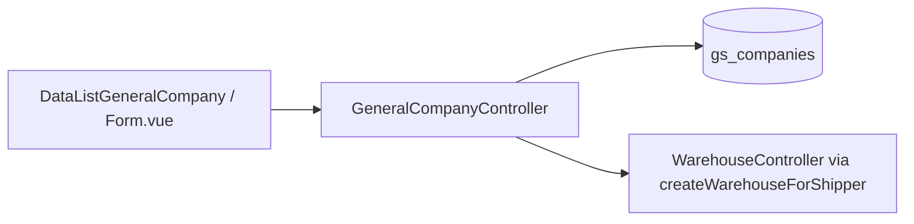

# General Company — Technical Documentation

> **Draft** — Diverifikasi terhadap codebase per 2026-06-24.

## 1. Architecture Overview

General Company memakai tabel **`gs_companies`** sama dengan Internal Company, dibedakan `company_type = 'general'`. Nested entities (contact, address, document, accounting) shared pattern dengan internal company.



## 2. Frontend File Map

**Root:** `olshoperp-frontend/src/pages/master/company/`

| File | Role | Key API |
|------|------|---------|
| `DataListGeneralCompany.vue` | Index datalist | `GET generalsetting/general-company` |
| `Form.vue` | Create/edit (shared internal & general) | `POST/PUT generalsetting/general-company` |
| `PaymentType.vue` | Currency, payment term, PO/SO payment type | `GET/POST .../payment-type/{id}` |
| `FormDocument.vue` | Tab documents | nested document routes |
| `DataListShipperWarehouse.vue` | Tab shipper warehouse tree | `supplychain/warehouse_shipper` |

**Router:** `/generalsetting/general-company`, `/generalsetting/general-company/create`, `/generalsetting/general-company/edit/:id`

**COA select2 (general company edit):** memanggil `generalsetting/internal-company/select2-coa` dengan `transaction_coa_id` — filter class di `InternalCompanyController@select2Coa`.

## 3. Backend File Map

| File | Role |
|------|------|
| `Modules/GeneralSetting/Http/Controllers/GeneralCompanyController.php` | CRUD, nested, import, audit, select2 |
| `Modules/GeneralSetting/Http/Controllers/CompanyAccountingController.php` | GET/POST accounting COA |
| `Modules/GeneralSetting/Http/Controllers/InternalCompanyController.php` | `select2Coa`, `generateGeneralCompany` onboarding |
| `Modules/GeneralSetting/Import/GeneralCompanyImport.php` | Excel import logic |
| `Modules/GeneralSetting/Entities/Company.php` | Model `TYPE_GENERAL`, `transaction_coa_tags` |
| `Modules/GeneralSetting/Entities/GeneralCompanyImportHistory.php` | Import history |
| `Modules/GeneralSetting/Entities/GeneralCompanyImportLog.php` | Import error log |
| `Modules/GeneralSetting/Policies/GeneralCompanyPolicy.php` | Extends `MainPolicy` |
| `Modules/GeneralSetting/Routes/api.php` | Routes L78–121 |

## 4. API Routes

Base prefix: `/api/generalsetting` (lihat `Modules/GeneralSetting/Routes/api.php`).

### 4.1 Resource

| Method | Path | Action |
|--------|------|--------|
| GET | `/general-company` | `index` — datalist |
| POST | `/general-company` | `store` |
| GET | `/general-company/{id}` | `show` |
| PUT | `/general-company/{id}` | `update` |
| DELETE | `/general-company/{id}` | `destroy` |

### 4.2 Nested & utility

| Method | Path | Action |
|--------|------|--------|
| GET | `/general-company/{id}/contact` | contactIndex |
| POST | `/general-company/detail-contact/` | contactStore |
| PUT | `/general-company/detail-contact/{id}` | contactUpdate |
| DELETE | `/general-company/detail-contact/{id}` | contactDestroy |
| DELETE | `/general-company/{id}/contact-bulk-delete` | bulkContactDestroy |
| GET/POST/PUT/DELETE | `/general-company/.../address...` | address CRUD + bulk |
| GET/POST/PUT/DELETE | `/general-company/.../document...` | document CRUD + upload/download |
| GET | `/general-company/{id}/audit` | audit |
| GET | `/general-company/{id}/required` | getRequired |
| POST | `/general-company/{id}/vat` | vat (auto_add_transaction_*) |
| GET/POST | `/general-company/payment-type/{id}` | payment & currency |
| POST | `/general-company/import` | importExcel |
| GET | `/general-company/import-history` | importHistory |
| GET | `/general-company/import-log` | importLog |
| GET | `/general-company/check-import-log` | cekImportLog |

### 4.3 Select2 endpoints

| Path | Filter |
|------|--------|
| `GET /general-company/select2/business` | BusinessField active |
| `GET /general-company/select2-shipper` | `is_shipper=1` active |
| `GET /general-company/select2-customer` | `is_customer=1` + COA complete |
| `GET /general-company/select2-supplier` | `is_supplier=1` + COA complete |
| `GET /general-company/select2-currency` | Currency |
| `GET /general-company/select2-payment-type` | PaymentType |

Shared accounting COA (company id):

| Path | Controller |
|------|------------|
| `GET /company/{id}/accounting` | `CompanyAccountingController@index` |
| `POST /company/{id}/accounting` | `CompanyAccountingController@store` |

## 5. Database Schema

### 5.1 `gs_companies` (general-specific columns)

| Column | Type | Notes |
|--------|------|-------|
| `company_type` | string | `'general'` |
| `is_customer` | tinyint | |
| `is_supplier` | tinyint | |
| `is_manufacturer` | tinyint | |
| `is_shipper` | tinyint | |
| `is_default_shipper` | tinyint | |
| `is_default_customer` | tinyint | |
| `auto_add_transaction_supplier` | string | yes/no/default_by_product |
| `auto_add_transaction_customer` | string | yes/no/default_by_product |
| `due_date_days` | int | payment term |
| `owned_by` | FK | internal company scope |

### 5.2 Related tables

| Table | Relasi |
|-------|--------|
| `gs_company_detail_contacts` | `company_id` |
| `gs_company_detail_addresses` | `company_id`, `is_primary` |
| `gs_company_detail_documents` | `company_id` |
| `gs_company_accountings` | `company_id` + `transaction_coa_list_id` |
| `gs_company_payment_and_currency_settings` | `company_id` |
| `gs_company_business_fields` | pivot business field (max 3) |
| `gs_company_3pl_warehouse_pivots` | shipper ↔ warehouse |
| `gs_company_vat_settings` | schema ada; assign logic commented |
| `gs_general_company_import_histories` | import batch |
| `gs_general_company_import_logs` | import row errors |

## 6. Import — Technical Detail

**Class:** `Modules/GeneralSetting/Import/GeneralCompanyImport`

```php
// Header constants (GeneralCompanyImport.php)
EXPECTED_HEADERS = [
  'Code', 'Name', 'Recognize As', 'Description',
  'Account Receivable COA', 'Sales Discount COA', "Customer's Deposit COA",
  'Deposit of Sales Return', 'Account Payable COA', 'Purchase Discount COA',
  'Deposit to Supplier COA', 'Deposit of Purchase Return',
];
ALLOWED_RECOGNIZE_AS = ['customer', 'supplier', 'shipper', 'manufacture'];
```

**Flow:**

1. `importExcel` creates `GeneralCompanyImportHistory` status `processing`
2. Clears previous `GeneralCompanyImportLog` for `owned_by`
3. Validates headers (row 1 group + row 2 header, or row 1 header only)
4. Per-row validation → collect errors or build payloads
5. On success: DB transaction create `Company` + `CompanyAccounting` + optional `CompanyPaymentAndCurrencySetting`
6. Update history `import_status`, `count_row_success/failed`

**COA lookup:** match `ChartOfAccount.code` (case-insensitive), `status=1`, `owned_by` company or null; reject parent COA (`CoaTree` has children).

**Not implemented in import:** `createWarehouseForShipper`, default flags, multi-role.

## 7. COA Class Filter (select2Coa)

`InternalCompanyController@select2Coa` — constants di `TransactionCoaList`:

```php
DEFAULT_COMPANY_COA_ACTIVA = [1, 6, 29, 32];
DEFAULT_COMPANY_COA_ACTIVA_PASSIVA = [2, 5, 13, 14];
DEFAULT_COMPANY_COA_PASSIVA = [3, 4, 26, 27, 28, 31];
```

Maps to `chart_of_account_class.position` ∈ `Activa` / `Passiva`.

## 8. Onboarding Seeder

`InternalCompanyController@generateGeneralCompany` — dipanggil saat create internal company:

- Seed CAHAYA (customer), BUMI (supplier), OSERP (shipper, default)
- OSERP: `createWarehouseForShipper` + `Company3PLWarehousePivot`

Legacy/fix seeders: `FixGeneralCompanyDefaultShipperSeeder`, `GeneralCompanyOnBoardingSeeder` (bulk excel).

## 9. Jobs / Observers

Tidak ada observer dedicated pada General Company create (berbeda dari internal company yang dispatch jobs COA/warehouse).

Side effects synchronous di controller: warehouse 3PL, payment settings, accounting copy.

## 10. Downstream References (grep summary)

Models/entities dengan FK ke General Company (`gs_companies.id`):

| Module | Entity | FK field |
|--------|--------|----------|
| OmniChannel | SalesOrder | `customer_id`, `shipper_id` |
| OmniChannel | DeliveryOrder | `customer_id`, `shipper_id` |
| SupplyChain | PurchaseOrder | `supplier_id` |
| SupplyChain | StockMutation | `supplier_id`, `customer_id` |
| SupplyChain | Item | `manufacturer_id` |
| Accounting | CustomerInvoice | `customer_id` |
| Accounting | SupplierInvoice | `supplier_id` |
| Accounting | Settlement | via SO `customer_id` |
| PPC | WorkOrder | `customer_id` |
| PPC | AircraftType | `manufacturer_id` |
| QA | VendorAudit | `company_id` |

## 11. Config

| Key | Value | Usage |
|-----|-------|-------|
| `upload.size.image` | 512 KB | Logo (backend ready; UI general limited) |
| `upload.size.file` | 2048 KB | Document attachment |
| `currency.primary.id` | env/config | Default PO/SO currency on create |
| `warehouse.3pl_code` | `3PL` | Parent warehouse code |
| `warehouse.3pl_process_group` | `3pl` | Shipper warehouse group |
| `warehouse.building_level` | config | Warehouse space type level |

## 12. Known Technical Gaps

Lihat [requirement.md §18](./requirement.md#18-known-gaps--open-items) — ringkas:

- FE import UI not wired (`DataListGeneralCompany.vue` lacks `has_import`)
- `destroy()` only checks `SalesOrder::where('shipper_id')` (G-03 — AS-IS)
- `CompanyVatSetting` tax assignment commented out in `vat()`

**G-02 (resolved):** `GeneralCompanyController@update` — Active OFF cek outstanding customer/supplier invoice; Recognize As Customer OFF ditolak jika `isUsedAsCustomer()` (SO, Customer Invoice, Delivery Order, Credit Note, PPC Work Order). `show` mengembalikan `role_customer_locked` untuk disable toggle di `Form.vue`.

## Related Documents

| Doc | Path |
|-----|------|
| API routes | `docs/api/general_setting/routes.md` |
| DB schema | `docs/db-schema/` → `gs_companies` |
| Requirement | [requirement.md](./requirement.md) |
