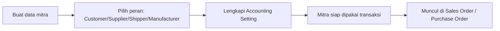

# Panduan Pengguna — General Company

Panduan ini membantu tim Finance/Accounting dan Sales/Purchase Ops mengelola data mitra bisnis eksternal di menu **General Company**.

---

## 1. Apa Itu & Kenapa Penting

**General Company** adalah tempat menyimpan data **mitra bisnis eksternal** perusahaanmu: **Customer**, **Supplier**, **Shipper** (jasa pengiriman), dan **Manufacturer** (produsen). Satu data mitra bisa punya lebih dari satu peran sekaligus — misalnya satu perusahaan bisa jadi Customer sekaligus Supplier — tanpa perlu membuat data dua kali.

Data ini penting karena menjadi sumber **akun default (COA)**, **currency**, **payment type**, dan **alamat** untuk hampir semua transaksi Purchase dan Sales. Kalau data mitra belum lengkap, mitra tersebut tidak akan bisa dipakai di transaksi.

---

## 2. Overview Flow & Proses Bisnis

**Alur singkat (tanpa diagram):**

1. Buat data mitra baru dan tentukan perannya.
2. Lengkapi pengaturan akun (Accounting Setting) sesuai peran.
3. Setelah lengkap, mitra otomatis muncul di pilihan transaksi terkait.

---

## 3. Sebelum Mulai (Flow Sebelum)

Pastikan hal berikut sudah siap:

- Kamu tahu **peran** mitra ini (Customer, Supplier, Shipper, Manufacturer, atau kombinasi).
- **Daftar akun (COA)** perusahaanmu sudah tersedia untuk dipilih di Accounting Setting.
- Untuk alamat: data **Country, Province, City** sudah tersedia (wajib diisi di tab Address).
- Untuk pajak: **Master Tax** sudah ada bila mitra perlu setting VAT.

Catatan: saat perusahaanmu pertama kali onboarding, sistem sudah otomatis menyiapkan 3 contoh mitra (satu Customer, satu Supplier, dan satu Shipper default bernama OLSHOPERP Shipper).

---

## 4. Setelah Selesai (Flow Sesudah)

Setelah data mitra lengkap dan aktif:

- Mitra **Customer** muncul di Sales Order, Sales Invoice, Credit Note, dan penerimaan pembayaran.
- Mitra **Supplier** muncul di Purchase Order, Purchase Invoice/Inbound, Debit Note, dan pembayaran ke supplier.
- Mitra **Shipper** bisa dipilih sebagai pengirim di Sales Order; bila jadi Default Shipper, akan terisi otomatis.
- **Alamat Primary** dipakai sebagai alamat default di dokumen transaksi (PO, Sales Invoice, Delivery Order).

---

## 5. Yang Perlu Diperhatikan

- **Dua cara menonaktifkan berbeda:** toggle **Active** OFF membuat mitra tidak bisa dipakai transaksi (peran tetap), sedangkan mematikan toggle **Recognize As** mencabut satu peran tertentu. Jangan tertukar.
- **Tidak bisa menonaktifkan/menghapus** mitra yang sedang jadi **Default Shipper/Customer** — ganti default ke mitra lain dulu.
- **Tidak bisa menonaktifkan** Customer/Supplier yang masih punya **saldo piutang/hutang**.
- **Accounting Setting harus lengkap** agar mitra muncul di transaksi. Ini penyebab paling umum mitra "tidak muncul" padahal statusnya Active.
- **Satu Default Currency** dipakai bersama untuk PO dan SO (tidak terpisah). Yang bisa beda hanya Payment Type PO vs SO.
- Hanya boleh **satu Default Shipper** dan **satu Default Customer** aktif; mengaktifkan yang baru otomatis mematikan yang lama.
- **Hati-hati menghapus mitra dengan histori transaksi:** untuk Customer/Supplier yang punya histori PO/Invoice, sistem saat ini belum menolak secara ketat — koordinasikan dulu sebelum menghapus.

---

## 6. Langkah-Langkah (Step by Step)

1. Buka **General Setting → Master Company → General Company**, klik **Create**.
2. Di tab **General (Basic Information)**, isi **Code** dan **Name** (wajib). Isi Business Field (maks 3), NPWP, dan Description bila perlu.
3. Aktifkan **Recognize As** sesuai peran mitra. Bisa lebih dari satu.
4. Bila perlu, aktifkan **Set as Default Customer** (untuk clone order dari platform) atau **Set as Default Shipper** (untuk autofill Sales Order).
5. Klik **Save & Next**.
6. Lengkapi tab **Contacts** dan **Address** (Country, Province, City wajib; tandai satu alamat sebagai **Primary**).
7. Buka tab **Accounting Setting**, isi **COA** untuk tiap peran yang aktif, atur **Default Currency** dan **Payment Type**. Pengaturan ini tersimpan otomatis saat dipilih.
8. Bila mitra adalah Shipper, cek tab **Shipper** untuk melihat gudang 3PL yang otomatis dibuat.
9. Untuk menambah banyak mitra sekaligus, gunakan **Import**: klik **Import** di datalist, **Download Template**, isi, lalu unggah. Cek **Import History/Log** untuk hasilnya.

🎬 [Interactive demo akan ditambahkan di sini]

---

## 7. Tips & Hal yang Sering Bikin Bingung

- **"Mitra saya Active tapi tidak muncul di dropdown transaksi."** Accounting Setting-nya belum lengkap untuk peran tersebut. Lengkapi COA-nya.
- **"Toggle Default Shipper tidak muncul."** Aktifkan dulu Recognize As Shipper.
- **"Tidak bisa mematikan Customer."** Cek saldo piutang, atau mitra ini sedang jadi Default Customer, atau sudah pernah dipakai di transaksi (peran terkunci).
- **"Import gagal semua."** Import bersifat semua-atau-tidak: satu baris salah menggagalkan seluruh file. Cek Import Log, perbaiki, unggah ulang.
- **"Import cuma satu peran per baris."** Benar — untuk mitra multi-peran, buat/edit lewat UI, bukan import.
- **Field Deposit of Sales/Purchase Return** dipakai untuk auto-journal proses retur — isi sesuai akun yang benar bila perannya Customer/Supplier.

---

## 8. Referensi

| Sumber | Untuk apa |
|--------|-----------|
| [Knowledge Base](./knowledge-base.md) | Panduan operator & troubleshooting lengkap |
| [Requirement](./requirement.md) | Aturan bisnis, validasi, Gap Registry |
| [Purchase Order](../supplychain-purchase-order/README.md) | Pemakaian mitra sebagai Supplier |
| [Sales Order General](../sales-order-general/README.md) | Pemakaian Customer & Default Shipper |
| [Internal Company](../generalsetting-internal-company/README.md) | Data perusahaan sendiri (pola form sama) |
