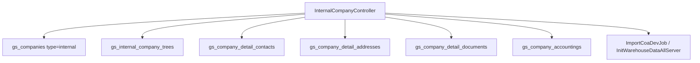

# Internal Company — Technical Documentation

> **Draft — 2026-06-19** — Dokumentasi AS-IS dari kode production. Belum review QA/PM; jangan jadikan referensi final.

## 1. Architecture Overview

## 2. Frontend File Map

**Root:** `olshoperp-frontend/src/pages/master/company/`

| File | Role | Key API |
|------|------|---------|
| `InternalCompanyList.vue` | Index | `GET generalsetting/internal-company` |
| `Form.vue` | Create/edit internal | `POST/PUT generalsetting/internal-company` |
| `FormDocument.vue` | Documents tab | nested document routes |
| Shared address/contact patterns | Tabs | `internal-company/{id}/contact|address|document` |

**Router:** `/generalsetting/internal-company` (name: `generalsetting_internal-company_index`)

## 3. Backend File Map

| File | Role |
|------|------|
| `Modules/GeneralSetting/Http/Controllers/InternalCompanyController.php` | Main controller (~2900 lines) |
| `Modules/GeneralSetting/Entities/Company.php` | TYPE_INTERNAL constant |
| `Modules/GeneralSetting/Entities/InternalCompanyTree.php` | Parent tree |
| `Modules/GeneralSetting/Policies/InternalCompanyPolicy.php` | Auth |
| `Modules/GeneralSetting/Jobs/ImportCoaDevJob.php` | COA seed |

## 4. API Routes (selected)

Resource: `Route::resource('/internal-company', 'InternalCompanyController')`

| Method | Path | Action |
|--------|------|--------|
| GET | `/internal-company` | index |
| POST | `/internal-company` | store |
| GET | `/internal-company/{id}` | show |
| PUT | `/internal-company/{id}` | update |
| DELETE | `/internal-company/{id}` | destroy |
| GET | `/internal-company/tree/company` | tree |
| POST | `/company/logo-upload/{internal_company}` | logoUpload |
| GET/POST/PUT/DELETE | `/internal-company/{id}/contact|address|document` | nested CRUD |
| GET | `/internal-company/{id}/audit` | audit |
| GET | `/internal-company/{id}/public-data-company-list` | publicDataCompanyList |

Full list: `Modules/GeneralSetting/Routes/api.php` lines 37–76.

## 5. Database Schema

| Table | Purpose |
|-------|---------|
| `gs_companies` | company_type, code, name, flags, owned_by |
| `gs_internal_company_trees` | company_id, parent_id |
| `gs_company_business_field` | M2M business field |
| `gs_company_detail_*` | contacts, addresses, documents |
| `gs_company_accountings` | COA links |

## 6. Jobs / Observers / Events

| Job/Seeder | When |
|------------|------|
| `ImportCoaDevJob` | New company COA |
| `InitWarehouseDataAllServer` | Warehouse bootstrap |
| `CopyCOA` | COA duplication |

## 7. Related db-schema docs

- `gs_companies`, `gs_internal_company_trees`
