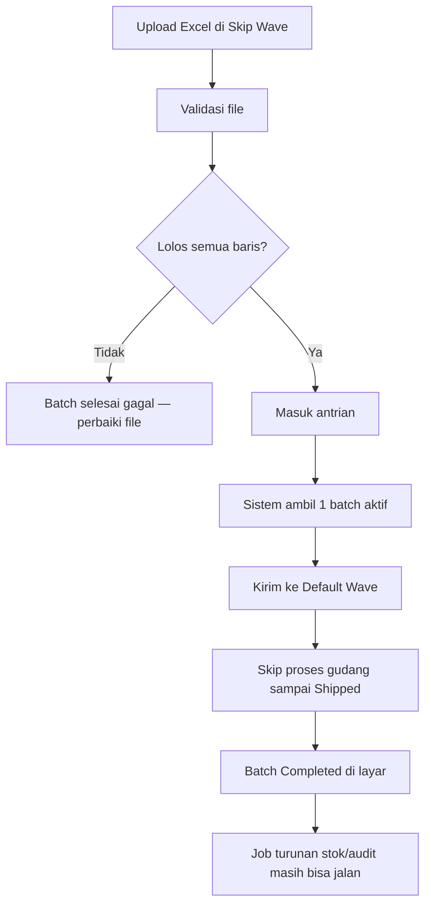

# Horizon Jobs — Knowledge Base (Ops / Support)

**Audience:** Ops, Support, QA saat investigasi antrean  
**Bukan menu UI** — ini panduan membaca pekerjaan latar belakang (Horizon) yang dipicu menu seperti Skip Wave Process.

---

## 1. Apa itu?

Setiap upload/aksi berat di OlshopERP sering memicu **banyak pekerjaan antrean** (job). Ada dua jenis:

| Jenis | Artinya untuk operator |
|-------|------------------------|
| **Job utama** | Langsung dari menu (validasi file, kirim wave, skip gudang) |
| **Job turunan** | Otomatis karena stok berubah (hitung stok akhir, sync marketplace, catat audit) — **tidak** dipilih di menu |

Satu file Skip Wave berisi 1.000 order bisa menghasilkan **ribuan** job di belakang layar. Progress di layar bisa sudah “selesai”, sementara job turunan masih mengantre.

---

## 2. Kapan pakai dokumen ini?

| ✅ | ❌ |
|----|----|
| Batch Skip Wave lama di Pending / Processing | Ingin ubah setting Horizon sendiri tanpa DevOps |
| Layar bilang Completed tapi server masih sibuk | Menafsirkan angka Horizon tanpa tanggal sample |
| Perlu tahu kenapa antrian batch tidak maju | Mengganti perilaku job tanpa ticket |

Pipeline detail Skip Wave: [pipelines/skip-wave-process.md](./pipelines/skip-wave-process.md) · Menu: [Skip Wave Process](../omni-skip-wave-process/knowledge-base.md).

---

## 3. Alur kerja standar (Skip Wave)

**Keterangan langkah:**

- Hanya **satu** batch Skip Wave boleh `pending`/`processing` di seluruh sistem (bisa dari company lain).
- Kalau progress sudah penuh tapi status batch masih Processing lama: kemungkinan penutup otomatis gagal — cek tombol **Redispatch** (batch diam lebih dari 60 menit).
- “Completed di menu” ≠ “semua job turunan sudah habis”.

---

## 4. Troubleshooting

| Gejala | Penyebab umum | Solusi |
|--------|---------------|--------|
| Banyak batch Pending lama | Ada 1 batch Processing yang menahan gerbang | Cek batch aktif; tunggu selesai atau Redispatch jika sudah macet |
| Progress Shipped hampir penuh, status masih Processing | Penutup batch tidak jalan (job hilang / callback gagal) | Redispatch (syarat diam lebih dari 60 menit) — minta DevOps jika gagal |
| Server lambat padahal Skip Wave sudah Completed | Job turunan (hitung stok, audit, sync marketplace) masih mengantre | Pantau Horizon bersama DevOps; jangan upload batch besar beruntun |
| Upload ditolak / batch tidak muncul di list utama | Validasi all-or-nothing gagal | Perbaiki Log Data → upload ulang seluruh file |

---

## 5. FAQ

**Q: Apa beda job utama dan job turunan?**  
A: Job utama = langkah yang kamu lihat di progress Wave / Skip Processing. Job turunan = efek samping stok & audit — tidak punya kolom sendiri di menu.

**Q: Boleh tekan Redispatch kapan?**  
A: Hanya jika batch sudah diam lebih dari 60 menit dan progress tampak macet. Jangan tekan saat masih aktif bergerak.

**Q: Kenapa company A menunggu padahal yang jalan company B?**  
A: Antrian Skip Wave saat ini **global** — satu batch aktif menahan semua company.
