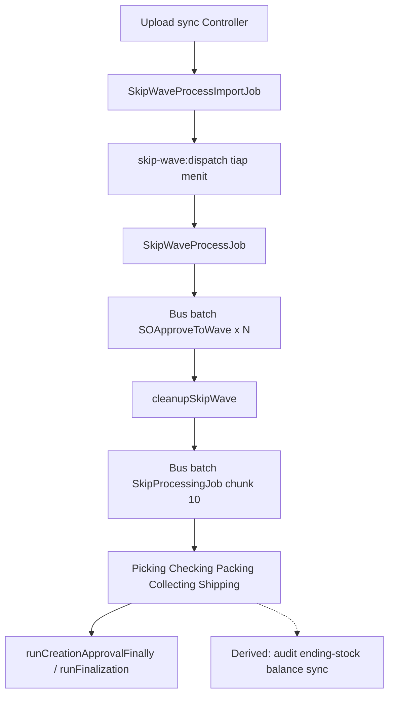

# Pipeline — Skip Wave Process (Horizon Jobs)

**Menu:** [Skip Wave Process](../omni-skip-wave-process/) · UI `/omni/skip-wave-process`  
**SoT perilaku bisnis:** [requirement.md](../omni-skip-wave-process/requirement.md)  
**Validasi:** artifact Claude (20 Sep 2026) + verifikasi kode `olshoperp@dev`

Batch codes: `SW-` import · `WV-` wave · `SP-` processing

---

## 1. Ringkasan fan-out (primary)

Untuk **1 file · 1.000 SO** (maks per upload):

| Tahap | Job | Qty |
|-------|-----|-----|
| Validasi Excel | `SkipWaveProcessImportJob` | 1 |
| Orkestrator | `SkipWaveProcessJob` | 1 |
| Masuk Default Wave | `SOApproveToWave` | 1.000 (1 / SO) |
| Skip gudang (+ DO inline) | `SkipProcessingJob` | 100 (10 SO / job) |
| **Total primary (happy, tanpa retry)** | | **≈ 1.102** |

Retry: `SkipWaveProcessJob` ulang (wave) atau `SkipProcessingRetryJob` → batch `SkipProcessingJob` baru (max 5 putaran, delay 5/10/15 detik).

---

## 2. Primary jobs (AS-IS)

| Job | Queue | Dibuat oleh | Chunk / scope |
|-----|-------|-------------|----------------|
| `SkipWaveProcessImportJob` | `getQueueName('import')` | `SkipWaveProcessController` saat upload | 1 file ≤ 1.000 baris |
| `SkipWaveProcessJob` | `getQueueName('SalesOrder')` | `SkipWaveDispatchCommand` (atau retry dari `cleanupSkipWave`) | Semua SO batch (retry: subset) |
| `SOApproveToWave` | SalesOrder | `SkipWaveProcessJob` via `Bus::batch` name `Skip Wave Process SOApproveToWave` | 1 SO |
| `SkipProcessingJob` | SalesOrder | `SkipWaveLogic::triggerProcessingPhase` | `CHUNK_SIZE_PER_JOB = 10` |
| `SkipProcessingRetryJob` | SalesOrder | `cleanupSkipProcessing` / DO-phase retry | SO retryable |
| `SkipWaveProcessExportJob` | (export path) | Controller export | Di luar pipeline upload |

### 2.1 Upload sync (sebelum job)

Controller (request web):

- Validasi mime `xlsx|xls|csv`, header `Order No`, buang baris kosong, cap 1.000.
- Simpan file; buat baris `omni_skip_wave_process` + reserved `WV-` / `SP-`.
- Status awal `in_queue`; dispatch **hanya** ImportJob (tidak langsung Wave).

### 2.2 ImportJob

- Excel row rules (ditemukan, unik, company, status approved/processed, wave status eligible).
- Lock per SO (`SKIP_WAVE_BATCH_LOCK_PREFIX`, TTL 3600s).
- All-or-nothing: ada gagal → `is_eligible=false`, status `completed` — **tidak** masuk gerbang.
- Sukses → `is_eligible=true`, tetap `in_queue` sampai cron.

### 2.3 Gerbang `skip-wave:dispatch`

File: `app/Console/Commands/SalesOrder/SkipWaveDispatchCommand.php` · schedule `everyMinute()`.

1. Jika ada batch `pending` **atau** `processing` → **stop** (tanpa filter company — GAP-SW-02).
2. Ambil satu `in_queue` + `is_eligible=true`.
3. Set konteks user/company; status → `pending`; dispatch `SkipWaveProcessJob`.

### 2.4 SkipWaveProcessJob → SOApproveToWave

- Filter `process_to_wave` / tipe platform; `validateBundleComponents()`.
- Set SO `IN_QUEUE` + `SENDING_TO_DEFAULT_WAVE`.
- `Bus::batch(...)->allowFailures()->finally(cleanupSkipWave)`.

`cleanupSkipWave`:

- Reset SO yang masih `IN_QUEUE`.
- 100% success wave → lepas lock → `triggerProcessingPhase`.
- Transient fail (savepoint/deadlock/lock wait/…) + retry &lt; 5 → re-dispatch `SkipWaveProcessJob` delayed.
- Non-retryable / max retry → lanjut dengan SO sukses saja; atau `completed` jika nol sukses.

### 2.5 SkipProcessingJob

- Per chunk: `processSalesOrders` → tahapan `skipPicking` … `skipShipping` (tergantung posisi terakhir SO).
- Lock processing 12 jam / WH process 120s.
- Log `scm_skip_processing_logs` per stage.
- Batch `finally` → `cleanupSkipProcessing` → (retry atau) `runBatchFinally`.

### 2.6 DO path (penting)

**AS-IS sejak fix “1 SO 1 DO” (Aug 2026):**

- `ProcessingService::runBatchFinally` memanggil `runCreationApprovalFinally` lalu **`return;`**.
- Blok dispatch `SkipProcessingCreateDeliveryOrdersJob` + `dispatchApprovalPhase` / `SkipProcessingApproveDOJob` = **dead code** (class masih ada).
- Pembuatan + approve DO terjadi di **`skipShipping`** (`SkipProcessTrait`) di dalam `SkipProcessingJob`.

`runCreationApprovalFinally` tetap: deteksi belum `Shipped`, retry transient (termasuk pesan Failed to create DOs / Duplicate), atau `runFinalization` (status completed, unlock, broadcast, toast).

---

## 3. Derived jobs (AS-IS mekanisme)

Skip Wave **tidak** memanggil class berikut secara langsung. Pemicu = observer / handler / package setelah stok berubah.

| Job (Horizon name) | Trigger terverifikasi | Catatan |
|--------------------|----------------------|---------|
| `ProcessDispatchAudit` | `owen-it/laravel-auditing` `ProcessDispatchAudit` | 1 audit job per baris berubah |
| `StoreEndingStockJob` | `ItemStockObserver`, `StockAfterApproveHandler` | Sering di-wrap `Bus::batch` 1 job |
| `CalculateEndingBalancePerWarehouse` | Stock ending / balance pipeline | Per produk × warehouse |
| `CalculateEndingBalancePerBuilding` | sama | Per building |
| `CalculateEndingBalance` | sama | Agregat |
| `StoreAvailableToSellStockJob` | Product ending stock controllers / ATS path | Unique-capable |
| `CalculateGlobalAtsJob` | `ProductStockObserver` | `ShouldBeUnique` |
| `SyncStockPlatformJob` | `ProductStock` (binding exists) | Push stok marketplace |
| `ItemStockSupplierJob` | `ItemStockObserver` created | Mapping supplier |
| Process status / `QueuedPageEvent` | ProcessingService / WebsocketHelper | Broadcast UI |

**Tidak terpicu oleh skip path (AS-IS):** generate Customer Invoice / journal dari approval DO skip (approval generik tanpa jalur settlement invoice).

### 3.1 Ekor setelah `completed`

Saat UI `completed`, yang ringan: broadcast final + toast + gerbang buka batch berikutnya.  
Job turunan yang sudah di-dispatch **tetap** mengantre — bisa bentrok worker dengan batch Skip Wave berikutnya.

---

## 4. Locks & status

| Lock / status | TTL / nilai | Peran |
|---------------|-------------|-------|
| Skip wave batch lock per SO | 3600s | Import success |
| `skip_processing_locked_so_{id}` | 12h | Processing phase |
| WH process lock | 120s (wait 30s) | Serialisasi per gudang |
| `skip_wave_status` | `in_queue` → `pending` → `processing` → `completed` / `failed` | Gerbang + UI |

---

## 5. Invariants

| ID | Assertion |
|----|-----------|
| INV-SWJ-01 | ImportJob tidak dispatch `SkipWaveProcessJob`. |
| INV-SWJ-02 | Maks 1 batch `pending`/`processing` global sebelum dispatch baru. |
| INV-SWJ-03 | Primary processing chunk = 10 SO / `SkipProcessingJob`. |
| INV-SWJ-04 | `runBatchFinally` tidak men-dispatch Create/Approve DO jobs (dead path). |
| INV-SWJ-05 | Retry transient max 5; delay `min(15, (retry+1)*5)` detik di wave logic. |

---

## 6. Observasi (Merdian · 20 Sep 2026)

> Bukan acceptance criteria. Sample artifact Claude tervalidasi mekanisme; angka dari Horizon / DB live.

### 6.1 Primary duration (sample)

| Fase | Sample | Rata-rata | Terlama |
|------|--------|-----------|---------|
| Wave (`SOApproveToWave` batch) | 29 batch / 14 hari | ~2 menit 44 detik | ~7 menit 26 detik |
| Processing (`SkipProcessingJob`) | 19 batch / 14 hari | ~17 menit 49 detik | ~56 menit 54 detik |

### 6.2 Derived load (korelasi Horizon 5 menit)

Metodologi artifact: bandingkan jendela 5 menit yang mengandung `SkipProcessingJob` vs yang tidak; “kelebihan” = selisih rata-rata × jumlah jendela skip.

Orde besar: **~30×** lipat primary; perkiraan **~34 job turunan / SO** → **~34.000** turunan per 1.000 SO (didominasi `ProcessDispatchAudit` + ending stock/balance).

### 6.3 Kasus batch macet

Contoh: `SW-20260919095547190-8D` — hampir semua SO sudah `Shipped`, tetapi `skip_wave_status` tetap `processing` karena `finally` tidak menutup (pending jobs tidak nol setelah stall / job hilang). Gerbang menahan ~15 batch lain (~13k SO).

**Tindakan AS-IS:** Redispatch UI (diam &gt; 60 menit).

---

## 7. Proposal remediasi (BUKAN TO-BE / BUKAN AC)

Diambil dari rencana optimasi Claude; landasan kode sebagian ada. **Belum** dipromote ke GAP resmi Skip Wave. Registry: **PROP-HJ-01** di [requirement.md](../requirement.md) §8.

| # | Usulan | Efek yang diharapkan | Risiko |
|---|--------|----------------------|--------|
| 1 | Redis AOF + `noeviction` (pisah dari cache) | Job pending tidak hilang | Infra |
| 2 | `disableAuditing()` pada detail volume tinggi saat skip | − audit storm | Rendah (pola sudah dipakai di tempat lain) |
| 3 | Hindari `Bus::batch` untuk 1 job ending stock | − pertumbuhan `job_batches` | Rendah |
| 4 | Perbaiki alarm Horizon (queue name + stuck batch &gt; 60m) | Deteksi dini | Rendah |
| 5 | Watchdog finalisasi + gerbang abaikan `processing` stale | Antrean tidak beku | Sedang |
| 6 | Unique ending stock tanpa mutation id di unique key + delay | − hitung ulang 5× | Sedang (uji stok) |
| 7 | Throttle broadcast + delay `SyncStockPlatformJob` | − event & rate limit MP | Rendah |
| 8 | Rem otomatis jika queue hilir penuh | Backpressure | Sedang |

---

## 8. File map (pipeline)

| Path | Peran |
|------|-------|
| `Modules/OmniChannel/Http/Controllers/SkipWaveProcessController.php` | Upload, export, redispatch API |
| `Modules/OmniChannel/Jobs/SkipWaveProcessImportJob.php` | Import |
| `Modules/OmniChannel/Jobs/SkipWaveProcessJob.php` | Wave orchestrator |
| `Modules/OmniChannel/Logics/SkipWave/SkipWaveLogic.php` | cleanup + processing phase + redispatch |
| `Modules/OmniChannel/Jobs/SOApproveToWave.php` | Per-SO wave |
| `Modules/OmniChannel/Jobs/SkipProcessingJob.php` | Chunk processing |
| `Modules/OmniChannel/Jobs/SkipProcessingRetryJob.php` | Retry processing |
| `Modules/OmniChannel/Services/ProcessingService.php` | Stages, finalisasi, dead DO dispatch block |
| `Modules/OmniChannel/Traits/Processing/SkipProcessTrait.php` | `skipShipping` DO inline |
| `Modules/SupplyChain/Logics/Processing/*ListLogic.php` | Optimized skip stages (ETM-16006) |
| `app/Console/Commands/SalesOrder/SkipWaveDispatchCommand.php` | Gerbang |
| `Modules/SupplyChain/Observers/ItemStockObserver.php` | Derived ending stock |
| `app/Helpers/SupplyChain/StockAfterApproveHandler.php` | Derived balances / ending stock |
| `Modules/SupplyChain/Jobs/CalculateEndingBalance*.php` | Derived recalc EB (optim ETM-15984) |
| `vendor/owen-it/laravel-auditing/.../ProcessDispatchAudit.php` | Derived audit |

---

## 8b. Implemented reliability (Sep 2026) — bukan proposal

Sudah di kode (lihat juga [omni-skip-wave-process/technical.md §5b](../omni-skip-wave-process/technical.md)):

| ETM | Perubahan pipeline |
|-----|-------------------|
| 15972 / 15985 | Datalist: defer+cache aggregates (bukan job Horizon, tapi mengurangi load saat operator pantau) |
| 15963 / 16002 | Redispatch incomplete wave via `error_retriable` |
| 16032 | Exclude “processing date &lt; trx date” dari auto-retry |
| 15988 / 16037 | DO existence + deadlock di skipShipping |
| 15999 | Skip SO yang sudah punya DO saat retry processing |
| 16006 | `*ListLogic` + `approveSkipTransfer` path |

Proposal §7 di atas tetap **bukan** AC — PROP-HJ-01.

---

## 9. Changelog

| Version | Date | Changes |
|---------|------|---------|
| 1.1 | 2026-09-25 | §8b reliability implemented; file map *ListLogic + CalculateEndingBalance |
| 1.0 | 2026-09-20 | Initial dari validasi artifact + kode; dead DO path; observasi Merdian; proposal terpisah |
