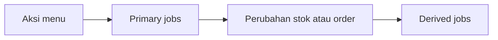
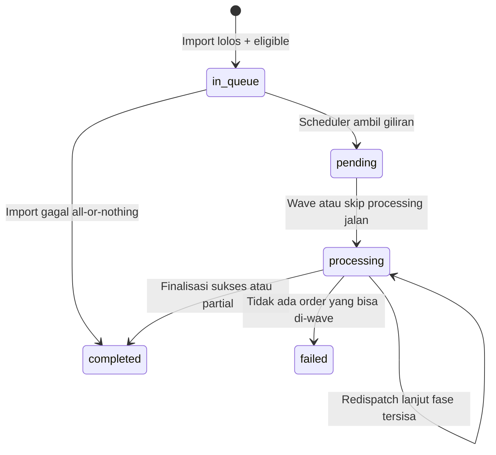
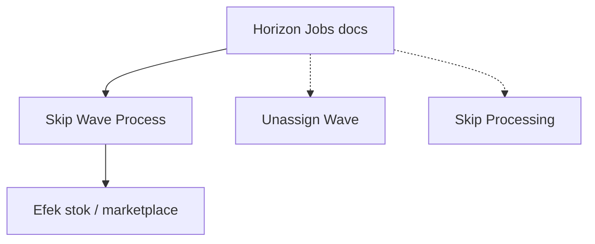

# Horizon Jobs — Requirement Documentation

**Tipe:** Cross-menu concept (bukan satu halaman UI)  
**Audience:** PM, QA  
**Prefix aturan:** `HJ-`  
**Pipeline Skip Wave (detail teknis):** [pipelines/skip-wave-process.md](./pipelines/skip-wave-process.md)  
**Perilaku bisnis menu:** [Skip Wave Process](../omni-skip-wave-process/requirement.md)

---

## 0. Metadata & Changelog

| Version | Date | Author | Changes |
|---------|------|--------|---------|
| 1.1 | 2026-09-20 | QA - Yemima | Rapikan ke struktur standar (siklus, how-it-works, validasi, gap); kurangi jargon class |
| 1.0 | 2026-09-20 | QA - Yemima | Initial: primary vs derived; gerbang; retry; observasi vs aturan |

---

## 1. Ringkasan Eksekutif

Dokumentasi ini mendefinisikan **aturan perilaku** pekerjaan antrean (queue / Horizon) lintas menu OlshopERP:

1. **Primary pipeline** — pekerjaan yang sengaja dijalankan oleh menu (upload, scheduler, orkestrator).
2. **Derived pipeline** — pekerjaan yang lahir otomatis karena data stok/order berubah (hitung stok, audit, sync marketplace).

Operator melihat progress di menu; DevOps/QA melihat beban di Horizon. Keduanya harus dibedakan agar status **Completed** di UI tidak disalahartikan sebagai “antrean server kosong”.

| Kebutuhan | Jawaban docs ini |
|-----------|------------------|
| Lacak apa yang dijalankan menu | Primary jobs + pipeline per menu |
| Pahami kenapa server sibuk setelah Completed | Derived jobs (HJ-02) |
| Bedakan fakta vs sample Horizon | Observasi bertanggal (HJ-03) |
| Usulan optimasi | Proposal — bukan AC sampai di-promote (HJ-04) |

### 1.1 Rantai konsep

---

## 2. Prasyarat

| Prasyarat | Sumber | Catatan |
|-----------|--------|---------|
| Akses Horizon di domain API | Infra / DevOps | Bukan host Vue |
| Identitas batch (mis. `SW-` / `WV-` / `SP-`) | Datalist menu terkait | Untuk telusur log & Redispatch |
| Company + user yang memicu | Token / audit upload | Konteks redispatch |
| Requirement menu terkait | Folder `qa-docs/{menu}/` | Aturan bisnis tetap di rumah menu |

**Form & field UI khusus:** tidak ada — konsep ini tidak punya layar sendiri. Field yang relevan (status batch, Redispatch, progress) hidup di menu pemicu (contoh: Skip Wave Process).

---

## 3. Siklus status (batch Skip Wave — sudut jobs)

Status batch Skip Wave menentukan **gerbang** antrean. Detail bisnis: [requirement Skip Wave §3](../omni-skip-wave-process/requirement.md).

| Status | Efek ke jobs |
|--------|----------------|
| `in_queue` | Belum ada orkestrator wave; menunggu gerbang |
| `pending` / `processing` | Menahan batch lain (gerbang global — GAP-SW-02) |
| `completed` / `failed` | Gerbang terbuka; **derived jobs boleh masih mengantre** |

---

## 4. How It Works

### 4.1 Primary vs derived

| Jenis | Siapa memicu | Terlihat di UI menu? | Contoh Skip Wave |
|-------|--------------|----------------------|------------------|
| Primary | Upload, scheduler, orkestrator, retry | Progress Wave / Skip Processing | Validasi file → wave per order → skip gudang (chunk) |
| Derived | Perubahan stok / baris model / audit package | Tidak langsung | Hitung stok akhir, saldo, sync marketplace, audit baris |

### 4.2 Alur primary Skip Wave (ringkas)

1. Upload Excel (cek sinkron di request) → buat batch `SW-` + cadangan `WV-` / `SP-`.
2. Job import memvalidasi baris; all-or-nothing; kunci order.
3. Scheduler tiap menit: jika tidak ada batch `pending`/`processing`, ambil satu `in_queue` eligible → orkestrator wave.
4. Satu job per order untuk masuk Default Wave (batch grup + cleanup).
5. Chunk 10 order untuk skip picking → … → shipping (Delivery Order dibuat di tahap shipping, bukan fase job DO terpisah yang aktif).
6. Finalisasi → status `completed` / toast / buka gerbang.

Formula fan-out primary (1.000 order, tanpa retry): **1 + 1 + 1.000 + 100 = 1.102** job. Detail class/queue: [pipeline](./pipelines/skip-wave-process.md).

### 4.3 Retry transient

| Aturan | Nilai AS-IS |
|--------|-------------|
| Maks putaran | 5 |
| Jeda | 5 / 10 / 15 detik |
| Contoh penyebab | savepoint, deadlock, lock wait, pesan “Stopped”, dll. |

### 4.4 Redispatch

Jika progress hampir penuh tetapi status tetap `processing` lama: tombol **Redispatch** (diam lebih dari **60 menit**) melanjutkan fase yang belum selesai. Tanpa itu, gerbang bisa menahan seluruh antrean.

### 4.5 Contoh observasi (bukan AC)

**Merdian · 20 Sep 2026:** batch dengan hampir semua order sudah Shipped tetap `processing` karena penutup antrean tidak selesai; ~15 batch lain tertahan. Angka turunan ~puluhan ribu job per 1.000 order = korelasi snapshot Horizon — lihat §7 Observasi & pipeline.

---

## 5. Validasi / Acceptance (aturan HJ)

| ID | Kriteria | Boleh di-assert di test? |
|----|----------|---------------------------|
| HJ-01 | Primary job suatu menu bisa dilacak dari aksi menu / scheduler tanpa menebak | Ya (file map pipeline) |
| HJ-02 | Setelah UI `completed`, derived boleh masih mengantre | Ya (observasi perilaku); bukan assert jumlah pasti |
| HJ-03 | Angka “N job / order” dari Horizon wajib berlabel tanggal + env | Dokumentasi saja |
| HJ-04 | Usulan optimasi tidak boleh jadi expected result TC sebelum di-promote ke GAP/TO-BE menu | Ya (proses QA) |
| HJ-05 | Skip Wave: import **tidak** langsung memicu orkestrator wave | Ya |
| HJ-06 | Skip Wave: maks 1 batch aktif `pending`/`processing` global | Ya (GAP-SW-02) |
| HJ-07 | Skip Wave: chunk skip processing = 10 order / job | Ya |
| HJ-08 | Skip Wave: path create/approve DO job terpisah setelah processing = tidak aktif (DO di tahap shipping) | Ya (regresi) |

---

## 6. Relasi menu lain

| Menu | Relasi |
|------|--------|
| [Skip Wave Process](../omni-skip-wave-process/) | Pipeline kanonik pertama |
| Unassign Wave / Skip Processing | Berbagi sebagian primary job — pipeline terpisah TBD |
| Stok / binding marketplace | Sumber derived (hitung stok, sync) |

---

## 7. Observasi (bukan acceptance criteria)

Sample **Merdian · 20 Sep 2026** (mekanisme tervalidasi ke kode; angka = snapshot):

| Temuan | Ringkas |
|--------|---------|
| Fan-out primer | ~1.102 job / 1.000 order |
| Derived | Orde ~30× lipat primary (audit + ending stock + balance + sync) — korelasi jendela 5 menit |
| Batch macet | Progress Shipped tinggi + status `processing` → antrean lain tertahan |

Sumber detail: [pipelines/skip-wave-process.md](./pipelines/skip-wave-process.md) § Observasi.

---

## 8. Gap registry

| ID | Deskripsi | Status |
|----|-----------|--------|
| GAP-SW-02 | Gerbang Skip Wave global lintas company | Open — rumah di requirement Skip Wave |
| PROP-HJ-01 | Proposal remediasi (Redis persistence, kurangi audit/batch 1-job, watchdog, unique ending stock, throttle sync) | **Proposal** — belum TO-BE; detail di pipeline § Proposal |

---

## 9. FAQ

**Q: Completed di Skip Wave = Horizon kosong?**  
A: Tidak (HJ-02).

**Q: Wajib assert 34.000 job turunan di TC?**  
A: Tidak (HJ-03).

**Q: Di mana daftar class job?**  
A: [technical.md](./technical.md) + [pipelines/skip-wave-process.md](./pipelines/skip-wave-process.md) — bukan di layer requirement ini.

**Q: Proposal remediasi sudah harus diimplement?**  
A: Belum — PROP-HJ-01 sampai PM/Dev promote.
