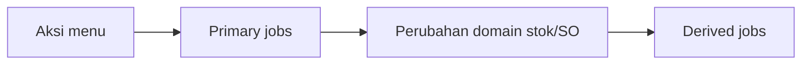

# Horizon Jobs — Requirement

**Audience:** PM, QA  
**Scope:** Aturan perilaku pipeline queue lintas menu. Detail Skip Wave → [pipelines/skip-wave-process.md](./pipelines/skip-wave-process.md).  
**Related menu:** [Skip Wave Process](../omni-skip-wave-process/requirement.md)

---

## 0. Metadata & Changelog

| Version | Date | Author | Changes |
|---------|------|--------|---------|
| 1.0 | 2026-09-20 | QA - Yemima | Initial: primary vs derived; gerbang; retry; observasi vs aturan |

---

## 1. Ringkasan Eksekutif

Dokumentasi ini memisahkan:

1. **Primary pipeline** — job yang di-dispatch secara eksplisit oleh menu/controller/scheduler.
2. **Derived pipeline** — job yang lahir dari observer / handler / package auditing setelah stok atau model berubah.

---

## 2. Prasyarat investigasi

| Prasyarat | Catatan |
|-----------|---------|
| Akses Horizon (API domain) | Bukan Vue host |
| Kode batch (`SW-` / `WV-` / `SP-`) | Dari datalist Skip Wave |
| Company + user upload | Untuk Redispatch & konteks |

---

## 3. Aturan umum (AS-IS)

| ID | Aturan |
|----|--------|
| HJ-01 | Primary jobs punya owner jelas (controller / command / `finally` callback). |
| HJ-02 | Derived jobs **tidak** wajib disebut di UI menu; efeknya bisa terus setelah status batch `completed`. |
| HJ-03 | Metrik “berapa job per order” dari Horizon = **observasi bertanggal**, bukan acceptance criteria abadi. |
| HJ-04 | Proposal optimasi (matikan audit, unique ending stock, dll.) = **Proposal**, bukan TO-BE sampai dipromote ke GAP menu terkait. |

---

## 4. Skip Wave — aturan yang mengikat (ringkas)

Sumber kanonik perilaku bisnis: [omni-skip-wave-process/requirement.md](../omni-skip-wave-process/requirement.md). Ringkas untuk jobs:

| Aturan | Detail |
|--------|--------|
| Gerbang | Maks. 1 batch `pending`/`processing` global (GAP-SW-02). Scheduler `skip-wave:dispatch` tiap menit. |
| Import | Tidak langsung dispatch wave; set `in_queue` + `is_eligible`. |
| Retry transient | Max 5; delay 5 / 10 / 15 detik (savepoint / deadlock / lock wait / Stopped, dll.). |
| Penutup | Status `completed` bergantung callback `Bus::batch` `finally` + finalisasi; jika pending jobs tidak habis, status bisa macet di `processing`. |
| Redispatch | UI boleh redispatch jika diam lebih dari 60 menit. |

---

## 5. Observasi (bukan AC)

Sample **Merdian · 20 Sep 2026** (artifact Claude tervalidasi mekanisme; angka = snapshot):

| Temuan | Ringkas |
|--------|---------|
| Fan-out primer | ~1.102 job per 1.000 SO (1 import + 1 orch + 1.000 wave + 100 processing) |
| Derived | Orde puluhan ribu job tambahan (audit + ending stock + balance + sync) — korelasi Horizon 5 menit |
| Batch stuck | Progress Shipped hampir penuh tetapi `skip_wave_status=processing` → gerbang menahan antrean lain |

Detail & tabel: [pipelines/skip-wave-process.md](./pipelines/skip-wave-process.md) § Observasi.

---

## 6. Gap / Proposal (bukan AC)

Proposal remediasi (Redis AOF/noeviction, disable audit detail saat skip, kurangi `Bus::batch` 1-job, watchdog gerbang, unique ending stock, throttle broadcast/sync) → [pipelines/skip-wave-process.md](./pipelines/skip-wave-process.md) § Proposal remediasi.

Belum menjadi GAP bernomor di requirement Skip Wave sampai PM/Dev promote.

---

## 7. Relasi menu

| Menu | Relasi |
|------|--------|
| Skip Wave Process | Pipeline penuh terdokumentasi |
| Unassign Wave / Skip Processing | Share job primer (`SOApproveToWave`, `SkipProcessing*`) — pipeline terpisah TBD |
| Marketplace stock | Derived `SyncStockPlatformJob` |

---

## 8. FAQ

**Q: Apakah Completed di Skip Wave berarti Horizon kosong?**  
A: Tidak. Job turunan bisa masih mengantre (HJ-02).

**Q: Angka 34.000 job turunan — wajib di-assert di test?**  
A: Tidak. Itu observasi bertanggal (HJ-03).
