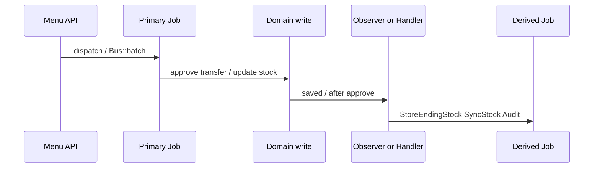

# Horizon Jobs — Technical

**Audience:** Developer, QA automation  
**Index pipelines:** [README](./README.md) · Skip Wave: [pipelines/skip-wave-process.md](./pipelines/skip-wave-process.md)  
**Aturan QA:** [requirement.md](./requirement.md) v1.1 (HJ-01…HJ-08, PROP-HJ-01)

---

## 1. File Map (pola lintas menu)

| Layer | Contoh path | Peran |
|-------|-------------|-------|
| Menu jobs | `Modules/*/Jobs/*` | Primary dispatch |
| Logic / service | `Modules/*/Logics/*`, `Services/*` | Orchestrate `Bus::batch` + `finally` |
| Scheduler | `app/Console/Commands/*`, `app/Console/Kernel.php` | Gate / cron |
| Observers | `Modules/*/Observers/*` | Derived fan-out |
| Stock after approve | `app/Helpers/SupplyChain/StockAfterApproveHandler.php` | Ending stock / balance |
| Auditing | `owen-it/laravel-auditing` → `ProcessDispatchAudit` | Derived audit jobs |
| Queue helper | `getQueueName('SalesOrder'|'import'|…)` | Connection naming |

---

## 2. Pola arsitektur

### 2.1 Primary vs derived

### 2.2 `Bus::batch` + `finally`

- Banyak pipeline Skip Wave memakai `allowFailures()` + `finally` untuk cleanup / fase berikutnya.
- **Fragility:** jika `pending_jobs` tidak pernah 0 (job hilang dari Redis, stall worker), `finally` tidak jalan → status batch UI bisa macet.
- Satu job dalam satu batch (pola `ItemStockObserver`) menambah baris `job_batches` tanpa manfaat callback grup.

### 2.3 Queue names (AS-IS Skip Wave)

| Job family | Queue helper |
|------------|--------------|
| Import Excel | `getQueueName('import')` |
| Wave + Skip Processing + retry | `getQueueName('SalesOrder')` |

---

## 3. Invariants (lintas pipeline)

| ID | Assertion |
|----|-----------|
| INV-HJ-01 | Primary job list untuk suatu menu harus bisa dilacak dari controller/command tanpa menebak observer. |
| INV-HJ-02 | Derived job list harus punya trigger class (observer/handler/package) yang terverifikasi di repo. |
| INV-HJ-03 | Dead code path (ada `return;` sebelum dispatch) wajib dilabel di pipeline doc. |
| INV-HJ-04 | Observasi Horizon wajib menyebut env + tanggal sample. |

---

## 4. Index pipelines

| Slug file | Menu | Primary entry |
|-----------|------|---------------|
| [skip-wave-process.md](./pipelines/skip-wave-process.md) | omni-skip-wave-process | Upload → ImportJob → `skip-wave:dispatch` → SkipWaveProcessJob |

---

## 5. Failure modes (umum)

| Mode | Efek | Mitigasi AS-IS |
|------|------|----------------|
| Redis tanpa persistence / eviction | Job pending hilang | Infra Redis AOF + `noeviction` (proposal) |
| `finally` tidak fire | Status menu macet; gerbang menahan antrean | Redispatch UI (Skip Wave, >60 menit) |
| Derived storm | Worker penuh setelah UI completed | Throttle / unique (proposal) |

---

## 6. Tests & QA Notes

- Assert jumlah primary job per N SO (formula tetap): import 1 + orch 1 + N wave + ceil(N/10) processing.
- Jangan hardcode jumlah derived di automated AC.
- Regresi: dead-code DO jobs tetap tidak di-dispatch dari `runBatchFinally` (DO di `skipShipping`).

---

## 7. Known Issues

| Ref | Note |
|-----|------|
| PROP-HJ-01 | Proposal remediasi — lihat requirement §8 / pipeline § Proposal |
| GAP-SW-02 | Gerbang Skip Wave global — lihat menu Skip Wave |
| Dead DO jobs | Create/Approve DO job path unreachable dari `runBatchFinally`; DO di `skipShipping` |

---

## 8. Changelog

| Version | Date | Changes |
|---------|------|---------|
| 1.1 | 2026-09-20 | Rujuk HJ-01…08 + PROP-HJ-01 dari requirement v1.1 |
| 1.0 | 2026-09-20 | Initial pola + index Skip Wave pipeline |
