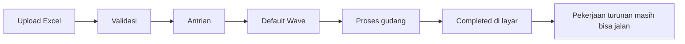

# Horizon Jobs — Panduan Pengguna

**Siapa yang baca panduan ini:** ops, support, fulfillment lead (bukan DevOps konfigurasi server)  
**Bukan menu tersendiri** — panduan membaca pekerjaan antrean yang dipicu menu seperti Skip Wave Process.

---

## 1. Apa Itu & Kenapa Penting

Saat kamu upload atau memproses banyak order, sistem menjalankan **banyak pekerjaan di belakang layar** (antrean). Progress di layar bisa sudah selesai, sementara pekerjaan turunan (hitung stok, sync toko, catat perubahan) masih jalan.

Dokumen ini membantu kamu membedakan: apa yang kamu lihat di menu vs apa yang masih sibuk di server — supaya tidak salah diagnose “batch macet” atau “server lambat”.

---

## 2. Overview Flow & Proses Bisnis

### Dua jenis pekerjaan

| Jenis | Artinya |
|-------|---------|
| Pekerjaan utama | Langsung dari menu (validasi file, kirim ke wave, proses gudang) — terlihat di progress |
| Pekerjaan turunan | Otomatis karena stok/data berubah — **tidak** punya kolom di menu |

### Alur Skip Wave (contoh utama)

**Versi teks:**

1. Upload file di Skip Wave Process.
2. Sistem validasi semua baris (satu salah = seluruh file gagal).
3. Batch masuk antrian; sistem hanya jalankan **satu** batch aktif di seluruh sistem.
4. Order dikirim ke Default Wave, lalu proses gudang sampai shipped.
5. Layar bisa **Completed** — pekerjaan turunan (stok/audit/sync) masih boleh mengantre.

🎬 [Interactive demo akan ditambahkan di sini]

### Status batch yang perlu kamu kenal

| Status | Artinya untuk antrean |
|--------|------------------------|
| In Queue | Menunggu giliran |
| Pending / Processing | Sedang jalan — menahan batch lain |
| Completed / Failed | Giliran terbuka; pekerjaan turunan boleh masih sibuk |

---

## 3. Sebelum Mulai (Flow Sebelum)

Pastikan:

- Kamu paham gejala dari **menu pemicu** dulu (biasanya Skip Wave Process), bukan langsung buka Horizon.
- Ada kode batch (`SW-…`) dan company/user yang upload — untuk diserahkan ke Support/DevOps.
- Kalau mau Redispatch: batch sudah diam lebih dari **60 menit** dan progress tampak macet (bukan masih bergerak).

🎬 [Interactive demo akan ditambahkan di sini]

---

## 4. Setelah Selesai (Flow Sesudah)

- Batch Completed di menu → boleh lanjut upload berikutnya, tapi **jangan** langsung unggah batch besar beruntun tanpa jeda jika server masih terasa lambat.
- Kalau banyak file lain menunggu lama → cek apakah ada satu batch yang menahan giliran (bisa dari company lain).
- Masalah pengiriman setelah shipped → menu Failed Ship (bukan Horizon Jobs).

🎬 [Interactive demo akan ditambahkan di sini]

---

## 5. Yang Perlu Diperhatikan

- Kalau layar bilang Completed, **jangan anggap** semua pekerjaan server sudah habis.
- Kalau banyak batch Pending lama: biasanya ada **satu** batch Processing yang menahan semua (antrian global).
- Kalau progress hampir penuh tapi status masih Processing lama: coba **Redispatch** setelah diam lebih dari 60 menit — jangan tekan saat masih aktif.
- Angka “berapa ribu job” dari sample Horizon **bukan** target yang harus sama tiap hari — selalu tanya tanggal & lingkungan sample.
- Usulan perbaikan infrastruktur (mis. pengaturan Redis) **bukan** aturan yang harus sudah jalan di production sampai diputuskan PM/Dev.

---

## 6. Langkah-Langkah (Step by Step)

1. Buka menu terkait (contoh: **Omni → Skip Wave Process**).
2. Catat **Batch Code**, status, progress Wave / Skip Processing.
3. Buka **Log Data** jika import gagal — perbaiki file, upload ulang.
4. Jika batch macet (diam > 60 menit, progress hampir penuh): tekan **Redispatch**.
5. Jika Redispatch gagal / tidak jelas: eskalasi Support/DevOps dengan batch code + company + waktu.
6. Untuk detail antrean Skip Wave: baca panduan pipeline di folder Horizon Jobs (link di Referensi).

🎬 [Interactive demo akan ditambahkan di sini]

---

## 7. Tips & Hal yang Sering Bikin Bingung

- **Completed tapi server masih lambat** — normal: pekerjaan turunan masih bisa jalan.
- **Company A menunggu, yang jalan company B** — antrian Skip Wave saat ini global.
- **Jangan hardcode “harus 34.000 job” di checklist QA** — itu sample observasi, bukan aturan tetap.
- **Beda Skip Processing menu** — itu pilih order yang sudah di wave; Skip Wave = upload batch. Keduanya bisa memicu antrean yang sama di belakang layar.
- Pipeline menu lain (Unassign Wave saja, Instant Settlement, dll.) **belum** terdokumentasi di hub ini — sementara rujuk menu masing-masing.

---

## 8. Referensi

| Butuh | Buka |
|-------|------|
| Aturan QA (HJ-01…08) | [requirement.md](./requirement.md) |
| Troubleshooting ops | [knowledge-base.md](./knowledge-base.md) |
| Pola teknis / indeks pipeline | [technical.md](./technical.md) |
| Detail job Skip Wave | [pipelines/skip-wave-process.md](./pipelines/skip-wave-process.md) |
| Job-flow Settlement / Sales Order (contoh visual) | [../_meta/horizon-jobs/](../_meta/horizon-jobs/) |
| Perilaku bisnis menu | [Skip Wave Process](../omni-skip-wave-process/) |
