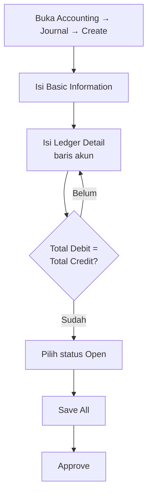

# Journal — Knowledge Base (Operator)

**Audience:** Finance, Accounting clerk, Support  
**Route:** `/accounting/journal`

---

## 1. Apa itu Journal?

Journal adalah buku pencatatan **debit dan kredit** untuk semua transaksi akuntansi. Ada dua cara muncul:

- **Manual** — Anda buat sendiri di menu Journal
- **Otomatis** — sistem membuatnya saat Anda approve transaksi lain (mis. Purchase Invoice, Sales Invoice, outbound gudang)

Hanya journal yang sudah **Approved** yang masuk laporan keuangan (buku besar / GL, Trial Balance, Balance Sheet, laba-rugi).

---

## 2. Kapan dipakai?

| ✅ Pakai Journal manual jika | ❌ Jangan mengandalkan edit manual jika |
|-----------------------------|----------------------------------------|
| Penyesuaian / jurnal koreksi yang tidak punya menu sumber | Transaksi bisnis sudah punya menu sendiri (invoice, payment, inbound) — biasanya journal-nya **otomatis** |
| Import massal dari Excel | Ingin ubah journal otomatis yang sudah Approved — tidak bisa diedit |

---

## 3. Alur kerja standar (manual)

Buat journal koreksi/penyesuaian langsung dari menu Journal. Happy path:

**Keterangan langkah:**

- **Basic Information:** isi tanggal (harus dalam periode akuntansi yang dibuka), mata uang, kurs, deskripsi. Field wajib harus terisi sebelum/bersamaan mengisi detail.
- **Ledger Detail di halaman yang sama:** tidak perlu simpan header dulu sebagai langkah terpisah — selama field wajib terisi, langsung tambah baris akun (Debit **atau** Credit per baris; pilih akun detail, bukan akun kelompok).
- **Cek balance:** lihat ringkasan di bawah tabel. Kalau belum sama, **Approve** tidak bisa jalan — koreksi baris dulu.
- **Open → Save All → Approve:** status harus **Open** sebelum Approve. Setelah Approved, journal masuk laporan dan tidak bisa diedit.

Alur import Excel dan journal otomatis dari transaksi lain: lihat §7–§8.

---

## 4. Form dasar

| Field | Fungsi singkat |
|-------|----------------|
| **Transaction Code** | Nomor journal (bisa diubah, harus unik) |
| **Transaction Date** | Tanggal jurnal — harus dalam periode akuntansi yang sedang dibuka |
| **Store** | Opsional — hubungkan ke toko/platform tertentu |
| **Transaction Reference** | Catatan referensi bebas |
| **Currency / Exchange Rate** | Mata uang & kurs (kurs terkunci jika mata uang utama) |
| **Description** | Ringkasan header |
| **Attachment** | Upload dokumen pendukung |

---

## 5. Ledger Detail (baris akun)

Setiap baris: pilih **akun detail** (bukan akun kelompok/induk), isi **Debit atau Credit** (salah satu), deskripsi opsional.

| Aturan | Artinya |
|--------|---------|
| Hanya akun detail | Akun induk tidak bisa dipilih |
| Debit atau Credit | Tidak boleh keduanya kosong; tidak boleh keduanya terisi di baris yang sama |
| Balance sebelum Approve | Total Debit harus sama Total Credit |

Di mata uang asing, kolom foreign muncul; ringkasan menampilkan juga setara IDR (dikali kurs).

---

## 6. Status & tombol

| Status | Artinya | Bisa diedit? |
|--------|---------|--------------|
| **Draft** | Masih disusun | Ya |
| **Open** | Siap disetujui | Ya |
| **Approved** | Final — masuk laporan | Tidak |
| **Rejected** | Ditolak — final | Tidak (tidak bisa dikembalikan) |

**Approve** hanya muncul saat status Open.

Journal **otomatis** dari transaksi lain langsung Approved — tidak lewat Draft/Open, dan tidak bisa diedit.

---

## 7. Journal otomatis dari transaksi lain

Saat Anda approve transaksi sumber (invoice, inbound, payment, dll.), sistem membuat journal sendiri.

| Yang perlu diketahui | Penjelasan |
|----------------------|------------|
| **Trx Ref** | Nomor transaksi **langsung** yang menerbitkan journal — bukan transaksi paling awal di rantai. Contoh: Stock Opname → Stock Deduction → journal; Trx Ref = nomor Stock Deduction |
| **Created by** | User yang **approve** transaksi sumber |
| **Tanggal** | Mengikuti tanggal transaksi sumber |

**Sejak 10 Juli 2026:** jika nilai transaksi sumber 0 (mis. harga barang 0), journal tetap punya baris akun dengan nilai 0 — tidak lagi hanya header kosong. Ini agar jejak akun tetap terlihat.

---

## 8. Import Excel

Gunakan template unduhan dari menu. Baris dengan **Row Number** sama digabung jadi satu journal (boleh banyak baris akun).

- Status setelah import: **Open** (belum auto-approve)
- **All-or-Nothing:** satu baris salah → seluruh file ditolak; semua pesan error tampil sekaligus — perbaiki semua, upload ulang

Kolom penting: tanggal (DD-MM-YYYY), Memo, COA Code (akun aktif & detail), Debit/Credit, Currency, Exchange.

---

## 9. Troubleshooting

| Gejala | Penyebab | Solusi |
|--------|----------|--------|
| Approve tidak jalan | Total Debit ≠ Total Credit | Samakan total di ringkasan bawah |
| Tidak bisa pilih akun tertentu | Akun itu induk/kelompok | Pilih akun yang lebih detail |
| Create gagal / auto-save gagal | Tanggal di luar periode dibuka | Ubah tanggal atau buka fiscal period |
| Import ditolak semua | Salah satu baris error (format/COA/balance) | Baca semua pesan error; perbaiki; upload ulang |
| Detail journal kosong (value 0) | Journal dibuat **sebelum** 10 Jul 2026 dengan perilaku lama | Bukan bug baru — cek tanggal journal; perilaku lama header-only |
| Tidak bisa edit journal otomatis | Status langsung Approved | By design — koreksi lewat transaksi sumber / jurnal koreksi manual |

---

## 10. FAQ

**Q: Kenapa muncul detail dengan angka 0?**  
A: Update 10 Jul 2026 — journal otomatis tetap tampilkan akun meskipun nilai sumber 0.

**Q: Bisa edit journal otomatis?**  
A: Tidak.

**Q: Kenapa Trx Ref bukan nomor transaksi paling awal?**  
A: Selalu nomor transaksi yang **langsung** menerbitkan journal.

**Q: Import gagal karena 1 baris dari ratusan?**  
A: Ya — aturan All-or-Nothing.

**Q: Apakah journal Rejected bisa dibuka lagi?**  
A: Tidak — status final.

---

## Related Documents

| Doc | Path |
|-----|------|
| Requirement | [requirement.md](./requirement.md) |
| Technical | [technical.md](./technical.md) |
