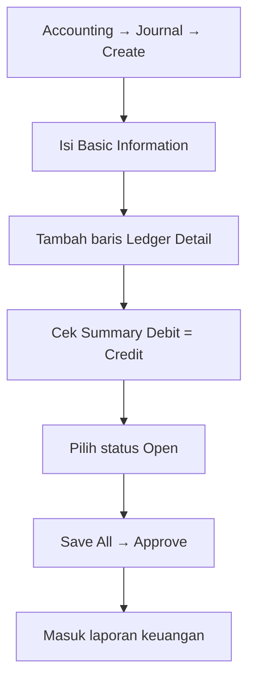

# Journal — Knowledge Base (Operator)

**Audience:** Finance, Accounting, Operations support  
**Route:** `/accounting/journal`

---

## 1. Apa itu Journal?

**Journal** mencatat semua jurnal akuntansi — yang Anda ketik manual maupun yang muncul sendiri karena transaksi lain (Sales Invoice, Purchase Invoice, Outbound, Stock Addition/Deduction, penerimaan/pembayaran, dll).

Hanya journal berstatus **Approved** yang masuk laporan keuangan (buku besar / GL, Trial Balance, Balance Sheet, P&L).

---

## 2. Kapan dipakai?

| ✅ Pakai Journal jika | ❌ Jangan pakai Journal jika |
|----------------------|------------------------------|
| Ada penyesuaian manual yang tidak punya transaksi sumber | Anda hanya ingin melihat laporan — pakai GL / P&L |
| Mau import banyak journal sekaligus dari Excel | Mau mengubah journal auto-generate (sudah Approved & terkunci) |
| Cek jejak journal dari transaksi lain (lihat **Trx Ref**) | Tanggal transaksi di luar Fiscal Period yang masih Open |

---

## 3. Alur kerja standar

Manual journal: buat header + baris akun, samakan total Debit & Credit, buka status Open, lalu Approve.

```mermaid
flowchart TD
    A["Accounting → Journal → Create"] --> B["Isi Basic Information"]
    B --> C["Tambah baris Ledger Detail"]
    C --> D["Cek Summary Debit = Credit"]
    D --> E["Pilih status Open"]
    E --> F["Save All → Approve"]
    F --> G["Masuk laporan keuangan"]
```

**Keterangan langkah:**

- **Create:** satu halaman untuk header + detail — tidak perlu simpan header dulu sebelum isi akun.
- **Basic Information:** tanggal harus masuk Fiscal Period aktif; currency & kurs; deskripsi wajib.
- **Ledger Detail:** pilih akun detail (bukan akun induk), isi **Debit** atau **Credit** saja per baris (jangan keduanya, jangan kosong).
- **Summary:** total Debit harus sama total Credit di seluruh journal — baru **Approve** bisa jalan.
- **Open → Approve:** radio **Open** dulu; tombol **Approve** hanya muncul saat Open. Setelah Approved, tidak bisa diubah.
- **Auto-generate:** journal dari transaksi lain langsung Approved — tidak lewat Draft/Open dan tidak bisa diedit.

---

## 4. Glosarium

| Istilah | Arti awam |
|---------|-----------|
| **Trx Ref** | Nomor transaksi asal yang menerbitkan journal ini (`-` kalau manual) |
| **COA / akun** | Daftar akun akuntansi (kas, persediaan, hutang, dll) |
| **Akun detail vs induk** | Hanya akun yang tidak punya sub-akun yang boleh dipilih |
| **Fiscal Period** | Periode pembukuan yang masih Open — menentukan tanggal valid |
| **Exchange Rate / kurs** | Nilai tukar ke mata uang utama perusahaan |
| **Auto-generate** | Journal yang muncul sendiri dari transaksi lain |
| **All-or-Nothing (import)** | Satu baris salah → seluruh file import ditolak |

---

## 5. Basic Information & Ledger Detail

### Header (Basic Information)

| Field | Wajib? | Catatan operator |
|-------|--------|------------------|
| Transaction Code | Ya | Auto; boleh diubah, harus unik |
| Transaction Date | Ya | Harus di Fiscal Period aktif — kalau tidak, simpan gagal |
| Store | Tidak | Opsional; store aktif tipe Platform & Others |
| Transaction Reference | Tidak | Catatan bebas |
| Currency | Ya | Default mata uang utama |
| Exchange Rate | Ya | `1` & terkunci untuk mata uang utama; editable jika asing |
| Description | Ya | Manual: isi sendiri; auto-generate: teks sistem |
| Upload file | Tidak | Lampiran eksternal |

### Baris ledger

| Field | Wajib? | Catatan |
|-------|--------|---------|
| Select Account | Ya | Hanya akun detail aktif |
| Debit / Credit | Salah satu | Tidak boleh keduanya kosong; tidak boleh keduanya terisi |
| Description | Tidak | Keterangan per baris |

Di datatable: Account · Foreign (jika currency asing) · Debit · Credit · Description · Action (Edit / Delete). Panel Summary menampilkan Total Amount + setara IDR (total × kurs).

---

## 6. Status & tombol

| Status | Bisa diedit? | Tombol utama |
|--------|--------------|--------------|
| **Draft** | Ya | Save All, radio Draft/Open |
| **Open** | Ya | Save All, **Approve**, radio Draft/Open |
| **Approved** | Tidak | — (final) |
| **Rejected** | Tidak | — (final, tidak bisa dibalik) |

Auto-generate: langsung **Approved** (Approved by System).

---

## 7. Journal otomatis dari transaksi lain

Saat transaksi sumber di-approve, sistem bisa menerbitkan journal sendiri (tipe mengikuti sumber: Sales Invoice, Purchase Invoice, Warehouse Stock Outbound, Stock Adjustment, Payment from Customer / to Supplier, Return, Credit/Debit Note, Assembly, Warehouse Stock Inbound, dll).

| Yang perlu tahu | Penjelasan |
|-----------------|------------|
| Status | Langsung Approved — tidak bisa diedit |
| Trx Ref | Nomor transaksi **langsung** penerbit, bukan yang paling hulu. Contoh: Stock Opname → Stock Deduction → Journal → Trx Ref = nomor Stock Deduction |
| Tanggal | Sama dengan tanggal transaksi sumber |
| Created by | User yang **approve** transaksi sumber |

### Detail value 0 (sejak 10 Juli 2026)

**Sebelum:** kalau amount sumber 0 (misalnya PO harga satuan 0 lalu Purchase Inbound), journal tetap Approved + Trx Ref lengkap, tapi **baris detail kosong** (supaya laporan tidak penuh angka 0).

**Sesudah:** sistem tetap menerbitkan **header + detail** sesuai akun masing-masing tipe transaksi, dengan Debit/Credit 0 ditampilkan apa adanya. Berlaku untuk semua tipe auto-generate, bukan hanya Inbound.

Journal lama (sebelum update) yang detailnya kosong biasanya **bukan bug** — cek tanggal journal-nya.

---

## 8. Import & export

### Import Excel

- Baris dengan **Row Number** sama = satu journal (boleh banyak baris akun).
- Tanggal format **DD-MM-YYYY**; waktu pakai saat import dijalankan.
- Per baris: Memo, kode akun detail aktif, Debit atau Credit, Currency, Exchange.
- Setelah berhasil: status default **Open** (belum auto-approve) — cek balance lalu Approve sendiri.
- **All-or-Nothing:** satu error di mana pun → seluruh file ditolak; semua pesan error dikumpulkan sekaligus. Perbaiki semua, lalu upload ulang.

### Export

- **Export Basic:** halaman aktif, header saja.
- **Export Advanced:** ikut filter (kosong = semua). Opsi With Details / Without Details / This Page Only.

Datalist juga punya **Show Deleted Data** dan Column Show/Hide.

---

## 9. Multi-currency

Currency diisi dengan kode. Kalau asing: di form tampil nilai foreign + setara IDR. Laporan GL tetap dalam IDR (nilai × kurs).

---

## 10. Troubleshooting

| Gejala | Penyebab umum | Solusi |
|--------|---------------|--------|
| Approve tidak jalan meski Debit/Credit sudah terisi | Total Debit ≠ Total Credit keseluruhan | Samakan di Summary bawah datatable |
| Tidak bisa pilih akun tertentu | Akun itu induk (punya sub-akun) | Pilih akun detail yang lebih spesifik |
| Simpan gagal saat isi tanggal | Tanggal di luar Fiscal Period Open | Ubah tanggal ke period yang masih aktif |
| Import ditolak semua padahal “cuma 1 baris salah” | All-or-Nothing | Baca semua pesan error, perbaiki semua, upload ulang |
| Detail journal kosong padahal transaksi sumber selesai | Journal auto-generate value 0 **sebelum** 10 Jul 2026 | Bukan bug perilaku lama — cek tanggal journal |
| Detail muncul Debit/Credit 0 | Perilaku baru sejak 10 Jul 2026 | Normal — sistem tampilkan detail apa adanya |
| Tidak bisa edit journal dari SI/PI/dll | Auto-generate sudah Approved | Benar — tidak bisa diubah dari Journal |
| Trx Ref bukan nomor transaksi “paling awal” | Trx Ref = penerbit langsung | Contoh: lihat Stock Deduction, bukan Stock Opname |

---

## 11. FAQ

**Q: Kenapa sekarang ada detail value 0, dulu kosong?**  
A: Sejak 10 Juli 2026, auto-generate tetap menampilkan baris akun + nilai meskipun amount sumber 0.

**Q: Journal auto-generate bisa diedit?**  
A: Tidak. Langsung Approved dan terkunci.

**Q: Kenapa Trx Ref bukan nomor transaksi paling awal?**  
A: Selalu nomor transaksi yang **langsung** menerbitkan journal.

**Q: Debit/Credit sudah keisi, kenapa Approve tetap tidak bisa?**  
A: Yang dicek adalah **total** Debit = **total** Credit di seluruh journal, bukan hanya per baris.

**Q: Import ditolak semua padahal hanya 1 baris salah?**  
A: Import journal All-or-Nothing — satu error menolak seluruh file.

---

## Related Documents

| Doc | Path |
|-----|------|
| Requirement | [requirement.md](./requirement.md) |
| Technical | [technical.md](./technical.md) |
| User Guide | [user-guide.md](./user-guide.md) |
