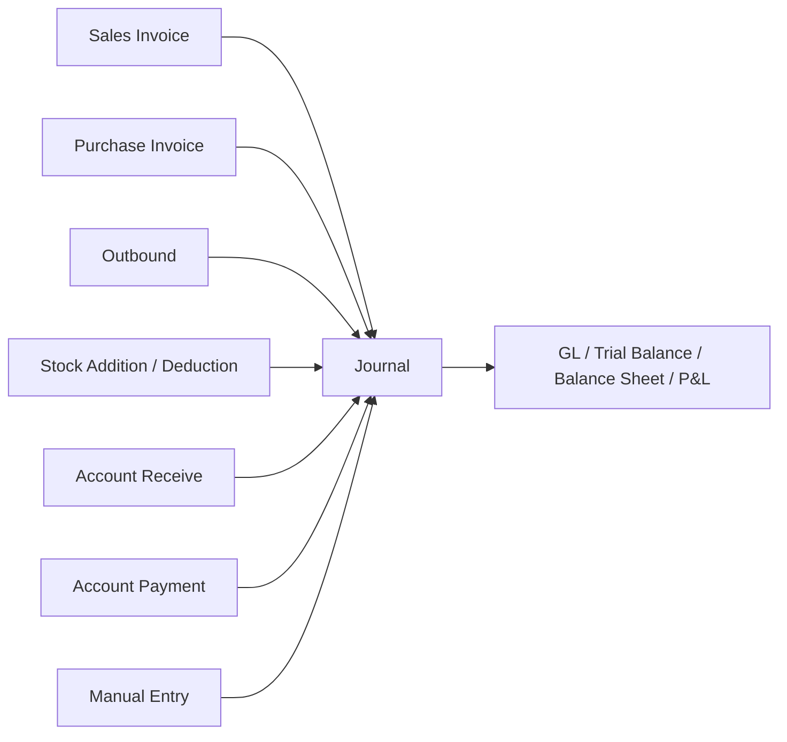
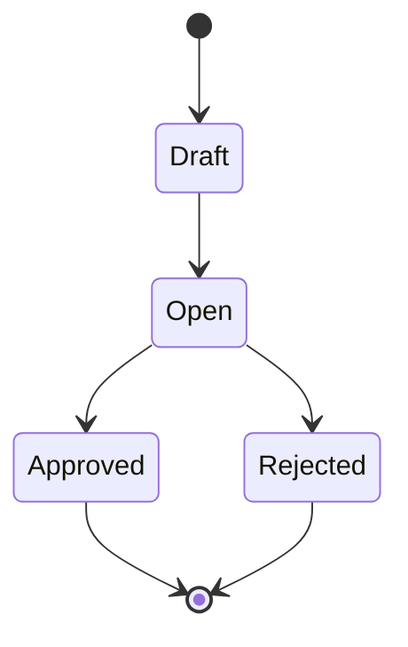
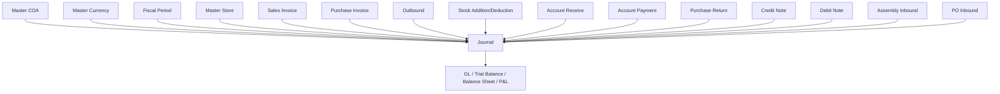

# Journal — Requirement Documentation

**Modul:** Finance & Accounting  
**Audience:** PM, Finance, QA  
**UI route:** `/accounting/journal`  
**SoT:** `accounting-journal-source-of-truth.md` v1.1 (10 Jul 2026)

Hanya journal **Approved** yang masuk laporan keuangan (GL, Trial Balance, Balance Sheet, P&L).

---

## 0. Metadata & Changelog

| Version | Date | Author | Changes |
|---------|------|--------|---------|
| 1.0 | 2026-05 | QA - Yemima | Initial — 13 tipe journal, import multi-currency, export advanced, auto-generate |
| 1.1 | 2026-07-15 | QA - Yemima | SoT v1.1: auto-generate value 0 tetap terbit detail COA (bukan header-only); GAP-JRN-01 backfill historical |

---

## 1. Ringkasan Eksekutif

Journal mencatat seluruh transaksi jurnal akuntansi — manual maupun auto-generate dari transaksi lain (Sales Invoice, Purchase Invoice, Outbound, Stock Addition/Deduction, AR, AP, dll). Audience utama: Finance/Accounting.

---

## 2. Prasyarat

| Prerequisite | Sumber | Catatan |
|--------------|--------|---------|
| Master COA aktif | Chart of Account | Hanya COA child (bukan parent) |
| Master Currency aktif | Master Currency | Minimal 1 primary currency |
| Fiscal Period aktif | Master Fiscal Period | Transaction Date harus dalam periode aktif — jika tidak, auto-save gagal |
| Master Store (opsional) | Store tipe Platform & Others, Active | Hanya jika journal terkait store |

---

## 3. Siklus Status

| Status | Kondisi | Editable? | Tombol |
|--------|---------|-----------|--------|
| **Draft** | Baru / masih diedit | Ya | Save All, radio Draft/Open |
| **Open** | User pilih Open, siap Approve | Ya (header + detail) | Save All, Approve, radio Draft/Open |
| **Approved** | Approve | Tidak | — (final) |
| **Rejected** | Reject dari Open | Tidak — tidak bisa reverse | — (final) |

Auto-generate by system: **langsung Approved**, skip Draft dan Open.

---

## 4. Datalist

| Kolom | Sumber | Default visible | Keterangan |
|-------|--------|-----------------|------------|
| Trx Code / Trx Date | Header | Ya | Nomor + tanggal |
| Type | Header | Ya | Salah satu dari 13 tipe (§6.2) |
| Description | Header | Ya | — |
| Curr / Exchange Rate | Header | Ya | — |
| Total | Detail | Ya | Total amount |
| Trx Ref | Sistem | Ya | Nomor transaksi langsung penerbit; `-` jika manual |
| Trx Status | Header | Ya | Draft / Open / Approved / Rejected |
| Created at / by | Audit | Ya | — |

**Fitur:** Show Deleted (deleted hanya text di Action); Column Show/Hide; Export Basic (active page, header only); Export Advanced — With Details / Without Details / This Page Only (ikuti filter aktif). Import: §6.3.

---

## 5. Form & Field

### 5.1 Basic Information

| Field | Wajib? | Default | Sumber | Validasi |
|-------|--------|---------|--------|----------|
| Transaction Code | Ya | Auto | — | Bisa diubah; unique |
| Transaction Date | Ya | Now | — | Harus Fiscal Period aktif |
| Store | Tidak | NULL | Store Platform & Others, Active | — |
| Transaction Reference | Tidak | NULL | Freetext | — |
| Currency | Ya | Primary | Master Currency Active | — |
| Exchange Rate | Ya | 1 (disabled jika primary) | — | Editable jika foreign |
| Description | Ya | `Default System` (auto) / kosong (manual) | — | — |
| Attachment | Tidak | — | — | File eksternal |

Create: Basic Information + Ledger Detail dalam **1 halaman** — tidak perlu save header terpisah selama required terpenuhi.

### 5.2 Ledger Detail — Input

| Field | Wajib? | Sumber | Catatan |
|-------|--------|--------|---------|
| Select Account | Ya | COA Active, child only | Parent ditolak |
| Debit | Conditional | — | Wajib jika Credit kosong |
| Credit | Conditional | — | Wajib jika Debit kosong |
| Description | Tidak | — | Per baris |

### 5.3 Ledger Detail — Datatable

Account (code + name) · Foreign (jika non-primary) · Debit · Credit · Description · Action (Edit modal / Delete).

### 5.4 Summary

Total Amount = Σ Debit / Σ Credit dalam currency transaksi. Equivalent in IDR = Total × Exchange Rate.

### 5.5 Sidebar (Edit/Show)

Jump Basic Information / Ledger Detail · Approval log · Audit Log · Radio Draft/Open · Save All · Approve (hanya Open).

---

## 6. How It Works

### 6.1 Auto-Create UI

Klik Create → langsung form header + detail. Tidak ada step simpan Basic Information terpisah.

### 6.2 Auto-Generate by System

| Field | Nilai |
|-------|-------|
| Description | Auto by system |
| Status | Langsung **Approved** |
| Trx Date | = Trx Date transaksi referensi |
| Created by | User yang **approve** transaksi referensi (bukan creator) |
| Created at | Timestamp insert journal |
| Approved by | System |
| Approved at | = Created at |

**Trx Ref** = transaksi **langsung** yang menerbitkan journal, bukan upstream paling jauh. Contoh: Stock Opname → Stock Deduction → Journal → Trx Ref = nomor Stock Deduction.

| Transaksi sumber | Tipe Journal |
|------------------|--------------|
| Sales Invoice | Sales Invoice |
| Outbound (order / expense / internal) | Warehouse Stock Outbound |
| Stock Addition | Stock Adjustment (Addition) |
| Stock Deduction | Stock Adjustment (Deduction) |
| Account Receive (AR) | Payment from Customer |
| Account Payment (AP) | Payment to Supplier |
| Purchase Invoice | Purchase Invoice |
| Purchase Return | Purchase Return |
| Credit Note | Credit Note |
| Debit Note | Debit Note |
| Assembly Inbound | Assembly Inbound |
| Purchase Order Inbound | Warehouse Stock Inbound |

#### Auto-generate value 0 (berlaku sejak 10 Jul 2026)

**Sebelum:** transaksi sumber amount 0 (mis. PO unit price 0 → Purchase Inbound) → journal Approved, header + Trx Ref lengkap, **detail kosong** (hindari sampah GL).

**Sesudah (request end user):** tetap terbit **header + detail** sesuai config COA tipe transaksi, value 0 ditampilkan apa adanya (Dr 0 / Cr 0). Berlaku **generik** untuk semua tipe di tabel di atas, bukan hanya Inbound.

`[VERIFY: CODEBASE]` — journal lama (header-only sebelum 10 Jul 2026): apakah di-backfill detail, atau historical as-is → GAP-JRN-01.

### 6.3 Import

| Kolom | Wajib? | Aturan |
|-------|--------|--------|
| Row Number | Ya | Integer; sama = 1 journal |
| Transaction Date | Ya | DD-MM-YYYY; time = waktu import |
| Description | Tidak | Header |
| Memo | Ya | Deskripsi per baris COA |
| COA Code | Ya | Active, child only |
| Debit / Credit | Conditional | Salah satu wajib; tidak boleh keduanya |
| Currency | Ya | Code Active; default template IDR |
| Exchange | Ya | Numeric; default 1 |
| Reference | Tidak | Freetext |

Grouping: Row Number sama = 1 transaksi (bisa ratusan baris COA). **All-or-Nothing** — 1 error → seluruh file ditolak; semua error dikumpulkan. Post-import: status default **Open** (tidak auto-approve).

### 6.4 Multi-Currency

Input pakai Code. Foreign: GL tetap IDR (amount × rate). Show/edit tampil foreign + IDR equivalent.

---

## 7. Validasi

### 7.1 Create/Edit Manual

| # | Kondisi | Behavior |
|---|---------|----------|
| 1 | COA parent | Tidak bisa disimpan |
| 2 | Debit dan Credit kosong | Tidak bisa disimpan |
| 3 | Debit dan Credit keduanya terisi | Tidak bisa disimpan |
| 4 | Total Debit ≠ Total Credit | Approve diblokir |
| 5 | Transaction Date di luar Fiscal Period aktif | Auto-save gagal |
| 6 | Transaction Code duplikat | Tidak bisa disimpan |

`[VERIFY: CODEBASE]` — auto-generate pasca 10 Jul dengan Dr=0 dan Cr=0: apakah validasi #2 di-bypass (0 dianggap “terisi eksplisit”, bukan kosong).

### 7.2 Import — error messages

| # | Skenario | Message |
|---|----------|---------|
| 1 | Kolom wajib kosong | `Row [X]: [Column Name] cannot be empty.` |
| 2 | Row Number non-numeric | `Row [X]: Row Number must be a numeric value.` |
| 3 | Date format invalid | `Row [X]: Invalid date format. Please use DD-MM-YYYY.` |
| 4 | COA not found/inactive | `Row [X]: COA Code [Code] not found or inactive.` |
| 5 | COA parent | `Row [X]: COA Code [Code] is a parent account. Only child accounts are allowed.` |
| 6 | Debit & Credit kosong | `Row [X]: Either Debit or Credit must be filled.` |
| 7 | Debit & Credit keduanya | `Row [X]: Debit and Credit cannot both be filled in the same row.` |
| 8 | Debit/Credit non-numeric | `Row [X]: [Column Name] must be a numeric value.` |
| 9 | Currency invalid | `Row [X]: Currency Code [Code] not found or inactive.` |
| 10 | Exchange non-numeric | `Row [X]: Exchange must be a numeric value.` |
| 11 | Unbalanced per Row Number | `Journal [Row Number]: Total Debit and Credit must be equal.` |

---

## 8. Relasi Menu Lain

| Menu | Peran |
|------|-------|
| Master COA / Currency / Fiscal Period / Store | Prasyarat & atribut journal |
| SI, PI, Outbound, Stock Adj, AR, AP, Return, CN, DN, Assembly, PO Inbound | Penerbit auto-generate |
| GL / TB / BS / P&L | Konsumen journal Approved |

---

## 9. Gap Registry

| ID | Deskripsi | Dampak | Status |
|----|-----------|--------|--------|
| GAP-JRN-01 | Belum konfirmasi: journal auto-generate lama (header-only, sebelum 10 Jul 2026) di-backfill detail atau dibiarkan historical | Inkonsistensi data lama vs baru untuk laporan komparatif | **Open** |

---

## 10. FAQ

**Q: Kenapa journal sekarang muncul detail value 0, sebelumnya kosong?**  
A: Sejak 10 Jul 2026, auto-generate tetap menampilkan detail COA + value meskipun amount sumber 0.

**Q: Auto-generate bisa diedit?**  
A: Tidak — langsung Approved dan non-editable.

**Q: Trx Ref bukan nomor transaksi paling awal?**  
A: Trx Ref = transaksi langsung penerbit, bukan upstream (mis. Stock Deduction, bukan Stock Opname).

**Q: Approve tidak bisa meski Debit/Credit terisi?**  
A: Total Debit harus sama Total Credit di keseluruhan journal.

**Q: Import ditolak semua padahal 1 baris salah?**  
A: All-or-Nothing — 1 error menolak seluruh file.

---

## Related Documents

| Doc | Path |
|-----|------|
| Knowledge Base | [knowledge-base.md](./knowledge-base.md) |
| Technical | [technical.md](./technical.md) |
