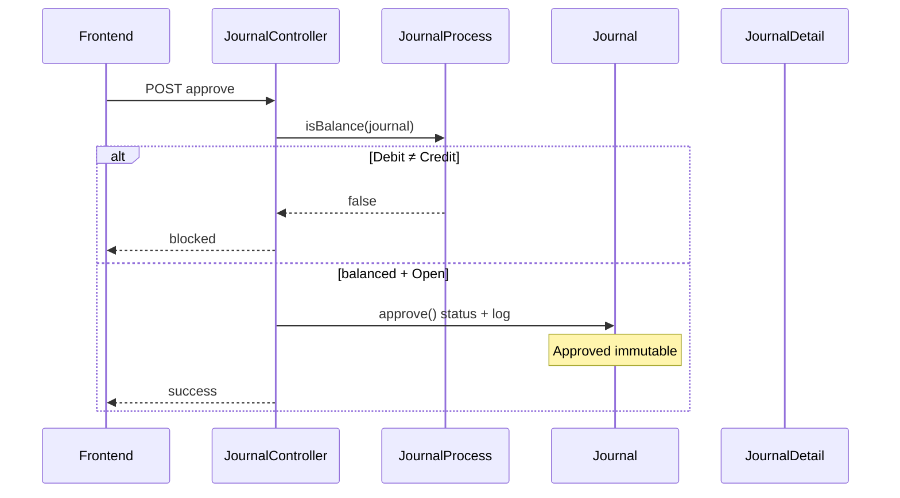

# Journal — Technical Documentation

**API prefix:** `accounting/journal`  
**Module:** `Modules/Accounting`  
**Behavior:** [requirement.md](./requirement.md) v1.1

---

## 1. File Map

### Backend

| Layer | Path |
|-------|------|
| Routes | `Modules/Accounting/Routes/api.php` (journal + journal-detail) |
| Controller header | `Modules/Accounting/Http/Controllers/JournalController.php` |
| Controller detail | `Modules/Accounting/Http/Controllers/JournalDetailController.php` |
| Model header | `Modules/Accounting/Entities/Journal.php` (`accounting_journals`, prefix `GL`) |
| Model detail | `Modules/Accounting/Entities/JournalDetail.php` |
| Store pivot | `Modules/Accounting/Entities/JournalStorePivot.php` |
| Policy | `Modules/Accounting/Policies/JournalPolicy.php` |
| Auto-journal | `app/Helpers/Accounting/JournalProcess.php` |
| Reports (GL etc.) | `app/Helpers/Accounting/JournalReport.php` |
| Import | `Modules/Accounting/Import/JournalImport.php` + `Jobs/JournalImportJob.php` |
| Import log / history | `ImportJournalLog`, `JournalImportHistory` |
| Export | `JournalExportService`, `JournalExportJob`, `JournalDetailExportJob` |

### Frontend

| Layer | Path |
|-------|------|
| List | `olshoperp-frontend/src/pages/Accounting/Journal/DataList.vue` |
| Form | `Form.vue` |
| Detail grid | `DatalistDetail.vue` |
| Header show | `HeaderBasicInformation.vue` |
| Approval | `ApprovalDialog.vue`, `ApprovalEligibility.vue`, `DatalistLogApproval.vue` |

### Auto-journal entry points (JournalProcess)

| Method | Sumber (kira-kira) |
|--------|-------------------|
| `stockInboundAutoJournal` | PO / warehouse inbound |
| `stockOutboundAutoJournal` | Outbound |
| `supplierInvoiceAutoJournal` | Purchase Invoice |
| `supplierPaymentAutoJournal` | Account Payment |
| `customerInvoiceAutoJournal` | Sales Invoice |
| `customerPaymentAutoJournal` | Account Receive |
| `stockPurchaseReturnAutoJournal` / `stockSalesReturnAutoJournal` | Returns |
| `creditNoteAutoJournal` / `debitNoteAutoJournal` | CN / DN |
| `openingStockAutoJournal` / `additionCoaAutoJournal` | Opname / addition |

Detail tipe journal string: [requirement §6.2](./requirement.md#62-auto-generate-by-system).

---

## 2. API Routes (utama)

| Method | Path | Action |
|--------|------|--------|
| GET/POST | `accounting/journal` | Index / Store |
| GET/PUT/DELETE | `accounting/journal/{id}` | Show / Update / Destroy |
| POST | `accounting/journal/{id}/approve` | Approve / Reject |
| GET | `…/get-total-debit-credit/{journal}` | Summary balance |
| GET | `journal-detail/{journal}/list` | Detail datalist |
| POST/PATCH/DELETE | `journal-detail` (+ inline) | CRUD lines |
| GET | `journal-detail/select2-coa` | COA child only |
| POST | `journal/upload` | Import Excel |
| GET | `journal/download-template` | Template |
| GET | `journal/import-log` / `import-history` / `progress` | Import UX |
| GET | `journal/export-excel` / `export-file` / `export-progress` | Export |

Polymorphic Trx Ref: `transaction_reference_id` + `transaction_reference_class` (+ text/url helpers) on `Journal`.

---

## 3. Database — Key Tables

### `accounting_journals`

| Column | Notes |
|--------|-------|
| `code` | Prefix `GL`, unique per company |
| `transaction_date`, `description`, `transaction_status` | draft / open / approved / rejected |
| `currency_id`, `exchange_rate`, `current_primary_currency_id` | Multi-currency |
| `transaction_reference_*` | Morph / text link to sumber |
| Soft delete | SemiHardDeletes |

### `accounting_journal_details`

| Column | Notes |
|--------|-------|
| `journal_id`, `coa_id` | Line |
| `debit`, `credit` | Primary amounts |
| `debit_foreign`, `credit_foreign` | When foreign currency |
| `description` | Per line (import: Memo) |

### Import support

`accounting_import_journal_logs`, `accounting_journal_import_histories`, export temp/files tables.

---

## 4. Services / Pricing / Balance

| Helper | Role |
|--------|------|
| `JournalProcess::totalDebit` / `totalCredit` / `isBalance` | Approve gate |
| `JournalProcess::*AutoJournal` | Build header + details on source approve |
| `JournalDetailController@store` | Foreign → store primary + foreign columns |
| `JournalReport` | GL / period aggregates — filter approved journals |

Foreign handling (detail store): if journal currency ≠ primary or rate ≠ 1 → persist primary `debit`/`credit` and keep foreign columns.

---

## 5. Approve Flow



Auto-generate path (sumber transaksi):

```mermaid
sequenceDiagram
    participant Src as Source doc approve
    participant JP as JournalProcess
    participant J as Journal
    participant D as JournalDetail

    Src->>JP: *AutoJournal(source)
    JP->>J: create header status Approved
    JP->>D: insert detail lines per COA config
    Note over J,D: Skip Draft/Open; Approved by System
```

---

## 6. Invariants

| ID | Invariant |
|----|-----------|
| INV-JRN-01 | `Σ debit = Σ credit` (primary) before/at Approved — including journals whose amounts are 0 |
| INV-JRN-02 | Approved journal: no write path for header/detail mutation |
| INV-JRN-03 | Auto-generate inserts as **Approved** only — never Draft/Open |
| INV-JRN-04 | Post 10 Jul 2026 (SoT): every new auto-journal should insert detail rows matching source COA config even when amounts are 0 — no header-only for **new** txs |
| INV-JRN-05 | `transaction_reference` points to **direct** publisher, not furthest upstream |
| INV-JRN-06 | Detail COA must be leaf/active |

`[VERIFY: CODEBASE]` INV-JRN-04: `JournalProcess` still contains `preventZero` / comments `skip zero rows (both debit & credit zero)` on some auto-journal paths (e.g. payment). Confirm which methods honor SoT zero-detail behavior vs still skip.

---

## 7. Validation Highlights

| Rule | Location |
|------|----------|
| Fiscal period on date | Create/update journal |
| Unique code | Store/update |
| COA child only | Detail select2 + store |
| Debit XOR Credit (manual) | Detail validation |
| Balance before approve | `isBalance` |
| Import all-or-nothing | `JournalImport` collects errors; no partial commit |
| Import messages | See [requirement §7.2](./requirement.md#72-import--error-messages) |

`[VERIFY: CODEBASE]` — auto lines with debit=0 and credit=0: bypass of “both empty” rule for auto-generate only.

---

## 8. Frontend Behaviors

| Behavior | Notes |
|----------|-------|
| Single-page create | Header + detail without separate header-only save |
| Draft/Open radio | Sidebar on edit |
| Approve only Open | Manual journals |
| Import UX | Template download, progress, import-log |
| Export | Basic page / Advanced with|without details |

---

## 9. Failure Modes & Transaction Boundary

| Failure | Scope | Behavior |
|---------|-------|----------|
| Import any row error | Batch | All-or-nothing rollback; errors → `ImportJournalLog` |
| Fiscal period invalid | Manual create | Auto-save blocked (not silent) |
| Unbalanced | Approve | Rejected — no status change |
| Auto-journal mid-fail | Source TX + JournalProcess | Typically wrap in DB transaction; `[VERIFY: CODEBASE]` if missing COA config: fail source vs empty header |
| Zero amount (legacy) | Pre-10-Jul journals | May be header-only historical (GAP-JRN-01) |
| Zero amount (SoT current) | New auto journals | Expect Dr/Cr 0 detail rows; code paths still have skip-zero — verify parity |
| GL aggregation | Reports | Must tolerate 0-value detail rows |

---

## 10. Data Lifecycle

| Stage | Trigger | Journal effect |
|-------|---------|----------------|
| Source doc **Approve** | SI, PI, Outbound, Stock Adj, AR, AP, Return, CN, DN, Assembly, PO Inbound | Insert Approved journal + details |
| Manual create → Open → Approve | User | Draft/Open editable → Approved immutable |
| Import finish | Excel job | Journals status **Open** |
| Rejected | Manual reject | Final — no revert path (SoT) |
| Downstream | GL / TB / BS / P&L | Consume `transaction_status = approved` |

Value 0 on source (e.g. PO unit price 0) flows to journal detail since SoT 1.1; previously dropped at generation layer.

---

## 11. Tests & QA Notes

| Area | Suggestion |
|------|------------|
| Balance gate | Approve blocked when totals differ |
| Auto Approved | Source approve → journal Approved, cannot PATCH |
| Trx Ref morph | Assert class/id = direct publisher (e.g. Stock Deduction) |
| Zero detail SoT | Inbound from zero-price PO → detail rows Inventory/Unbilled with 0 |
| Skip-zero residual | Regression on payment/outbound paths that still `skip zero rows` |
| Import AON | One bad COA → zero journals inserted; N error logs |
| Fiscal | Date outside period → create fails |

---

## 12. Known Issues

| ID | Issue |
|----|-------|
| GAP-JRN-01 | Historical header-only (pre 10 Jul 2026) backfill undecided — Open |
| VERIFY | Skip-zero code vs SoT “always emit zero details” for all auto types |
| VERIFY | Manual Rejected immutability vs any FE path that reopens |

Full registry: [requirement §9](./requirement.md#9-gap-registry).

---

## Related Documents

| Doc | Path |
|-----|------|
| Requirement | [requirement.md](./requirement.md) |
| Knowledge Base | [knowledge-base.md](./knowledge-base.md) |
| API routes (suplemen) | `docs/api/accounting/routes.md` |
