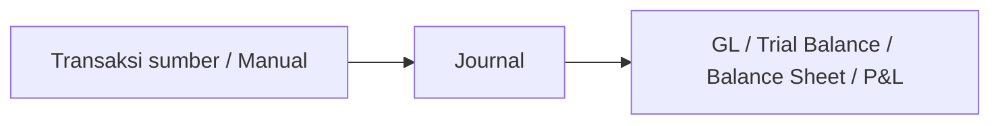
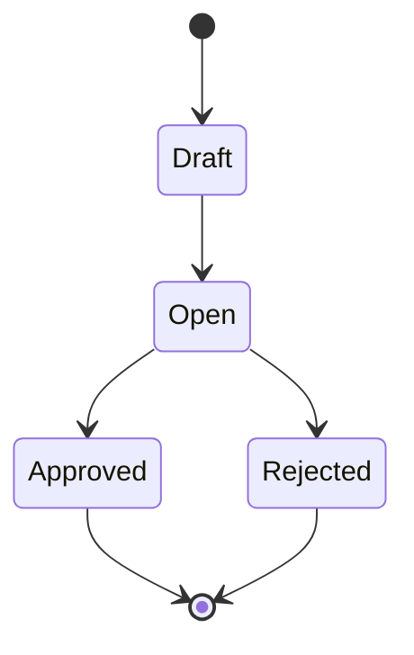

# Journal — Panduan Pengguna

**Siapa yang baca panduan ini:** finance, accounting, operations support  
**Menu di sistem:** Accounting → Journal  
**Route:** `/accounting/journal`

---

## 1. Apa Itu & Kenapa Penting

Journal adalah tempat mencatat jurnal akuntansi — baik yang kamu buat manual maupun yang muncul otomatis setelah transaksi lain di-approve (invoice, outbound, penyesuaian stok, pembayaran, dll).

Hanya journal yang sudah **Approved** yang masuk ke laporan keuangan. Tanpa journal yang benar dan seimbang (total Debit = total Credit), angka di buku besar dan P/L bisa tidak lengkap atau tidak akurat.

---

## 2. Overview Flow & Proses Bisnis

### Rantai proses (sumber → journal → laporan)

**Versi teks (tanpa diagram):**

1. Transaksi sumber (Sales Invoice, Purchase Invoice, Outbound, Stock Adjustment, AR/AP, dll) di-approve — **atau** kamu buat journal manual / import Excel.
2. Journal tercatat di menu **Journal** (otomatis langsung Approved, atau manual lewat Draft → Open → Approve).
3. Journal Approved dipakai laporan: General Ledger, Trial Balance, Balance Sheet, Profit & Loss.

🎬 [Interactive demo akan ditambahkan di sini]

### Siklus status transaksi

**Versi teks — arti tiap status:**

| Status | Artinya | Bisa diubah? |
|--------|---------|--------------|
| **Draft** | Baru / masih diedit | Ya |
| **Open** | Siap di-approve | Ya |
| **Approved** | Final; masuk laporan | Tidak |
| **Rejected** | Ditolak dari Open; tidak bisa dibalik | Tidak |

> Journal yang dibuat sistem dari transaksi lain **langsung Approved** — tidak lewat Draft/Open dan tidak bisa diedit.

---

## 3. Sebelum Mulai (Flow Sebelum)

Pastikan ini sudah siap:

- [ ] **Chart of Account** — akun detail aktif sudah ada (akun induk tidak bisa dipilih di journal).
- [ ] **Currency** — minimal satu mata uang utama aktif.
- [ ] **Fiscal Period** — ada period **Open** yang mencakup tanggal journal kamu.
- [ ] (Opsional) **Store** aktif tipe Platform & Others, kalau journal perlu diatribusikan ke store.
- [ ] Untuk import: file Excel mengikuti template (Row Number, tanggal DD-MM-YYYY, kode akun, Debit/Credit, currency, kurs).

**Catatan penting:**

- Tanggal di luar period Open → simpan gagal.
- Auto-generate tidak perlu dibuat manual — cukup selesaikan transaksi sumbernya.

🎬 [Interactive demo akan ditambahkan di sini]

---

## 4. Setelah Selesai (Flow Sesudah)

Setelah journal **Approved** (manual atau otomatis):

- Angka masuk ke **General Ledger**, Trial Balance, Balance Sheet, dan **Profit & Loss**.
- Journal Approved **tidak bisa diedit** lagi.
- Untuk journal otomatis, cek **Trx Ref** untuk menelusuri transaksi langsung yang menerbitkannya (bukan transaksi paling hulu).

Kalau kamu baru import: status biasanya masih **Open** — cek balance, lalu Approve sendiri.

🎬 [Interactive demo akan ditambahkan di sini]

---

## 5. Yang Perlu Diperhatikan

- Kalau kamu pilih **akun induk** (punya sub-akun), baris tidak bisa disimpan — pilih akun yang lebih detail.
- Kalau satu baris Debit dan Credit **keduanya kosong** atau **keduanya terisi**, baris tidak bisa disimpan — isi salah satu saja.
- Kalau **total Debit** belum sama **total Credit** di keseluruhan journal, tombol **Approve** tidak jalan — samakan dulu di Summary.
- Kalau **tanggal** di luar Fiscal Period yang masih Open, simpan otomatis gagal — geser tanggal ke period aktif.
- Kalau **kode transaksi** sudah dipakai journal lain, simpan ditolak — ganti kode unik.
- Kalau **import** punya satu baris salah saja, **seluruh file** ditolak (All-or-Nothing) — perbaiki semua error yang muncul, lalu upload ulang.
- Kalau currency asing, pastikan **kurs** diisi angka yang benar; di layar kamu lihat nilai asing + setara IDR.

---

## 6. Langkah-Langkah (Step by Step)

### A. Buat journal manual

1. Buka **Accounting → Journal**.
2. Klik **Create** — form header + ledger muncul di satu halaman.
3. Isi **Transaction Date**, **Currency**, **Description** (dan Store / Reference bila perlu). Kode transaksi biasanya terisi otomatis.
4. Di **Ledger Detail**, pilih akun → isi Debit **atau** Credit → simpan baris. Ulangi sampai semua akun masuk.
5. Cek **Summary**: Total Debit harus sama Total Credit.
6. Di sidebar, pilih radio **Open**.
7. Klik **Save All**, lalu **Approve**.

### B. Journal dari transaksi lain (otomatis)

1. Approve transaksi sumber (misalnya Purchase Invoice atau Outbound).
2. Buka **Journal** → cari lewat tanggal, tipe, atau **Trx Ref**.
3. Status sudah **Approved** — baca saja, jangan harap bisa edit.

### C. Import Excel

1. Unduh template dari menu Journal.
2. Isi baris: Row Number sama = satu journal; Memo + kode akun + Debit/Credit + Currency + Exchange.
3. Upload file. Kalau ada error, baca **semua** pesan (bukan hanya yang pertama), perbaiki, upload ulang.
4. Journal hasil import biasanya **Open** — buka, cek balance, Approve.

### D. Export / daftar

1. Filter datalist sesuai kebutuhan.
2. **Export Basic** = halaman aktif, header saja; **Export Advanced** = ikut filter, dengan/tanpa detail.
3. Centang **Show Deleted Data** bila perlu melihat data terhapus (kolom Action menampilkan teks deleted).

🎬 [Interactive demo akan ditambahkan di sini]

---

## 7. Tips & Hal yang Sering Bikin Bingung

- **Detail value 0 sejak 10 Juli 2026.** Contoh: PO harga satuan 0 → Purchase Inbound → journal sekarang tetap punya baris akun (Debit 0 / Credit 0), bukan tabel kosong. Journal lama sebelum tanggal itu yang detailnya kosong biasanya perilaku lama, bukan bug.
- **Approve “sudah keisi tapi tidak bisa.”** Yang dihitung adalah total seluruh journal, bukan per baris. Lihat Summary di bawah.
- **Import “cuma salah 1 baris, kenapa semua gagal?”** Memang All-or-Nothing — satu error membatalkan seluruh file.
- **Trx Ref aneh.** Selalu nomor penerbit langsung. Stock Opname yang mengurangi stok menerbitkan Stock Deduction dulu; Trx Ref journal = nomor Stock Deduction, bukan Stock Opname.
- **Tidak bisa edit journal dari invoice/outbound.** Benar — auto-generate langsung Approved dan terkunci.
- **Tidak bisa pilih akun.** Biasanya akun itu induk — pilih yang lebih spesifik.

---

## 8. Referensi

| Butuh | Buka |
|-------|------|
| Aturan lengkap / acceptance | [requirement.md](./requirement.md) |
| Troubleshooting operator | [knowledge-base.md](./knowledge-base.md) |
| API / kode / DB | [technical.md](./technical.md) |
