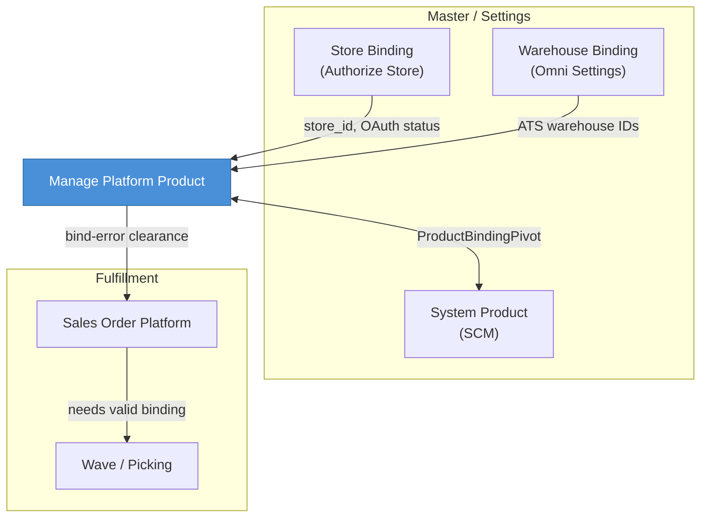

# Manage Platform Product — Requirement Documentation

## 0. Metadata & Changelog

| Version | Date | Author | Changes |
|---|---|---|---|
| 1.0 | 2026-06-19 | QA - Yemima | Initial AS-IS documentation |
| 1.1 | 2026-06-19 | QA - Yemima | Merge glossary §12 + bulk binding §13 from legacy |
| 1.2 | 2026-06-22 | QA - Yemima | Onboarding sequencing sync produk (§14); update entry point store bind |

---

## 1. Tujuan & Fungsi Menu

**Fungsi utama / Main purpose:**  
Menyediakan workspace operasional untuk **menyelaraskan katalog marketplace dengan master produk internal** — meliputi sync produk dari platform, binding SKU, pengaturan push stok, dan monitoring log sync.

**Siapa yang pakai / Users:**  
Tim OmniChannel ops, catalog admin, QA, dan support internal yang mengelola multi-store marketplace.

**Kapan dipakai / When used:**  
- Saat toko baru di-authorize (initial product pull + bind)  
- Rutin harian: cek status Binded/Not Binded, push stok, pull update produk  
- Saat order platform error `unbinded product` / bind-error  
- Troubleshooting sync gagal via Sync Log  

**Posisi dalam flow bisnis / Business flow position:**

```
Marketplace listing → [Manage Platform Product: sync + bind + stock] → Sales Order Platform → Wave/Fulfillment
```

Menu ini berada **setelah** produk listed di marketplace & store connected, **sebelum** order dapat diproses penuh di gudang (butuh binding valid).

**UI route:** `/omni/platform-product`  
**API prefix:** `POST/GET .../omnichannel/product-platform/*`

---

## 2. Scope

### In Scope
- DataList Platform Product (filter store, advanced filter, export)  
- Manual binding & stock settings per baris (modal Specification Product)  
- Auto Binding, Bulk Binding, Pull Products, Push Stock (header actions)  
- Bulk actions: sync product, edit stock, push stock, delete  
- Per-row sync product (SINGLE/PARENT only)  
- Sync Log panel (Action Log + Product Sync)  
- Bulk Binding Log (inside Bulk Binding panel)  
- Product delete (manual + bulk) dengan aturan tree SKU  
- Auto-delete orphan SKU saat sync (per batch sync sukses, scoped `product_platform_id`)  
- Dampak binding ke Sales Order Platform (backfill `product_id`, clear bind-error)  

### Out of Scope
- CRUD System Product (menu SCM terpisah)  
- CRUD / authorize Store (menu Store Binding terpisah)  
- Sync & approve Sales Order Platform (menu Dev - Sales Platform)  
- Push/update **harga** ke platform via `update_platform_price` (endpoint ada, tidak exposed di DataList utama)  
- Edit SKU/nama produk platform langsung di OlshopERP  
- Shopee/Lazada product webhooks (belum implemented — hanya TikTok webhook produk)  
- Bulk unbind massal (tidak ada fitur dedicated)  

> ⚠️ User mungkin expect bisa **create** Platform Product manual — saat ini `can_create: false` di UI. Catat di Section 11.

---

## 3. AS-IS Feature Map

| ID | Fitur/Aksi | Deskripsi Singkat | Validasi (ref) | Function (ref) |
|---|---|---|---|---|
| A-01 | Filter Store | Multi-select store di atas DataList | V-01 | F-01 |
| A-02 | View & Export DataList | Lihat produk, advanced filter, export Excel | V-01 | F-01 |
| A-03 | Manual Binding | Bind/unbind per baris via modal Specification | V-02, V-03, V-04, V-05 | F-04, F-05 |
| A-04 | Stock Settings | Fake Stock, Minimum Stock, Stock Ratio per baris | V-06, V-07 | F-06 |
| A-05 | Auto Binding | Cocokkan SKU unbound ↔ system product (per store terpilih) | V-08, V-09 | F-07 |
| A-06 | Bulk Binding | Bind SKU platform identik di semua toko aktif → 1 system product | V-10, V-11 | F-08 |
| A-07 | Pull Products | Sync produk dari marketplace ke OlshopERP | V-12, V-13 | F-02 |
| A-08 | Push Stock | Push stok ke marketplace (per store terpilih) | V-14, V-15 | F-03 |
| A-09 | Sync Product (per row) | Sync ulang satu produk platform | V-16 | F-09 |
| A-10 | Bulk Sync Product | Sync produk terpilih (checkbox) | V-17 | F-10 |
| A-11 | Bulk Edit Stock | Update fake/min/ratio untuk baris terpilih | V-18 | F-11 |
| A-12 | Bulk Push Stock | Push stok untuk baris terpilih | V-14 | F-03 |
| A-13 | Bulk Delete | Hapus baris terpilih | V-19, V-20 | F-12 |
| A-14 | Sync Log Panel | Action Log + Product Sync history | V-01 | F-13 |
| A-15 | Bulk Binding Log | Riwayat bind via Bulk Binding | V-01 | F-08 |
| A-16 | Delete (per row) | Hapus satu Platform Product | V-19, V-20 | F-12 |

---

## 4. Function Inventory

| Function ID | Nama Function | Trigger | Deskripsi Proses | Aksi (§3) |
|---|---|---|---|---|
| F-01 | Load Product DataList | Page load / filter change | Query `omni_products` scoped company + store filter; render kolom binding, stock, type | A-01, A-02, A-14 |
| F-02 | Product Platform Sync (Store) | Pull Products button / cron `product-platform:sync` / onboarding scheduler / store bind (re-auth only) | `ProductPlatformSyncStoreJob` → list API platform → incremental filter → chunk/single sync → write `omni_products` tree → orphan cleanup → `AutobindBatchJob` | A-07 |
| F-03 | Push Stock Batch | Push Stock button / bulk push / scheduled | `CanPushStock::pushStocks` → `PushStockBatchJob` → platform API; qty from fake stock or ATS×ratio/min | A-08, A-12 |
| F-04 | Manual Bind / Unbind | Save Binding form | `ProductBindingPivot` updateOrCreate/delete; copy stock units; `handleErrorFlagBinding`; observer → `UpdateOrderDetailOnProductBindJob` | A-03 |
| F-05 | Backfill SO on Bind | After binding created/updated | Job fills `product_id` on SO details where null + same `product_omni_id`; clears bind-error flags | A-03, A-05, A-06 |
| F-06 | Stock Settings Save | Save Stock form | Update `fake_stock`, `minimum_stock_qty`, `stock_ratio`, `stock` on platform product | A-04 |
| F-07 | Auto Bind Batch | Auto Binding button / after sync observer | `CanAutoBind::bindExisting` → match SKU → `AutobindSingleJob` batch per store | A-05 |
| F-08 | Bulk Bind Cross-Store | Bulk Binding Save | Match exact `sku` all active stores company → create pivot `type_binding=bulk` per row | A-06, A-15 |
| F-09 | Single Product Sync | Row sync action | `ProductPlatformSyncSingleJob` / platform-specific sync for one item | A-09 |
| F-10 | Bulk Product Sync | Bulk sync checkbox | Filter parent rows only; chunk `ProductPlatformSyncChunkJob`; log `BULK_SYNC` | A-10 |
| F-11 | Bulk Stock Edit | Bulk stock action | Update stock fields; skip PARENT rows | A-11 |
| F-12 | Product Delete | Row/bulk delete | Validate SKU type + tree; cascade delete binding pivot | A-13, A-16 |
| F-13 | Sync Logging | Any sync/bind/push job | Write `ProductSyncLog`, phase logs, error logs | A-14 |

---

## 5. Validations Deep-Dive & Acceptance Criteria

### V-01: Store filter & menu access

| Field | Detail |
|---|---|
| **Berlaku pada aksi** | A-01, A-02, A-14 |
| **Trigger** | Page load; Pull/Push/Auto-bind actions |
| **Kondisi** | User role harus punya akses menu Platform Product (`ProductPolicy` via RoleMenu); Pull/Push/Auto-bind butuh minimal 1 store selected |
| **Expected Behavior** | Tanpa store → tombol header disabled; unauthorized menu → 403 |
| **Error Message** | `Field Store is required` (sync/bind/push) |
| **Acceptance Criteria** | ✅ DataList load dengan company scope ✅ Tombol disabled jika `storeIds` kosong ✅ User tanpa permission tidak akses API |

---

### V-02: Binding — Fix Asset system product blocked

| Field | Detail |
|---|---|
| **Berlaku pada aksi** | A-03 |
| **Trigger** | On save manual binding |
| **Kondisi** | `SystemProduct.productCoaGroup.type == Fix Asset` |
| **Expected Behavior** | Block bind |
| **Error Message** | `Binding is not allowed for System Products with COA Group "Fix Asset"` |
| **Acceptance Criteria** | ✅ Pivot tidak dibuat ✅ Pesan error ditampilkan di UI |

---

### V-03: Binding — Random product mismatch

| Field | Detail |
|---|---|
| **Berlaku pada aksi** | A-03 |
| **Trigger** | On save manual binding |
| **Kondisi** | System product `is_random` AND platform SKU tidak mengandung "random" AND `random_confirmation` false |
| **Expected Behavior** | Block bind; UI flag `binding_random: true` |
| **Error Message** | `Products that you bind are not both of the 'Random' type.` |
| **Acceptance Criteria** | ✅ Bind gagal tanpa konfirmasi ✅ Bind sukses setelah konfirmasi atau SKU cocok |

---

### V-04: Binding — PARENT platform product (UI)

| Field | Detail |
|---|---|
| **Berlaku pada aksi** | A-03 |
| **Trigger** | Render row action |
| **Kondisi** | `product_child_count > 0` (PARENT) |
| **Expected Behavior** | Tombol binding **tidak dirender**; status Binded derived from all children bound |
| **Error Message** | N/A (UI hidden) |
| **Acceptance Criteria** | ✅ PARENT tidak punya modal binding ✅ Status hijau jika semua VARIANT binded |

---

### V-05: Unbind manual

| Field | Detail |
|---|---|
| **Berlaku pada aksi** | A-03 |
| **Trigger** | Save binding with empty System Product |
| **Kondisi** | Existing pivot found |
| **Expected Behavior** | Delete pivot; reset platform product stock unit fields to null; audit unbind |
| **Error Message** | Success: `Product binding has been removed successfully.` |
| **Acceptance Criteria** | ✅ Pivot deleted ✅ Stock unit fields null ✅ SO details yang sudah punya `product_id` **tidak** di-reset |

---

### V-06: Stock save — bind or fake stock required for platform push intent

| Field | Detail |
|---|---|
| **Berlaku pada aksi** | A-04 |
| **Trigger** | After stock save, when evaluating push eligibility message |
| **Kondisi** | `fake_stock` null AND no systemProduct binding |
| **Expected Behavior** | Save local fields OK; warning on push path |
| **Error Message** | `No data will be updated to platform because the product is not binded and fake stock is not set.` |
| **Acceptance Criteria** | ✅ DB update tetap commit ✅ User informed push won't work |

---

### V-07: Stock ratio validation

| Field | Detail |
|---|---|
| **Berlaku pada aksi** | A-04, A-11 |
| **Trigger** | On save |
| **Kondisi** | `stock_ratio` not integer or outside 0–100 |
| **Expected Behavior** | Validation error |
| **Error Message** | `Stock ratio can't be a decimal.` / Laravel validation messages |
| **Acceptance Criteria** | ✅ Invalid ratio rejected |

---

### V-08: Auto bind — previous batch running

| Field | Detail |
|---|---|
| **Berlaku pada aksi** | A-05 |
| **Trigger** | Auto bind dispatch per store |
| **Kondisi** | `ProductAutoBindLog` exists for store with unfinished batch |
| **Expected Behavior** | Block new batch |
| **Error Message** | `Previous batch is still running` |
| **Acceptance Criteria** | ✅ No duplicate batch ✅ User sees error |

---

### V-09: Auto bind — SKU match rules

| Field | Detail |
|---|---|
| **Berlaku pada aksi** | A-05 |
| **Trigger** | Auto bind job per product |
| **Kondisi** | Platform product unbound; system product active; SKU match (case-insensitive); optional `-random`→`-acak`; skip PARENT platform; skip Fix Asset; skip system parent |
| **Expected Behavior** | Create/update pivot; copy stock units; skip non-matching silently |
| **Error Message** | `No product to be bound` (if no jobs) |
| **Acceptance Criteria** | ✅ Only unbound products processed ✅ PARENT platform skipped (logged warning) |

---

### V-10: Bulk bind — system product owner

| Field | Detail |
|---|---|
| **Berlaku pada aksi** | A-06 |
| **Trigger** | On bulk bind save |
| **Kondisi** | `systemProduct.owned_by != current company` |
| **Expected Behavior** | Block entire operation |
| **Error Message** | `Strict Owner ID Matching failed. System product owner does not match.` |
| **Acceptance Criteria** | ✅ No pivot created |

---

### V-11: Bulk bind — platform SKU match all stores

| Field | Detail |
|---|---|
| **Berlaku pada aksi** | A-06 |
| **Trigger** | On bulk bind save |
| **Kondisi** | Exact match `omni_products.sku = platform_sku`; store `status=1` & `default_company_owner=company` (**note:** `authorization_status` not filtered in code — gap §11) |
| **Expected Behavior** | Bind all matches; `type_binding=bulk`; handleErrorFlagBinding each |
| **Error Message** | `No matching platform products found for this SKU from active & authorized stores.` |
| **Acceptance Criteria** | ✅ N pivots for N stores ✅ Bulk binding log queryable ✅ SO bind-error cleared |

---

### V-12: Pull Products — store authorization & sync flag

| Field | Detail |
|---|---|
| **Berlaku pada aksi** | A-07 |
| **Trigger** | Pull Products click |
| **Kondisi** | Store unauthorized OR `sync_product` disabled |
| **Expected Behavior** | Unauthorized: dispatch auto-bind only, skip sync; Disabled: count as disabled store |
| **Error Message** | `No authorized stores selected for synchronization` / `Sync Products is disabled on N store(s)` |
| **Acceptance Criteria** | ✅ Authorized + sync enabled → `ProductPlatformSyncStoreJob` ✅ Auto-bind may still dispatch for unauthorized path |

---

### V-13: Pull Products — post sync auto-bind

| Field | Detail |
|---|---|
| **Berlaku pada aksi** | A-07 |
| **Trigger** | After product sync completes (`ProductSynchronizationAfterCommitObserver`) |
| **Kondisi** | Sync success for store |
| **Expected Behavior** | Dispatch `AutobindBatchJob` with `AFTER_SYNC_BIND` type |
| **Acceptance Criteria** | ✅ Auto-bind runs without manual click after scheduled/manual sync |

---

### V-14: Push Stock — bind or fake stock

| Field | Detail |
|---|---|
| **Berlaku pada aksi** | A-08, A-12 |
| **Trigger** | Push stock dispatch |
| **Kondisi** | Product without binding AND without fake stock; OR inactive system product |
| **Expected Behavior** | Skip product; error if all selected fail |
| **Error Message** | `SKU {sku} is not binded and fake stock is not set` / `Unable to push stock. ...` |
| **Acceptance Criteria** | ✅ Fake stock overrides ATS ✅ Partial bulk push skips unqualified ✅ Store must authorized |

---

### V-15: Push Stock — quantity calculation

| Field | Detail |
|---|---|
| **Berlaku pada aksi** | A-08, A-12 |
| **Trigger** | `CanPushStock::getPushQuantity` |
| **Kondisi** | Bound product with ATS |
| **Expected Behavior** | Priority: fake_stock → floor(ATS × ratio/100) with minimum_stock_qty threshold → 0 if below min |
| **Error Message** | Internal failed messages for threshold limits (scheduled push) |
| **Acceptance Criteria** | ✅ Fake stock always wins ✅ Ratio/min applied correctly |

---

### V-16: Per-row sync — VARIANT excluded

| Field | Detail |
|---|---|
| **Berlaku pada aksi** | A-09 |
| **Trigger** | Render row action |
| **Kondisi** | Row has `productTree.parent_id` (VARIANT) |
| **Expected Behavior** | Sync button not rendered (`render_sync: false`) |
| **Acceptance Criteria** | ✅ VARIANT rows no sync icon |

---

### V-17: Bulk sync — parent rows only

| Field | Detail |
|---|---|
| **Berlaku pada aksi** | A-10 |
| **Trigger** | Bulk sync selected IDs |
| **Kondisi** | Selected row is VARIANT (has parent) |
| **Expected Behavior** | Skipped from job batch |
| **Error Message** | Success message includes skipped count |
| **Acceptance Criteria** | ✅ Only root/parent platform IDs synced ✅ Store must authorized + sync_product enabled |

---

### V-18: Bulk stock edit — PARENT skipped

| Field | Detail |
|---|---|
| **Berlaku pada aksi** | A-11 |
| **Trigger** | Bulk stock save |
| **Kondisi** | `product_child_exists` |
| **Expected Behavior** | Skip row; log error entry "This product is a parent product" |
| **Acceptance Criteria** | ✅ PARENT not updated ✅ Other rows updated |

---

### V-19: Delete — VARIANT blocked

| Field | Detail |
|---|---|
| **Berlaku pada aksi** | A-13, A-16 |
| **Trigger** | Delete action |
| **Kondisi** | SKU type VARIANT |
| **Expected Behavior** | Block delete |
| **Error Message** | `Cannot delete VARIANT type SKU platform. Variant products cannot be deleted individually. Please delete the parent product instead.` |
| **Acceptance Criteria** | ✅ Row remains ✅ Bulk delete reports failure for variant |

---

### V-20: Delete — tree & company ownership

| Field | Detail |
|---|---|
| **Berlaku pada aksi** | A-13, A-16 |
| **Trigger** | Delete action |
| **Kondisi** | PARENT with children (`treeDestroyCheck` fails) OR wrong company owner |
| **Expected Behavior** | Block delete; binding pivot deleted if delete succeeds |
| **Error Message** | Tree message from `treeDestroyCheck` / `{sku} in this Store belongs to Company {name}` |
| **Acceptance Criteria** | ✅ Binding cascade on delete ✅ Bulk delete writes sync log BULK_DELETE |

---

## 6. Permission Matrix

Permissions resolved via **Gate RoleMenu** on menu Platform Product — bukan hardcoded role name.

| Permission Flag | Menu capability | Typical actions |
|---|---|---|
| **View** (`viewAny` / `view`) | Access DataList, export, sync logs view, bulk binding logs | A-01, A-02, A-14, A-15 |
| **Update** (`update`) | Binding, stock, pull, push, auto-bind, bulk bind, bulk stock | A-03–A-08, A-11, A-12 |
| **Delete** (`delete`) | Row delete, bulk delete | A-13, A-16 |
| **Add** (`create`) | — | ❌ Not used (`can_create: false` UI) |

| Role (example) | View | Update | Delete | Notes |
|---|---|---|---|---|
| Configured via Gate | Per RoleMenu | Per RoleMenu | Per RoleMenu | Actual matrix lives in **Gate → Role Menu** assignment |
| No menu access | ❌ | ❌ | ❌ | API returns 403 |

**QA note:** Regression must test with role that has view-only vs update vs delete — jangan assume "Admin = all".

---

## 7. Menu Dependencies & Relationship Map

### Diagram Relasi



### Detail Per Relasi

| Menu Terkait | Arah | Apa yang Dipertukarkan | To-Do Kalau Ada Perubahan |
|---|---|---|---|
| **Store Binding** | → MPP | `store_id`, `authorization_status`, `sync_product`, platform credentials | Store unauthorized → Pull/Push disabled; fix auth first |
| **System Product** | ↔ MPP | `product_system_id`, stock units, ATS, COA, bundle, random flag | COA/Fix Asset/random rules affect bind; inactive blocks push |
| **Warehouse Binding** | → MPP | `store.ats_warehouse_ids` for ATS calculation | Wrong WH → push stock 0 or wrong qty |
| **Sales Order Platform** | ← MPP | `product_omni_id`, `product_id` on SO detail; bind-error flags | Binding change → `UpdateOrderDetailOnProductBindJob`; no re-sync order needed |
| **Wave / Picking / DO** | ← MPP | Valid system product on SO lines | Unbound SKU → wave/approve blocked |
| **Sales Return Platform** | ← MPP | Platform + system product on return lines | Unbound → return validation error |

---

## 8. Sync & Binding Cross-Reference

> Merged & adapted from legacy appendix in `_legacy/` (see manifest `legacy_sources`)

### 8.1 Product sync — entry points

| Entry | Trigger | Sync Type ID | Auto-bind after? |
|---|---|---|---|
| Cron hourly | `product-platform:sync` | Auto (2) | Yes (observer) |
| Pull Products button | User + store filter | Manual (4) | Yes (via sync completion) |
| Store bind (re-auth, initial sync sudah complete) | OAuth callback | Store Bind (3) | Yes |
| Store authorize (first-time onboarding) | Scheduler `platform-product:onboarding` | Store Bind (3) | Yes (setelah sync selesai) |
| Per-row sync | Row action | Manual (4) | Contextual |
| Bulk sync | Checkbox bulk | Bulk (15) | No automatic |
| TikTok webhook | Product create/update job | Webhook (5) | Follows sync job chain |
| Shopee/Lazada product webhook | — | — | ❌ Not implemented |

**Pipeline (Shopee example):**  
`ProductPlatformSyncStoreJob` → list API → filter by `update_time` vs `platform_last_updated_at` → `ProductPlatformSyncChunkJob` / `ProductPlatformSyncSingleJob` → write `omni_products` + tree, images, variants → delete orphan SKUs same `product_platform_id` not in sync set → `AutobindBatchJob`.

**Incremental vs full:** Cron uses `limit_time=true` (last ~6 hours) except hours 0,6,12,18 (full window).

### 8.2 Binding — three methods (unchanged coexistence)

| Method | Scope | Matching | `type_binding` |
|---|---|---|---|
| Manual | 1 platform product × 1 store | User selects system product | null (not set) |
| Auto-bind | All unbound × selected store(s) | SKU identical (case-insensitive) | null in job |
| Bulk Binding | 1 platform SKU × all active stores | User selects system product; exact SKU match | `bulk` |

**Post-bind effects (all methods):** copy stock units → `handleErrorFlagBinding` → observer dispatches `UpdateOrderDetailOnProductBindJob` → audit bind/unbind on system + platform product.

### 8.3 Binding ↔ Sales Order Platform

| Field on SO detail | Rule |
|---|---|
| `product_omni_id` | Always set on order sync |
| `product_id` | Set if bound at sync time; else null until bind |
| Approve blocked | `bind-error` if no resolvable system product |
| Bind later | Backfill + clear error — **no order re-sync required** |

### 8.4 Bulk Binding — AS-IS notes

- UI: `BulkBindingPanel.vue` slideover on DataList  
- API: `POST bulk-bind`, logs: `GET bulk-binding-logs`  
- **Gap:** bulk_bind missing Fix Asset / random / parent skip validations (see §11)  
- **Gap:** store filter uses `status=1` only; error message mentions "authorized" but code doesn't filter `authorization_status`

---

## 9. QA Test Notes

| Area | Skenario Rawan | Kenapa Perlu Diwaspadai | Ticket Ref |
|---|---|---|---|
| Concurrent sync | Pull Products + cron sync same store | Duplicate jobs / queue lock (`JOB_LOCK`) | — |
| Auto-bind + manual bind | User manual bind while auto-bind batch running | Race on same SKU pivot | — |
| Bulk bind 50+ stores | Single transaction loop | Timeout / long lock on pivot table | — |
| SKU case sensitivity | Bulk bind `ABC` vs `abc` across stores | Only exact DB match binds subset | — |
| Delete PARENT with children | Bulk delete mixed selection | Partial fail; treeDestroyCheck | — |
| Push after unbind | Unbind but SO still has product_id | Push uses binding path vs stale SO | — |
| Fake stock = 0 | User sets fake_stock 0 intentionally | Should push zero (by design tooltip) | — |
| Store filter empty | Click Push without store | Disabled state — regression on button availability API | — |
| Re-bind bulk | Second bulk bind same SKU | Old pivot deleted before create — log history from pivot-only query may miss prior state | — |
| VARIANT in bulk sync selection | User selects mixed parent+variant | Skipped count messaging accuracy | — |
| Order before bind | SO exists unbound → bind | Async job delay before approve passes | — |

---

## 10. Feature Development History

| Tanggal | Fitur/Perubahan | Ticket/PR Ref | Dampak |
|---|---|---|---|
| — | Initial Platform Product sync (Shopee/Lazada/TikTok) | Legacy | Core menu |
| — | Auto-bind after sync | Legacy | A-05, F-07 |
| — | Bulk sync / bulk delete / bulk stock actions | Legacy | A-10–A-13 |
| 2025–2026 | Product sync pipeline refactor (queue model) | See sync appendix | F-02 |
| 2026-06 | Bulk Binding API + UI panel + export logs | In progress | A-06, A-15, F-08 |
| 2026-06 | Sequencing sync produk onboarding (`omni_store_onboardings`) | In progress | F-02, §14 |
| — | TikTok product webhook | Partial | F-02 webhook path |
| — | Shopee/Lazada product webhook | Not implemented | Gap §11 |

> **Note:** Section ini di-update manual saat fitur rilis — isi ticket/PR when available.

---

## 11. Known Gaps / Open Questions

| Gap/Pertanyaan | Status | Catatan |
|---|---|---|
| Manual create Platform Product di UI | Open | `can_create: false` — by design? |
| `bulk_bind` tidak validasi Fix Asset / random / skip PARENT | Open | Manual bind punya validasi; bulk belum parity |
| `bulk_bind` filter store tanpa `authorization_status` | Open | Error message vs code mismatch |
| Bulk binding log dari pivot `type_binding=bulk` saja | Open | Re-bind deletes old pivot — audit history incomplete |
| `type_binding` manual/auto tidak di-set | Open | Hanya bulk yang set `bulk` |
| Produk hilang total dari marketplace API | Open | Tidak auto-delete — hanya orphan dalam sync batch |
| Shopee/Lazada product webhook | Open | Throws not implemented |
| Permission matrix contoh role Admin/Ops | Pending | Actual access 100% from Gate RoleMenu |
| In-app Help modal (KB) | Planned | KB v1.0 ready; UI belum |
| Product Onboarding Status di Store DataList | In progress | Lihat [omni-store-binding §9](../omni-store-binding/requirement.md#9-sequencing-sync-platform-product-onboarding) — kolom FE belum |
| Onboarding row dibuat saat create store (bukan authorize) | Open | Deviasi minor vs spec meeting |

---

## 12. Glossary, Playbook & SO Platform Impact

> Merged from `_legacy/old_platform-product-binding-glossary.md`

### 12.1 Glossary

| Istilah | Penjelasan | UI |
|---------|------------|-----|
| Platform Product | Salinan produk marketplace di OlshopERP | Manage Platform Product |
| System Product | Master SKU internal | System Product (SCM) |
| Binding | 1 SKU marketplace ↔ 1 SKU internal per toko | Binded / Not Binded |
| Auto-bind | Cocokkan SKU otomatis (case-insensitive) | Tombol Auto-bind |
| Fake Stock | Stok manual push tanpa binding | Stock settings |
| ATS | Available To Sell dari System Product | System Product datalist |
| bind-error | Order error: belum terhubung ke internal | SO Platform filter |

### 12.2 Analogi bisnis

Marketplace listing → sync → **binding** → SO Platform → wave/fulfillment. Order **bisa masuk** tanpa binding, tetapi **tidak bisa approve** sampai bind selesai.

### 12.3 Dampak operasional (matrix)

| Aktivitas | Perlu sync? | Perlu bind? | Jika belum |
|-----------|-------------|-------------|------------|
| Order masuk | ✅ | ❌ saat sync | Gagal jika platform product belum ada |
| Approve SO Platform | ✅ | ✅ | bind-error |
| Wave / Picking | ✅ | ✅ | Validasi gagal |
| Push stok (normal) | ✅ | ✅ | Gagal |
| Push dengan Fake Stock | ✅ | ❌ | Pakai fake_stock |
| Sales Return platform | ✅ | ✅ | Error |

### 12.4 Playbook

| Skenario | Langkah | Hasil |
|----------|---------|-------|
| A — Toko baru | Authorize → Pull Products → Auto/Manual bind → Sync order | Tanpa bind-error |
| B — Order sebelum bind | Order masuk (bind-error) → Bind produk | Error hilang, backfill otomatis |
| C — SKU beda | Auto-bind gagal → Manual bind | Normal setelah bind |
| D — Parent + variants | Bind tiap VARIANT | PARENT status = semua anak bind |
| E — Unbind | Push normal stop; order lama tidak kehilangan product_id | Re-bind untuk order baru |

### 12.5 SO Platform — field baris order

| Field | Wajib? | Kapan terisi |
|-------|--------|--------------|
| `product_omni_id` | ✅ | Saat order sync |
| `product_id` (system) | ⚠️ Nullable | Saat binding ada (sync atau retrospective) |

**Bundle:** child lines via `pickBundleChildren()`. **Random:** masuk `SalesOrderDetailRandom`.

### 12.6 Error & status

| Error SO | Penyebab | Solusi |
|----------|----------|--------|
| bind-error | Belum bind / inactive / unit kosong | Bind atau perbaiki system product |
| coa-error | COA belum setup | Lengkapi System Product |
| stock-error | ATS tidak cukup | Inbound / cek stok |
| bundle-error | Komponen bundle kosong | Lengkapi bundle detail |

### 12.7 FAQ (binding & SO)

**Q: Perlu re-sync order setelah bind?** A: Tidak — `UpdateOrderDetailOnProductBindJob` backfill otomatis.

**Q: Satu System Product ke banyak Platform Product?** A: Ya (multi listing/toko).

**Q: Satu Platform Product ke banyak System Product?** A: Tidak — per toko satu pivot aktif.

---

## 13. Bulk Binding — Spesifikasi Lengkap

> Merged from `_legacy/old_bulk-binding-requirement.md`. Manual & auto-bind **tidak berubah**.

### 13.1 Masalah & solusi

Satu SKU di 15 toko → manual bind 15×. **Bulk Binding:** pilih 1 platform SKU + 1 system product → bind semua toko aktif sekaligus.

### 13.2 Acceptance criteria

| ID | Kriteria |
|----|----------|
| BB-01 | Tombol Bulk Binding di DataList |
| BB-02 | Sidebar: Platform SKU + System Product |
| BB-03 | Preview store yang akan ter-bind sebelum Save |
| BB-04 | Save → bind exact SKU match di semua toko aktif company |
| BB-05 | `type_binding = 'bulk'` per pivot |
| BB-06 | Bulk Binding Log dengan audit lengkap |
| BB-07 | Manual & auto-bind regression unchanged |

### 13.3 Out of scope v1

Bulk unbind · multiple SKU per aksi · bind PARENT platform product

### 13.4 UI — BulkBindingPanel

| Field | API |
|-------|-----|
| Platform Product SKU | `GET select2-bulk-platform` |
| System Product | `SystemProductSelect` (`is-parent=false`) |
| Log tab | `GET bulk-binding-logs` |

### 13.5 Validasi bulk (target parity manual)

| Validasi | Manual | Bulk AS-IS | Bulk target |
|----------|--------|------------|-------------|
| Fix Asset COA | ✅ | ❌ | ✅ |
| Random product | ✅ confirm | ❌ | ✅ |
| Skip PARENT | N/A | ❌ | ✅ |
| `authorization_status` store | — | ❌ | ✅ |
| `updateOrCreate` pivot | ✅ | delete+create | ✅ |

### 13.6 Bulk Binding Log

| Kolom | Contoh |
|-------|--------|
| Platform SKU | `TSHIRT-RED-L` |
| Platform Product ID | `10482` |
| Store | `Toko Shopee A` |
| System Product | `TSHIRT-RED-L` |
| Updated By | User name |
| Updated At | timestamp |

**Gap:** dedicated `omni_bulk_binding_logs` table (append-only) belum ada — saat ini query pivot `type_binding=bulk` saja; re-bind menghapus histori.

### 13.7 API

```json
POST /api/omnichannel/product-platform/bulk-bind
{ "platform_sku": "TSHIRT-RED-L", "system_product_id": 5021 }
```

### 13.8 Test plan (bulk)

| # | Skenario | Expected |
|---|----------|----------|
| B-1 | SKU di 15 store | 15 pivot + log |
| B-5 | SKU tidak ada | Error jelas |
| B-6 | Fix Asset system product | Ditolak |
| B-9 | Re-bind ke system product lain | Pivot update + log baru (target) |
| R-1..4 | Manual/auto-bind regression | Unchanged |

---

## 14. Onboarding Sequencing Sync (cross-menu)

> Detail lengkap: [omni-store-binding/requirement.md §9](../omni-store-binding/requirement.md#9-sequencing-sync-platform-product-onboarding)

Fitur ini mengatur **kapan** `ProductPlatformSyncStoreJob` di-dispatch untuk toko baru — bukan UI di menu Manage Platform Product, tetapi dampaknya langsung ke data Platform Product di menu ini.

### 14.1 Ringkasan

| Aspek | Nilai |
|-------|-------|
| Antrian | Tabel `omni_store_onboardings` |
| Orchestrator | `platform-product:onboarding` (scheduler tiap menit) |
| Sync type | `STORE_BIND_SYNC_TYPE_ID` (3) |
| Paralelisme | Per platform (Shopee / Lazada / TikTok) — satu store aktif per platform |
| Gate lanjut (same platform) | Progress store aktif > 97% (`product_completed = 1`) |
| Auto-bind setelah sync | Ya — `ProductSynchronizationAfterCommitObserver` → `AutobindBatchJob` |

### 14.2 Dampak ke MPP

| Skenario | Perilaku |
|----------|----------|
| Toko baru authorize | Produk masuk via antrian onboarding — user tidak perlu Pull Products manual untuk first sync |
| Banyak toko authorize bersamaan | Sync tidak fire-and-forget semua sekaligus — mengurangi API overload |
| Store lama (tanpa row onboarding) | Tidak masuk antrian; sync via Pull Products / cron seperti biasa |
| Status monitoring | Kolom **Product Onboarding Status** di menu Store (bukan MPP DataList) |

### 14.3 QA cross-check

- Setelah onboarding complete → cek produk muncul di MPP DataList per store
- Auto-bind after sync tetap jalan (V-13 regression)
- Manual Pull Products untuk store di antrian tidak conflict — tetap test concurrent sync (§9 QA notes)

---

## Related Documents

| Doc | Path |
|---|---|
| Knowledge Base (operator) | [knowledge-base.md](./knowledge-base.md) |
| Technical | [technical.md](./technical.md) |
| Legacy binding glossary | [../_legacy/old_platform-product-binding-glossary.md](../_legacy/old_platform-product-binding-glossary.md) — merged §12 |
| Legacy bulk binding | [../_legacy/old_bulk-binding-requirement.md](../_legacy/old_bulk-binding-requirement.md) — merged §13 |
| Legacy sync pipeline | [../_legacy/old_platform-product-sync-newrequirement.md](../_legacy/old_platform-product-sync-newrequirement.md) — merged technical §8 |
