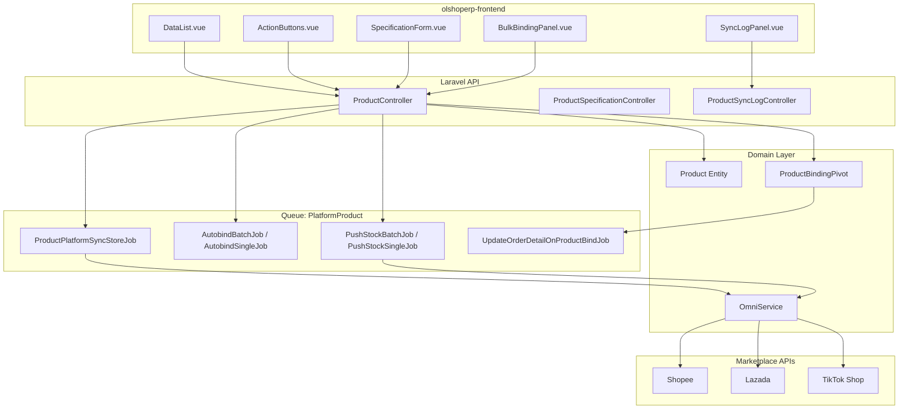
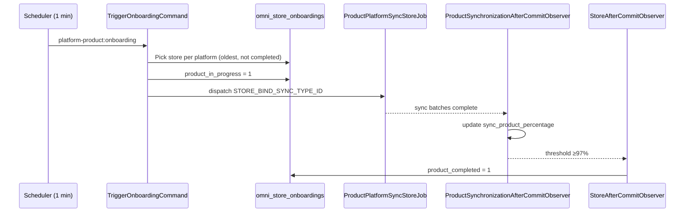
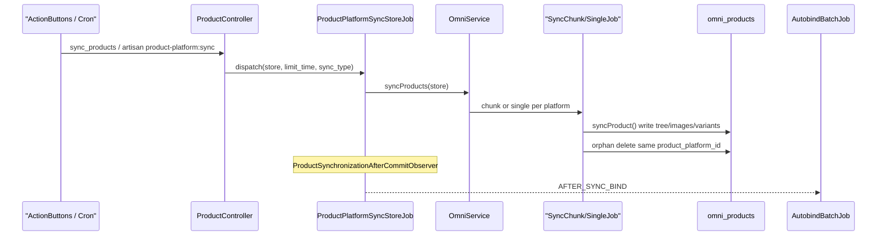
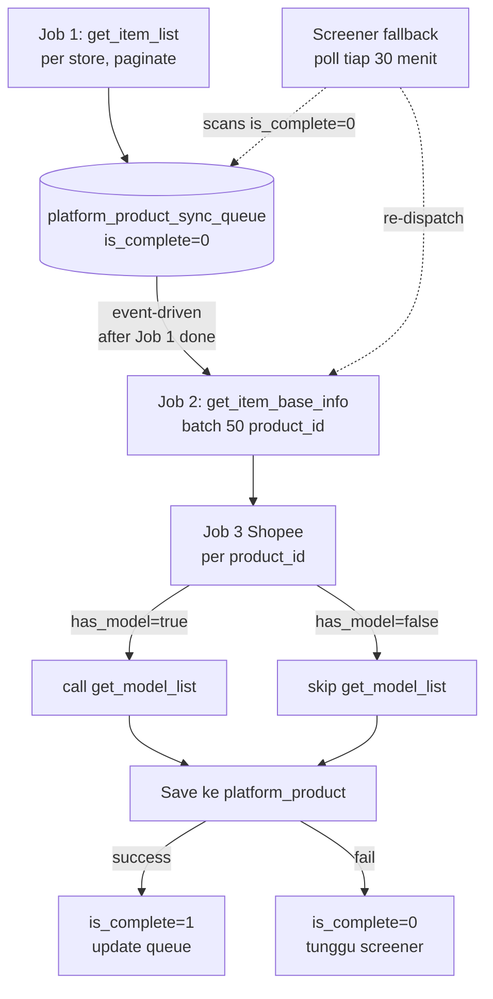
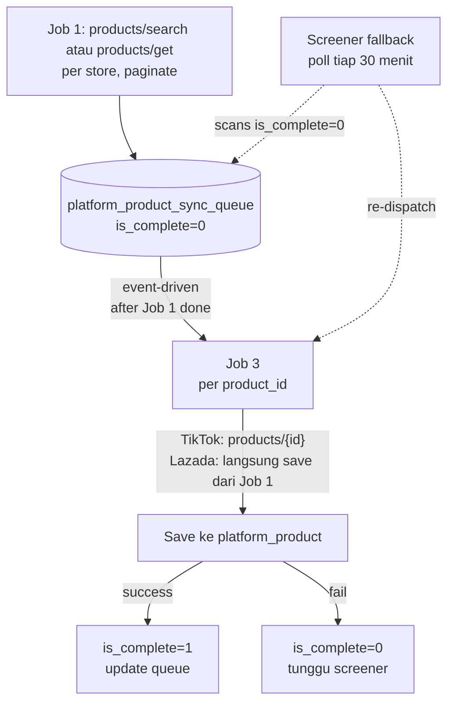

# Manage Platform Product — Technical Documentation

## 0. Metadata & Changelog

| Version | Date | Author | Changes |
|---|---|---|---|
| 1.0 | 2026-06-19 | QA - Yemima | Initial AS-IS technical inventory |
| 1.1 | 2026-06-19 | QA - Yemima | Merge sync pipeline design spec (§8.2) |
| 1.2 | 2026-06-22 | QA - Yemima | Onboarding sequencing sync (§3.9) |

**Stack:** Laravel 13 API · Vue 3 SPA · Horizon queues · MariaDB  
**Primary module:** `Modules/OmniChannel`  
**Menu slug:** `manage-platform-product`  
**UI route:** `/omni/platform-product`  
**API base:** `{VITE_API_URL}omnichannel/product-platform/*`

---

## 1. Architecture Overview



### Request flow (typical)

1. Vue `DataList` → `POST product-platform/get` (DataTables payload)  
2. User action → controller method → DB / job dispatch  
3. Background jobs → `OmniService` → platform trait (`Manages*Product`)  
4. Binding side-effects → Eloquent observers → `UpdateOrderDetailOnProductBindJob` (queue: `sales_order`)

---

## 2. Frontend File Map

**Root:** `olshoperp-frontend/src/pages/Omni/ProductPlatform/`

| File | Role | Key API / events |
|---|---|---|
| `DataList.vue` | Main page — DataTables, store filter, bulk actions, modals | `POST get`, export URLs, `@platform_binding`, `@open-log-data` |
| `components/ActionButtons.vue` | Pull / Push / Auto-bind / Bulk Binding trigger | `sync-products`, `sync-stocks`, `auto-bind`; queue availability via `queues/availablility` |
| `components/BulkBindingPanel.vue` | Slideover bulk bind + binding log DataList | `select2-bulk-platform`, `bulk-bind`, `bulk-binding-logs` |
| `SpecificationForm.vue` | Modal wrapper: binding + stock sections | Opens from row binding icon |
| `BindingForm.vue` | Manual bind/unbind | `PUT {id}/binding` |
| `StockForm.vue` | Fake stock, min stock, ratio | `GET/PUT {id}/stock` |
| `components/SyncLogPanel.vue` | Slideover tabs: Action Log + Product Sync | Sync log APIs |
| `components/SyncLogTables.vue` | Action log tables | `product-platform/sync-logs` |
| `components/ProductSyncTable.vue` | Product sync history | `product-platform/synchronizations` |
| `components/SyncPhaseLogTable.vue` | Phase detail per sync log | `sync-logs/{id}/details` |
| `components/SyncLogErrorTable.vue` | Error rows per sync log | `sync-logs/{id}/errors` |
| `components/PushStockTooltip.vue` | Push stock help content | — |
| `components/PlatformProductSelect.vue` | Reusable platform product select | `select2` with `is_binded` filter |
| `components/ProductApiLog.vue` | API log viewer component | Used from log flow |
| `Form.vue` | Create/edit form (route exists) | Resource routes — **not linked from DataList** (`can_create: false`) |
| `VariantForm.vue`, `VariantModal.vue`, `VariantUpdateForm.vue` | Variant specification UI | Specification controller |
| `ApiDataLog.vue` | Standalone API log page | Secondary route |

### Router (`src/router/index.ts`)

| Route | Component | Notes |
|---|---|---|
| `omni/platform-product` | `DataList.vue` | Primary entry |
| `omni/platform-product/create` | `Form.vue` | Exists; create disabled in DataList |
| `omni/platform-product/edit/:id` | `Form.vue` | Edit form route |

### Shared dependencies

| Import | Usage |
|---|---|
| `DataTablesV3.vue` | Main grid, bulk actions, export |
| `SystemProductSelect.vue` | Bulk bind + BindingForm system product picker |
| `PlatformCell.vue` | Store column with platform icon |
| Echo / `usePageEvent` | Job lock events (`JOB_LOCK_CREATED`, `JOB_LOCK_RELEASED`) |

---

## 3. Backend File Map

### 3.1 Controllers

| Class | Path | Responsibility |
|---|---|---|
| `ProductController` | `Http/Controllers/ProductController.php` | **Main hub** — datalist, bind, stock, sync, push, delete, export, bulk bind |
| `ProductSpecificationController` | `Http/Controllers/ProductSpecificationController.php` | Specification / variant columns |
| `ProductDetailController` | `Http/Controllers/ProductDetailController.php` | Product detail store |
| `ProductShippingInformationController` | `Http/Controllers/ProductShippingInformationController.php` | Shipping info |
| `ProductSyncLogController` | `Http/Controllers/ProductSyncLogController.php` | Sync log datalist |
| `ProductSyncErrorLogController` | `Http/Controllers/ProductSyncErrorLogController.php` | Per-log errors |
| `ProductSyncPhaseLogController` | `Http/Controllers/ProductSyncPhaseLogController.php` | Phase details |
| `ProductSynchronizationController` | `Http/Controllers/ProductSynchronizationController.php` | Product sync history |

**ProductController traits:**

| Trait | Path | Methods used |
|---|---|---|
| `CanAutoBind` | `Concerns/CanAutoBind.php` | `bindExisting`, `dispatchBind`, `dispatchBindAll` |
| `CanPushStock` | `Concerns/CanPushStock.php` | `pushStocks`, `getPushQuantity` |
| `TreeHandlerTrait` | `App\Traits\TreeHandlerTrait` | Delete tree validation |
| `HasSelect2` | `App\Traits\HasSelect2` | Select2 endpoints |

**Key private methods (ProductController):**

| Method | Purpose |
|---|---|
| `handleErrorFlagBinding()` | Backfill SO detail `product_id`, clear bind-error flags |
| `getSkuType()` / `validateProductDeletion()` | SINGLE / VARIANT / PARENT delete rules |
| `select2BulkPlatform()` | Bulk binding platform SKU select |
| `bulkBindingLogs()` | Query pivots with `type_binding = bulk` |

### 3.2 Entities (core)

| Entity | Table | Notes |
|---|---|---|
| `Product` | `omni_products` | Platform product; alias `ProductPlatform` in some imports |
| `ProductBindingPivot` | `omni_product_binding_pivots` | Binding pivot; observers attached |
| `ProductTree` | `omni_product_trees` | Parent/variant hierarchy |
| `ProductSyncLog` | `omni_product_sync_logs` | Header log per sync/push/bind batch |
| `ProductSyncPhaseLog` | `omni_product_sync_phase_logs` | Phase tracking (new pipeline) |
| `ProductSyncErrorLog` | (via sync log relations) | Failed SKU rows |
| `ProductAutoBindLog` | `omni_product_auto_bind_logs` | Auto-bind batch tracking |
| `ProductSynchronization` | — | Product-level sync history |
| `Store` | `omni_stores` | Scoped via `store_id` |
| `StoreOnboarding` | `omni_store_onboardings` | Antrian sequencing sync produk onboarding (1:1 `store_id`) |
| `BulkBindingLogExportFile` | `omni_bulk_binding_log_export_files` | Export job tracking |
| `ProductPlatformExportFile` | `omni_product_platform_export_files` | DataList export |
| `ProductPlatformDataTemp` | `omni_product_platform_data_temps` | Export staging |

### 3.3 Jobs (queue `PlatformProduct` unless noted)

| Job | Trigger | Role |
|---|---|---|
| `ProductPlatformSyncStoreJob` | Pull / cron / onboarding scheduler / re-auth callback | Store-level sync entry; creates `ProductSyncLog` |
| `ProductPlatformSyncChunkJob` | After store job (Shopee) | Batch `get_item_base_info` (~50 IDs) |
| `ProductPlatformSyncSingleJob` | Chunk result / TikTok / Lazada | Single product detail + persist |
| `ProductSyncProductPlatformStoreJob` | Legacy/alternate path | Store sync variant |
| `ProductSyncProductPlatformSingleJob` | Per-row sync | Single product from UI |
| `ProductPlatformRetrySyncJob` | Retry failed sync | Re-dispatch chunk/single jobs |
| `AutobindBatchJob` | Auto-bind button / after sync | Calls `CanAutoBind::bindExisting` |
| `AutobindSingleJob` | Auto-bind batch item | Creates pivot + stock units |
| `AutobindBatchCleanupJob` | Batch finally | Closes auto-bind log |
| `PushStockBatchJob` | Push Stock button | Builds platform payload per store |
| `PushStockSingleJob` | Push batch item | Calls `OmniService::pushStock` |
| `UpdateOrderDetailOnProductBindJob` | Binding observer | Queue: **`sales_order`** — backfill SO details |
| `CreateProductPlatformJob` | TikTok webhook create | Webhook product create |
| `UpdateProductPlatformJob` | TikTok webhook update | Webhook product update |
| `ProductPlatformExportJob` | Export all | Writes temp table → Excel |
| `BulkBindingLogExportJob` | Bulk log export | Excel export |
| `SyncStockPlatformJob` | ATS threshold (scheduled) | Auto push when ATS crosses threshold |

### 3.4 Services & platform traits

| Class | Path |
|---|---|
| `OmniService` | `Services/OmniService.php` — facade router to platform service |
| `OmniShopeeService` | `Services/OmniShopeeService.php` + `Traits/ManagesShopeeProduct.php` |
| `OmniLazadaService` | `Services/OmniLazadaService.php` + `Traits/ManagesLazadaProduct.php` |
| `OmniTikTokService` | `Services/OmniTikTokService.php` + `Traits/ManagesTiktokProduct.php` |
| `OmniBaseService` | Abstract sync/push contract |
| `ManagesProduct` | Shared image/DnW sync helpers |
| `ProductPlatformExportService` | Export column mapping |

### 3.5 Observers

| Observer | Model | Events | Effect |
|---|---|---|---|
| `ProductBindingObserver` | `ProductBindingPivot` | created, updating, deleted | Audit `binded`/`unbinded`; dispatch `UpdateOrderDetailOnProductBindJob` |
| `ProductBindingAfterCommitObserver` | `ProductBindingPivot` | created, updating | Same job dispatch after commit |
| `ProductSynchronizationAfterCommitObserver` | `ProductSynchronization` | updated (`status_id`) | `AutobindBatchJob` after sync; update `sync_product_percentage` on store |
| `StoreAfterCommitObserver` | `Store` | updated | Set `initial_sync_product_completed` + `product_completed` onboarding at ≥97% |
| `ProductSyncPhaseLogAfterCommitObserver` | `ProductSyncPhaseLog` | — | Phase pipeline hooks |

Model attribute on pivot:

```php
#[ObservedBy([ProductBindingObserver::class, ProductBindingAfterCommitObserver::class])]
class ProductBindingPivot extends MainModel
```

### 3.6 Policies & auth

| Class | Path | Notes |
|---|---|---|
| `ProductPolicy` | `Policies/ProductPolicy.php` | Extends `MainPolicy` — Gate RoleMenu on Platform Product menu |
| Authorization in controller | — | `viewAny`, `view`, `update`, `delete` per action |

Middleware: routes under `api/*` use `auth:sanctum` + company context via token.

### 3.7 Console & schedule

| Command | Signature | Role |
|---|---|---|
| `SyncOmniProductCommand` | `product-platform:sync {--store_ids=}` | Hourly cron sync; incremental unless hour % 6 == 0 |
| `TriggerOnboardingCommand` | `platform-product:onboarding` | Tiap menit — dispatch sync onboarding terkontrol per platform |
| `SyncProgressMonitorCommand` | `platform-product:sync-progress-monitor` | Retry sync stuck >30 menit |

Registered in `app/Console/Kernel.php` → `platformProductSchedules()`.

### 3.8 Onboarding sequencing sync (AS-IS)

**Related menu doc:** [omni-store-binding/technical.md §7.1](../omni-store-binding/technical.md#71-sequencing-onboarding--triggeronboardingcommand)



| File | Role |
|------|------|
| `app/Console/Commands/PlatformProduct/TriggerOnboardingCommand.php` | Orchestrator antrian |
| `Modules/OmniChannel/Entities/StoreOnboarding.php` | Model flag onboarding |
| `Modules/OmniChannel/Http/Controllers/StoreController.php` | `onboarding()->create([])` on store create |
| `Modules/OmniChannel/Observers/StoreAfterCommitObserver.php` | Complete onboarding + trigger SO sync |
| `Modules/OmniChannel/Http/Controllers/OmniCallbackController.php` | OAuth — product sync **only** if `initial_sync_product_completed` |

**Threshold 97%:** `config('omni.get_so.product_failed_threshold')` default `3` → complete when `sync_product_percentage ≥ 97`.

**Gap:** kolom datalist Product Onboarding Status belum di `StoreController@index` / `StoreBinding/DataList.vue`.

### 3.9 Constants

| Class | Path | Usage |
|---|---|---|
| `ProductSyncTypes` | `Constants/ProductSyncTypes.php` | Sync/bind/push type IDs for logs |
| `ProductSyncStatus` | `Constants/ProductSyncStatus.php` | Phase status enum |
| `UniqueJobKey` | `Constants/UniqueJobKey.php` | Job uniqueness keys (push, auto-bind) |

---

## 4. API Reference

**Prefix:** `/api/omnichannel/product-platform`  
**Auth:** `Authorization: Bearer {token}`

### 4.1 DataList & CRUD

| Method | Path | Controller@method | Permission |
|---|---|---|---|
| POST | `get` | `index` | viewAny |
| GET | `{id}` | `show` | view |
| PUT/PATCH | `{id}` | `update` | update |
| DELETE | `{id}` | `destroy` | delete |
| GET | `{product_platform}/audit` | `audit` | view |

### 4.2 Binding & stock

| Method | Path | Controller@method | Body / notes |
|---|---|---|---|
| GET | `{product_id}/binding` | `binding_show` | Returns current pivot |
| PUT | `{product}/binding` | `binding` | `{ ProductSystem, random_confirmation? }` |
| GET | `{product}/stock` | `stock_show` | — |
| PUT | `{product}/stock` | `stock_store` | `fake_stock`, `real_stock`, `stock_ratio`, `minimum_stock_qty` |
| PUT | `bulk-stock-product-platform` | `bulk_stock_store` | `{ data_ids[], fake_stock?, ... }` |
| POST | `auto-bind` | `auto_bind` | `{ store_ids: "1,2,3" }` |
| GET | `select2-bulk-platform` | `select2BulkPlatform` | `?q=` search |
| POST | `bulk-bind` | `bulk_bind` | `{ platform_sku, system_product_id }` |
| GET | `bulk-binding-logs` | `bulkBindingLogs` | DataTables |
| GET | `bulk-binding-logs/export-excel` | `bulkBindingLogsExportExcel` | — |

### 4.3 Sync & push

| Method | Path | Controller@method | Body / notes |
|---|---|---|---|
| POST | `sync-products` | `sync_products` | `{ store_ids }` → Pull Products |
| POST | `sync-stocks` | `sync_stocks` | `{ store_ids, product_ids? }` → Push Stock |
| GET | `sync-stock-all` | `sync_stock_all` | Push all authorized stores |
| GET | `{product_platform}/sync` | `sync_product` | Per-row sync |
| POST | `bulk-sync-product-platform` | `bulk_sync_product` | `{ data_ids }` comma-separated |

### 4.4 Sync logs

| Method | Path | Controller |
|---|---|---|
| GET | `sync-logs/` | `ProductSyncLogController@index` |
| GET | `sync-logs/{id}/errors` | `ProductSyncErrorLogController@index` |
| GET | `sync-logs/{id}/details` | `ProductSyncPhaseLogController@index` |
| GET | `synchronizations/` | `ProductSynchronizationController@index` |

### 4.5 Bulk delete & export

| Method | Path | Controller@method |
|---|---|---|
| DELETE | `bulk-delete` | `bulkDelete` |
| GET | `export-excel` | `exportExcel` |
| GET | `product-export-file` | `productExportFile` |
| GET | `get-export-all-progress` | `getExportAllProgress` |

### 4.6 Specification (outside prefix group)

| Method | Path | Controller |
|---|---|---|
| POST | `product-platform/{product}/specification` | `ProductSpecificationController@store` |
| GET | `product-platform/{product_id}/specification` | `show` |
| PUT | `product-platform/{product}/specification/detail/{variant}` | `detail_update` |
| POST | `product-platform/{product}/detail` | `ProductDetailController@store` |
| POST/GET | `product-platform/{product}/shipping-information` | `ProductShippingInformationController` |

### 4.7 Related API (not under prefix)

| Method | Path | Usage |
|---|---|---|
| GET | `omnichannel/queues/availablility` | ActionButtons lock state (`pull_product`, `bind_product`, `push_product`) |

---

## 5. Database Schema

### 5.1 `omni_products` (core)

Created via `CREATE TABLE omni_products LIKE scm_products` + alterations (`2023_12_05_101827_create_duplicate_products_table.php`).

**Platform-specific columns (key):**

| Column | Type | Purpose |
|---|---|---|
| `platform_id` | FK | Marketplace type |
| `store_id` | FK | Owning store |
| `product_platform_id` | string | Marketplace item ID |
| `sku_platform_id` | string nullable | Variant/model ID |
| `status_platform` | string | Raw platform status |
| `platform_last_updated_at` | datetime | Incremental sync filter |
| `fake_stock` | int nullable | Manual push qty override |
| `stock_ratio` | int nullable | ATS percentage for push |
| `minimum_stock_qty` | int nullable | Push threshold |

**Unique index:** `(store_id, product_platform_id, sku_platform_id, deleted_at)`

### 5.2 `omni_product_binding_pivots`

| Column | FK | Notes |
|---|---|---|
| `product_omni_id` | `omni_products.id` | Platform product |
| `product_system_id` | `scm_products.id` | System product |
| `store_id` | `omni_stores.id` | Store scope |
| `type_binding` | enum | `auto`, `manual`, `bulk`, nullable |

Migration: `2023_12_28_082455_create_product_binding_pivots_table.php`

### 5.3 Related tables

| Table | Purpose |
|---|---|
| `omni_product_trees` | Parent/variant tree |
| `omni_product_sync_logs` | Sync/push/bind batch logs |
| `omni_product_auto_bind_logs` | Auto-bind batch metadata |
| `omni_product_sync_phase_logs` | New sync pipeline phases |
| `omni_bulk_binding_log_export_files` | Bulk log export jobs |
| `omni_product_platform_export_files` | DataList export jobs |

**DB schema docs:** `docs/db-schema/omni_channel/omni_product_binding_pivots.md` (partial — extend as needed)

### 5.4 Entity relationships (Eloquent)

```
Product (omni_products)
  ├── belongsTo Store, Platform
  ├── belongsTo ProductBindingPivot (via product_omni_id) → systemProduct
  ├── hasMany productChildren (ProductTree)
  ├── belongsTo productTree (parent)
  └── childrenBindingPivot (HasManyThrough)

ProductBindingPivot
  ├── belongsTo Product (platform)
  ├── belongsTo Product (system) — Modules\SupplyChain\Entities\Product
  └── belongsTo Store
```

---

## 6. Queue & Job Flow

### 6.1 Product sync (Pull Products / cron)



**Incremental filter:** `platform_last_updated_at` vs API `update_time`; cron `limit_time=true` except hours 0,6,12,18.

### 6.2 Auto-bind

```
AutobindBatchJob → CanAutoBind::bindExisting()
  → chunk unbound products per store
  → match SystemProduct by SKU
  → Bus::batch(AutobindSingleJob[])
  → ProductBindingPivot::updateOrCreate (no type_binding set)
  → AutobindBatchCleanupJob on finally
```

### 6.3 Push stock

```
ProductController::sync_stocks()
  → CanPushStock::pushStocks()
  → PushStockBatchJob (unique per store)
  → getPushQuantity() per product
  → PushStockSingleJob → OmniService::pushStock()
```

### 6.4 Binding side-effect

```
ProductBindingPivot saved
  → ProductBindingObserver + AfterCommitObserver
  → UpdateOrderDetailOnProductBindJob (queue: sales_order)
  → SalesOrderDetail where product_id null + product_omni_id match
  → update product_id, units, taxes, bundle children
```

---

## 7. Binding Implementation Detail

### 7.1 Manual bind (`binding()`)

```php
ProductBindingPivot::updateOrCreate([
    'store_id' => $product->store_id,
    'product_omni_id' => $product->id,
], [
    'product_system_id' => $request->ProductSystem,
]);
// + handleErrorFlagBinding + copy stock units
```

Unbind: delete pivot + null platform stock unit fields.

### 7.2 Bulk bind (`bulk_bind()`)

- Query: `Product::where('sku', $platform_sku)` + store `status=1` + company owner  
- Per row: delete existing pivot → create with `type_binding = 'bulk'`  
- **Gap:** no Fix Asset / random / parent skip (see requirement §11)

### 7.3 Auto-bind (`AutobindSingleJob`)

```php
ProductBindingPivot::updateOrCreate([
    'store_id' => $store->id,
    'product_omni_id' => $product->id,
], [
    'product_system_id' => $system_product->id,
]);
// copies stock_unit_id, conversion, base unit
```

### 7.4 Downstream: Sales Order

| Component | Path |
|---|---|
| `handleErrorFlagBinding()` | `ProductController` — sync path clear flags |
| `UpdateOrderDetailOnProductBindJob` | `Jobs/UpdateOrderDetailOnProductBindJob.php` |
| `pickBundleChildren()` | `SalesOrderDetailController` — bundle expansion |

---

## 8. Sync Pipeline

> **Dokumen ini menggabungkan AS-IS (kode saat ini) dan target arsitektur 3-job model** (sebelumnya `old_platform-product-sync-newrequirement.md`).

### 8.1 AS-IS Implementation (Current Code)

| Platform | List job | Detail job | Webhook product |
|---|---|---|---|
| **Shopee** | `ProductPlatformSyncStoreJob` → list IDs | `ProductPlatformSyncChunkJob` (50) → `ProductPlatformSyncSingleJob` | ❌ Not implemented |
| **Lazada** | Store job (full list in list step) | `ProductPlatformSyncSingleJob` direct | ❌ Not implemented |
| **TikTok** | Store job → search | `ProductPlatformSyncSingleJob` | ✅ `CreateProductPlatformJob`, `UpdateProductPlatformJob` |

**Trait entry points:**

- `ManagesShopeeProduct::syncProduct()` — writes product tree, auto-delete orphans
- `ManagesLazadaProduct::syncProduct()` — same pattern
- `ManagesTiktokProduct::syncProduct()` — same pattern

**Incremental filter:** `platform_last_updated_at` vs API `update_time`; cron `limit_time=true` except hours 0,6,12,18.

**Sequence:** lihat §6.1 Product sync (Pull Products / cron).

### 8.2 Target Architecture — 3-Job Model (Design Spec)

Status: **Draft design** — tabel `platform_product_sync_queue` dan screener belum tentu sama persis dengan implementasi production. Gunakan untuk roadmap & review arsitek.


### 1. Tujuan & Scope

Pipeline ini bertanggung jawab untuk:

- Sync data product dari platform marketplace (Shopee, TikTok, Lazada) ke OlshopERP
- Berjalan untuk setiap authorized store
- Mendukung skenario initial backfill (saat store baru di-authorize) maupun incremental sync (delta berdasarkan `update_time`)

**Out of scope (akan dibahas terpisah):**

- Order sync flow
- Webhook integration (akan jadi phase berikutnya)
- Autobinding logic (dianggap sebagai downstream consumer dari pipeline ini)

---

### 2. Architecture Summary

Pipeline menggunakan **3-job sequencing model** dengan dua jalur trigger:

1. **Primary path (event-driven):** Job 1 selesai → langsung dispatch Job 2 (Shopee) atau Job 3 (TikTok/Lazada) berdasarkan rows yang baru di-UPSERT ke queue.
2. **Fallback path (screener polling):** scheduler berjalan tiap 30 menit, scan `platform_product_sync_queue` untuk row dengan `is_complete = 0`, lalu dispatch ulang ke Job 2/Job 3. Ini menangkap row yang gagal/ketinggalan di primary path.

Per masing-masing platform:

| Platform | Job 1 | Job 2 | Job 3 |
|---|---|---|---|
| **Shopee** | `get_item_list` → product_id + update_time + status | Batch `get_item_base_info` (50/call) → detail + `has_model` flag | Per-product. Jika `has_model=true` → call `get_model_list`. Lalu save ke `platform_product` |
| **TikTok** | `products/search` → product list (sudah include SKU price/stock) | *skip* | Per-product. Call `products/{product_id}` untuk full detail (description, images, attribute), lalu save |
| **Lazada** | `products/get` → list (sudah include skus, attributes, images) | *skip* | Per-product. Save langsung dari data Job 1 (no extra API call) |

### Primary path (event-driven dispatch)

Saat Job 1 selesai (commit semua row ke queue), emit event `Job1Completed`. Handler event:

- **Shopee** → chunk product_id baru per 50, dispatch satu Job 2 per chunk
- **TikTok / Lazada** → dispatch Job 3 per product_id

Tidak melewati screener.

### Fallback path (screener polling)

Screener jalan tiap 30 menit (Laravel scheduler / cron). Query:

```sql
SELECT * FROM platform_product_sync_queue
WHERE is_complete = 0
  AND (last_attempt_at IS NULL OR last_attempt_at < NOW() - INTERVAL 5 MINUTE)
ORDER BY updated_at ASC
LIMIT SCREENER_BATCH_SIZE;
```

Untuk setiap row hasil query:

- **Shopee** → dispatch Job 2 (batch 50 per group store)
- **TikTok / Lazada** → dispatch Job 3 langsung per product

Screener **bukan jalur utama** — fungsinya menangkap row yang stuck di `is_complete=0` karena gagal di primary path (Job 1 yang ga sempet trigger event, Job 2/3 yang failed mid-execution, dll).

---

### 3. Data Model

### 3.1 Tabel `platform_product_sync_queue`

```sql
CREATE TABLE platform_product_sync_queue (
    id              BIGINT UNSIGNED AUTO_INCREMENT PRIMARY KEY,
    store_id        BIGINT UNSIGNED NOT NULL,
    product_id      VARCHAR(64) NOT NULL,
    update_time     BIGINT UNSIGNED NULL COMMENT 'epoch dari platform',
    is_complete     TINYINT(1) NOT NULL DEFAULT 0,
    last_attempt_at TIMESTAMP NULL,
    created_at      TIMESTAMP NOT NULL DEFAULT CURRENT_TIMESTAMP,
    updated_at      TIMESTAMP NOT NULL DEFAULT CURRENT_TIMESTAMP ON UPDATE CURRENT_TIMESTAMP,

    KEY idx_screener (is_complete, updated_at),
    KEY idx_store_product (store_id, product_id)
) ENGINE=InnoDB DEFAULT CHARSET=utf8mb4;
```

**Catatan field:**

- `store_id` — referensi ke tabel `stores`. Platform (Shopee/TikTok/Lazada) didapat via join ke tabel stores.
- `update_time` — disimpan untuk comparison di Job 1 berikutnya, decide perlu reprocess atau tidak.
- `is_complete` — flag 0/1. Reset ke 0 saat Job 1 detect `update_time` baru. Set ke 1 saat Job 3 sukses save.
- `last_attempt_at` — timestamp percobaan terakhir, dipakai screener untuk filter row yang masih "fresh".

### 3.2 Tabel log per job

Polymorphic table: 1 tabel `sync_job_log` untuk semua tipe job (Job 1, Job 2, Job 3, Screener). Field `job_type` membedakan kontennya.

```sql
CREATE TABLE sync_job_log (
    id                BIGINT UNSIGNED AUTO_INCREMENT PRIMARY KEY,
    uuid              CHAR(36) NOT NULL UNIQUE,
    job_type          ENUM('job1','job2','job3','screener') NOT NULL,
    platform          ENUM('shopee','tiktok','lazada') NOT NULL,
    store_id          BIGINT UNSIGNED NULL,
    product_id        VARCHAR(64) NULL COMMENT 'untuk screener & job3: 1 row per product dispatch',
    parent_uuid       CHAR(36) NULL COMMENT 'untuk job 2/3, ref ke job 1/screener yg trigger',
    target_job        ENUM('job2','job3') NULL COMMENT 'khusus screener: dispatch ke job mana',
    started_at        TIMESTAMP NOT NULL,
    finished_at       TIMESTAMP NULL,
    status            ENUM('running','success','failed','partial','locked','do_nothing') NOT NULL DEFAULT 'running',
    total_items       INT UNSIGNED NULL,
    total_failed      INT UNSIGNED NULL,
    total_skipped     INT UNSIGNED NULL,
    metadata          JSON NULL COMMENT 'page count, failed product_ids, dll',
    created_at        TIMESTAMP NOT NULL DEFAULT CURRENT_TIMESTAMP,

    KEY idx_type_started (job_type, started_at),
    KEY idx_parent (parent_uuid),
    KEY idx_store (platform, store_id),
    KEY idx_product (platform, store_id, product_id)
);
```

#### Konvensi pengisian field per `job_type`

| `job_type` | `store_id` | `product_id` | `parent_uuid` | `target_job` | Total rows per cycle |
|---|---|---|---|---|---|
| `job1` | ✓ | NULL | NULL | NULL | 1 per store per run |
| `job2` (Shopee only) | ✓ | NULL (list ada di metadata.product_ids[]) | = job1.uuid | NULL | N per Job 1 (chunk 50) |
| `job3` | ✓ | ✓ | = job2.uuid (Shopee) atau = screener.uuid (TikTok/Lazada/Shopee dari screener cycle) | NULL | 1 per product processing |
| `screener` | ✓ | ✓ | NULL | ✓ ('job2' atau 'job3') | 1 per product yg di-dispatch screener |

**Penting untuk screener:** sesuai requirement, setiap product_id yang di-dispatch screener mendapat 1 log row sendiri dengan `product_id` di kolom top-level (bukan di metadata). Ini mempermudah audit "kapan terakhir screener pick product X" via `SELECT ... WHERE job_type='screener' AND product_id=?`.

**Trade-off volume:** 1 row per dispatch. Worst case kalo 1000 product is_complete=0 per cycle × 48 cycle/hari × 43 store = ~2 juta row/hari di steady state buruk. Realistis steady state setelah backfill: 50-200 product/cycle × 48 × 43 = 100K-400K row/hari. Setelah 30 hari = jutaan row. **Rekomendasi:** partition table by `MONTH(created_at)` atau setup retention policy (purge log > 90 hari ke archive). Bukan blocker untuk launch, tapi monitor table size.

---

### 4. Job Definitions

### 4.1 Job 1 — List Fetcher

Jalan **per store, per platform**. Trigger: scheduler (mis. cron tiap 6 jam) atau manual trigger saat store baru di-authorize.

#### Common flow

1. Generate `job_uuid`, write log row `status='running'`
2. Loop pagination ke platform API
3. Untuk setiap page, accumulate data dan UPSERT ke `platform_product_sync_queue`
4. Setelah loop selesai, finalize log dengan `total_items`, `total_failed`, `metadata`
5. Trigger screener (event-driven) untuk shop ini

#### Per-platform detail

**Shopee — `get_item_list`**

```
Endpoint: /api/v2/product/get_item_list
Params:
  - shop_id, partner_id, timestamp, access_token, sign
  - offset (paginate)
  - page_size: 100 (max)
  - item_status: ['NORMAL', 'UNLIST', 'BANNED', 'DELETED', 'REVIEWING']
  - update_time_from: last_successful_sync_at - 10 minute buffer
  - update_time_to: this_run_started_at (snapshot consistency)

Response per item:
  - item_id
  - item_status
  - update_time

UPSERT ke queue:
  store_id = <internal store id>  // platform tersirat via tabel stores
  product_id = item_id
  update_time = response.update_time
  is_complete = 0  (reset, supaya screener pick ulang)
```

**Strategi pemilihan window:**

- **Initial backfill** (saat store baru di-authorize): TIDAK pakai `update_time_from` filter. Ambil semua product. Tidak ada filter time supaya backfill lengkap.
- **Scheduled incremental sync**: pakai `update_time_from = last_successful_sync_at - buffer (10 menit)`, dan `update_time_to = this_run_started_at` untuk snapshot consistency.

Pilihan strategi disimpan di field `sync_mode` di payload Job 1 saat di-dispatch.

**Pagination loop behavior (semua platform):** loop berhenti saat `has_next_page = false` (Shopee/Lazada) atau `next_page_token` kosong (TikTok). Setiap **page failure di-log explicit** ke `metadata.failed_pages[]`, **lanjut ke page berikutnya** (no early exit). Mencegah satu page error menyebabkan seluruh shop ga ke-sync.

**TikTok — `products/search`**

```
Endpoint: POST /product/202309/products/search (atau 202502 untuk versi terbaru)
Params:
  - page_size: 100 (max), page_token (cursor pagination, bukan offset)
  - filter: { status, update_time_from, update_time_to }

Response per product:
  - id (product_id)
  - title
  - status
  - skus[]
  - update_time, create_time
  - (dan field lain — disimpan sebagai is_complete = 0 di queue, detail diambil lagi di Job 3)

UPSERT ke queue:
  store_id = <internal store id>
  product_id = response.id
  update_time = response.update_time
  is_complete = 0
```

**Catatan:** meskipun response `products/search` udah cukup detail (SKU + price + stock), implementasi sekarang **tetap fetch ulang detail di Job 3** untuk dapatkan description/images/attributes. Future: kalo terbukti boros API call, evaluate skip Job 3 API call untuk TikTok dan langsung save dari Job 1 cache.

**Lazada — `products/get`**

```
Endpoint: GET /products/get
Params:
  - offset, limit (max 50)
  - filter: ['all' | 'live' | 'inactive' | 'deleted' | 'image-missing' | 'pending' | 'rejected']
  - update_before / update_after (epoch ms)

Response per product:
  - item_id
  - status
  - skus[] (sudah lengkap)
  - attributes
  - images
  - created_time, updated_time

UPSERT ke queue:
  store_id = <internal store id>
  product_id = item_id
  update_time = response.updated_time
  is_complete = 0
```

**Lazada note:** di response, `images` dan `marketImages` adalah **string JSON-encoded** (bukan array). Parser wajib decode dulu. Field `status` di sample dokumentasi (`"Active,InActive,Pending QC,..."`) adalah daftar enum, bukan actual value — production akan return single value (mis. `"Active"`).

#### Job 1 log requirements

- `uuid` — auto-generated
- `started_at`, `finished_at` — wajib
- `total_items` — sum dari `total_count` per page; pakai `total_count` dari page pertama sebagai expected, log mismatch di metadata kalo beda
- `total_failed` — count product_id yg gagal di-UPSERT ke queue
- `metadata`:
  - `pages_attempted`, `pages_succeeded`, `pages_failed`
  - `failed_page_offsets[]`
  - `failed_product_ids[]` (kalo per-row failure di UPSERT)
  - `expected_total_from_first_page` vs `actual_total_inserted`

### 4.2 Job 2 — Batch Detail Fetcher (Shopee only)

Jalan saat di-trigger oleh Screener untuk Shopee. Input: array of product_id (max 50 per job instance).

```
Endpoint: /api/v2/product/get_item_base_info
Params:
  - shop_id, partner_id, timestamp, access_token, sign
  - item_id_list: array of product_id (max 50)

Response per item:
  - item_id
  - item_name, description, images, ...
  - has_model (boolean) ← critical
  - item_status

Action:
  - Simpan ke staging detail (atau langsung ke platform_product dengan flag tertentu)
  - Untuk setiap item_id sukses fetch:
      - Trigger Job 3 untuk product_id tersebut, pass has_model flag
  - Untuk setiap item_id failed (404, banned, dll):
      - Log ke metadata.failed_item_ids[]
      - is_complete tetep 0 → screener pick lagi nanti
```

#### Job 2 splitting rule

Job 1 selesai → screener pick semua product_id dengan `is_complete=0` untuk shop tsb → bagi menjadi chunks 50 product_id → dispatch 1 Job 2 per chunk.

Misal: 1000 product_id dari Job 1 → 20 Job 2 instances. Setiap Job 2 instance bisa generate up to 50 Job 3 instance.

#### Job 2 log requirements

- `uuid`, `parent_uuid` (= Job 1 uuid)
- `started_at`, `finished_at`
- `total_items` — count product_id dalam batch (max 50)
- `total_failed` — count yg gagal fetch base_info
- `metadata`:
  - `product_ids[]` — daftar product_id dalam batch ini
  - `failed_product_ids[]` dengan error code masing-masing

### 4.3 Screener (fallback path)

Job scheduler yang berjalan tiap 30 menit (Laravel scheduler / cron). **Bukan primary dispatcher** — fungsinya menangkap row queue yang stuck di `is_complete=0`.

Untuk menentukan platform dari setiap row, screener join ke tabel `stores`.

```php
// Pseudocode
$candidates = DB::table('platform_product_sync_queue as q')
    ->join('stores as s', 'q.store_id', '=', 's.id')
    ->select('q.*', 's.platform')
    ->where('q.is_complete', 0)
    ->where(function ($w) {
        $w->whereNull('q.last_attempt_at')
          ->orWhere('q.last_attempt_at', '<', now()->subMinutes(5));
    })
    ->orderBy('q.updated_at', 'asc')  // oldest first
    ->limit(SCREENER_BATCH_SIZE)
    ->get();

// Group by platform untuk dispatch logic yg beda
$grouped = $candidates->groupBy('platform');

// Shopee — chunk 50, dispatch Job 2
foreach ($grouped->get('shopee', collect()) as $storeId => $rows) {
    foreach ($rows->groupBy('store_id') as $sid => $storeRows) {
        foreach ($storeRows->chunk(50) as $chunk) {
            $job2Uuid = Str::uuid();
            Job2Shopee::dispatch($job2Uuid, $sid, $chunk->pluck('product_id'));

            // Log 1 row per product yang di-dispatch screener
            foreach ($chunk as $row) {
                SyncJobLog::create([
                    'uuid'       => Str::uuid(),
                    'job_type'   => 'screener',
                    'platform'   => 'shopee',
                    'store_id'   => $sid,
                    'product_id' => $row->product_id,
                    'target_job' => 'job2',
                    'parent_uuid'=> $job2Uuid,
                    'started_at' => now(),
                    'finished_at'=> now(),
                    'status'     => 'success',
                ]);
            }
        }
    }
}

// TikTok / Lazada — langsung Job 3 per product
foreach (['tiktok', 'lazada'] as $plt) {
    foreach ($grouped->get($plt, collect()) as $row) {
        $job3Uuid = Str::uuid();
        Job3::dispatch($job3Uuid, $plt, $row->store_id, $row->product_id);

        SyncJobLog::create([
            'uuid'       => Str::uuid(),
            'job_type'   => 'screener',
            'platform'   => $plt,
            'store_id'   => $row->store_id,
            'product_id' => $row->product_id,
            'target_job' => 'job3',
            'parent_uuid'=> $job3Uuid,
            'started_at' => now(),
            'finished_at'=> now(),
            'status'     => 'success',
        ]);
    }
}
```

**Catatan logging:** setiap product_id yang di-dispatch screener mendapat 1 log row sendiri (sesuai decision). Ini memungkinkan query audit per-product:

```sql
SELECT * FROM sync_job_log
WHERE job_type = 'screener'
  AND store_id = ?
  AND product_id = ?
ORDER BY started_at DESC;
```

**Primary path (terpisah dari screener):** ketika Job 1 selesai, listener event `Job1Completed` langsung dispatch Job 2 (Shopee) atau Job 3 (TikTok/Lazada) untuk semua product_id yang baru di-UPSERT ke queue. Logic-nya mirip screener tapi:

1. Tidak melewati DB query (sudah punya list product_id dari Job 1).
2. Tidak menulis log dengan `job_type='screener'` — sebagai gantinya, `parent_uuid` di log Job 2/Job 3 diisi dengan uuid dari Job 1 (`sync_job_log` row Job 1) yang baru selesai.

Ini yang membedakan jalur primary vs fallback di audit log.

### 4.4 Job 3 — Product Saver

Inti dari pipeline. Berjalan **per product_id**. Implementasi terpisah per platform:

#### Common pattern (semua platform)

```php
// Pseudocode
function handle(string $platform, int $storeId, string $productId) {
    $lockKey = "lock:product_sync:{$platform}:{$storeId}:{$productId}";
    $lockValue = Str::uuid();
    $lockTtl = 10; // seconds — UNIFORM
    $retryCount = 0;

    // Lock acquisition with retry (race condition handling)
    while ($retryCount < 3) {
        $acquired = Redis::set($lockKey, $lockValue, 'NX', 'EX', $lockTtl);
        if ($acquired) break;
        $retryCount++;
        sleep(pow(2, $retryCount) * 0.5); // backoff: 1s, 2s, 4s
    }

    if (!$acquired) {
        // Lock dipegang worker lain, exit gracefully
        logJob3('locked', ...);
        return;
    }

    try {
        // Check is_complete (kemungkinan worker lain udah selesai duluan)
        $row = DB::table('platform_product_sync_queue')
            ->where('store_id', $storeId)
            ->where('product_id', $productId)
            ->first();

        if ($row->is_complete === 1) {
            // Worker lain sudah selesai. Log ke sync_job_log dengan status='do_nothing'.
            logJob3('do_nothing', 'already completed by another worker', $job3Uuid, ...);
            return;
        }

        // Platform-specific fetch + save
        $result = match($platform) {
            'shopee'  => processShopee($storeId, $productId),  // optional get_model_list
            'tiktok'  => processTiktok($storeId, $productId),  // call products/{id}
            'lazada'  => processLazada($storeId, $productId),  // langsung save dari data Job 1
        };

        // Idempotent UPSERT ke platform_product
        savePlatformProduct($result);

        // Mark complete
        DB::table('platform_product_sync_queue')
            ->where('id', $row->id)
            ->update([
                'is_complete'     => 1,
                'last_attempt_at' => now(),
            ]);

        logJob3('success', null, $job3Uuid, ...);

    } catch (\Exception $e) {
        // Execution failure → is_complete tetap 0, tunggu screener cycle berikutnya.
        // Error message disimpan di sync_job_log.metadata, bukan di queue.
        DB::table('platform_product_sync_queue')
            ->where('id', $row->id)
            ->update([
                'last_attempt_at' => now(),
            ]);
        // Error detail di sync_job_log.metadata, bukan di queue table
        logJob3('failed', $e->getMessage(), $job3Uuid, ...);

    } finally {
        // Safe release: hanya release kalo lock value masih milik kita
        Redis::eval(
            "if redis.call('GET', KEYS[1]) == ARGV[1] then return redis.call('DEL', KEYS[1]) else return 0 end",
            1, $lockKey, $lockValue
        );
    }
}
```

#### Shopee — `processShopee()`

```
1. Ambil data base_info dari staging (hasil Job 2)
2. Kalo has_model = true:
     - Call /api/v2/product/get_model_list dengan item_id
     - Merge variant data
3. Return final product object
```

#### TikTok — `processTiktok()`

```
1. Call GET /product/202309/products/{product_id}
   - Header: x-tts-access-token, signature
2. Response include: title, description, images, sales_attributes, skus, ...
3. Return final product object
```

#### Lazada — `processLazada()`

**Decision (current):** **Option A — skip detail call**. Save langsung dari data yg sudah ada di staging (hasil Job 1 `/products/get` yg sudah include skus + attributes + images).

```
1. Read staged data dari Job 1 (perlu disimpan saat Job 1 — bisa di kolom JSON sementara di queue table, atau staging table terpisah)
2. Parse images dari string JSON-encoded → array
3. Map status, sub_status, hidden_status
4. Return final product object
```

**Future option (B):** kalo nanti butuh tambahan field `variation` metadata atau `imageSequence` scoring, tambahkan call `/product/item/get` per product. Ini safe untuk ditambahkan in-place tanpa break existing data — cuma tambah kolom nullable di `platform_product` + jalanin one-time backfill script kalo perlu populate data lama. Lihat section 10.6.

#### Job 3 log requirements

- `uuid`, `parent_uuid` (= Job 2 uuid untuk Shopee, = Job 1 uuid untuk TikTok/Lazada via primary path, atau = Screener uuid untuk fallback path)
- `started_at`, `finished_at`
- `status`: success | do_nothing | failed | locked (di kolom `status` sync_job_log)
- `metadata`:
  - `trigger_source`: 'job_chain' (dispatched by Job 2) atau 'screener' (picked up by screener cycle)
  - `lock_retry_count`
  - `had_model` (Shopee, hanya kalo true)
  - `api_response_time_ms`
  - `error_message` (kalo failed)

---

### 5. Flow Diagram

### Shopee



### TikTok & Lazada



---

### 6. Redis Lock Pattern

### Key naming convention

```
lock:product_sync:{platform}:{store_id}:{product_id}
```

Contoh: `lock:product_sync:shopee:12345:9876543210`

**Per platform** dan **per store** — product_id 9876 di Shopee shop A ≠ product di TikTok shop A.

### Acquisition

```php
$lockKey = "lock:product_sync:{$platform}:{$storeId}:{$productId}";
$lockValue = (string) Str::uuid();
$lockTtl = 10; // seconds

// Atomic SET if Not Exists + Expire
$acquired = Redis::set($lockKey, $lockValue, 'NX', 'EX', $lockTtl);
```

### Retry

Max **3 retry attempts** dengan exponential backoff (0.5s, 1s, 2s, 4s). Setelah 3 gagal acquire → log ke `sync_job_log` dengan `status='locked'` dan exit. Akan di-pick screener cycle berikutnya.

### Safe release

**Wajib pakai Lua script** untuk atomic compare-and-delete:

```lua
if redis.call('GET', KEYS[1]) == ARGV[1] then
    return redis.call('DEL', KEYS[1])
else
    return 0
end
```

Mencegah kasus: Worker A acquire lock, processing lambat, lock TTL expired, Worker B acquire lock baru → Worker A finally finish dan accidentally release lock milik Worker B.

### Laravel implementation

Bisa pakai `Cache::lock()` Laravel atau Redis facade langsung. Untuk kontrol penuh, Redis facade direkomendasikan:

```php
use Illuminate\Support\Facades\Redis;

$lockValue = (string) Str::uuid();
$acquired = Redis::set($lockKey, $lockValue, 'NX', 'EX', 10);

// Release
Redis::eval($luaScript, 1, $lockKey, $lockValue);
```

---

### 7. Error Handling Matrix

| Error scenario | Job | Behavior | is_complete | Retry by screener? |
|---|---|---|---|---|
| API timeout / 5xx | Job 1 | Log page failed di metadata, lanjut page berikutnya. Affected product_id ga masuk queue di run ini | N/A | Next Job 1 run akan ambil ulang |
| API rate limit (429) | Job 1 | Same as above. Tambahan: backoff per platform throttle | N/A | Next Job 1 run |
| API timeout / 5xx | Job 2 | Per item_id dalam batch: log failed_product_ids. `is_complete` tetap 0 | 0 | Yes |
| Product banned/deleted by platform | Job 2/3 | API return error → save status dari response (kalo ada) | 0 → 1 (saat status berhasil di-save) | Picked once, then is_complete=1 |
| API timeout / 5xx | Job 3 | Catch exception, log error ke `sync_job_log.metadata.error_message`, is_complete tetap 0 | 0 | Yes (forever sampai sukses — risk noted) |
| Lock acquire failed (3x retry) | Job 3 | Tulis `sync_job_log.status='locked'`, exit | 0 | Yes |
| `is_complete=1` saat Job 3 cek | Job 3 | Do nothing, tulis `sync_job_log.status='do_nothing'` | 1 | No |
| DB write failure | Any | Catch exception, log error, retry via Horizon retry policy (max 3 attempts) | tergantung stage | Yes |

---

### 8. Risk Register — untuk Review Tim Arsitek

Section ini berisi risiko-risiko yang muncul dari keputusan arsitektur di doc ini. Disusun supaya tim teknis arsitek bisa review, accept, atau request perubahan sebelum implementation. Setiap risiko punya: deskripsi, impact estimation, mitigasi yang sudah ada (kalo ada), dan keputusan yang perlu di-ambil.

### 8.1 Queue table tanpa unique constraint

**Konteks:** `platform_product_sync_queue` tidak punya `UNIQUE KEY` di `(store_id, product_id)`.

**Risk:** dua Job 1 untuk store yang sama jalan paralel bisa create duplicate row untuk product_id yang sama. Application-layer UPSERT (SELECT-then-INSERT/UPDATE) punya race window.

**Impact:** duplicate row di queue → screener akan dispatch 2x Job 2/Job 3 untuk product yang sama → 2x API call. Bukan data corruption (Job 3 idempotent UPSERT ke `platform_product`), tapi waste resource.

**Mitigasi yang tersedia (perlu di-implement):** Laravel queue middleware `WithoutOverlapping` per `store_id` di Job 1 untuk pastiin cuma satu instance jalan per store per waktu.

**Decision needed:** confirm WithoutOverlapping cukup, atau perlu tambah unique constraint sebagai defense-in-depth?

### 8.2 Queue table tanpa job_uuid reference

**Konteks:** queue table tidak punya `job1_uuid`, `job2_uuid`, `job3_uuid`. Linkage dari queue row ke log Job 1/2/3 yang process row tersebut harus dilakukan via query terpisah ke `sync_job_log` by `store_id` + `product_id`.

**Risk:** audit "siapa yang terakhir touch row ini" tidak instant dari queue table. Perlu join atau extra query ke sync_job_log.

**Impact:** debugging incident lebih lambat — investigator harus run dua query (queue row + log lookup) bukannya cukup satu. Tidak ada data loss atau wrong behavior.

**Mitigasi yang tersedia:** `sync_job_log` punya index di `(platform, store_id, product_id)` untuk cepat lookup.

**Decision needed:** apakah audit query latency acceptable, atau perlu balikin minimal 1 field (`last_job_uuid`) untuk fast forward-link?

### 8.3 Permanent failure loop (boolean `is_complete`)

**Konteks:** `is_complete` cuma 0/1, tidak ada retry counter atau status `permanent_failed`.

**Risk:** product yang gagal fetch karena alasan permanent (regional restriction, account suspended, API access denied untuk product spesifik) akan terus di-pick screener tiap 30 menit selama `is_complete` tetap 0.

**Impact estimation:** worst case 500 product permanent-fail per store × 43 store × 48 cycle/hari = ~1 juta wasted API call/hari. Untuk Shopee bisa eat up rate limit, untuk Lazada masih jauh dari daily quota 10jt.

**Mitigasi yang tersedia:** Job 3 design accept status apapun dari API → kalo product return "deleted" / "banned" status, tetep save dengan status tersebut → is_complete jadi 1 → exit loop. Yang stuck di loop adalah product yang **API call-nya error** (5xx, timeout), bukan yang return error status di body.

**Decision needed:** terima trade-off ini, atau tambah field `permanent_failed_at` + threshold (mis. 10 attempts berturut-turut → mark permanent, exclude dari screener)?

### 8.4 TTL lock 10 detik uniform

**Konteks:** semua platform pakai Redis lock dengan TTL 10 detik. Tidak ada per-platform tuning.

**Risk:** Shopee Job 3 dengan `has_model=true` perlu call `get_model_list` yang bisa lambat (8-12 detik). Kalo API lambat, lock expired mid-processing. Worker dari screener cycle berikutnya mungkin pick ulang dan re-process.

**Impact:** re-process tidak korupsi data (idempotent UPSERT), cuma waste 1 API call per kasus race.

**Mitigasi yang tersedia:** idempotent UPSERT ke `platform_product` by `(store_id, product_id)`.

**Decision needed:** terima, atau tambah per-platform TTL (Shopee 15s, TikTok/Lazada 10s)?

### 8.5 Idempotent save dependency

**Konteks:** semua save logic ke `platform_product` **wajib** idempotent UPSERT by natural key `(store_id, product_id)`.

**Risk:** kalo ada code path yang INSERT-only (tanpa ON DUPLICATE KEY UPDATE atau equivalent), double-processing (akibat 8.1 / 8.4) akan create duplicate row di `platform_product`.

**Impact:** data corruption — duplicate product entries di final table.

**Mitigasi yang tersedia:** **belum ada otomatis**. Perlu code review wajib untuk semua write path ke `platform_product`.

**Decision needed:** tambah UNIQUE KEY di `platform_product` table `(store_id, product_id)` sebagai database-level guard?

### 8.6 sync_job_log volume growth

**Konteks:** screener menulis 1 row per product_id yang di-dispatch. Worst case ~400K row/hari, steady state 100-200K row/hari.

**Risk:** table size growth cepat. Setelah 6 bulan = 18-72 juta row. Query audit lambat tanpa partition.

**Impact:** monitoring & debugging slow. Storage cost.

**Mitigasi yang tersedia:** index di `(platform, store_id, product_id)` untuk fast lookup. Tapi tidak menyelesaikan storage cost.

**Decision needed:** partition by `MONTH(created_at)` dari awal, atau retention policy purge > 90 hari ke archive table, atau terima dulu sampai pain point?

---

### 9. Operational Monitoring

### Metrics wajib di-track

| Metric | Threshold concern | Action |
|---|---|---|
| Job 1 duration per store | > 10 menit untuk 7500 product | Investigate pagination/API latency |
| Job 1 `pages_failed` count | > 0 per run | Alert, retry next run |
| Job 1 `actual_total` vs `expected_total` | mismatch | Alert, mungkin race condition di platform |
| Job 2 duration per batch | > 30 detik | Investigate Shopee latency |
| Job 3 duration p95 | > 8 detik (Shopee with has_model) | Evaluate bump TTL |
| `is_complete=0` count older than 24h | > 1% of total queue | Indikasi permanent failure or stuck |
| Lock acquisition failure rate | > 5% | Indikasi screener bentrok dengan job_chain trigger |
| Per-platform API call rate | mendekati platform rate limit | Implement per-shop throttler |
| Per-shop API error rate | > 10% sustained | Auth issue, deauthorize warning |

### Dashboard yg disarankan (Horizon + custom)

- Horizon dashboard untuk queue depth & throughput
- Custom dashboard untuk `sync_job_log` aggregations:
  - Jobs per status per platform per hour
  - Top failing product_ids
  - Avg duration trend

---

### 10. Open Items / Future Phases

1. **Webhook integration** — Shopee Push Mechanism, TikTok webhook, Lazada notification. Akan replace polling untuk incremental sync, tinggal polling untuk backfill + reconciliation.

2. **Order sync pipeline** — separate document. Pattern mirip tapi dengan time-windowed pagination dan webhook-first approach.

3. **Reconciliation job nightly** — detect deletion gap (section 8.3), missing webhook coverage, count mismatch.

4. **Per-shop rate limiter** — token bucket pakai Redis. Wajib sebelum production untuk Lazada karena volume call.

5. **Manual ops tooling**:
   - Force re-sync per store (set `is_complete=0` for all products of a store)
   - Force re-sync per product (single product)
   - Block list (untuk product yang permanent fail, exclude dari screener)

6. **Lazada `/product/item/get` integration** — opsional, kalo butuh `variation` metadata dan `imageSequence`. Safe untuk ditambahkan di tengah jalan dengan backfill script untuk existing data.

7. **TikTok rate limit adaptive throttling** — karena per-product call paling boros, perlu adaptive backoff kalo kena 429.

---

### Glossary

- **Job 1 / Job 2 / Job 3** — stages dari sync pipeline, lihat section 4
- **Screener** — scheduler fallback yang scan `platform_product_sync_queue` (is_complete=0) tiap 30 menit dan re-dispatch ke Job 2/Job 3. Bukan primary dispatcher.
- **is_complete** — flag boolean (0/1) yang menandai apakah product sudah berhasil masuk ke `platform_product`
- **Primary path (job chain)** — flow dispatch event-driven: Job 1 selesai → langsung dispatch Job 2 (Shopee) / Job 3 (TikTok/Lazada) tanpa lewat screener.
- **Fallback path (screener cycle)** — secondary path: screener pick is_complete=0 dan re-dispatch ke worker yang sama. Menangkap row yang stuck karena primary path gagal/missed.
- **has_model** (Shopee) — boolean dari `get_item_base_info` yang menandai produk punya variant atau tidak
- **UPSERT** — INSERT atau UPDATE based on natural key, idempotent

---

## 9. Push Stock Implementation

**Quantity resolution** (`CanPushStock::getPushQuantity`):

1. If `fake_stock !== null` → return fake_stock  
2. Else require `systemProduct` active  
3. `ATS = floor(systemProduct->getATS(store.ats_warehouse_ids))`  
4. Apply `stock_ratio` and `minimum_stock_qty` rules  

**Parent product:** UI banner — parent stock ignored during sync (Shopee push uses variant/SINGLE rows).

---

## 10. Delete Implementation

| SKU type | `validateProductDeletion` | `treeDestroyCheck` |
|---|---|---|
| SINGLE | ✅ allowed | must pass tree check |
| VARIANT | ❌ blocked | — |
| PARENT | ✅ if no blocking children | must pass tree check |

On success: soft-delete product + delete `productBindingPivot`.

Bulk: `bulkDelete()` loops `destroy()`, logs to `ProductSyncLog` with `BULK_DELETE` action.

Auto-delete (sync): in `Manages*Product::syncProduct()` — deletes platform products same `product_platform_id` not in current sync ID set (**no** `status_platform` check).

---

## 11. Real-time & Job Locks

**Frontend:** `ActionButtons.vue` polls `GET omnichannel/queues/availablility?store_ids=&types=pull_product,bind_product,push_product`

**Echo events:** `ECHO_EVENTS.JOB_LOCK_CREATED` / `JOB_LOCK_RELEASED` — disables buttons while store-level job runs.

**Job uniqueness:** `ShouldBeUnique` on `ProductPlatformSyncStoreJob`, `AutobindBatchJob`, `PushStockBatchJob` via `UniqueJobKey`.

---

## 12. Configuration

| Key | Location | Purpose |
|---|---|---|
| `omni.random_is_acak` | `config/omni.php` | Auto-bind: map `-random` → `-acak` in SKU |
| `omni.minimum_qty_push_stock_trigger` | `config/omni.php` | ATS threshold for scheduled push |
| Queue name | `getQueueName('PlatformProduct')` | Horizon supervisor mapping |
| Scout | `Product` searchable | Optional — SO search uses platform SKU |

---

## 13. Testing Pointers

| Area | Status | Suggestion |
|---|---|---|
| Feature tests | ❌ No dedicated tests found for ProductController binding/sync | Add tests for V-02–V-20 in requirement |
| Manual QA | Primary | Use requirement §9 scenarios |
| Pint | PHP style | `vendor/bin/pint --dirty` after PHP changes |

**Critical paths to regression-test:**

1. Manual bind → SO detail backfill job  
2. Pull Products → sync log → auto-bind  
3. Push stock with fake_stock vs ATS  
4. Bulk bind cross-store  
5. Delete VARIANT vs SINGLE  
6. Queue lock UI disable/enable  

---

## 14. Cross-Reference Map (Requirement ↔ Code)

| Requirement ID | Primary code |
|---|---|
| A-03, V-02–V-05 | `ProductController::binding()` |
| A-05, V-08–V-09 | `CanAutoBind`, `AutobindSingleJob` |
| A-06, V-10–V-11 | `ProductController::bulk_bind()` |
| A-07, V-12–V-13 | `sync_products()`, `SyncOmniProductCommand` |
| A-08, V-14–V-15 | `CanPushStock`, `PushStockBatchJob` |
| A-13, V-19–V-20 | `destroy()`, `bulkDelete()` |
| F-05 | `UpdateOrderDetailOnProductBindJob` |

---

## Related Documents

| Doc | Path |
|---|---|
| Knowledge Base | [knowledge-base.md](./knowledge-base.md) |
| Requirement | [requirement.md](./requirement.md) |
| Binding glossary (legacy) | [../_legacy/old_platform-product-binding-glossary.md](../_legacy/old_platform-product-binding-glossary.md) |
| Bulk binding (legacy) | [../_legacy/old_bulk-binding-requirement.md](../_legacy/old_bulk-binding-requirement.md) |
