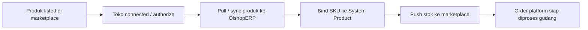

# Panduan Pengguna — Manage Platform Product

**Siapa yang baca panduan ini:** tim OmniChannel ops, catalog admin, support  
**Menu di sistem:** OmniChannel → Manage Platform Product  
**Route:** `/omni/platform-product`

---

## 1. Apa Itu & Kenapa Penting

**Manage Platform Product** adalah workspace untuk menyelaraskan **produk di marketplace** (Shopee, Lazada, TikTok Shop, dll.) dengan **produk internal** di OlshopERP. Di sini kamu menarik katalog dari toko, menghubungkan (bind) SKU marketplace ke System Product, mengatur stok yang dikirim ke etalase, dan memantau hasil sync.

Tanpa binding yang benar, order dari buyer bisa stuck karena sistem belum tahu produk gudang mana yang harus dipenuhi. Menu ini jembatan antara etalase digital dan stok internal — bukan tempat membuat produk baru dari nol.

---

## 2. Overview Flow & Proses Bisnis

**Versi teks (tanpa diagram):**

1. Produk sudah ada di seller center marketplace.
2. Toko marketplace sudah di-connect / authorize di OlshopERP.
3. Produk masuk ke menu ini lewat **Pull Products**, sync otomatis, atau onboarding toko baru.
4. Kamu **bind** SKU platform ke System Product (manual, Auto Binding, atau Bulk Binding).
5. Bila perlu, **Push Stock** mengirim jumlah stok ke etalase.
6. Order marketplace bisa diproses gudang karena binding valid.

🎬 [Interactive demo akan ditambahkan di sini]

### Status yang kamu lihat (bukan Draft/Approve)

Menu ini **bukan** dokumen transaksi dengan Draft/Open/Approve. Yang kamu pantau adalah status **binding** dan tipe SKU:

| Status / badge | Artinya | Bisa diubah? |
|----------------|---------|--------------|
| **Not Binded** | Belum terhubung ke System Product | Ya — bind manual / Auto / Bulk |
| **Binded** | Sudah terhubung (PARENT = semua varian anak sudah bind) | Ya — unbind atau ganti binding |
| **SINGLE** | Produk tunggal tanpa varian | Bind langsung dari baris ini |
| **VARIANT** | Varian (ukuran/warna) dari induk | Bind **per varian**, bukan dari baris PARENT |
| **PARENT** | Induk yang punya banyak varian | Tidak bisa bind langsung — bind tiap VARIANT |

---

## 3. Sebelum Mulai (Flow Sebelum)

Pastikan ini sudah siap:

- Toko marketplace sudah **connected / authorized** di menu Store / Store Binding.
- **System Product** yang mau dihubungkan sudah aktif (bukan Fix Asset, dan cocok dengan aturan random bila relevan).
- Kamu tahu **SKU** di marketplace yang mau diikat.
- Kamu punya akses menu Manage Platform Product (lihat/update sesuai privilege).

Untuk toko baru: setelah authorize, sistem biasanya sudah mengantri sync produk awal — kamu tetap bisa **Pull Products** manual bila SKU belum muncul.

🎬 [Interactive demo akan ditambahkan di sini]

---

## 4. Setelah Selesai (Flow Sesudah)

Setelah produk **Binded**:

- Order platform yang sebelumnya error karena produk belum bind bisa terisi produk internal secara otomatis (tidak perlu re-sync order).
- Kamu bisa **Push Stock** agar stok etalase marketplace mengikuti aturan yang kamu set.
- Pantau hasil di **Sync Log** (Action Log & Product Sync) dan **Bulk Binding Log** (di panel Bulk Binding).

Lanjutan operasional: order diproses di Sales Order Platform → wave/picking/fulfillment.

---

## 5. Yang Perlu Diperhatikan

- Kalau kamu belum pilih **Store** di filter atas, tombol Pull / Push / Auto Binding **disabled** — pilih toko dulu.
- Kalau proses sync/bind/stock untuk toko itu **masih berjalan**, tombol bisa abu-abu — tunggu sebentar, refresh, jangan klik berulang.
- Kalau kamu coba buat produk baru di menu ini: **tidak bisa** — produk harus ada di marketplace dulu, lalu di-pull.
- Kalau kamu edit nama/SKU di OlshopERP: **tidak bisa** — ubah di seller center, lalu Pull ulang.
- Kalau kamu bind produk **PARENT**: sistem tidak menampilkan tombol bind — bind tiap **VARIANT**.
- Kalau System Product bertipe **Fix Asset**: bind ditolak.
- Kalau satu sisi random dan yang lain bukan (tanpa konfirmasi): bind ditolak.
- Kalau Auto Binding: hanya cocokkan SKU yang **belum bind** dan SKU platform = SKU system (per store terpilih). Kalau SKU sengaja beda, pakai bind manual atau Bulk Binding.
- Kalau Bulk Binding: SKU platform harus **100% sama persis** (huruf/spasi) di toko-toko yang mau ikut; System Product harus milik company yang sama.
- Kalau Push Stock tanpa bind dan tanpa **Fake Stock**: push gagal / tidak ada data ke platform.
- Kalau Fake Stock diisi: angka itu yang diprioritaskan saat push (override stok gudang).
- Kalau Stock Ratio: harus bilangan bulat 0–100 (bukan desimal).
- Kalau hapus **VARIANT** satu per satu: ditolak — hapus lewat PARENT (tanpa anak) atau biarkan sync yang kelola.
- Kalau hapus PARENT yang masih punya anak: ditolak.
- Banner kuning: stok **PARENT** di marketplace diabaikan saat sync stok — yang relevan varian/SINGLE yang sudah bind.

---

## 6. Langkah-Langkah (Step by Step)

### Toko baru — produk pertama kali muncul

1. Buka **OmniChannel → Manage Platform Product**.
2. Di filter atas, pilih **Store** toko baru.
3. Klik **Pull Products** — tunggu notifikasi sukses; cek Sync Log bila perlu.
4. Klik **Auto Binding**, atau bind manual per SKU (ikon binding di baris).
5. Pastikan status jadi **Binded** dan kolom System Product terisi.

### Bind manual satu SKU

1. Pastikan Store terpilih dan baris bukan **PARENT**.
2. Klik ikon **binding** → modal **Specification Product**.
3. Di **Binding Product**, pilih System Product → Save.
4. (Opsional) Atur **Stock Management** (Fake Stock / Minimum Stock / Stock Ratio) → Save.
5. Status jadi **Binded** hijau.

### Bulk Binding — SKU sama di banyak toko

1. Klik **Bulk Binding** (panel kanan).
2. Pilih **Platform Product SKU** — cek preview toko mana saja yang punya SKU itu.
3. Pilih **Binded to System Product**.
4. Klik **Save** — cek log di panel yang sama untuk toko yang ter-update.

### Kirim stok ke marketplace

1. Pilih Store → pastikan produk **Binded** *atau* sudah set **Fake Stock**.
2. Atur Minimum Stock / Stock Ratio di Specification bila perlu.
3. Klik **Push Stock** (atau bulk push untuk baris terpilih).
4. Cek Sync Log bila hasil tidak sesuai.

### Sync ulang & hapus

- Sync per baris: hanya **SINGLE** atau **PARENT** (varian tidak punya tombol sync sendiri).
- Bulk sync / bulk stock / bulk delete: centang baris, lalu aksi massal (PARENT di-skip untuk edit stock; VARIANT tidak bisa dihapus sendiri).
- Export Excel tersedia dari tab export di DataList.

🎬 [Interactive demo akan ditambahkan di sini]

---

## 7. Tips & Hal yang Sering Bikin Bingung

- **"SKU tidak muncul padahal sudah ada di marketplace."** Pilih Store → Pull Products → cek Sync Log. Jangan expect ketik SKU baru di sini.
- **"Auto Binding bilang No product to be bound."** Semua sudah bind, atau SKU platform ≠ SKU system. Pakai bind manual / Bulk Binding.
- **"Push Stock gagal / stok tetap 0."** Belum bind dan belum Fake Stock, atau stok tersedia jual di bawah minimum. Bind dulu atau set Fake Stock; cek stok di System Product.
- **"Tombol abu-abu."** Store belum dipilih, atau job masih jalan — tunggu 1–2 menit lalu refresh.
- **"Order stuck unbinded product."** Bind SKU terkait — error order biasanya hilang otomatis tanpa re-sync order.
- **"Bulk Binding tidak update semua toko."** SKU di database tidak 100% sama (huruf/spasi). Samakan di seller center atau bind manual per toko.
- **"Apa beda Auto Binding dan Bulk Binding?"** Auto = per store, cocok otomatis jika SKU sama. Bulk = satu SKU platform, bind sekaligus di banyak toko ke System Product yang kamu pilih.
- **"Fake Stock kapan dipakai?"** Saat belum bind, atau sengaja override stok gudang dengan angka tetap ke marketplace.

---

## 8. Referensi

| Sumber | Untuk apa |
|--------|-----------|
| [Knowledge Base](./knowledge-base.md) | Troubleshooting & FAQ operator |
| [Requirement](./requirement.md) | Aturan bisnis, validasi, acceptance criteria |
| [Technical](./technical.md) | API, job, file map (developer) |
| [Help Center overview (ID)](../_meta/docs-hub/menus/manage-platform-product/overview.id.md) | Landing Help Center in-app |
| [System Product](../system-product/README.md) | Master SKU internal & stok |
| [Store Binding](../omni-store-binding/README.md) | Connect toko & Product Onboarding Status |
