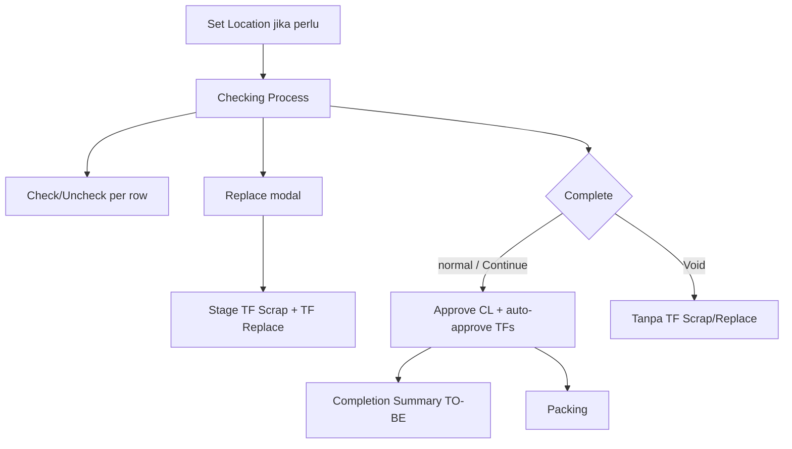

# Checking List — Requirement Documentation

**Modul:** SupplyChain / OmniChannel  
**UI:** `/omni/checking-list` · edit `/omni/checking-list/edit/:id` · set-location `/omni/checking-list/set-location/:id`  
**Audience:** PM, Warehouse Ops, QA  
**SoT:** `_meta/sot/omni-checking-list-source-of-truth.md` v1.0  
**Card:** [ETM-16138](https://erpintegration.atlassian.net/browse/ETM-16138) · Wireframe: https://claude.ai/artifact/WokXLb4E1JMVEvNAKgKjKk

Related: [Picking List](../omni-picking-list/requirement.md) · [Packing List](../omni-packing-list/requirement.md) · Sales Platform Void & Recreate (`omni-sales-platform` §5.8)

---

## 0. Changelog

| Version | Date | Author | Changes |
|---------|------|--------|---------|
| 1.0 | 2026-09-29 | QA - Yemima | Initial AS-IS + TO-BE ETM-16138; keputusan open Q (check per-row, partial replace, Continue vs Void) |

---

## 1. Ringkasan Eksekutif

Checking List adalah tahap **QC** fulfillment setelah picking: set location stasiun, check item (informatif), Replace defective (TF Scrap + TF Replace), Complete menuju packing.

| Kebutuhan | Jawaban |
|-----------|---------|
| QC cepat | Check per-row; Complete tidak diblok unchecked |
| Barang rusak | Modal Replace → TF Scrap + TF Replace |
| Audit | Replacement History + Completion Summary (TO-BE) |
| Order cancel di checking | Prompt Continue vs Void (manual only) |

---

## 2. Prasyarat

| Prasyarat | Sumber |
|-----------|--------|
| CL tergenerate dari picking / pipeline | Upstream PL |
| Location station (bila null → Set Location) | `set-location` |
| Untuk Replace: CL Open + pause (AS-IS) | Duration / pause API |
| Hak akses menu | Gate |

---

## 3. Siklus & alur

---

## 4. Check / Uncheck (AS-IS + keputusan)

| Aturan | Expected |
|--------|----------|
| Granularity | **Per row** — satu Check = seluruh qty baris checked |
| Complete | **Tidak** diblok oleh sisa unchecked |
| Replace | **Bukan** bagian Check — modal terpisah (Artifact) |

---

## 5. Replace defective

### 5.1 Timing (AS-IS verified)

| Event | Scrap TF | Replace TF |
|-------|----------|------------|
| Confirm Replace (`change-product`) | Create/update Open | Create/update Open |
| Approve CL | Auto-approve | Auto-approve + inject checked lines |

### 5.2 Arah stok

| TF | Origin | Destination |
|----|--------|-------------|
| Scrap | Outrack (CL origin / last pick) | Scrap WH (setting WH process / parenthesis) |
| Replace | Rack dipilih operator | Outrack checking (CL destination) |

### 5.3 Partial & row (keputusan Yemima)

- Partial qty = partial.  
- Beda lokasi replace → **pisah row**.  
- Lokasi sama → boleh 1 grouping asal history/TF jelas; split row tiap partial **OK** untuk kemudahan FE/BE.

### 5.4 TO-BE UI (ETM-16138)

Modal: defective SKU RO, qty, replacement rack+stock, reason, **preview 2 TF**. Row state Replaced. Replacement History slideover.

---

## 6. Complete — Cancel / Void (TO-BE)

| Kondisi | Behavior |
|---------|----------|
| Source Skip Wave / Skip Processing | **Tanpa** prompt cancel/void |
| Manual + platform status contains `cancel` OR internal `void` | Prompt: Continue to Packing **vs** Void… |
| Continue | Approve normal termasuk TF Scrap/Replace **tetap** digenerate/approve |
| Void only / Void & Recreate | **Tidak** generate TF Scrap/Replace; stok terakhir = PL di outrack; Void & Recreate = Sales Platform flow |

---

## 7. Completion Summary (TO-BE)

Hero Completed / Voided / Voided & Recreated · stats Checked/Unchecked/Replaced · list TF Auto-approved · Replacement History · Next / Packing. API `completion-summary`.

---

## 8. Set Location (AS-IS + tidy TO-BE)

Jika `location_id` null dan belum approved → Set Location → process.

---

## 9. Acceptance Criteria (ETM-16138)

- [ ] Table headers Status/Product/Qty/QC Steps/Action  
- [ ] Check per-row; Complete tidak diblok unchecked  
- [ ] Replace modal + preview TF; generate di change; approve di Complete  
- [ ] Partial/beda lokasi sesuai §5.3  
- [ ] Continue tetap TF; Void tanpa TF scrap/replace  
- [ ] Cancel prompt hanya manual checking  
- [ ] Completion Summary + history API/UI  
- [ ] Set Location tetap jalan  

---

## 10. Non-goals

- Menggabungkan menu Transfer Checking scan dengan CL process  
- Mengubah pipeline Skip Wave generate CL (kecuali flag `is_manual` untuk prompt)
