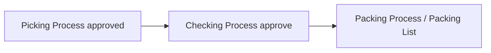

# Checking Process — Knowledge Base

## Apa itu

Approve **transfer internal** tahap checking (virtual WH `sequence = 2`) setelah picking. Operator scan QR / kode TF / SO / platform order.

**Bukan** [Checking List](../omni-checking-list/README.md) — List = QC operasional (check, replace defective, scrap/replace TF). Process = approve dokumen TF stage.

## Alur

## Tips

- Picking harus sudah approved sebelum checking eligible.
- Settlement butuh rantai sampai **Shipped 3PL** — checking sendiri tidak memicu accounting.
- Relasi Failed Ship: tahap #2 (CL) di rantai fulfillment.

## Troubleshooting

| Gejala | Solusi |
|--------|--------|
| Transfer not found | Bukan destination sequence 2 / belum picking |
| Scanned previously | Sudah APPROVED — jangan scan ulang |

Detail: [requirement.md](./requirement.md) · [Checking List TO-BE](../omni-checking-list/requirement.md)
