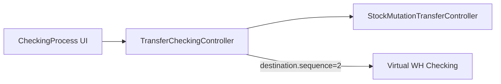

# Checking Process — Technical

**FE:** `olshoperp-frontend/src/pages/Omni/CheckingProcess/` (atau path setara Transfer Checking)  
**BE:** `Modules/OmniChannel/Http/Controllers/TransferCheckingController.php` → delegates `StockMutationTransferController`  
**API:** `omnichannel/transfer-checking/*`

## Architecture

Thin wrapper seperti Picking Process. Approve scoped ke destination warehouse **`sequence = 2`** (virtual Checking). `process_type` checking (`PROCESS_TYPE_CHECKING`).

## Key behaviors

| Topic | Detail |
|-------|--------|
| Eligibility | TF destination `sequence = 2`; status DRAFT/OPEN/APPROVED |
| Approve | QR / TF code / SO / platform_order_id — pola sama Picking |
| Upstream | Picking TF (`PROCESS_TYPE_PICKING`) approved |
| Downstream | Packing Process / Packing List |
| vs Checking List | List = dokumen QC operasional (scan/replace); Process = approve TF stage |

## Related

[Picking Process technical](../omni-picking-process/technical.md) · [Checking List](../omni-checking-list/technical.md) · [Failed Ship rantai](../supplychain-failed-ship/requirement.md)
