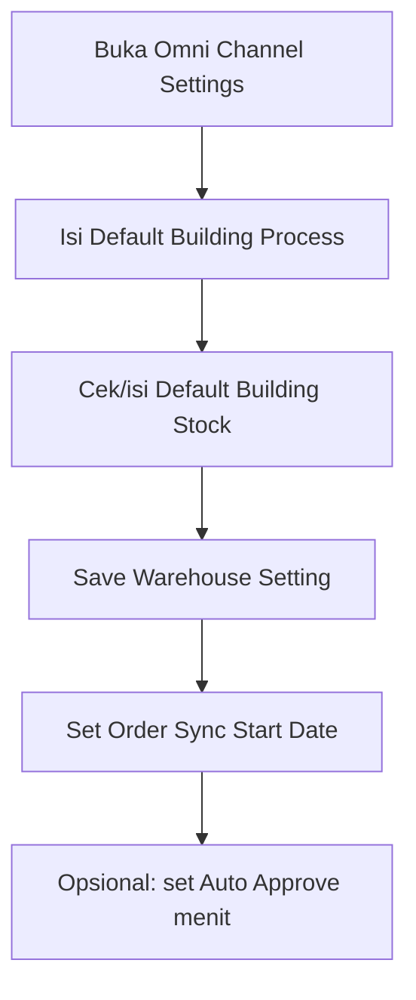

# Omni Channel Settings — Knowledge Base

> **Audience:** Admin company / PM setup Omni Channel. **Route:** `/omni/global-settings`

---

## 1. Apa itu Omni Channel Settings?

Menu konfigurasi **default operasional Omni Channel per company** — bukan daftar transaksi. Di sini kamu mengatur:

- **Default Building Process** — gudang proses default untuk Store baru  
- **Default Building Stock** — satu atau lebih building untuk akumulasi stok jual / push stock  
- **Order Sync Start Date** — mulai kapan order marketplace di-tarik  
- **Auto Approve (menit)** — jeda sebelum sistem mencoba auto-approve order  

---

## 2. Glosarium

| Istilah | Arti awam |
|---------|-----------|
| **Default Building Process** | Gudang proses default yang ikut ke Store baru |
| **Default Building Stock** | Daftar building tempat stok dihitung bersama (ATS / push) |
| **Order Sync Start Date** | Tanggal-jam mulai sistem ambil order dari platform |
| **Auto Approve (menit)** | Jeda sebelum order di-approve otomatis |
| **Company owner** | Setting Warehouse & Sync Date milik company yang sedang login |

---

## 3. Cara pakai

### Warehouse Setting

1. Buka **Omni Channel → Omni Channel Settings**.  
2. Pilih **Default Building Process** (wajib). Stock akan ikut menambahkan building yang sama.  
3. Tambah building lain di **Default Building Stock** bila perlu (multi).  
4. Klik **Save**.  

Hanya building milik company-mu yang sudah lengkap pengaturan Out Rack / Scrap / Return (sesuai filter sistem) yang muncul di pilihan.

### Order Setting

1. Isi **Order Sync Start Date** — tersimpan otomatis saat kamu menutup picker (autosave).  
2. Isi **Set Auto Approve All Sales Order** (menit) — autosave saat blur.  

Catatan UI: ada peringatan bahwa Auto Approve bisa diabaikan karena ada batch approve harian jam 19:00. Tetap jangan menganggap field ini “mati total” tanpa cek dengan admin — nilai ini dipakai lintas company.

### Audit Log

Buka dari side nav **Audit Log** untuk melihat riwayat perubahan setting.

---

## 4. Yang bisa / tidak bisa

| Aksi | Bisa? | Catatan |
|------|-------|---------|
| Ubah Process / Stock kapan saja | ✅ | Mengganti nilai existing (bukan buat versi baru) |
| Multi building di Stock | ✅ | Process tidak bisa dihilangkan dari daftar Stock |
| Default Warehouse Void | ❌ UI | Field disembunyikan |
| Buat Sales Return auto-approve dari menu ini | ❌ | Komponen belum terpasang di halaman |
| Cari Other Cost/Discount Owner di sini | ❌ | Bukan di form ini — meski pesan sync kadang menyebut "global settings" |

---

## 5. Troubleshooting

| Gejala | Penyebab | Solusi |
|--------|----------|--------|
| Store baru Process kosong | Settings company belum diisi | Isi & Save Default Building Process |
| Warehouse tidak muncul di dropdown | Bukan milik company / belum building / belum Out Rack–Scrap–Return | Lengkapi Warehouse Setting dulu |
| Order lama marketplace tidak masuk | Sebelum Sync Start Date | Geser tanggal (maks 14 hari ke belakang) atau terima bahwa order lama tidak di-sync |
| Sync gagal suruh lengkapi global settings | Other Cost/Discount Owner | Hubungi admin — field itu bukan di halaman ini |
| Auto Approve “tidak terasa” | Batch 19:00 / exception order / nilai global | Cek warning UI; jangan ubah tanpa koordinasi multi-company |

---

## 6. FAQ

**Q: Setting company lain ikut kepakai?**  
A: Warehouse & Sync Start Date **tidak**. Auto Approve delay bersifat **global** — hati-hati.

**Q: Kenapa multi warehouse di Stock?**  
A: Supaya ketersediaan stok dan push stock bisa digabung dari beberapa building.

**Q: Apa yang terjadi saat Save Warehouse?**  
A: Setting tersimpan dan sistem memastikan struktur Wave transfer untuk building proses sudah ada.

---

## Related Documents

| Doc | Path |
|-----|------|
| Requirement | [requirement.md](./requirement.md) |
| Technical | [technical.md](./technical.md) |
| User Guide | [user-guide.md](./user-guide.md) |
| Store Binding | [../omni-store-binding/README.md](../omni-store-binding/README.md) |
