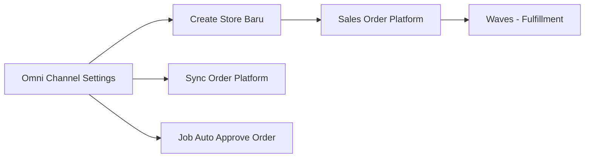
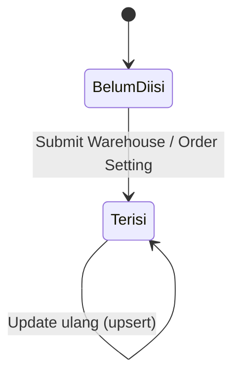
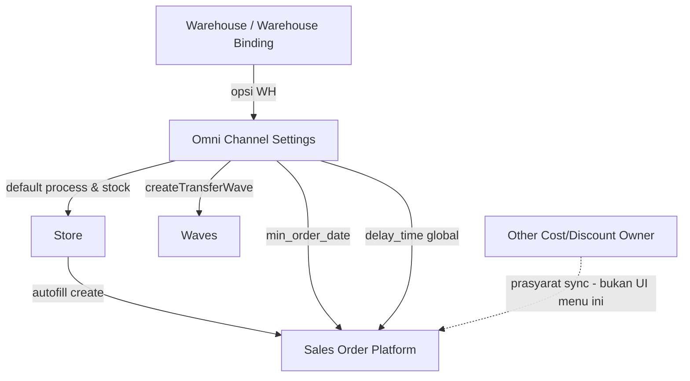

# Omni Channel Settings — Requirement Documentation

**Modul:** Omni Channel  
**UI route:** `/omni/global-settings`  
**API prefix:** `omnichannel/default-warehouse` · `omnichannel/settings` · `omnichannel/order-automation-setting`  
**Audience:** PM, Admin company, QA, Developer  
**PM source:** Omni Channel Settings Source of Truth v1.0 (31 Juli 2026)

> Requirement = target bisnis + **AS-IS codebase** (31 Jul 2026). Gap & koreksi vs SoT ada di §2 & §11.

---

## 0. Metadata & Changelog

| Version | Date | Author | Changes |
|---------|------|--------|---------|
| 1.0 | 2026-07-31 | QA - Yemima | Docs awal dari SoT v1.0 + verifikasi codebase: Warehouse/Order Setting, upsert per company, Gap Registry `GAP-OCS-01..06`, koreksi filter select2 & side-effect ATS |

---

## 1. Ringkasan Eksekutif

**Omni Channel Settings** adalah menu **master konfigurasi per company** (bukan dokumen transaksi) yang menyimpan default operasional Omni Channel: warehouse proses & stock default, batas tanggal mulai sync order platform, dan durasi auto approve order. Nilai di sini dipakai otomatis saat **create Store baru**, saat **sync Sales Order Platform**, dan saat **job auto approve**.

---

## 2. Status implementasi vs SoT (AS-IS notes)

| Area | SoT / bisnis | AS-IS codebase | Gap |
|------|--------------|----------------|-----|
| Level warehouse opsi dropdown | Requirement lama: level ≥ 19 | Select2: `level = building_level` **dan** `level < rack_level`; store validate `level <= 30` ("must be under 31") | GAP-OCS-01 |
| Filter Out Rack / Broken / Return / Failed Ship untuk Process | Wajib di dropdown Process; tidak untuk Stock | Select2 **Process & Stock sama**: Out Rack + Scrap + Return (via `for_wh_binding`). **Failed Ship tidak** difilter. Tooltip UI: Out Rack, Scrap, Return | GAP-OCS-02 (partially resolved) |
| Simpan Warehouse → aktifkan `include_ats` | SoT §6.4 | **Tidak** di `DefaultWarehouseController@store` — hanya `createTransferWave`. `include_ats` diaktifkan di alur Store / Warehouse Binding | Koreksi AS-IS (bukan gap fitur UI) |
| Auto Approve delay | Per company di halaman settings | `updateOrCreate([])` **global** (tanpa `owned_by`) | GAP-OCS-03 |
| Other Cost/Discount Owner | Error sync arahkan ke "global settings" | API terpisah; **tidak** di form menu ini | GAP-OCS-04 |
| Sales Return Configuration | Ada di SoT sebagai orphan | FE + API ada, **tidak di-mount** di `Form.vue` | GAP-OCS-05 |
| Order Split | Stub | Stub FE/BE | GAP-OCS-06 |
| Default Warehouse Void | Hidden UI | `show_default_warehouse_void: false` — field DB/API tetap ada | Confirmed |

---

## 3. Prasyarat

| Prasyarat | Sumber | Catatan |
|-----------|--------|---------|
| Internal Company aktif | Master Internal Company | Scope Warehouse Setting & min_order_date per company login |
| Warehouse Structure + Warehouse Setting | Master WH / WH Binding | Opsi dropdown: owner = company login; building level; Out Rack + Scrap + Return terisi (AS-IS) |
| Privilege Global Setting | Role Menu | Policy `GlobalSetting` create/view untuk Warehouse & Order Automation |

---

## 4. Siklus status

Bukan dokumen transaksi — **tidak ada** Draft/Open/Approve. Submit bersifat **upsert** per company (Warehouse / min_order_date) atau global (delay auto approve).

| Status | Arti | Editable? |
|--------|------|-----------|
| Belum Diisi | Belum pernah disave untuk company | — → field turunan Store bisa NULL |
| Terisi | Sudah pernah disave | Ya kapan saja — mengganti value, bukan version history |

---

## 5. Form & Field

Menu **tanpa datalist multi-row**. Satu konfigurasi aktif per company (Warehouse + Order Sync Date) + satu baris global (Auto Approve delay). Tab **Audit Log** = riwayat perubahan gabungan.

### 5.1 Warehouse Setting

| Field | Wajib? | Default | Sumber opsi | Validasi AS-IS | Catatan |
|-------|--------|---------|-------------|----------------|---------|
| Default Building Process | Ya | Kosong | Select2 WH owner company + building level + Out Rack/Scrap/Return | `required`; level `<= 30` saat store → pesan `Warehouse process level must be under 31.` | Default warehouse proses Store baru; simpan → `createTransferWave` |
| Default Building Stock | Ya (≥1) | Autofill dari Process saat Process berubah | **Select2 yang sama** dengan Process (AS-IS) | `required`, `array` | Multi; Process selalu ikut di daftar stock (tidak bisa dihapus dari set) |
| Default Warehouse Void | Tidak | — | select2 void (tersedia) | `nullable` | **Hidden di UI** (`show_default_warehouse_void: false`) |

Tombol **Save** (samping) menyimpan Warehouse Setting saja.

### 5.2 Order Setting — Order Automation

| Field | Wajib? | Default | Satuan | Validasi AS-IS | Catatan |
|-------|--------|---------|--------|----------------|---------|
| Set Auto Approve All Sales Order | Ya | — | Menit | `required`, `integer` (min 0 di UI) | Autosave blur; **scope global** (GAP-OCS-03). UI warning: setting "ignored" karena batch approve harian 19:00 |
| Order Sync Start Date | Ya | Now | DateTime | Wajib; tidak lebih tua dari 14 hari → `Order Sync Start Date cannot be older than 14 days from today` | Autosave; scope **per company** (`OmniSetting.owned_by`) |

Exception auto approve (bukan validasi di menu ini) — di level SO Platform / General / All SO:

1. User mengubah detail order platform → wajib approve manual.  
2. Harga detail di bawah benchmark COGS → tidak ikut auto approve.

---

## 6. How It Works

### 6.1 Owner scoping — Default Building Process

Opsi & nilai tersimpan mengikuti **company yang login**. Setting company A tidak dipakai saat create Store di company B (autofill NULL jika B belum diisi).

### 6.2 Building Stock — multi warehouse

Saat Process diisi, Stock autofill menambah warehouse yang sama. User boleh menambah WH lain (owner sama). Kalkulasi ATS / push stock mengakumulasi dari seluruh WH di field ini. WH Process tidak dihapus dari daftar stock saat remove array.

### 6.3 Dampak create Store

Tanpa Default Building Process untuk company terkait, create Store gagal / meminta lengkapi Omni Channel Settings dulu (lihat docs Store).

### 6.4 Efek samping simpan Warehouse Setting (AS-IS)

1. Upsert `DefaultWarehouse` + sync rows `DefaultWarehouseStock`.  
2. `WaveController::createTransferWave(default_warehouse_id)` — pastikan struktur Wave virtual transfer.  
3. **Tidak** otomatis set `include_ats` di controller ini (berbeda klaim SoT §6.4).

### 6.5 Auto Approve delay

Menu ini hanya menyimpan **durasi (menit)**. Logika exception ada di dokumentasi Sales Order. Nilai dibaca job auto approve; UI menyatakan bisa diabaikan karena batch 19:00 — tetap dokumentasikan bahwa kode masih menyimpan & membaca field ini (GAP-OCS-03).

### 6.6 Order Sync Start Date

Default = sekarang. Hanya order platform dengan waktu ≥ nilai ini yang di-sync. Order lebih lama **tidak pernah** masuk, apa pun pemicu sync.

---

## 7. Validasi

### 7.1 Warehouse Setting

| # | Kondisi | Behavior | Pesan AS-IS |
|---|---------|----------|-------------|
| V1 | Process kosong | Ditolak | Laravel `required` pada `default_warehouse_id` |
| V2 | Stock kosong / bukan array | Ditolak | `default_warehouse_stock_id` required array |
| V3 | WH beda owner | Tidak muncul di select2 | — |
| V4 | Level Process tidak lolos cek store | Ditolak | `Warehouse process level must be under 31.` |
| V5 | WH tanpa Out Rack / Scrap+Return / bukan building level | Tidak muncul di select2 Process **dan** Stock | — (GAP-OCS-02: Failed Ship tidak dicek) |

### 7.2 Order Setting

| # | Kondisi | Behavior | Pesan AS-IS |
|---|---------|----------|-------------|
| V6 | delay_time kosong / bukan integer | Ditolak | Laravel validation |
| V7 | min_order_date invalid | Ditolak | `Invalid date` |
| V8 | min_order_date > 14 hari ke belakang | Ditolak | `Order Sync Start Date cannot be older than 14 days from today` |

---

## 8. Relasi Menu Lain

| Menu | Peran |
|------|-------|
| [Store Binding](../omni-store-binding/README.md) | Konsumen default process/stock saat create |
| Sales Order Platform | Window sync + auto approve |
| Sales Order General / All Sales Order | Durasi auto approve juga berlaku; exception di docs masing-masing |
| Warehouse / Warehouse Binding | Sumber opsi & konfigurasi lokasi |
| Waves | Transfer wave di bawah process WH |
| Manage Platform Product, Instant Settlement, dll. | Tidak dependency langsung ke UI settings ini |

---

## 9. Acceptance Criteria

| ID | Kriteria |
|----|----------|
| OCS-01 | Warehouse Setting upsert per company; Process & Stock wajib; Process selalu di daftar Stock |
| OCS-02 | Select2 hanya WH owner company + building level + Out Rack/Scrap/Return (AS-IS) |
| OCS-03 | Simpan Process → createTransferWave dijalankan |
| OCS-04 | min_order_date per company; reject > 14 hari ke belakang |
| OCS-05 | delay_time integer ≥ 0 tersimpan (catat scope global GAP-OCS-03) |
| OCS-06 | Audit Log menggabungkan perubahan Warehouse / Stock / Order Automation / OmniSetting |
| OCS-07 | Sales Return Config & Order Split tidak accessible dari Form utama (documented orphan/stub) |

---

## 10. FAQ

**Q: Kenapa Store baru warehouse prosesnya kosong?**  
A: Autofill dari Default Building Process company yang login. Kalau belum diisi di Omni Channel Settings, field Store ikut kosong.

**Q: Setting company A dipakai di company B?**  
A: Tidak untuk Warehouse & Sync Start Date. **Kecuali** delay Auto Approve yang global (GAP-OCS-03).

**Q: Kenapa bisa multi warehouse di Building Stock?**  
A: Agar ATS / push stock mengakumulasi dari beberapa building.

**Q: Ubah Auto Approve tidak terasa?**  
A: UI bilang diabaikan karena batch 19:00; field tetap global lintas company — lihat GAP-OCS-03.

**Q: Order lama marketplace tidak masuk?**  
A: Cek Order Sync Start Date — order sebelum tanggal jam itu tidak di-sync.

**Q: Error sync suruh lengkapi global settings tapi field tidak ada?**  
A: Other Cost/Discount Owner — lihat GAP-OCS-04.

---

## 11. Gap Registry

| ID | Deskripsi | Dampak | Status |
|----|-----------|--------|--------|
| GAP-OCS-01 | Kontradiksi level: bisnis "≥ 19" vs store `<= 30` vs select2 `building_level` + `< rack_level` | Opsi WH bisa salah sampai level exact dikonfirmasi PM/dev | Open |
| GAP-OCS-02 | Failed Ship tidak masuk filter select2; SoT bedakan Process vs Stock untuk kelengkapan lokasi — AS-IS **kedua** field pakai filter Out Rack+Scrap+Return yang sama | Tooltip/SoT vs opsi actual; Failed Ship belum di-gate | Open (partially mitigated) |
| GAP-OCS-03 | `delay_time` singleton global tanpa company scope; UI teks "ignored" vs job masih baca | Company saling memengaruhi; user salah paham | Open |
| GAP-OCS-04 | Other Cost/Discount Owner wajib sync order tapi bukan UI menu ini | Bingung cari field di Omni Channel Settings | Open |
| GAP-OCS-05 | `SalesReturnConfiguration.vue` + API ada, tidak di-mount di Form | Auto approve Sales Return platform tidak bisa dikonfigurasi dari UI | Open |
| GAP-OCS-06 | `DatalistOrderSplit.vue` stub | Tidak operasional — jangan dianggap fitur hilang | Open |

---

## Related Documents

| Doc | Path |
|-----|------|
| Knowledge Base | [knowledge-base.md](./knowledge-base.md) |
| Technical | [technical.md](./technical.md) |
| User Guide | [user-guide.md](./user-guide.md) |
| Store Binding | [../omni-store-binding/README.md](../omni-store-binding/README.md) |
