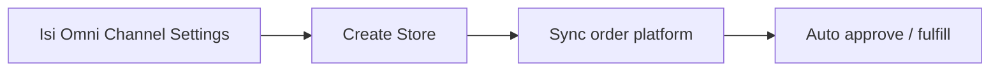

# Panduan Pengguna — Omni Channel Settings

**Siapa yang baca:** Admin company / tim yang setup Omni Channel  
**Menu:** Omni Channel → Omni Channel Settings  
**Route:** `/omni/global-settings`

---

## 1. Apa Itu & Kenapa Penting

**Omni Channel Settings** menyimpan **default operasional** Omni Channel untuk company-mu: gudang proses & stok default, kapan order marketplace mulai di-tarik, dan jeda auto approve. Tanpa setting warehouse yang lengkap, **Store baru** bisa gagal atau field gudangnya kosong. Tanpa Sync Start Date yang tepat, order lama/baru dari platform bisa tidak masuk sesuai harapan.

Ini **bukan** menu transaksi — tidak ada Draft/Approve. Kamu isi sekali (lalu update bila perlu).

---

## 2. Overview Flow & Proses Bisnis

**Versi teks:**

1. Admin mengisi Warehouse Setting & Order Setting di menu ini.  
2. Saat buat **Store** baru, gudang proses/stock default terisi dari sini.  
3. Sync order marketplace memakai **Order Sync Start Date**.  
4. Job auto approve memakai durasi (menit) yang tersimpan — dengan pengecualian di level order.

### Status

| Kondisi | Arti | Bisa diubah? |
|---------|------|--------------|
| Belum pernah disave | Store baru bisa kosong/gagal autofill | Ya — isi lalu Save |
| Sudah terisi | Nilai aktif untuk company | Ya — Save/update mengganti nilai lama |

---

## 3. Sebelum Mulai (Flow Sebelum)

- Company yang kamu login sudah aktif.  
- Building warehouse sudah ada dan (untuk yang muncul di pilihan) sudah punya pengaturan Out Rack / Scrap / Return sesuai sistem.  
- Kamu punya akses menu Omni Channel Settings.  
- Putuskan tanggal mulai sync order (tidak boleh lebih dari 14 hari ke belakang dari hari ini).

🎬 [Interactive demo akan ditambahkan di sini]

---

## 4. Setelah Selesai (Flow Sesudah)

- Create Store baru: field warehouse proses/stock mengikuti default (kecuali di-override di Store).  
- Order platform hanya masuk sejak Sync Start Date.  
- Auto approve mengikuti durasi + aturan exception di Sales Order (ubah detail order platform, harga di bawah COGS, dll.).

Perubahan settings **tidak otomatis** mengubah Store yang sudah dibuat sebelumnya — hanya mempengaruhi create baru / proses sync & approve ke depan.

---

## 5. Yang Perlu Diperhatikan

- Kalau kamu belum isi **Default Building Process**, Store baru di company itu bisa bermasalah.  
- Kalau kamu ganti login ke company lain, setting Warehouse & Sync Date **tidak ikut** — tiap company punya sendiri.  
- Kalau kamu ubah **Auto Approve menit**, nilai itu bersifat **global** (bisa memengaruhi company lain) — koordinasikan dulu.  
- Kalau UI bilang Auto Approve “diabaikan” karena batch jam 19:00, tetap jangan ubah sembarangan.  
- Kalau **Order Sync Start Date** terlalu ketat, order marketplace sebelum tanggal itu **tidak pernah** masuk.  
- Kalau pesan sync menyuruh lengkapi “global settings” tapi di halaman ini tidak ada field yang dimaksud: biasanya **Other Cost/Discount Owner** di tempat lain — hubungi admin.  
- Field **Default Warehouse Void** tidak ditampilkan di layar.  
- Pengaturan Sales Return auto-approve belum bisa diakses dari halaman ini.

---

## 6. Langkah-Langkah (Step by Step)

1. Buka **Omni Channel → Omni Channel Settings**.  
2. Di **Warehouse Setting**, pilih **Default Building Process**.  
3. Pastikan **Default Building Stock** berisi minimal building proses; tambah building lain bila stok digabung dari beberapa lokasi.  
4. Klik **Save**.  
5. Di **Order Settings**, set **Order Sync Start Date** (tersimpan otomatis).  
6. (Opsional) set **Set Auto Approve All Sales Order** dalam menit (tersimpan otomatis saat keluar dari field).  
7. Bila perlu, buka **Audit Log** dari navigasi samping untuk cek riwayat perubahan.

🎬 [Interactive demo akan ditambahkan di sini]

---

## 7. Tips & Hal yang Sering Bikin Bingung

- **"Store baru gudang kosong."** Isi dulu Default Building Process di company yang sama, lalu create Store lagi / isi manual di Store.  
- **"Warehouse tidak muncul."** Bukan milik company-mu, atau belum lengkap setting lokasi building.  
- **"Order lama tidak masuk."** Cek Sync Start Date.  
- **"Auto Approve tidak jalan."** Bisa karena batch 19:00, exception order, atau nilai global — cek dengan admin.  
- **"Error sync global settings tapi form sudah lengkap."** Bukan Warehouse/Sync Date — kemungkinan Other Cost/Discount Owner.

---

## 8. Referensi

| Sumber | Untuk apa |
|--------|-----------|
| [Knowledge Base](./knowledge-base.md) | Troubleshooting operator |
| [Requirement](./requirement.md) | Validasi & Gap Registry |
| [Technical](./technical.md) | API / developer |
| [Store Binding](../omni-store-binding/README.md) | Pemakaian default warehouse di Store |
