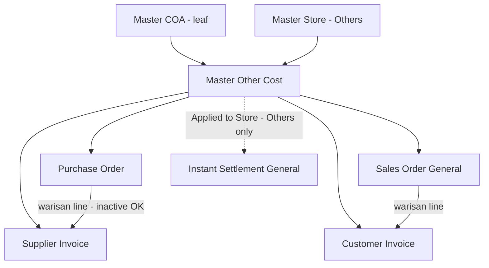

# Master Other Cost — Requirement Documentation

## 0. Metadata & Changelog

| Version | Date | Author | Changes |
|---------|------|--------|---------|
| 1.0 | 2026-06-23 | QA - Yemima | Konsolidasi requirement PM + verifikasi AS-IS codebase |
| 1.1 | 2026-06-23 | QA - Yemima | Klarifikasi QA atas V-30–V-35 & open items; tambah requirement Import TO-BE; selaraskan Code max 50 |
| 1.2 | 2026-06-23 | QA - Yemima | Konfirmasi PM atas open items; audit import AS-IS vs TO-BE (§4.4); cross-ref menu konsumen |
| 1.3 | 2026-06-23 | QA - Yemima | Koreksi: Applied Store import pakai **store name** (bukan code) — selaras codebase & form manual; batalkan IMP-01 |
| 1.4 | 2026-07-10 | QA - Yemima | Cross-ref: COA di Master = **default** untuk PI; override COA per baris di Purchase Invoice (§6) |

**Nama lain menu:** Other Cost, Master Other Cost  
**UI route:** `/omni/other-cost`  
**API prefix:** `omnichannel/other-cost/*`  
**Modul:** Finance Accounting → Master  
**Tabel utama:** `omni_other_costs`

---

## 1. Ringkasan Eksekutif

**Master Other Cost** adalah master data jenis biaya lain-lain yang memetakan **1 jenis biaya → 1 COA**. Data ini dipakai sebagai opsi biaya tambahan di transaksi pembelian/penjualan dan invoice, serta menentukan kolom `OC:` pada template **Instant Settlement (General)** — store tipe **Others** saja.

Setiap record baru otomatis memiliki `owned_by` = **company yang sedang login** saat create/import.

Menu terkait: [Instant Settlement](../accounting-settlement-upload/requirement.md), [Other Discount](../omni-other-discount/README.md).

### 1.1 Diagram relasi

> **Applied to Store** hanya relevan untuk settlement **General / Others**. Settlement platform (Shopee, TikTok, dll.) memakai mapping platform — bukan field ini.

---

## 2. Acceptance Criteria — Master CRUD (AS-IS)

### 2.1 Datalist

| ID | Kriteria | Status |
|----|----------|--------|
| A-01 | Global search, Show Deleted, Create, bulk delete, column show/hide, advanced filter | ✅ |
| A-02 | Show Deleted → baris soft-deleted tampil dengan keterangan deleted di Action | ✅ |
| A-03 | Kolom UI: Code, Name, Description, COA (1 kolom gabungan code+name) | ✅ **Accepted AS-IS** — tidak wajib 8 kolom terpisah |
| A-04 | Export active page only | ✅ |

### 2.2 Create / Edit

| ID | Kriteria | Status |
|----|----------|--------|
| A-10 | Code required, unique per company (`owned_by`), **max 50 karakter** | ✅ |
| A-11 | Code tidak boleh mengandung spasi | ❌ **Task dev** (O-01) |
| A-12 | `owned_by` = company login saat create | ✅ |
| A-13 | Other Cost COA: leaf, active, class **Expense** (form) — TO-BE selaraskan + Other Revenue & Expenses | ✅ AS-IS / ❌ O-08 task |
| A-14 | Active default Yes; inactive tidak di dropdown transaksi **baru** | ✅ (dropdown) |
| A-15 | Warisan PO→PI / SO→SI: line inactive tetap ikut | ✅ |
| A-16 | Data soft-deleted: **view only**, tidak bisa edit | ✅ |

### 2.3 Applied to Store

| ID | Kriteria | Status |
|----|----------|--------|
| A-20 | Radio All Stores / Applied Store; store Others + active only | ✅ |
| A-21 | Filter template Instant Settlement **General** per store | ✅ |
| A-22 | Applied to Store kosong → tidak masuk template settlement | ✅ |

### 2.4 Export & Audit

| ID | Kriteria | Status |
|----|----------|--------|
| A-30 | Export active page; kolom Applied to Store | ❌ **Task dev** (O-05) |
| A-40 | Audit Log slideover di Edit; 6 kolom standar | ✅ |

---

## 3. Validasi & Rules

### 3.1 Master Create/Update

| ID | Field | Rule (AS-IS) | Catatan |
|----|-------|--------------|---------|
| V-01 | `code` | `required`, `max:50`, unique per `owned_by` | O-02: ikuti max **50** (bukan 30) |
| V-02 | `name` | `required`, `max:50` | |
| V-03 | `expense_coa_id` | `required` (create); diproses di update tanpa entry di rules array | Lihat O-09 |
| V-04 | `description` | Tidak ada `max` di form API | **Task dev** (O-03) — TO-BE max 150 |
| V-05 | COA leaf | Tidak boleh punya child | `Selected COA must be smallest COA code.` |
| V-06 | Other Cost Owner | Global setting harus ada | `Configure global setting in section other cost owner.` |
| V-07 | COA `owned_by` | Harus match company login | |
| V-08 | `status` | Default Yes dari FE | |

**Manual test O-03 (description max 150 di form):**

1. Buka Create/Edit Other Cost.
2. Isi Description > 150 karakter (copy-paste teks panjang).
3. Klik Save.
4. **AS-IS expected:** request lolos (tidak ada error) — gap terdokumentasi.
5. **TO-BE expected:** error validasi `max:150` di response API + pesan di form.

### 3.2 COA — limitasi per channel

**Standar bisnis (TO-BE):** Class yang diizinkan = **Expense** + **Other Revenue & Expenses** (sama seperti import).

| Channel | COA Class (AS-IS) | TO-BE |
|---------|-------------------|-------|
| **Form UI** (`select2-expense`) | Hanya **Expense** | Tambah **Other Revenue & Expenses** — **task dev O-08** |
| **Import Excel** | Expense + Other Revenue & Expenses | ✅ Selaras standar |
| **API save** | Tidak cek class name — leaf + owner only | Pertahankan; andalkan dropdown/import |

Filter lain (semua channel): leaf, `status=1`, `owned_by` = company login.

### 3.3 Applied to Store

| Kondisi | `is_all_stores` | Pivot | Settlement General |
|---------|-----------------|-------|-------------------|
| All Stores | `1` | Pivot dihapus | Semua template Others (jika OC active) |
| Store spesifik | `0` | Sync pivot | Hanya store terpilih |
| Applied Store kosong | `0` | 0 pivot | **Tidak** masuk template |

**Scope bisnis:** Applied to Store **hanya** untuk Instant Settlement store tipe **Others**. Settlement platform memakai **Platform Account Mapping** — jika master Other Cost di-inactive, mapping dianggap tidak terbaca → **issue terpisah** untuk highlight peringatan di menu mapping (O-10).

### 3.4 Active / Inactive di transaksi

| Skenario | Perilaku |
|----------|----------|
| Input **baru** (dropdown) | Inactive **tidak muncul** di select2 — cukup untuk UX normal |
| Warisan PO→PI / SO→SI | Line **tetap ikut** (snapshot) meski master inactive |
| Instant Settlement General | Hanya Other Cost **active** |
| Instant Settlement Platform | OC inactive → mapping tidak terbaca; perlu highlight di mapping menu |

> **O-07 — Closed (accepted):** Tidak perlu enforce `status=1` di store API. Dropdown filter sudah cukup untuk input baru; warisan PO→PI memang harus tetap bisa mengambil line yang sudah ter-assign.

### 3.5 Rules tambahan (dikonfirmasi QA)

| ID | Rule | Penjelasan |
|----|------|------------|
| V-30 | **`owned_by` pada create** | Saat create/import, `owned_by` Other Cost = **company_id dari session/token login** saat itu. Data hanya milik company tersebut. |
| V-31 | **Auto-save on edit** | UX: ubah COA atau Active di halaman Edit langsung simpan — kemudahan input, bukan aturan bisnis. |
| V-32 | **Soft delete** | Delete tidak hapus fisik. Centang **Show Deleted Data** → baris muncul di datalist dengan label deleted (mis. "Deleted" / "already deleted"). |
| V-33 | **Company scope** | Query datalist & operasi CRUD difilter `owned_by` = company login. User **hanya melihat** Other Cost milik company yang sedang aktif di token Sanctum — tidak melihat data company lain. Field `is_all_company` selalu `0` (tidak dipakai di UI). |
| V-34 | **Store filter** | Picker Applied Store: Master Store tipe **Others** (`Platform::PL_OTHER`) + **status active** — selaras requirement PM. |
| V-35 | **Deleted = view only** | Record soft-deleted: halaman Edit **read-only** (`can_update = false`). Hanya bisa dilihat, tidak bisa diubah. |

### 3.6 Field Tariff (O-13 — diabaikan)

Kolom `tariff` di `omni_other_costs` — legacy field (kemungkinan rencana persentase/VAT). UI & API **tidak aktif**. **Tidak perlu action** sampai ada kebutuhan bisnis baru.

### 3.7 FormRequest class (O-12)

Saat ini validasi ada **inline** di `OtherCostController@store` / `@update`, bukan class `FormRequest` terpisah. O-12 = technical debt refactor ke `StoreOtherCostRequest` / `UpdateOtherCostRequest` agar konsisten konvensi Laravel & lebih mudah di-test — **bukan** perubahan behavior bisnis.

**O-09 — detail:** Di `update()`, array `$request->validate([...])` **tidak** memuat `expense_coa_id`, padahal logic update tetap memproses & memvalidasi COA (leaf, owner). Risiko: field tidak ter-cover rule Laravel standar; seharusnya ditambahkan ke rules array.

---

## 4. Fitur Import

> **Status:** Backend API ada (`OtherCostImport`); UI datalist **belum di repo FE** (testing via API/Postman atau branch dev). §4.1–4.3 = requirement TO-BE; §4.4 = audit AS-IS untuk QA sebelum go-live.

### 4.0 Background & Objective

Setup massal Master Other Cost via Excel: template standar, validasi ketat COA & Applied Store, laporan hasil per baris.

### 4.1 Gap AS-IS backend vs TO-BE (QA catatan)

| Aspek | AS-IS (`OtherCostImport.php`) | Sisa gap |
|-------|------------------------------|----------|
| UI Import / Download Template | Belum ada | AC 1–2 |
| Applied Store input | **Store name** (comma-separated) atau `All` | ✅ **Selaras** — sama dengan picker form manual (`store_name`) |
| Import mode | **All-or-nothing** | Open I-01 |
| Error message format | Wording berbeda dari draft PM | Polish copy (IMP-10) |
| Duplicate code in file | Dicek | ✅ |
| Code vs soft-deleted | Cek unique non-deleted only | Open I-02 |

### AC 1 — Tombol & Akses Import

- Tombol **Import** di datalist Master Other Cost
- Klik → modal/halaman import
- **Download Template** → `others_cost_template.xlsx`

### AC 2 — Struktur Template Excel

| # | Kolom | Wajib | Tipe | Aturan |
|---|-------|-------|------|--------|
| A | Code | Ya | Text | AC 3 |
| B | Name | Ya | Text | AC 3 |
| C | Other Cost COA | Ya | Text (Code COA) | AC 4 |
| D | Applied Store | Tidak | Text (**nama store**, koma, atau `All`) | AC 5 |
| E | Description | Tidak | Text | Max 150 — AC 6 |

### AC 3 — Validasi Code & Name

| Field | Validasi | Error Message |
|-------|----------|---------------|
| Code | Wajib | `Row [X]: Code cannot be empty.` |
| Name | Wajib | `Row [X]: Name cannot be empty.` |

> Tambahan TO-BE: Code **tidak boleh spasi** (selaras O-01), max **50** karakter.

### AC 4 — Validasi Other Cost COA

COA valid jika **semua** terpenuhi:

- Wajib diisi; input = **Code COA**
- Class: **Expense** atau **Other Revenue & Expenses**
- **Child account** (bukan parent)

| Skenario | Error Message |
|----------|---------------|
| Kosong | `Row [X]: Other Cost COA cannot be empty.` |
| Tidak ditemukan | `Row [X]: COA Code [Code] not found in master data.` |
| Class tidak diizinkan | `Row [X]: COA Code [Code] class is not allowed. Only Expense and Other Revenue & Expenses are permitted.` |
| Parent account | `Row [X]: COA Code [Code] is a parent account. Only child accounts are allowed.` |

### AC 5 — Validasi Applied Store

> **Input = nama store** (`store_name` di Master Store), bukan kode — konsisten dengan form manual & `StoreController@select2` (label = name). Matching **case-insensitive** (trim + uppercase).

- Opsional; kosong = berhasil (tidak ada pivot)
- Multi store: **nama** dipisah koma — contoh: `Toko Garment,Toko Fashion`
- `All` / `ALL` (case-insensitive) = semua store **Active** tipe **Others**
- `All` **tidak boleh** dikombinasi nama store lain — contoh gagal: `All,Toko Garment`

| Skenario | Error Message (AS-IS) |
|----------|----------------------|
| Kombinasi All + store | `ALL cannot be combined with other store names.` (via exception) |
| Nama tidak ditemukan / tidak eligible | `Row [X]: Store {name} was not found or is not eligible.` |
| Store bukan Others / inactive | Tercakup dalam "not eligible" (query: `status=1`, platform Others) |

| Skenario | Error Message (TO-BE — polish copy) |
|----------|-------------------------------------|
| Kombinasi All + store | `Row [X]: Applied Store cannot combine "All" with specific store names.` |
| Nama tidak ditemukan | `Row [X]: Store [Name] not found.` |
| Bukan tipe Others | `Row [X]: Store [Name] is not type "Others".` |
| Store inactive | `Row [X]: Store [Name] is inactive.` |

### AC 6 — Validasi Description

| Skenario | Error Message |
|----------|---------------|
| > 150 karakter | `Row [X]: Description must not exceed 150 characters.` |

### AC 7 — Proses Simpan

- Baris valid → insert ke `omni_other_costs` + pivot jika perlu
- `owned_by` = company login
- **Active = Yes** untuk semua hasil import

### AC 8 — Laporan Hasil Import

- Jumlah berhasil / gagal
- Detail error per baris (nomor baris + pesan)
- Open Item I-01: partial success vs all-or-nothing

### 4.2 Test Scenario Import

| # | Skenario | Expected |
|---|----------|----------|
| T01 | Klik Import | Modal/halaman import tampil |
| T02 | Download Template | `others_cost_template.xlsx`, 5 kolom AC 2 |
| T03 | 5 baris valid | 5 berhasil, Active = Yes |
| T04 | 1000+ baris valid | Selesai tanpa timeout |
| T05 | File .txt / .pdf | `Unsupported file type.` |
| T06 | Template kosong | `The file does not contain valid data.` |
| T07 | Code kosong | `Row [X]: Code cannot be empty.` |
| T08 | COA parent | Error AC 4 |
| T09 | COA class Assets | Class not allowed |
| T10 | COA tidak ada | COA not found |
| T11 | `All,Toko Garment` | Kombinasi All tidak diizinkan |
| T12 | `All` | Berhasil — all Others active stores |
| T13 | `Toko Garment,Toko Fashion` (nama valid) | Berhasil — 2 pivot store |
| T14 | Nama store tidak exist | Store not found / not eligible |
| T15 | Store platform | Not type Others |
| T16 | Applied Store kosong | Berhasil — optional |
| T17 | Description > 150 | Exceeds 150 characters |
| T18 | Description kosong | Berhasil |
| T19 | 5 valid + 2 error | Laporan sesuai mode (partial vs all-or-nothing) |
| T20 | Cek datalist setelah import | Cross-check 3–5 sampel |
| T21 | Laporan import | Jumlah & detail error jelas |

### 4.3 Open Items Import

| # | Item |
|---|------|
| I-01 | **All-or-nothing** vs **partial success**? AS-IS = all-or-nothing. AC 8 mengindikasikan partial — konfirmasi PO/BA. |
| I-02 | Uniqueness Code vs data existing termasuk soft-deleted? |
| I-03 | Limit maksimal baris per file? |
| I-04 | Validasi duplicate Code dalam 1 file — AS-IS sudah ada |

### 4.4 Audit Import AS-IS vs Requirement TO-BE (QA — siap test)

**Endpoint:** `POST /api/omnichannel/other-cost/import` (field `file_attachment`, xlsx/xls)  
**Supporting:** `GET .../import-history`, `GET .../import-log`, `GET .../check-import-log`

#### Ringkasan verdict

| Area | Siap test? | Catatan |
|------|------------|---------|
| Validasi COA class + leaf | ✅ Sebagian | Class & leaf OK; **tanpa filter `owned_by` COA** — IMP-03 |
| Validasi Code/Name/Description | ✅ Sebagian | Pesan error polish; no-space belum ada (O-01) |
| Applied Store (by **name**) | ✅ | Selaras form manual & `OtherCostImport` |
| Mode import | ⚠️ | All-or-nothing — IMP-06 / I-01 |
| UI + template download | ❌ | FE belum wired |
| Laporan error | ⚠️ | `row_number` null di log — IMP-07 |

#### Temuan bug / potensi bug (prioritas)

| # | Severity | Temuan | Dampak | File |
|---|----------|--------|--------|------|
| IMP-02 | **High** | `eligibleStoreQuery()` **tanpa filter company** | `ALL` atau lookup store bisa mencakup store company lain | `OtherCostImport.php` L277–284 |
| IMP-03 | **High** | Lookup COA **tanpa `owned_by`** company login | COA code duplikat antar company → bisa ambil COA salah | `OtherCostImport.php` L129–132 |
| IMP-04 | **Medium** | `ALL` set `is_all_stores=1` **dan** create pivot per store | Manual create All Stores **tanpa** pivot — perilaku settlement bisa beda | `OtherCostImport.php` L158–227 |
| IMP-05 | **Medium** | Import **tidak cek** Other Cost Owner (V-06) | Manual create ditolak tanpa setting; import bisa lolos | `OtherCostImport` vs `OtherCostController@store` |
| IMP-06 | **Medium** | **All-or-nothing** | 1 error → 0 row committed | `OtherCostImport.php` L198–200 |
| IMP-07 | **Low** | `OtherCostImportLog.row_number` selalu `null` | Laporan kurang rapi | L313–318 |
| IMP-08 | **Low** | Code uniqueness case-insensitive (import) vs case-sensitive (manual) | Inkonsistensi edge case | L105–108 |
| IMP-09 | **Low** | Code soft-deleted bisa di-import ulang | Konfirmasi I-02 | |
| IMP-10 | **Low** | Pesan file/type error wording | Copywriting | `OtherCostController@importExcel` |

> ~~IMP-01 (store code)~~ — **Dibatalkan.** Import memang by **store name**; requirement PM awal salah.

#### Checklist test API (tanpa UI)

Gunakan file xlsx dengan header persis: `Code | Name | Other Cost COA | Applied Store | Description`.

| Test | Input | Expected |
|------|-------|----------|
| T-API-01 | 1 baris valid, Applied Store kosong | Success, Active=1, no pivot |
| T-API-02 | Applied Store = `ALL` | Success, `is_all_stores=1` + pivot semua Others (IMP-04 — bandingkan manual) |
| T-API-03 | Applied Store = **nama store** valid (Others, active) | Success |
| T-API-04 | Applied Store = string random / platform store name | Gagal — not found or not eligible |
| T-API-05 | 1 valid + 1 invalid row | 0 row saved (all-or-nothing) |
| T-API-06 | COA parent | Error row |
| T-API-07 | COA class Assets | Error class |
| T-API-08 | Description 151 char | Error |
| T-API-09 | `All,Toko X` | Error kombinasi |
| T-API-10 | Duplicate code in file | Error row 2 |

#### Skenario manual O-03 (form — terpisah dari import)

1. Edit Other Cost → Description >150 karakter → Save.
2. **AS-IS:** lolos. **TO-BE (task dev):** error `max:150`.

---

## 5. Open Items Master (TO-BE / Gap)

| # | Item | Status | Catatan |
|---|------|--------|---------|
| O-01 | Code **tanpa spasi** — konsisten semua channel | **Task dev** | Form, API, import |
| O-02 | Max Code 30 vs 50 | **Closed** | Ikuti codebase: **max 50** |
| O-03 | `description` max 150 di form API | **Task dev** | Manual test §4.4 |
| O-04 | Kolom datalist 8 terpisah | **Closed** | Accepted AS-IS |
| O-05 | Export kolom Applied to Store (+ Active, Created) | **Task dev** | |
| O-06 | Import UI + template download + fix IMP-02–05 | **In progress** | §4 + §4.4 |
| O-07 | Enforce active di store API | **Closed** | Dropdown filter cukup; warisan PO→PI accepted |
| O-08 | Form COA: tambah **Other Revenue & Expenses** | **Task dev** | Selaraskan dengan import |
| O-09 | `expense_coa_id` di rules `update()` | Low / tech debt | §3.7 |
| O-10 | Highlight mapping platform jika OC inactive | **Issue raised** | Settlement platform behavior confirmed |
| O-11 | Applied to Store scope | **Closed** | Hanya settlement Others/General |
| O-12 | Dedicated FormRequest class | Low / tech debt | §3.7 |
| O-13 | Field Tariff legacy | **Ignored** | §3.6 |

---

## 6. Menu Konsumen — Cross-Reference

| Menu | Slug | Relasi ke Master Other Cost |
|------|------|----------------------------|
| Purchase Order | [supplychain-purchase-order](../supplychain-purchase-order/requirement.md) | Picker other cost di tab header; line `scm_purchase_order_other_costs`; warisan ke PI |
| Sales Order General | [sales-order-general](../sales-order-general/requirement.md) | Tab other cost; import sheet 2; settlement general |
| Customer Invoice (SI) | [accounting-customer-invoice](../accounting-customer-invoice/requirement.md) | Tab other cost; warisan dari SO |
| Supplier Invoice (PI) | [accounting-supplier-invoice](../accounting-supplier-invoice/requirement.md) | Tab other cost + from PO; **COA default dari master, editable override per baris** sebelum approve — [PI §8.3](../accounting-supplier-invoice/requirement.md#83-coa-editable-per-baris-change-req-2026-07) |
| Instant Settlement | [accounting-settlement-upload](../accounting-settlement-upload/requirement.md) | Template General: kolom `OC:{code}`; filter Applied Store — [§4.6](../accounting-settlement-upload/requirement.md) |
| Other Discount | [omni-other-discount](../omni-other-discount/README.md) | Master paralel (struktur serupa) |

**Prasyarat bersama:** Other Cost harus **active** untuk muncul di dropdown transaksi baru & template settlement. Inactive tetap valid untuk line warisan.

> **Catatan PI (v2.1):** Mengubah COA di Master Other Cost **tidak** mengubah baris PI yang sudah tersimpan. Sebaliknya, override COA di PI **tidak** mengubah master. Class COA di form master tetap dibatasi (Expense / ORev); di PI override memakai `select2/child` **tanpa** batasan class (hanya active + leaf).

---

## 7. Permission & Dependencies

- **Policy:** `OtherCostPolicy` → `MainPolicy`
- **Prasyarat create:** Other Cost Owner global setting (V-06)
- **COA:** Master Chart of Account — class Expense + Other Revenue & Expenses (TO-BE selaraskan di form)

---

## 8. QA Test Notes (ringkas)

1. Create → cek `owned_by` = company login (DB atau response).
2. Soft delete → Show Deleted → label deleted; buka Edit → read-only.
3. All Stores → template settlement General → header `OC: {code}`.
4. Warisan: PO + OC → inactive OC → buat PI dari PO → line OC tetap ada.
5. Import API: jalankan T-API-01–10 di §4.4 sebelum UI go-live.

---

## Related Documents

| Doc | Path |
|-----|------|
| Knowledge Base | [knowledge-base.md](./knowledge-base.md) |
| Technical | [technical.md](./technical.md) |
| Instant Settlement | [../accounting-settlement-upload/requirement.md](../accounting-settlement-upload/requirement.md) |
