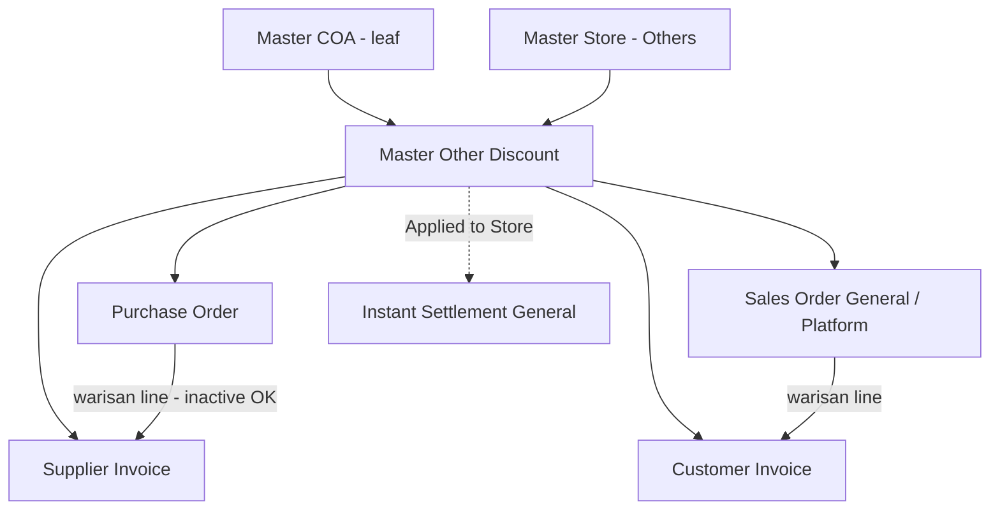

# Master Other Discount — Requirement Documentation

## 0. Metadata & Changelog

| Version | Date | Author | Changes |
|---------|------|--------|---------|
| 1.0 | 2026-06-23 | QA - Yemima | Konsolidasi requirement PM + verifikasi AS-IS codebase; selaraskan jawaban konsisten dengan [Other Cost](../omni-other-cost/requirement.md) |
| 1.1 | 2026-07-10 | QA - Yemima | Cross-ref: COA di Master = **default** untuk PI; override COA per baris di Purchase Invoice (§6) |
| 1.2 | 2026-07-17 | QA - Yemima | COA scope **sama Other Cost**: semua class + child-only (update req 17 Jul); O-08 = hapus filter class |

**Nama lain menu:** Other Discount, Master Other Discount  
**UI route:** `/omni/other-discount`  
**API prefix:** `omnichannel/other-discount/*`  
**Modul:** Finance Accounting → Master  
**Tabel utama:** `omni_other_discounts`  
**Menu pasangan:** [Master Other Cost](../omni-other-cost/requirement.md) — struktur & behavior identik; **COA scope sekarang sama** (semua class + child-only).

---

## 1. Ringkasan Eksekutif

**Master Other Discount** adalah master data jenis **potongan/diskon** yang memetakan **1 jenis diskon → 1 COA**. Dipakai sebagai opsi pengurangan nilai di transaksi pembelian/penjualan dan invoice, serta kolom `OD:` pada template **Instant Settlement (General)** — store tipe **Others** saja.

Setiap record baru otomatis memiliki `owned_by` = **company yang sedang login** saat create/import.

### 1.1 Perbedaan dengan Other Cost

| Aspek | Other Cost | Other Discount |
|-------|------------|----------------|
| Tujuan | Biaya **tambahan** (menambah nilai) | Potongan/**diskon** (mengurangi nilai) |
| Settlement header | `OC: {code}` | `OD: {code}` |
| **COA scope (TO-BE)** | Semua class + child-only | **Sama** — semua class + child-only |
| Struktur field, Applied Store, import, audit | Identik | Identik |

### 1.2 Diagram relasi

> **Applied to Store** hanya relevan untuk settlement **General / Others**. Settlement platform memakai **Platform Account Mapping**.

---

## 2. Acceptance Criteria — Master CRUD (AS-IS)

### 2.1 Datalist

| ID | Kriteria | Status |
|----|----------|--------|
| A-01 | Global search, Show Deleted, Create, bulk delete, column show/hide, advanced filter | ✅ |
| A-02 | Show Deleted → baris soft-deleted tampil dengan keterangan deleted di Action | ✅ |
| A-03 | Kolom UI: Code, Name, Description, COA (1 kolom gabungan code+name) | ✅ **Accepted AS-IS** — tidak wajib 8 kolom terpisah |
| A-04 | Export active page only | ✅ |

### 2.2 Create / Edit

| ID | Kriteria | Status |
|----|----------|--------|
| A-10 | Code required, unique per company (`owned_by`), **max 50 karakter** | ✅ |
| A-11 | Code tidak boleh mengandung spasi | ❌ **Task dev** (O-01) |
| A-12 | `owned_by` = company login saat create | ✅ |
| A-13 | Other Discount COA: leaf (child-only), active, **semua COA Class** | ⚠️ AS-IS form/import masih filter class — O-08 |
| A-14 | Active default Yes; inactive tidak di dropdown transaksi **baru** | ✅ (dropdown) |
| A-15 | Warisan PO→PI / SO→SI: line inactive tetap ikut | ✅ |
| A-16 | Data soft-deleted: **view only**, tidak bisa edit | ✅ |

### 2.3 Applied to Store

| ID | Kriteria | Status |
|----|----------|--------|
| A-20 | Radio All Stores / Applied Store; store Others + active only | ✅ |
| A-21 | Filter template Instant Settlement **General** per store | ✅ |
| A-22 | Applied to Store kosong → tidak masuk template settlement | ✅ |

### 2.4 Export & Audit

| ID | Kriteria | Status |
|----|----------|--------|
| A-30 | Export active page; kolom Applied to Store | ❌ **Task dev** (O-05) |
| A-40 | Audit Log slideover di Edit; 6 kolom standar | ✅ |

---

## 3. Validasi & Rules

> Jawaban konsisten dengan [Other Cost](../omni-other-cost/requirement.md) termasuk §3.2 COA scope (update 17 Jul 2026).

### 3.1 Master Create/Update

| ID | Field | Rule (AS-IS) | Catatan |
|----|-------|--------------|---------|
| V-01 | `code` | `required`, `max:50`, unique per `owned_by` | O-02: ikuti max **50** (bukan 30) |
| V-02 | `name` | `required`, `max:50` | |
| V-03 | `expense_coa_id` | `required` | Nama kolom legacy — isinya COA diskon |
| V-04 | `description` | Tidak ada `max` di create API; `max:150` di update | **Task dev** (O-03) — selaraskan create |
| V-05 | COA leaf (child-only) | Tidak boleh punya child di `CoaTree` | `Selected COA must be smallest COA code.` |
| V-05b | COA class | **Semua class diperbolehkan** (TO-BE) | AS-IS form/import masih filter — O-08 |
| V-06 | Owner COA | COA `owned_by` harus match company login (`getToken()->company_id`) | Pesan error masih menyebut "other cost owner" — O-14 |
| V-07 | `status` | Default Yes dari FE | |
| V-08 | Namespace Code | Unique **per menu** (`omni_other_discounts`) — **terpisah** dari Other Cost | Code sama boleh ada di OC & OD |

### 3.2 COA — scope class & child-only (update 17 Jul 2026)

**Standar bisnis (TO-BE) — sama Other Cost:** **Semua COA Class** diperbolehkan. Rule **child-only** tetap. Open item lama “apakah scope OD beda dari OC?” → **resolved: tidak beda**.

| Channel | COA Class (AS-IS verified) | TO-BE |
|---------|----------------------------|-------|
| **Form UI** (`select2-expense`) | **Expense** atau **Other Revenue & Expenses** (sama OC) | **Semua class** — hapus filter (**O-08**) |
| **Import Excel** | Expense + Other Revenue & Expenses | **Semua class** — hapus allow-list (**O-08**) |
| **API save** | Tidak cek class — leaf + owner only | Pertahankan |

**Child-only:** parent = id di `CoaTree.parent_id`. Enforcement: dropdown + `store`/`update` + import.

Filter lain (tidak berubah): leaf, `status=1`, `owned_by` = company login.

### 3.3 Applied to Store

| Kondisi | `is_all_stores` | Pivot | Settlement General |
|---------|-----------------|-------|-------------------|
| All Stores | `1` | Pivot dihapus | Semua template Others (jika OD active) |
| Store spesifik | `0` | Sync pivot | Hanya store terpilih |
| Applied Store kosong | `0` | 0 pivot | **Tidak** masuk template |

**Import Applied Store:** input = **nama store** (`store_name`), bukan kode — sama seperti Other Cost. Matching case-insensitive.

### 3.4 Active / Inactive di transaksi

| Skenario | Perilaku |
|----------|----------|
| Input **baru** (dropdown) | Inactive **tidak muncul** (`status=1` di select2) |
| Warisan PO→PI / SO→SI | Line **tetap ikut** meski master inactive |
| Instant Settlement General | Hanya Other Discount **active** |
| Instant Settlement Platform | OD inactive → mapping tidak terbaca; highlight di mapping menu (O-10) |

> **O-07 — Closed:** Dropdown filter cukup; warisan PO→PI accepted — sama Other Cost.

### 3.5 Rules tambahan (konsisten Other Cost)

| ID | Rule | Penjelasan |
|----|------|------------|
| V-30 | **`owned_by` pada create** | Company login saat create/import |
| V-31 | **Auto-save on edit** | Ubah COA / Active di Edit langsung simpan |
| V-32 | **Soft delete** | Show Deleted Data menampilkan baris deleted |
| V-33 | **Company scope** | Datalist & CRUD filter `owned_by` = company login |
| V-34 | **Store filter** | Picker: Others (`Platform::PL_OTHER`) + active |
| V-35 | **Deleted = view only** | Edit read-only jika soft-deleted |

### 3.6 Field Tariff (O-13 — diabaikan)

Kolom `tariff` di `omni_other_discounts` — legacy, UI/API tidak aktif.

### 3.7 FormRequest (O-12)

Validasi inline di `OtherDiscountController` — technical debt refactor ke FormRequest terpisah.

---

## 4. Fitur Import

> Backend API ada (`OtherDiscountImport`); UI datalist **belum di repo FE**. Testing via API.

### 4.1 Gap AS-IS vs TO-BE

| Aspek | AS-IS | Sisa gap |
|-------|-------|----------|
| UI Import / Template | Belum ada | AC 1–2 |
| Applied Store | **Store name** atau `All` | ✅ Selaras |
| COA class import | Expense + ORev (sama OC) | **O-08** — hapus filter; semua class |
| Import mode | All-or-nothing | I-01 |
| Other Discount Owner check | Import tidak cek (sama OC) | IMP-05 |

### AC 2 — Template Excel

| # | Kolom | Wajib | Tipe |
|---|-------|-------|------|
| A | Code | Ya | Text |
| B | Name | Ya | Text |
| C | Other Discount COA | Ya | Text (Code COA) |
| D | Applied Store | Tidak | Text (**nama store**, koma, atau `All`) |
| E | Description | Tidak | Text (max 150) |

### AC 4 — Validasi Other Discount COA

- Input = **Code COA**
- **Semua COA Class** diperbolehkan (TO-BE — hapus allow-list)
- Child account only
- AS-IS masih menolak class di luar Expense/ORev — dihapus bersama O-08

### AC 5 — Applied Store

Identik [Other Cost §4 AC 5](../omni-other-cost/requirement.md) — **nama store**, `All`, tidak boleh kombinasi `All` + nama.

### 4.4 Audit Import AS-IS

**Endpoint:** `POST /api/omnichannel/other-discount/import`  
**Supporting:** `GET .../import-history`, `GET .../import-log`, `GET .../check-import-log`

| # | Severity | Temuan | File |
|---|----------|--------|------|
| IMP-02 | High | `eligibleStoreQuery()` tanpa filter company | `OtherDiscountImport.php` |
| IMP-03 | High | Lookup COA tanpa `owned_by` | `OtherDiscountImport.php` |
| IMP-04 | Medium | `ALL` → `is_all_stores=1` + pivot (manual All tanpa pivot) | vs `OtherDiscountController@store` |
| IMP-05 | Medium | Import tidak cek owner COA seperti manual | |
| IMP-06 | Medium | All-or-nothing | |
| IMP-07 | Low | `row_number` null di log | |
| IMP-08 | Low | Code uniqueness case-insensitive (import) vs case-sensitive (manual) | |
| IMP-COA | **High** | Import masih allow-list Expense+ORev — TO-BE: **hapus** filter class (O-08) | `ALLOWED_COA_CLASSES` |

#### Checklist test API

Header: `Code | Name | Other Discount COA | Applied Store | Description`

| Test | Input | Expected |
|------|-------|----------|
| T-API-01 | Valid, Applied Store kosong | Success, no pivot |
| T-API-02 | Applied Store = `ALL` | `is_all_stores=1` + pivot semua Others |
| T-API-03 | Nama store valid | Success |
| T-API-07 | COA class **Asset** (leaf, active) | AS-IS: **gagal** (class filter) — **TO-BE: lolos** (O-08) |
| T-API-07b | COA class **Expense** leaf | AS-IS & TO-BE: **lolos** (class tetap boleh) |
| T-API-07c | COA **parent** | AS-IS & TO-BE: **gagal** (child-only) |

---

## 5. Open Items Master

| # | Item | Status | Catatan |
|---|------|--------|---------|
| O-01 | Code tanpa spasi | **Task dev** | Sama OC |
| O-02 | Max Code 30 vs 50 | **Closed** | Max **50** |
| O-03 | `description` max 150 di create API | **Task dev** | Update punya max:150; create belum |
| O-04 | Kolom datalist 8 terpisah | **Closed** | Accepted AS-IS |
| O-05 | Export kolom Applied to Store | **Task dev** | Sama OC |
| O-06 | Import UI + fix IMP-02–05 + O-08 | **In progress** | |
| O-07 | Enforce active di store API | **Closed** | Sama OC |
| O-08 | Hapus filter **COA class** di form + import — **semua class**; child-only tetap (**sama Other Cost**) | **Task dev** | Update 17 Jul; beda class vs OC **resolved: tidak beda** |
| O-09 | `expense_coa_id` di rules `update()` | Low | Tech debt |
| O-10 | Highlight mapping platform jika OD inactive | **Issue raised** | Sama OC |
| O-11 | Applied to Store scope | **Closed** | Settlement Others only |
| O-12 | FormRequest class | Low | Tech debt |
| O-13 | Field Tariff | **Ignored** | |
| O-14 | Pesan error "other **cost** owner" di controller diskon | Low | Copy-paste bug |

---

## 6. Menu Konsumen — Cross-Reference

| Menu | Slug | Relasi |
|------|------|--------|
| Purchase Order | [supplychain-purchase-order](../supplychain-purchase-order/requirement.md) | Tab other discount |
| Sales Order General | [sales-order-general](../sales-order-general/requirement.md) | Tab other discount |
| Sales Order Platform | `sales-order-general` / Omni SO | Tab other discount |
| Customer Invoice (SI) | [accounting-customer-invoice](../accounting-customer-invoice/requirement.md) | Tab + warisan SO |
| Supplier Invoice (PI) | [accounting-supplier-invoice](../accounting-supplier-invoice/requirement.md) | Tab + warisan PO; **COA default dari master, editable override per baris** sebelum approve — [PI §8.3](../accounting-supplier-invoice/requirement.md#83-coa-editable-per-baris-change-req-2026-07) |
| Instant Settlement | [accounting-settlement-upload](../accounting-settlement-upload/requirement.md) | Template General: `OD:{code}`; filter Applied Store — [§4.6](../accounting-settlement-upload/requirement.md) |
| Other Cost | [omni-other-cost](../omni-other-cost/requirement.md) | Master paralel |

**AR/AP:** Other Discount muncul **via Customer Invoice / Supplier Invoice** (line `accounting_*_other_discounts`), bukan field master langsung di header AR/AP.

> **Catatan PI (v2.1):** Override COA di Additional Discount PI tidak mengubah master. TO-BE master: semua class + child-only (**sama Other Cost**); di PI override memakai `select2/child` tanpa batasan class (active + leaf).

---

## 7. Permission & Dependencies

- **Policy:** `OtherDiscountPolicy` → `MainPolicy`
- **Prasyarat create:** Company login + COA `owned_by` match (V-06)
- **Global setting terpisah:** `OtherDiscountOwner` (`omni_other_discount_owners`) — untuk platform order automation; **bukan** gate create master (berbeda dari pesan error di controller)
- **COA:** Master Chart of Account — **semua class**, child-only (TO-BE O-08)

---

## 8. QA Test Notes

1. Create → `owned_by` = company login.
2. Code `DISKON_A` di Other Discount + `DISKON_A` di Other Cost → **keduanya boleh** (namespace terpisah).
3. Soft delete → Show Deleted → Edit read-only.
4. All Stores → settlement template → header `OD: {code}`.
5. Import: Applied Store pakai **nama store**, bukan kode.
6. **COA scope (O-08):** setelah fix — leaf dari class selain Expense/ORev (mis. Asset/Revenue) bisa dipilih; parent ditolak.

---

## Related Documents

| Doc | Path |
|-----|------|
| Knowledge Base | [knowledge-base.md](./knowledge-base.md) |
| Technical | [technical.md](./technical.md) |
| Other Cost (pasangan) | [../omni-other-cost/requirement.md](../omni-other-cost/requirement.md) |
