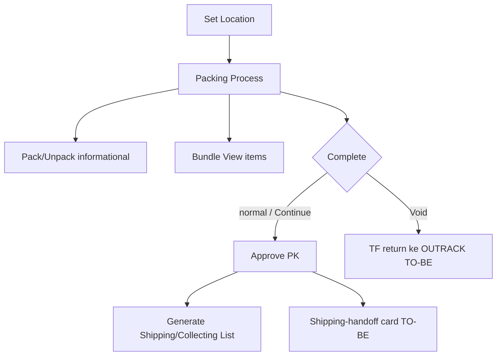

# Packing List — Requirement Documentation

**Modul:** SupplyChain / OmniChannel  
**UI:** `/omni/packing-list` · edit `/omni/packing-list/edit/:id` · set-location `/omni/packing-list/set-location/:id`  
**Audience:** PM, Warehouse Ops, QA  
**SoT:** `_meta/sot/omni-packing-list-source-of-truth.md` v1.0  
**Wireframe:** https://claude.ai/artifact/JmsKaAYDVR1F67iGj3SV5X

Related: [Checking List](../omni-checking-list/requirement.md) · [Process Summary](../omni-process-summary/requirement.md) · Sales Platform Void & Recreate · [Instant Settlement](../accounting-settlement-upload/requirement.md)

---

## 0. Changelog

| Version | Date | Author | Changes |
|---------|------|--------|---------|
| 1.1 | 2026-09-29 | QA - Yemima | Full process AS-IS + TO-BE handoff (table, bundle, shipping-handoff, void→outrack open A/B) |
| 1.0 | 2026-06-23 | QA - Yemima | Cross-ref Instant Settlement |

---

## 1. Ringkasan Eksekutif

Packing List = tahap **kemas** fulfillment. Setelah approve, sistem generate **Shipping/Collecting List** (bukan outbound — ETM-10761). Completion TO-BE = kartu **shipping handoff** (shipper + AWB) agar operator tahu drop parcel ke kurir mana.

| Kebutuhan | Jawaban |
|-----------|---------|
| Pack cepat | Pack per-row/bundle; Complete tidak diblok unpacked |
| Bundle | Header row + modal komponen |
| Handoff kurir | Shipper + 3PL WH + AWB di completion |
| Cancel di packing | Prompt Continue vs Void (manual only); void → TF balik OUTRACK (TO-BE) |

---

## 2. Prasyarat

| Prasyarat | Sumber |
|-----------|--------|
| Packing list dari checking / pipeline | Upstream CL |
| Location station bila null | `set-location` |
| AWB idealnya sudah ada saat complete | Process Summary / platform — TO-BE fallback jika kosong |

---

## 3. Alur

---

## 4. Pack / Unpack & Bundle

| Aturan | Expected |
|--------|----------|
| Pack granularity | Per row / **satu Pack per bundle header** |
| Complete gate | **Tidak** diblok unpacked items |
| Bundle di tabel | Header SKU + Bundle badge; **jangan** auto-expand komponen |
| View items | Modal `detail-bundle` + warning “changed on {date}” |

---

## 5. Approve (AS-IS side-effect)

1. Approve TF packing.  
2. Update duration + SO `processing_status` → Packed.  
3. Optional config `shipped_at.packing_approve` → call platform ship.  
4. Jika ada `so_voided` details → `generateTransferVoid`.  
5. Else → `generateShippingList` (Collecting). **Tidak** generate outbound di step ini.

---

## 6. Cancel / Void on Complete (TO-BE)

| Kondisi | Behavior |
|---------|----------|
| Skip Wave / Skip Processing | **Tanpa** prompt |
| Manual + platform `cancel` OR internal `void` | Non-blocking: Continue **vs** Void… |
| Continue | Approve normal → Collecting/shipping |
| Void only / Void & Clone | TF internal **auto-approved** mengembalikan barang ke **OUTRACK**; Void & Clone = Sales Platform flow |

### 6.1 Void TF destination (TO-BE vs AS-IS)

| | Destination |
|--|-------------|
| AS-IS | WH `PROCESS_GROUP_VOIDED_ORDER` (dari packing dest) |
| TO-BE | **OUTRACK** (post-picking), agar tidak stranded di virtual packing WH |

### 6.2 OPEN — origin void TF (putuskan dengan BE)

| Opsi | Origin → Dest | Catatan |
|------|---------------|---------|
| **A** | Virtual packing WH → OUTRACK | Sesuai wording wireframe; sejajar header packing dest = pack WH |
| **B** | Checking / last real → OUTRACK | Jika packing TF dianggap belum memindah stok |

**Status:** Pending decision — Yemima + BE. Jangan implement void-to-outrack tanpa opsi dipilih.

---

## 7. Completion = Shipping-handoff card (TO-BE)

Prioritas UI: header ready-to-ship · **banner shipper + service + 3PL WH** · AWB besar (+ barcode) · buyer/city/box/weight/items · note Collecting→DO→3PL · Back / Next Order · Print Shipping Label.  
Void variant: merah + kode TF return OUTRACK, tanpa banner ship.

**OPEN:** field shipper/AWB/weight mana yang guaranteed vs optional saat packing complete.

API: enrich `approve` response atau `GET packing-list/{id}/completion-summary`.

---

## 8. Set Location

Jika `location_id` null dan belum approved → Set Location → process (tidy layout TO-BE).

---

## 9. Relasi Instant Settlement

Packing belum approved / collecting-DO belum sampai Shipped → settlement V-04 gagal. Outbound settlement **tidak** otomatis dari approve packing (ETM-10761).

---

## 10. Acceptance Criteria (handoff)

- [ ] Table headers Status/Product/Qty/Packing Steps/Action; progress unpacked/to_pack  
- [ ] Pack informational; Complete tidak diblok  
- [ ] Bundle badge + View items modal; pack 1× di bundle row  
- [ ] Shipping-handoff completion (shipper/3PL/AWB) + void variant  
- [ ] Cancel/void prompt hanya manual; Continue vs Void/Clone  
- [ ] Void → TF auto-approved ke OUTRACK **setelah** keputusan Option A/B  
- [ ] Set Location tetap jalan; FE mock/test jika response shape berubah  

---

## 11. Non-goals

- Lane/cart concept (tidak ada di sistem)  
- Mengganti Process Summary sebagai tempat Get Resi utama (hanya fallback di handoff)  
- Generate outbound di approve packing (sudah dihapus ETM-10761)
