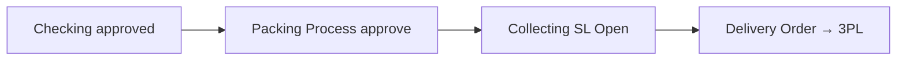

# Packing Process — Knowledge Base

## Apa itu

Approve **transfer internal** tahap packing (virtual WH `sequence = 3`) setelah checking. Setelah approve, sistem siapkan **Collecting / Shipping List** untuk Delivery Order.

**Bukan** [Packing List](../omni-packing-list/README.md) — List = pack/bundle/shipping-handoff. Process = approve TF stage.

## Alur

## Tips

- Auto-outbound saat packing **sudah dimatikan** — outbound dari settlement setelah Shipped.
- Order macet di packing → belum bisa Shipped → Instant Settlement gagal.
- Relasi Failed Ship: tahap #3 (PK) + trigger Collecting.

## Troubleshooting

| Gejala | Solusi |
|--------|--------|
| Tidak ada transfer packing | Checking belum approved / salah sequence |
| Settlement gagal | Cek sampai DO Shipped 3PL |

Detail: [requirement.md](./requirement.md) · [Packing List TO-BE](../omni-packing-list/requirement.md) · [Delivery Order](../supplychain-delivery-order/README.md)
