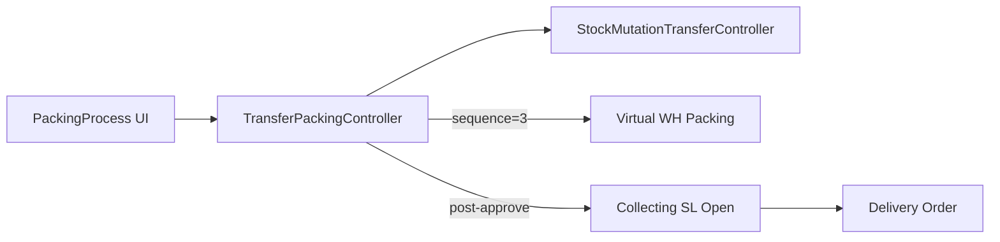

# Packing Process — Technical

**BE:** `Modules/OmniChannel/Http/Controllers/TransferPackingController.php` → `StockMutationTransferController`  
**API:** `omnichannel/transfer-packing/*`

## Architecture

Approve scoped ke destination warehouse **`sequence = 3`** (virtual Packing). `process_type` packing (`PROCESS_TYPE_PACKING`). Setelah approve, sistem menyiapkan Collecting / Shipping List (`PROCESS_TYPE_SHIPPING`) — prasyarat Delivery Order.

## Key behaviors

| Topic | Detail |
|-------|--------|
| Eligibility | destination `sequence = 3` |
| Upstream | Checking TF / Checking List complete |
| Downstream | Collecting SL → DO → Shipped 3PL |
| Auto-outbound | **Disabled** (ETM-10761) — outbound via settlement setelah Shipped |
| vs Packing List | List = pack/bundle/shipping-handoff UI; Process = approve TF stage |

## Related

[Packing List](../omni-packing-list/technical.md) · [Delivery Order](../supplychain-delivery-order/technical.md) · [Failed Ship](../supplychain-failed-ship/requirement.md)
