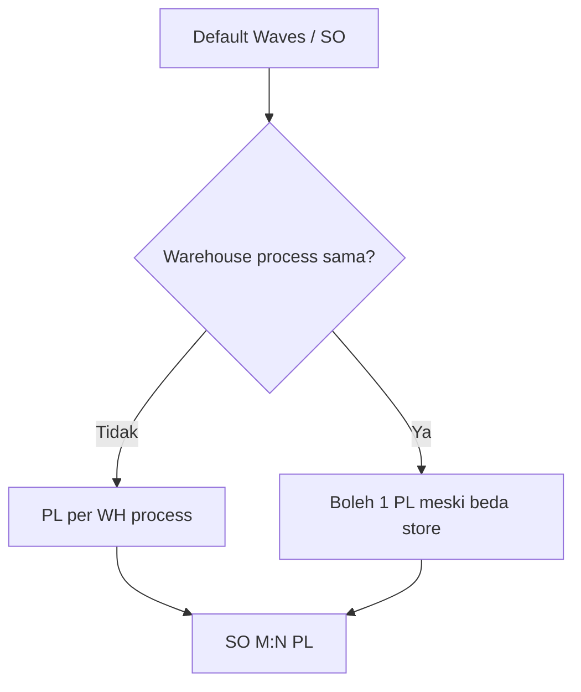

# Picking List — Requirement Documentation

**Modul:** SupplyChain / OmniChannel  
**UI route:** `/omni/picking-list` · process `/omni/picking-list/edit/:id`  
**Audience:** PM, Warehouse Ops, QA  
**SoT:** `_meta/sot/omni-picking-list-source-of-truth.md` v1.0  
**Related card:** [ETM-16131](https://erpintegration.atlassian.net/browse/ETM-16131) (TO-BE UI/UX process)

Related: [Manual Picking List](../supplychain-manual-picking-list/requirement.md) · [Skip Processing](../omni-skip-processing/requirement.md)

---

## 0. Changelog

| Version | Date | Author | Changes |
|---------|------|--------|---------|
| 1.0 | 2026-09-29 | QA - Yemima | Initial dari AS-IS Yemima + codebase; TO-BE ETM-16131 + gap building/multi-store |

---

## 1. Ringkasan Eksekutif

Picking List adalah transaksi **pick operasional**: generate dari Wave/SO, datalist untuk gudang, dan halaman process sampai Complete / Approved. Satu PL terikat **satu warehouse process**. Relasi SO↔PL **many-to-many**.

| Kebutuhan | Jawaban AS-IS |
|-----------|----------------|
| Lihat & filter PL | Datalist + Incomplete SO Picklist (POV order) |
| Kerjakan pick | Halaman process: Start → pick/unpick → Complete |
| Audit waktu | Start/End Picking + Time Duration |
| Beda pintu scan | Omni `/omni/picking-process` → redirect ke process yang sama (TO-BE) |

### 1.1 Batas scope menu

| In scope | Out of scope (menu lain / follow-up) |
|----------|--------------------------------------|
| Datalist + process PL `process_type` picking | Create Manual PL |
| Status Draft/Open/Approved + picking status | Full redesign process (ETM-16131 = TO-BE) |
| Generate rules WH process / M:N | Card terpisah: building dari WH process order |

---

## 2. Prasyarat

| Prasyarat | Sumber | Catatan |
|-----------|--------|---------|
| PL sudah tergenerate | Wave / fulfillment pipeline | Menu ini tidak create PL Omni |
| Login company yang punya PL | Auth / company | — |
| Hak akses menu Picking List | Gate / role | — |
| Untuk process: PL belum Complete | Trx Status | Approved = selesai |

---

## 3. Generate & banyak-ke-banyak (AS-IS)

| Aturan | Expected |
|--------|----------|
| Order beda warehouse process | Auto-split PL per WH process |
| Warehouse process sama | Boleh gabung 1 PL (termasuk multi-store) |
| Cardinality | 1 SO → N PL; 1 PL → N SO |

---

## 4. Datalist (AS-IS)

### 4.1 Toolbar

Global Search · Advanced Filter · pill Incomplete SO Picklist · Show deleted · Column show/hide · Export · Created By / Created At (default) · Action.

### 4.2 Kolom visible

Trx Code | Trx Date | Trx Ref (kode SO) | SO Total | Store Name | Building | Assignee | Start Picking | End Picking | Total SKU | Total Qty | Picking Status | Time Duration | Trx Status | Action.

Hidden (data): `transaction_date_sortable`, `name_formatted`, `end`, `total_quantity_formatted`, `picking_duration_formatted`.

### 4.3 Status matrix

| Picking Status | Time Duration | Trx Status | Trigger |
|----------------|---------------|------------|---------|
| `-` | `-` | Draft | Belum Start |
| In Progress | `{n} picked \| {m} unpicked` | Open | Setelah Start Picking (`start` terisi) |
| Paused | (mode pause) | Open | Pause AS-IS tersedia |
| Complete | Durasi start→end | Approved | Setelah Complete (`end` terisi) |

### 4.4 Incomplete SO Picklist

Filter / pill **POV order** (SO yang pick belum lengkap), **bukan** filter status dokumen PL.

---

## 5. Halaman process (AS-IS)

| Area | Behavior |
|------|----------|
| Kolom | Product · Location (+ stock) · Qty · Unit · aksi pick/unpick |
| Location | Inline edit hanya unpicked; picked read-only |
| Location options | Harus **same warehouse structure** (parenthies/building) — lihat Gap |
| Alur | Start → pick/unpick → Review Unpicked → Complete → Yay → Completion Summary |
| Incomplete SO | Pill / slideover POV order di dalam process |

Acceptance (AS-IS):

- [ ] Start Picking mengisi Start + ubah ke Open / In Progress  
- [ ] Complete mengisi End + Approved / Complete  
- [ ] Pick/unpick mengubah counter Time Duration  
- [ ] Location tidak editable setelah picked  

---

## 6. TO-BE — ETM-16131 (UI/UX process)

Sumber: handoff Melly + Artifact wireframe. **Tidak mengubah** generate PL / Manual PL (kecuali disebut).

| Screen | Acceptance ringkas |
|--------|-------------------|
| 1 Process | Qty default = full To Pick; location+stock+same-structure; checkbox save; Incomplete SO redesign |
| 2 Review Unpicked | Hanya Lost Stock / New PL; auto-create New PL; qty tidak editable di review |
| 3 Yay | Tanpa ignored items |
| 4 Completion Summary | Blok Orders (SO, qty, status); Complete + Print Packing List |
| 5 Incomplete SO | Slideover: Order No, Store, Status, Qty, items, Action; close X / click-out / Esc |

Bug in card: pill Incomplete SO count kosong.

---

## 7. TO-BE / Gap — datalist (di luar ETM-16131)

| ID | Requirement | Status |
|----|-------------|--------|
| GAP-PL-01 | Building = warehouse process dari **order**, bukan default store WH | Pending card |
| GAP-PL-02 | Multi-store: 1 cell + tooltip list; export comma-separated | Pending |

---

## 8. Relasi lintas menu

| Menu | Relasi |
|------|--------|
| Waves / Unassign / Skip Wave | Upstream generate & auto-process |
| Checking / Packing List | Downstream setelah pick |
| Manual Picking List | Entity sejenis, `process_type` & create beda |
| Omni Picking Process | Entry scan → process PL yang sama (TO-BE) |

---

## 9. Non-goals

- Menulis ulang pipeline Horizon / Skip Wave di dokumen ini  
- Menyatukan Manual PL sebagai satu menu dengan Omni PL  
- Menganggap building datalist sudah benar AS-IS (lihat GAP-PL-01)
