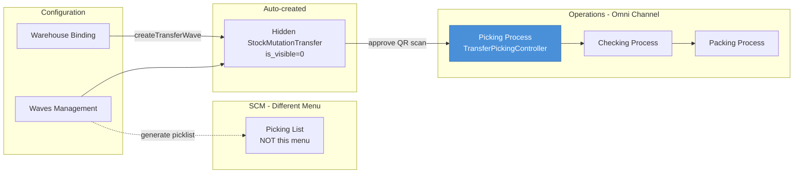
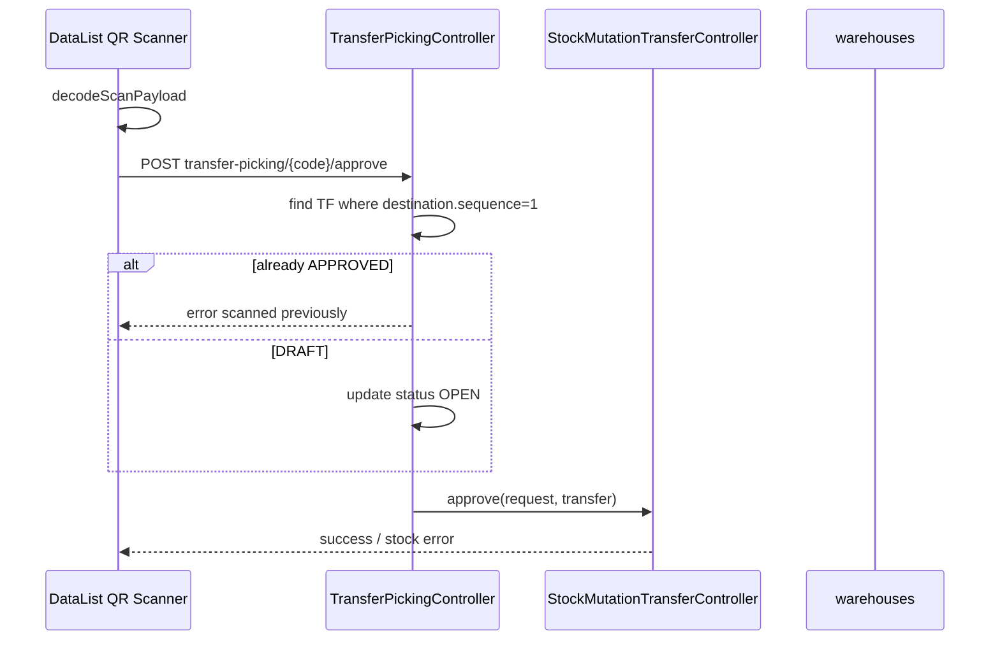

# Picking Process — Requirement Documentation

> **Status: DRAFT** — Dokumentasi AS-IS pertama (2026-06-19). Belum melalui review QA/PM.

## 0. Metadata & Changelog

| Version | Date | Author | Changes |
|---------|------|--------|---------|
| 1.0 | 2026-06-19 | QA - Yemima | Initial AS-IS draft |
| 1.1 | 2026-06-23 | QA - Yemima | Cross-reference Relasi Instant Settlement (Fase 2) |
| 1.2 | 2026-06-26 | QA - Yemima | Relasi Failed Ship — pergerakan stok tahap picking |

**UI route:** `/omni/picking-process`  
**API:** `omnichannel/transfer-picking/*`  
**Controller:** `TransferPickingController` → delegates to `StockMutationTransferController`

---

## 1. Ringkasan

**Picking Process** adalah menu operasional approve **Stock Mutation Transfer** internal yang destinasinya **virtual warehouse dengan `sequence = 1`** (wave buffer). `TransferPickingController` membungkus SCM transfer controller dengan scope picking. Approve dapat via **QR scan**, kode TF, kode SO, atau `platform_order_id`.

**Bukan** menu Picking List (`omni-picking-list`) — controller, route, dan use case berbeda.

---

## 2. Acceptance Criteria (AS-IS)

| ID | Kriteria |
|----|----------|
| A-01 | DataList transfer picking via wrapped `StockMutationTransferController@index` |
| A-02 | Hanya TF dengan `destination.sequence = 1` eligible approve |
| A-03 | QR scan decode → approve endpoint |
| A-04 | Approve DRAFT → auto OPEN sebelum approve |
| A-05 | Approve APPROVED → error "scanned previously" |
| A-06 | Resolve transfer by TF code, SO code, atau platform_order_id |
| A-07 | Approval eligibility check endpoint |
| A-08 | Approval log & audit trail |
| A-09 | Bulk print label template A |
| A-10 | Generate picklist bulk (by wave / SO / transfer detail) |
| A-11 | Skip processing mode (`mode=skip_processing`) untuk unassign wave flow |

---

## 3. Validasi & Rules

| ID | Rule | Trigger | Pesan |
|----|------|---------|-------|
| V-01 | Destination WH `sequence = 1` | approve lookup | Transfer not found |
| V-02 | Status DRAFT / OPEN / APPROVED only | approve query | — |
| V-03 | APPROVED cannot re-approve | approve | "This document has been scanned previously." |
| V-04 | DRAFT → OPEN on approve | pre-approve update | Status transition |
| V-05 | Stock eligibility | `mutationTransferApprovalEligibility` | SCM validation message |
| V-06 | Skip processing: SO `unassign_wave_status = PROCESSED` | mode skip | Complex guard + process_groups check |

---

## 4. Fitur & Behavior

| ID | Fitur | Trigger | Result |
|----|-------|---------|--------|
| F-01 | Index datalist | GET transfer-picking | Delegated index mode=1 |
| F-02 | Show detail | GET transfer-picking/{id} | TF header + details |
| F-03 | QR approve | POST approve + scan payload | Approve TF |
| F-04 | Manual approve | POST approve/{code} | Same |
| F-05 | Approval info | GET approve info | Stock lines preview |
| F-06 | Approval log | GET log/approve | History per TF |
| F-07 | Bulk print | POST print-bulk | LabelPrintController template_A |
| F-08 | Generate picklist | POST generate-picklist | PicklistService / jobs |
| F-09 | Tree detail | GET transfer-picking-detail/tree | Warehouse tree |

---

## 5. Diagram Relasi

### Sequence — QR Approve

---

## 6. Distinction vs Picking List

| Aspek | Picking Process | Picking List |
|-------|-----------------|--------------|
| Menu slug | `omni-picking-process` | `omni-picking-list` |
| Route | `/omni/picking-process` | `/omni/picking-list` |
| Controller | `TransferPickingController` | `PickingListController` |
| Dokumen | `StockMutationTransfer` | `PickingList` entity |
| Aksi utama | Approve transfer (QR) | Kelola daftar picking |
| Module manifest | OmniChannel | SupplyChain |

---

## 7. Permission

| Gate | Policy |
|------|--------|
| viewAny | `TransferPicked` |
| approval | `TransferPicked` approve ability |

---

## 8. QA Test Notes

- [ ] Scan QR valid TF → approved
- [ ] Scan ulang TF approved → error
- [ ] Approve by SO code → resolves correct TF
- [ ] TF dest sequence ≠ 1 → not in list / not approvable
- [ ] Eligibility fail → error message dari SCM
- [ ] Bulk print → label dengan AWB barcode height logic
- [ ] Generate picklist by wave → job dispatched

---

## 9. Known Gaps

- Skip processing log temporary — remove after validation (code comment)
- Bulk print contains commented auto-approve block — not active AS-IS

## Relasi Instant Settlement

**Dampak ke menu ini:** Picking Process adalah tahap **Pick** dalam rantai **Pick → Check → Pack → Collect → DO → Shipped WH 3PL**. Approve transfer picking memindahkan alokasi antar virtual WH — prasyarat agar tahap berikutnya (checking, packing, collecting) bisa jalan.

**Prasyarat dari menu ini agar settlement lolos:** SO sudah di wave; transfer picking (`sequence = 1`) siap di-approve; seluruh rantai processing harus selesai sampai Shipped sebelum baris order lolos validasi settlement.

**Independensi:** Approve picking **independen** dari accounting. Settlement tidak memicu atau revert picking — hanya membaca status akhir SO (Shipped) + stok.

**Detail alur bulk:** [Instant Settlement](../accounting-settlement-upload/requirement.md)

Tahap terkait (doc terpisah): Checking List/Process, Packing List/Process, Collecting — lihat [sales-order-general §2.4](../sales-order-general/requirement.md).

Diagram integrasi: [Instant Settlement §10](../accounting-settlement-upload/requirement.md#10-relasi-menu--integrasi).

---

## Relasi Failed Ship

**Posisi dalam rantai:** Picking = langkah **#1 approve** setelah in-wave virtual. Stok SKU berpindah dari rak fisik ke **Outrack** (virtual WH).

| Field / konsep | Nilai |
|----------------|-------|
| Dokumen | TF internal `process_type = picking`, prefix **PL** |
| Prasyarat FS | Bukan langsung — FS butuh seluruh rantai sampai `shipping do` approved (stok di 3PL) |
| Audit trail | Menu [Transfer Internal](../supplychain-mutation-transfer-internal/technical.md#8-relasi-failed-ship--rantai-fulfillment) + **Show Virtual** |

**Independensi FS:** Approve picking tidak terkait invoice/outbound. Jika order gagal kirim **setelah** Shipped, gunakan [Failed Ship](../supplychain-failed-ship/requirement.md) — bukan revert PL.

---

## Related Documents

| Doc | Path |
|-----|------|
| Knowledge Base | [knowledge-base.md](./knowledge-base.md) |
| Technical | [technical.md](./technical.md) |
| Waves Management | [../omni-waves-management/requirement.md](../omni-waves-management/requirement.md) |
