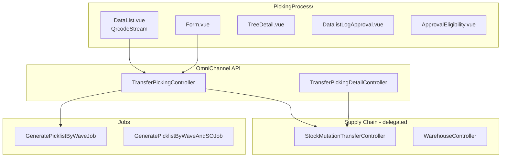

# Picking Process — Technical Documentation

> **Status: DRAFT** — Dokumentasi AS-IS pertama (2026-06-19). Belum melalui review QA/PM.

## 1. Architecture Overview

`TransferPickingController` adalah **thin wrapper** di atas Supply Chain `StockMutationTransferController` dengan filter picking (`index` param `1`) dan constraint approve `destination.sequence = 1`.



---

## 2. Frontend File Map

**Root:** `olshoperp-frontend/src/pages/Omni/PickingProcess/`

| File | Role | Key API |
|------|------|---------|
| `DataList.vue` | Grid + QR scanner (`vue-qrcode-reader`) | `GET omnichannel/transfer-picking` |
| `Form.vue` | Detail TF + approve | `GET/POST transfer-picking/{id}` |
| `HeaderBasicInformation.vue` | Header fields | show endpoint |
| `DatalistDetail.vue` | Line items | transfer-picking-detail resource |
| `TreeDetail.vue` | WH tree | `GET transfer-picking-detail/{id}/tree` |
| `DatalistLogApproval.vue` | Approval history | `GET .../log/approve` |
| `ApprovalEligibility.vue` | Pre-approve check | `GET .../approval-eligibility` |

**QR decode:** `@/utils/qrcodeReader` → `decodeScanPayload`

---

## 3. Backend File Map

| File | Role |
|------|------|
| `TransferPickingController.php` | Wrapper: index, show, approve, print, picklist |
| `TransferPickingDetailController.php` | Detail lines & tree |
| `SupplyChain/.../StockMutationTransferController.php` | Core TF logic |
| `Entities/TransferPicked.php` | Policy model |
| `Jobs/GeneratePicklistByWaveJob.php` | Async picklist |
| `Services/PicklistService.php` | Picklist generation |
| `Http/Controllers/LabelPrintController.php` | Bulk print template A |

---

## 4. API Routes

| Method | Path | Handler |
|--------|------|---------|
| GET | `transfer-picking` | `index` → SMTC index(1, true) |
| GET | `transfer-picking/{id}` | `show` |
| GET | `transfer-picking/{id}/audit` | `audit` |
| POST | `transfer-picking/{code}/approve` | `approve` |
| GET | `transfer-picking/{id}/approve` | `transferProcessApproveinfo` |
| GET | `transfer-picking/{id}/log/approve` | `transferProcessApprovalLog` |
| GET | `transfer-picking/approval-eligibility/{id}` | `transferProcessApprovalEligibility` |
| POST | `transfer-picking/print-bulk` | `bulkPrint` |
| POST | `transfer-picking/generate-picklist` | `generatePicklist` |
| POST | `transfer-picking/bulk-generate-picklist` | `bulkGeneratePicklist` |
| GET | `transfer-picking-detail/{id}/tree` | tree |

---

## 5. Approve Logic (AS-IS)

**Lookup order** (`approve` method):

1. By `code` + destination `sequence=1` + status DRAFT/OPEN/APPROVED
2. Fallback: by SO `code` on transfer_mutation_details
3. Fallback: by SO `platform_order_id`

**Pre-approve:**

```php
if ($transfer->transaction_status === MainModel::TS_DRAFT) {
    $transfer->update(['transaction_status' => MainModel::TS_OPEN]);
}
```

**Delegate:**

```php
(new StockMutationTransferController)->approve($request, $transfer);
```

**Guards:**

- `!$transfer` → "Please enter the transfer document number or the sales order number."
- `TS_APPROVED` → "This document has been scanned previously."

---

## 6. Virtual WH sequence=1

Hidden transfers dari `WaveController::createTransferWave`:

- `warehouse_origin` = WH process (physical)
- `warehouse_destination` = virtual WH (`process_group = wave`, child of process)
- Virtual WH created with `sequence = 1` in warehouse tree

Picking Process **only** lists/approves transfers where:

```php
->whereHas('destination', fn ($q) => $q->where('sequence', 1))
```

---

## 7. Generate Picklist Integration

`bulkGeneratePicklist` branches by `x_class`:

| x_class | Handler |
|---------|---------|
| `WaveController` | `bulkGeneratePicklistByWave` → `GeneratePicklistByWaveJob` |
| `WaveDetailProductController` | By wave SO detail |
| `WaveDetailTransferController` | By transfer detail |
| default | `bulkGeneratePicklistBySO` → `PicklistService` |

---

## 8. Database / Entities

| Entity | Table | Notes |
|--------|-------|-------|
| `StockMutationTransfer` | `stock_mutation_transfers` | Underlying document |
| `TransferMutationDetail` | pivot lines | SO detail reference |
| `Wave` | `omni_waves` | `transaction_reference_class` |
| `TransferPicked` | policy alias | Authorization |

---

## 9. Related menus (code reference)

| Menu | Controller | Do not confuse |
|------|------------|----------------|
| Picking Process | `TransferPickingController` | This doc |
| Picking List | `PickingListController` | `omni-picking-list` |
| Manual Picking List | SCM manual | `supplychain-manual-picking-list` |

---

## 10. Relasi Failed Ship

Picking adalah **tahap pertama yang di-approve** dalam rantai fulfillment menuju WH 3PL. Tanpa PL approved, checking/packing/collecting/DO tidak lanjut → order tidak **Shipped** → tidak eligible Failed Ship.

| Aspek | Nilai |
|-------|-------|
| `process_type` | `picking` |
| Prefix kode | **PL** |
| Pergerakan stok | Rack (fisik) → Outrack (virtual, `sequence = 1`) |
| Controller | `TransferPickingController` → `StockMutationTransferController@approve` |
| Referensi SO | `transaction_reference` pada header/detail TF |
| Lihat di TF Internal | Toggle **Show Virtual**, filter prefix PL |

**Rantai lengkap:** [Failed Ship requirement §3](../supplychain-failed-ship/requirement.md#3-pergerakan-stok-order--wave-hingga-3pl) · [Transfer Internal §8](../supplychain-mutation-transfer-internal/technical.md#8-relasi-failed-ship--rantai-fulfillment)

**Setelah Shipped (3PL):** Failed Ship memindahkan stok **dari** 3PL — bukan revert picking.
