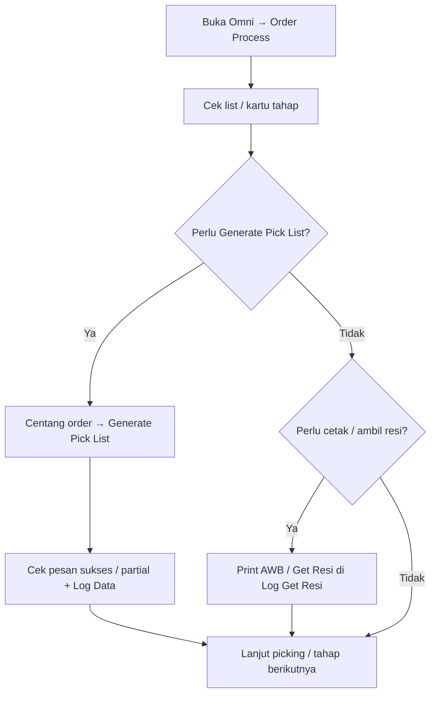

# Order Process — Knowledge Base (Operator)

**Audience:** Warehouse Operation / Fulfillment, Support  
**Route:** `/omni/process-summary`

---

## 1. Apa itu Order Process?

Order Process adalah **papan pantau** order yang sudah disetujui dan siap diproses gudang — baik yang masih menunggu kirim ke Default Wave maupun yang sudah masuk wave. Dari sini kamu bisa:

- Lihat di tahap mana order berada (picking, checking, packing, outbound, siap kirim)
- **Generate Pick List** banyak order sekaligus
- **Cetak resi** (platform / internal) dan **ambil ulang resi** (Get Resi)
- Cek log bulk dan log percobaan Get Resi

---

## 2. Kapan dipakai?

| ✅ Pakai jika | ❌ Jangan harapkan jika |
|---------------|-------------------------|
| Order sudah **approved** | Order masih draft/open |
| Mau pantau progress gudang dalam satu list | Order sudah dianggap **selesai seluruh pipeline** (hilang dari list) |
| Mau bulk Generate Pick List tanpa buka Waves Management | Order belum masuk wave manapun — bulk PL akan di-skip diam-diam |

---

## 3. Alur kerja standar

**Keterangan langkah:**

- **Kartu tahap:** filter list. Satu order bisa cocok lebih dari satu kartu. Klik ulang kartu aktif = hapus filter.
- **Kartu Complete:** saat ini selalu 0 / kosong — belum berfungsi penuh. Perbaikan sudah terdaftar.
- **Generate Pick List:** hanya floating bar (tidak ada tombol per baris di sini). Order harus sudah anggota wave; yang berflag instant processing dikecualikan.
- **Print Resi:** khusus order **platform**. Internal AWB menampilkan SKU sistem + lokasi rack asli.
- **Export:** hanya halaman aktif (maks ~100 baris), bukan seluruh hasil filter.

---

## 4. Kolom penting di list

| Kolom | Artinya |
|-------|---------|
| Availability / Processing Status | Warna stok + ikon tahap proses |
| Process / Total Duration | Lama tiap tahap dan total |
| Building | Gudang proses |
| Action | Print AWB, Print Internal AWB, Not Authorized, atau info akses kedaluwarsa |

Link **TRX. CODE** membuka form Sales Order (tab baru) untuk edit data order.

---

## 5. Print Resi & Get Resi

**Print AWB** = dokumen resi platform yang tersimpan.  
**Print Internal AWB** = format yang sama, daftar produk diganti data internal (SKU, qty, lokasi).

Tombol hilang / Not Authorized jika: bukan platform, belum ada file resi, wave belum “processed”, order dianggap cancel, atau barang sudah tercatat outbound.

Setelah ~7 hari, file resi lokal bisa dibersihkan otomatis → muncul info akses kedaluwarsa (belum ada hitung mundur “Expires in N days” di layar).

**Log Get Resi:** histori tiap percobaan ambil resi + tombol Get AWB untuk retry. Badge Success/Failed = jumlah percobaan, bukan jumlah order unik.

---

## 6. Log Data (Bulk Action Log)

Mencatat job **bulk** saja: Generate Pick List dan Bulk Get AWB — status sukses / sebagian / gagal, jumlah dipilih vs berhasil. Tidak mencatat print satuan atau retry per baris.

---

## 7. Troubleshooting

| Gejala | Penyebab umum | Solusi |
|--------|---------------|--------|
| Order tidak muncul | Belum approved / sudah selesai pipeline | Cek status di Sales Order |
| Print → Not Authorized | Belum resi, bukan platform, sudah outbound, dll | Get Resi dulu; cek tipe & tahap order |
| Bulk PL sebagian gagal | Order belum di wave / instant processing | Pastikan distribusi wave; cek Log Data |
| Resi gagal diambil | Status platform sudah lewat batas / store tidak push | Baca alasan di Log Get Resi, retry |
| Export sedikit baris | Hanya halaman aktif | Perbesar page length / export per halaman |
| Lazada tetap “kedaluwarsa” 7 hari | Aturan per-platform historis belum diterapkan | Semua platform ikut cleanup 7 hari saat ini |
| Kartu Complete selalu 0 | Fitur belum diisi | Abaikan kartu itu untuk sekarang |

---

## 8. FAQ

**Q: Harus send to Default Waves dulu baru muncul di sini?**  
A: Tidak. Approved saja sudah bisa muncul. Send to wave tetap perlu kalau mau ikut Bulk Generate Pick List.

**Q: Beda Log Data vs Log Get Resi?**  
A: Log Data = batch bulk. Log Get Resi = tiap percobaan ambil resi per order.

**Q: Beda Generate Pick List di sini vs Waves Management?**  
A: Di sini = bulk dari banyak order (grouping manual). Di Waves = generate per wave ikut aturan wave.
