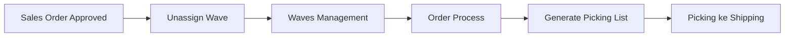
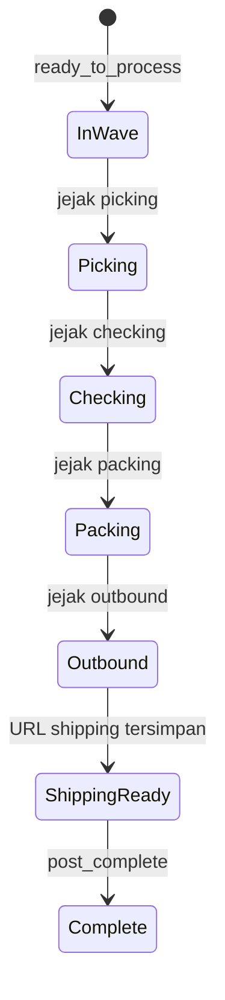
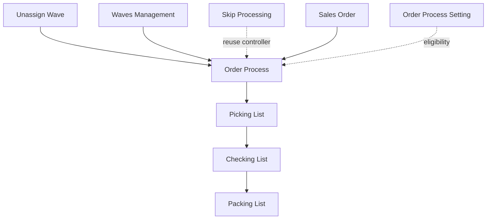

# Order Process — Requirement Documentation

**Modul:** SupplyChain / OmniChannel  
**Prefix:** `OP-`  
**Audience:** PM, Warehouse Ops, QA  
**UI route:** `/omni/process-summary`  
**SoT:** `order-process-source-of-truth.md` v1.2 (19 Jul 2026)

---

## 0. Metadata & Changelog

| Version | Date | Author | Changes |
|---------|------|--------|---------|
| 1.2 | 2026-07-20 | QA - Yemima | Initial 5-file dari SoT v1.2 + verifikasi TransferSummary / AWB / gaps |

---

## 1. Ringkasan Eksekutif

Order Process adalah **dashboard monitoring + aksi bulk** untuk Sales Order yang sudah siap proses gudang (`ready_to_process = 1`, belum `post_complete`). Populasi = gabungan order yang masih di Unassign Wave **dan** yang sudah di Default/priority wave — syarat minimum: sudah approved (flag siap proses). Operator: bulk Generate Pick List (di luar Waves Management), Print AWB (platform & internal), pantau Get Resi, dan Bulk Action Log.

| Kebutuhan | Jawaban Order Process |
|-----------|----------------------|
| Monitor pipeline gudang | Kartu filter tahap (overlap OK) |
| Bulk PL tanpa buka Waves | Floating bar Generate Pick List |
| Cetak / ambil resi | Print AWB, Print Internal AWB, Get Resi |
| Audit bulk | Bulk Action Log + Log Get Resi |

### 1.1 Rantai proses

Order bisa muncul di OP **sebelum** send to default waves. Send to wave **wajib** hanya untuk eligible Bulk Generate Pick List (§6.1).

---

## 2. Prasyarat

| Prasyarat | Sumber | Catatan |
|-----------|--------|---------|
| Order ready to process (set saat approve) | Sales Order | List: `ready_to_process = 1` dan `post_complete = 0` |
| Anggota wave (untuk Bulk PL) | Unassign Wave / Waves Management | Bukan syarat tampil list |
| Warehouse Structure / Binding | Master + Binding | Building, Get Resi, shipper |
| Order Process Setting | General Setting | Jalur wave / instant processing |

---

## 3. Siklus Status (kartu filter)

Kartu **bukan** FSM eksklusif — satu order bisa match beberapa kartu (jejak dokumen per tahap).

| Kartu | Kondisi | Overlap? | UI saat aktif |
|-------|---------|----------|---------------|
| All | Populasi dasar | — | Tanpa filter tahap |
| Picking / Checking / Packing / Outbound / Shipping Ready | Jejak tahap terkait | Ya | List terfilter |
| Complete | Tidak ada logic — GAP-OP-02 | — | Counter 0, list kosong |

Klik ulang kartu aktif → clear filter.

---

## 4. Datalist

### 4.1 Kolom visible default

| # | Kolom | Keterangan |
|---|-------|------------|
| 1 | TRX. CODE / PLATFORM ORDER | Link edit SO; copy |
| 2 | Store / Buyer | Truncate + tooltip; buyer platform masked |
| 3 | Shipper Service / Tracking | Tracking + copy |
| 4 | Availability / Processing Status | Ikon stok + tahap wave→ship |
| 5 | Process / Total Duration | XDays YHours ZMins |
| 6 | Total Weight / Dimensions | Gram; volume terbesar |
| 7 | Building | WH process; strip jika kosong |
| 8 | Buyer Notes / Address | Excerpt + tooltip |
| 9 | SO STATUS / PLATFORM STATUS | — |
| 10 | Action | Print AWB / Internal / Not Authorized / expired tip |

Hidden default (Columns / Advanced Filter): raw codes, **Picking List Reference** (max 2 link), Total SKU/Qty, dll. Checkbox kiri untuk bulk.

### 4.2 Fitur

| Fitur | Perilaku |
|-------|----------|
| Global Search / Advanced Filter | Server-side; Action tidak di AF |
| Columns Show/Hide | Unhide kolom hidden |
| Export | **Basic saja** — Active Page Only, max 100 baris, ikut filter/sort; tanpa checkbox/Action/Availability column; **tidak ada Export All** |
| Bulk selection | Floating bar Generate Pick List |
| Log Data | Slideover Bulk Action Log |
| Pills | Broken Products, Log Get Resi |

---

## 5. Form & Field

Bukan form create/edit. Interaksi:

| Panel | Input user | Catatan |
|-------|------------|---------|
| Bulk Generate Pick List | Checkbox rows | Tanpa field tambahan |
| Broken Products | Read-only | Defect products |
| Log Get Resi | Filter badge; Get AWB retry / bulk | — |
| Bulk Action Log | Read-only | Histori job bulk |

Edit entity SO lewat link TRX. CODE.

---

## 6. How It Works

### 6.1 Bulk Generate Pick List

1. Centang order → floating bar → Generate Pick List.  
2. Sistem group by keanggotaan wave; proses per wave.  
3. Exclude `instant processing`.  
4. Grouping = No Group / manual (beda dari rule Max Order/SKU/Weight di Waves).  
5. Sukses penuh / partial message; 1 baris Bulk Action Log.  
6. Order **belum di wave manapun** → skip diam-diam (GAP-OP-08).

Single Generate Pick List by wave = **Waves Management**, bukan menu ini.

### 6.2 Print Resi (AWB)

Hanya **order platform** (disengaja; key = platform order id).

Tombol tampil jika: `can_print` (platform + wave `processed` + “tidak cancelled”) **dan** dokumen resi masih ada (`has_outbound` false). Else: Not Authorized; jika URL pernah ada tapi file terhapus → tooltip akses kedaluwarsa.

| Format | Isi |
|--------|-----|
| Platform Resi | File/API platform tersimpan |
| Internal Resi | Resi dipangkas product list → SKU internal, Qty, Location (rack asli, bukan WH virtual) |

**Outbound gate:** `has_outbound` = ada qty `processed_to_out` di detail (bukan wajib header Approved) — GAP-OP-07 Resolved.

**Cancel check di `can_print`:** AS-IS bandingkan `platform_order_id` ke kode cancel — salah field (GAP-OP-03).

**Expire cetak:** cleanup file lokal seragam **7 hari** semua platform (GAP-OP-04); tidak ada countdown UI (GAP-OP-05). Gate **get** AWB per platform (status logistik) tetap ada (§7.3) — beda lapisan dari lama akses cetak.

### 6.3 Get Resi

Jalur: auto (job/observer, terutama masuk Default Waves + trigger platform), manual retry Log Get Resi, bulk floating bar / datatable.

- Cleanup path file setelah 7 hari (timestamp simpan dipertahankan).  
- Auto-download AS-IS partial vs requirement “pernah get sebelumnya” (GAP-OP-06).  
- Satu order bisa banyak baris log (retry). Badge Success/Failed = hitungan attempt.

### 6.4 Log Get Resi / Bulk Action Log

- **Log Get Resi:** per attempt (Success/Failed/Pending), Get AWB retry.  
- **Bulk Action Log:** per job bulk (Generate PL / Get AWB) — status Success / Partially Success / Failed; **bukan** single print/retry.

---

## 7. Validasi

### 7.1 Bulk Generate Pick List

| # | Kondisi | Behavior |
|---|---------|----------|
| V1 | Tidak ada terpilih | 0 out of 0 |
| V2 | Belum anggota wave | Skip diam-diam → partial |
| V3 | Instant processing | Exclude |
| V4 | Multi-wave | Proses per wave |
| V5 | Service gagal | Tidak masuk sukses |
| V6–V7 | Full / partial | Pesan sukses atau `{n} out of {m}` |

### 7.2 Print Resi

| # | Kondisi | Behavior |
|---|---------|----------|
| V8 | Tidak eligible / no doc / has_outbound | Not Authorized |
| V9 | File terhapus cleanup, timestamp ada | Tooltip kedaluwarsa |
| V10 | Empat syarat OK | Print AWB + Internal |

### 7.3 Get AWB

| # | Kondisi | Pesan (contoh) |
|---|---------|----------------|
| V11 | General SO | Unable to get AWB for general… |
| V12 | Cancelled | Unable to get AWB, {code} is cancelled |
| V13 | Tokopedia | not supported |
| V14 | Sudah punya AWB | already has AWB details |
| V15–V17 | Lewat gate Shopee / TikTok / Lazada | AWB can only be obtained before {code} |
| V18 | Store tidak push | Unable to get AWB for {store} |
| V19 | Bulk partial | `{n} AWBs successfully retrieved, {m} failed` |

---

## 8. Relasi Menu Lain

| Menu | Peran |
|------|-------|
| Unassign Wave / Waves Management | Hulu wave + single PL |
| Picking / Checking / Packing | Hilir dokumen |
| Skip Processing | Saudara, mode berbeda |
| Sales Order | Sumber + link edit |
| Order Process Setting | Wave / instant |

---

## 9. Gap Registry

| ID | Deskripsi | Severity | Status |
|----|-----------|----------|--------|
| GAP-OP-01 | Populasi list = ready_to_process (boleh belum di wave) — terkonfirmasi | — | Resolved |
| GAP-OP-02 | Kartu Complete hardcoded 0, query kosong | Medium | Open |
| GAP-OP-03 | `can_print` cancel cek `platform_order_id` bukan status | High | Open |
| GAP-OP-04 | Expire cetak seragam 7 hari, bukan per-platform historis | Medium | Open |
| GAP-OP-05 | Tidak ada label “Expires in N days” | Low | Open |
| GAP-OP-06 | Auto Get Resi trigger partial vs requirement | Medium | Open |
| GAP-OP-07 | `has_outbound` berbasis qty processed_to_out = sesuai bisnis | — | Resolved |
| GAP-OP-08 | Bulk PL silent skip non-wave; partial angka saja | Low | Open |
| GAP-OP-09 | Print Internal cek timestamp di field SO vs OtherInfo | Medium | Open |
| GAP-OP-10 | Badge Log Get Resi berpotensi tanpa company scope | High (kontingen) | Open — [VERIFY] multi-tenant |

---

## 10. FAQ

**Q: Approved tidak muncul?** Cek `ready_to_process` / sudah `post_complete` — bukan soal belum send wave.  
**Q: Print → Not Authorized?** Bukan platform, belum resi, wave belum processed, cancel, atau sudah outbound.  
**Q: Bulk PL partial?** Order belum di wave di-skip diam-diam (GAP-OP-08).  
**Q: Print AWB vs Internal?** Platform file vs product list internal + lokasi rack.  
**Q: Log Data vs Log Get Resi?** Bulk job vs per-attempt Get Resi.  
**Q: Complete = 0?** Placeholder (GAP-OP-02).  
**Q: Export sedikit?** Active page only, max 100.  
**Q: Lazada tetap expire 7 hari?** Ya AS-IS (GAP-OP-04).

---

## 11. Changelog (file)

| Version | Date | Changes |
|---------|------|---------|
| 1.2 | 2026-07-20 | Dari SoT v1.2 ke struktur qa-docs-standard |
