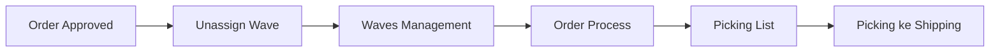

# Order Process — Panduan Pengguna

**Siapa yang baca panduan ini:** warehouse ops, fulfillment, support  
**Menu di sistem:** Omni → Order Process  
**Alamat:** `/omni/process-summary`

---

## 1. Apa Itu & Kenapa Penting

Order Process adalah **papan pantau** untuk order yang sudah disetujui dan siap diproses gudang. Dari satu layar kamu bisa melihat progress tahap, membuat picking list banyak order sekaligus, mencetak resi, dan memantau percobaan ambil resi.

Tanpa menu ini, operator harus bolak-balik antar Waves Management dan dokumen picking untuk memantau dan mencetak resi secara massal.

---

## 2. Overview Flow & Proses Bisnis

### Rantai proses

**Versi teks (tanpa diagram):**

1. Order **di-approve** → otomatis siap muncul di Order Process.
2. (Opsional tapi penting untuk Generate Pick List) order dikirim ke Default Wave lalu didistribusi di Waves Management.
3. Di **Order Process** kamu pantau tahap, bulk Generate Pick List, cetak/ambil resi.
4. Tim gudang lanjut picking → checking → packing → outbound → shipping.

🎬 [Interactive demo akan ditambahkan di sini]

### Filter tahap (kartu)

Kartu di atas list memfilter order menurut jejak dokumen (picking, checking, packing, outbound, siap kirim). Satu order bisa cocok lebih dari satu kartu. Kartu **Complete** saat ini belum berfungsi (selalu 0).

**Versi teks:** klik kartu = filter; klik ulang = hapus filter; **All** = seluruh populasi menu.

---

## 3. Sebelum Mulai (Flow Sebelum)

Pastikan:

- Order sudah **approved**.
- Untuk **Generate Pick List**: order sudah masuk wave (lewat Unassign Wave / Waves Management).
- Untuk **Print / Get Resi**: order tipe **platform** (bukan general), binding shipping & store siap push ke platform.
- Setting Order Process (jalur wave / instant processing) sudah dikonfigurasi tim terkait.

🎬 [Interactive demo akan ditambahkan di sini]

---

## 4. Setelah Selesai (Flow Sesudah)

- Setelah Generate Pick List sukses → lanjut di **Picking List** / proses gudang.
- Setelah cetak resi → serahkan ke packing/shipping sesuai SOP.
- Order yang sudah selesai seluruh pipeline hilang dari list Order Process.

🎬 [Interactive demo akan ditambahkan di sini]

---

## 5. Yang Perlu Diperhatikan

- Kalau kamu centang order yang **belum masuk wave**, Generate Pick List bisa “sukses sebagian” tanpa daftar order gagal per baris — cek angka di pesan dan Log Data.
- Order dengan jalur **instant processing** tidak ikut Generate Pick List di sini.
- **Print Resi** hanya untuk order platform. Kalau bukan platform, muncul Not Authorized.
- Kalau barang sudah tercatat outbound, tombol print tidak tampil.
- File resi lokal bisa dibersihkan otomatis setelah sekitar **7 hari** (semua platform) — lalu muncul info akses kedaluwarsa.
- **Export** hanya halaman yang sedang kamu lihat (bukan seluruh hasil filter), maksimal sekitar 100 baris.
- Log Data hanya mencatat aksi **bulk**, bukan print satuan atau retry satu baris.

---

## 6. Langkah-Langkah (Step by Step)

### A. Pantau order

1. Buka **Omni → Order Process**.
2. Pakai kartu tahap atau pencarian / advanced filter.
3. Cek kolom Processing Status dan Action.

### B. Bulk Generate Pick List

1. Centang satu atau banyak order.
2. Di floating bar, klik **Generate Pick List**.
3. Baca pesan sukses / partial.
4. Buka **Log Data** jika perlu rincian batch.

### C. Cetak / ambil resi

1. Pastikan order platform dan eligible (tombol Print tampil).
2. Klik **Print AWB** (resi platform) atau **Print Internal AWB** (SKU internal + lokasi).
3. Jika gagal / belum ada resi: buka **Log Get Resi** → **Get AWB** (satu atau bulk).
4. Setelah ~7 hari tanpa file, ikuti info akses kedaluwarsa — ambil ulang jika platform masih mengizinkan.

🎬 [Interactive demo akan ditambahkan di sini]

---

## 7. Tips & Hal yang Sering Bikin Bingung

- **Approved tapi tidak muncul** — cek apakah sudah dianggap selesai pipeline; bukan karena belum send to wave.
- **Bulk PL partial** — sering karena sebagian order belum di wave; cross-check manual masih diperlukan.
- **Print AWB vs Internal** — platform asli vs daftar produk internal.
- **Log Data vs Log Get Resi** — batch bulk vs tiap percobaan ambil resi.
- **Complete selalu 0** — kartu placeholder; jangan dipakai untuk filter completed.
- **Export sedikit** — naikkan jumlah baris per halaman, lalu export lagi.
- **Lazada tetap “expire” 7 hari** — aturan tanpa batas waktu historis belum diterapkan.

---

## 8. Referensi

| Butuh | Buka |
|-------|------|
| Aturan lengkap & gap QA | [requirement.md](./requirement.md) |
| Troubleshooting operator | [knowledge-base.md](./knowledge-base.md) |
| API, flag, job AWB | [technical.md](./technical.md) |

**Related menus:** [Unassign Wave](../omni-unassign-wave/) · [Waves Management](../omni-waves-management/) · Picking / Checking / Packing List · Skip Processing · Sales Order
