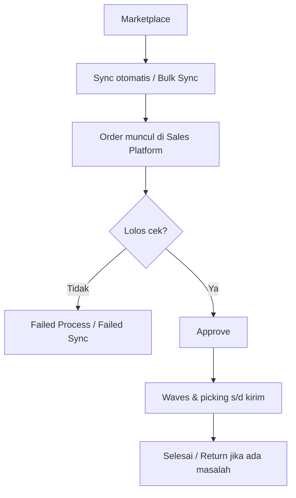

# Dev - Sales Platform — Knowledge Base

Halaman daftar order marketplace hasil sinkronisasi (Shopee, TikTok, Lazada, dll.). Order **tidak** dibuat manual di sini — tombol **Create** membuka Sales Order internal.

---

## 1. Apa itu & kapan dipakai

Pakai Sales Platform untuk:

- Memantau order yang sudah masuk dari toko online
- Melihat kenapa order gagal sync atau gagal proses (binding, stok, kurir, gudang)
- Melanjutkan approve → waves → packing → kirim
- Mengelola **Booking Shopee** (order cadangan tanpa nomor order buyer dulu)

---

## 2. Alur kerja standar

**Keterangan langkah:**

- **Sync** — sistem tarik order sesuai jadwal atau tombol Bulk Sync / Sync per baris.
- **Failed Sync** — order belum masuk sempurna; pakai Retry di pill **Order Failed Synchronize**.
- **Failed Process** — order sudah masuk tapi ada error (produk belum diikat, COA, stok, kurir, gudang).
- **Approve** — buka kunci proses gudang; bisa manual atau otomatis malam hari.
- **Return** — gabungan Sales Return dan/atau Failed Ship.

---

## 3. Membaca daftar & pill

| Pill / panel | Kegunaan |
|--------------|----------|
| **Failed Process** | Tampilkan order bermasalah + ikon error; hover untuk pesan |
| **Order Failed Synchronize** | Order gagal ditarik dari marketplace; ada alasan & tombol Retry |
| **Ready to Process** | Order tanpa error flag |
| **Order Synchronize Status** | Hari ini: berapa order di platform vs sudah masuk sistem per toko |
| **Log Data** | Riwayat batch sync (sukses/gagal/dilewati per toko) |

Ringkasan status di atas daftar (Sales Request → … → Complete / Return / Cancelled) saling eksklusif. Order **Rejected** saat ini tidak masuk ringkasan tersebut.

### Ikon proses gudang (Processing Status)

Urutan: Wave → Pick → Check → Pack → Collect → Ship.  
Abu = menunggu · Oranye = antre wave · Kuning = sedang dikerjakan · Hijau = selesai. Hover tiap ikon untuk teks status.

---

## 4. Booking Shopee

Order booking muncul dengan **Platform Order ID `-`** (kosong di sistem) dan **nilai sering 0**.

| Boleh / tidak | Penjelasan |
|---------------|------------|
| Approve & proses gudang **manual** | Boleh (ETM-13108) |
| Auto-approve malam hari | **Tidak** — booking dikecualikan |
| Get Resi / cetak label tanpa tracking | **Gagal** — sistem butuh tracking number untuk ship booking |
| Instant Settlement / unggah settlement | **Belum bisa** selama nomor order platform masih kosong — file settlement mencocokkan **No. Pesanan = Platform Order ID** |
| Approve booking = langsung buat invoice/jurnal revenue | **Tidak** — invoice marketplace datang lewat settlement setelah order match |

**Urutan yang benar:**

1. Booking masuk (Order ID `-`, amount 0) → boleh approve & siapkan gudang.
2. Pastikan **tracking / resi** tersedia agar ship booking tidak macet.
3. Tunggu **match buyer** → Platform Order ID terisi, biasanya amount ikut order reguler.
4. Selesaikan shipped (WH 3PL) → baru **Instant Settlement**.

Edit field booking (Other Information) dilakukan dari **All Sales Order**, bukan dari form list Sales Platform.

---

## 5. Sync & harga (yang perlu diketahui Ops)

- Toko harus **authorized** dan platform **Active**.
- Jadwal tarik order lebih jarang malam hari.
- **Order Sync Start Date** di Omni Setting membatasi order terlalu lama tidak ikut ditarik.
- Harga Shopee memakai harga diskon platform (bukan harga coret). Biaya/diskon tambahan dari label akun platform hanya info di SO — **tidak** ikut ke Sales Invoice.

---

## 6. Auto-approve

Sistem menjadwalkan approve massal tiap hari sekitar **19:00**. Order yang dicegah auto-approve antara lain: punya error flag, harga di bawah Benchmark COGS, booking, atau sudah ditandai cegah approve (misalnya setelah ganti produk). Pengaturan “menit delay” di Omni Setting saat ini **tidak** mengendalikan jadwal harian itu.

Kekurangan stok **tidak** menggagalkan approve otomatis; stok dicek terpisah setelahnya dan bisa muncul sebagai Failed Process.

---

## 7. Sales Return & Failed Ship

Kedua proses bisa membuat ringkasan **Return** di Sales Platform:

| Situasi | Menu yang dipakai |
|---------|-------------------|
| Barang gagal kirim / perlu dikembalikan dari alur kirim | **Failed Ship** |
| Retur/refund dari platform | **Sales Return** |

Pill di Failed Ship menonjolkan return platform yang **belum** outbound penuh. Daftar Sales Return platform boleh menampilkan order yang **sudah** outbound.

---

## 8. Troubleshooting

| Gejala | Penyebab umum | Solusi |
|--------|---------------|--------|
| Order tidak muncul | Start Date / platform Inactive / toko unauthorized | Cek Omni Setting, Store Binding, Sync Status |
| Pill Failed Sync isi | Produk belum sync, line kosong, toko unauthorized | Perbaiki master → Retry |
| Ikon bind / COA / warehouse | Binding atau setting gudang kurang | Ikat produk / lengkapi COA / set WH Process |
| Tidak auto-approve | Error flag, harga &lt; benchmark, booking | Perbaiki lalu approve manual atau tunggu retry error-approve |
| Booking: Get Resi gagal | Tracking number belum ada | Sync/ambil resi dulu; cek status booking di Shopee |
| Settlement: *Unable to find order* pada booking | Platform Order ID masih kosong | Tunggu match order → pastikan Order ID terisi, baru upload settlement |
| Create membuka form lain | By design | Gunakan Sales Order internal untuk order manual |

---

## 9. FAQ

**Apakah bisa edit harga setelah Approved?** Tidak — form terkunci.  
**Apa beda Log Data dan API Data Log?** Log Data = batch sync toko; API Data Log = payload/detail di form order (mis. escrow Shopee).  
**Kenapa Net Sales beda dengan invoice?** Biaya/diskon tambahan di SP tidak masuk Sales Invoice.  
**Approve booking amount 0 apakah langsung jurnal 0?** Tidak. Settlement baru jalan setelah ada Platform Order ID; biasanya amount sudah dari order yang sudah match.

---

## Related

- [Requirement](./requirement.md) · [Technical](./technical.md)
- [Failed Ship](../supplychain-failed-ship/knowledge-base.md) · [Sales Returns](../supplychain-sales-returns/knowledge-base.md)
- [Instant Settlement](../accounting-settlement-upload/knowledge-base.md)
