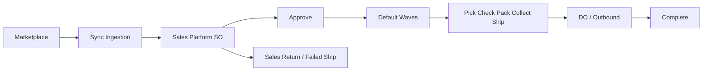
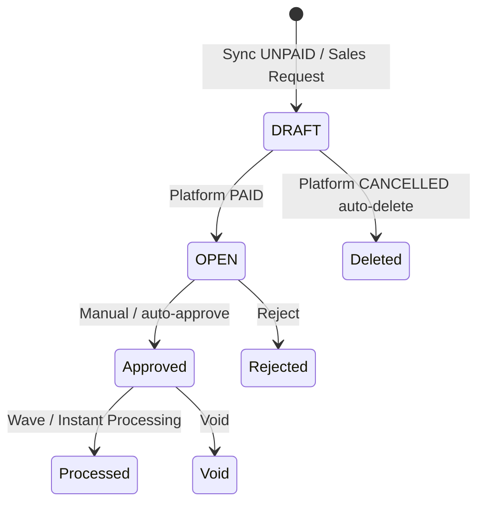
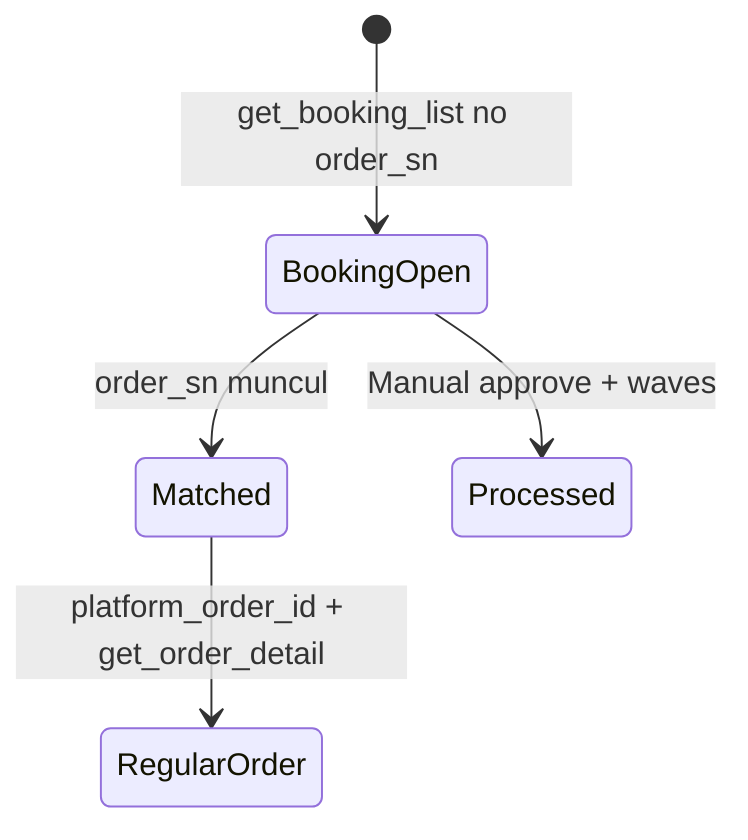
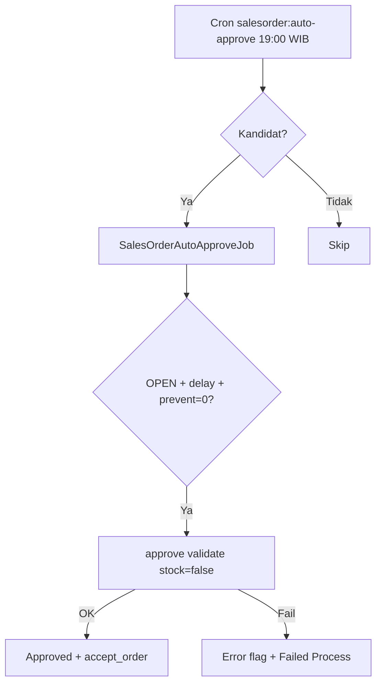
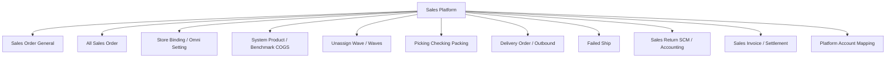
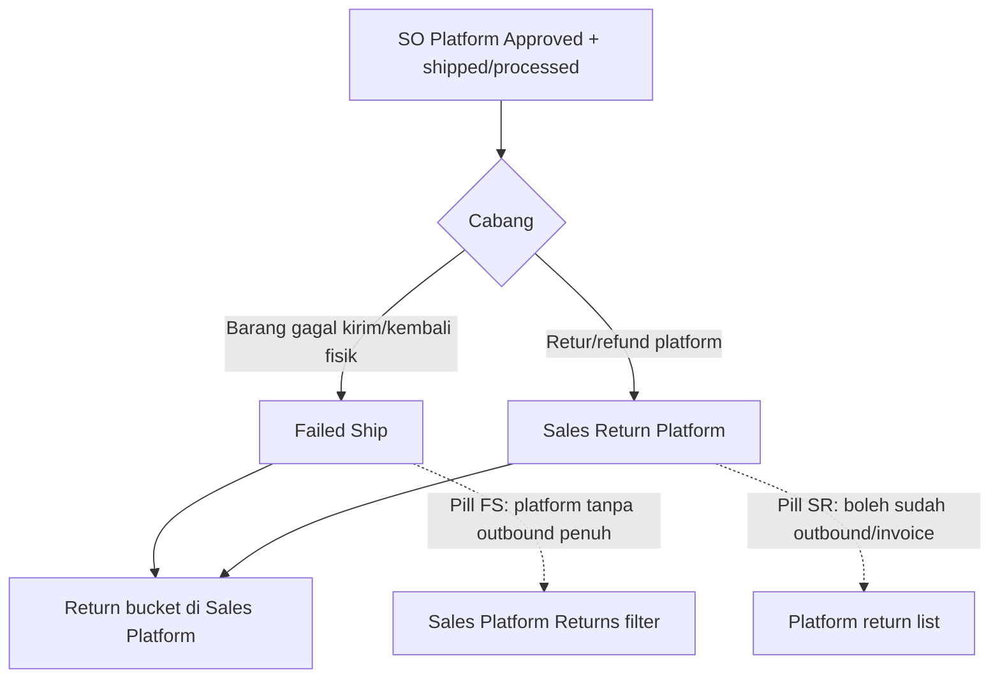

# Dev - Sales Platform — Requirement Documentation

**Modul:** OmniChannel  
**UI route:** `/omni/sales-order` · **type:** `platform`  
**Audience:** PM, Ops, QA  
**SoT:** 6 file `omni-sales-platform-*-source-of-truth.md` v1.0 (2026-07-15)  
**Status:** AS-IS verified + PM SoT merge · lihat §Gaps

---

## 0. Metadata & Changelog

| Version | Date | Author | Changes |
|---------|------|--------|---------|
| 1.1 | 2026-07-15 | QA - Yemima | GAP-BOOK-01: jalur Instant Settlement mitigasi jurnal 0; booking × tracking × settle (§3b, §5.6) |
| 1.0 | 2026-07-15 | QA - Yemima | Initial dari 6 SoT + codebase; gaps APR/SPL/SPD/BOOK/SYN; relasi return/FS |

---

## 1. Ringkasan Eksekutif

Sales Platform adalah datalist **read-only** untuk order marketplace hasil sync. **Bukan** create manual — tombol **Create** redirect ke Sales Order General.

| Kebutuhan | Jawaban SP |
|-----------|-----------|
| Monitoring sync & gagal proses | Pill Failed Sync / Failed Process / Log Data / Sync Status |
| Lanjut fulfillment | Approve → waves → 6 icon processing → Outbound/DO |
| Booking Shopee tanpa Order ID | SO OPEN amount 0; proses manual diizinkan (ETM-13108); settle/journal IS menunggu match Order ID |
| Margin guard | `prevent_auto_approve` jika Price Before VAT &lt; Benchmark COGS |

### 1.1 Rantai proses



---

## 2. Prasyarat

| Prasyarat | Sumber | Catatan |
|-----------|--------|---------|
| Store authorized + active | Master Store | Hanya store auth masuk Sync Status |
| Platform Active | Platform config | Inactive → **nol** API call |
| Warehouse Process | Store → fallback Omni Setting | Kosong → `warehouse-error` |
| Binding System Product | System Product | Owner product harus = store default owner |
| Order Sync Start Date (opsional) | Omni Order Settings | Order sebelum tanggal tidak di-sync |

---

## 3. Siklus Status

### 3a. Status internal SO



| Status | Editable detail? | Catatan |
|--------|------------------|---------|
| **DRAFT** | Ya (SKU/qty) | Ganti product → `prevent_auto_approve=1` |
| **OPEN** | Ya | Booking tetap OPEN amount 0 |
| **Approved** | Tidak | Read-only |
| **Rejected** | — | **Tidak masuk** summary bucket (GAP-SPL-01) |
| **Void** | Tidak | Bisa generate SO duplikat platform (lihat GAP-SPD-01) |

### 3b. Booking Shopee (sumbu terpisah)



**ETM-13108:** approve/waves **boleh** saat `platform_order_id` NULL. Booking **dikecualikan** dari auto-approve.

**Accounting / Instant Settlement (mitigasi GAP-BOOK-01):**

| Gate | Perilaku AS-IS | Efek ke jurnal revenue |
|------|----------------|------------------------|
| Approve SO Platform (termasuk booking amount 0) | **Tidak** auto-generate Sales Invoice / journal (beda dari POS) | Tidak ada jurnal di momen approve |
| Get Resi / ship booking (Shopee) | Gagal jika **tracking number** tidak didapat | Bottleneck utama sebelum label/ship platform |
| Fulfillment gudang (wave → … → Shipped WH 3PL) | Tidak hard-require `platform_order_id` di validasi approve | Booking unmatched **bisa** sampai shipped stok |
| Instant Settlement (store platform) | Match file by **`platform_order_id` only** | Booking unmatched (`NULL`) → *"Unable to find order"* → **tidak** generate SI/outbound/journal dari IS |
| Setelah match `order_sn` | `platform_order_id` + amount dari order reguler | Settle & journal memakai nilai order riil |

**Residual:** SI/journal amount 0 masih mungkin hanya jika dibuat/approve **manual** di luar Instant Settlement (bukan jalur utama Ops).

---

## 4. Form & Field (Order Detail)

Editable hanya **DRAFT/OPEN**: System SKU + SO Qty (inline). Setelah Approved: read-only.

| Area | Field penting | Wajib? | Sumber | Validasi |
|------|---------------|--------|--------|----------|
| Header | Trx Code, Platform Order ID | — | Sync | Booking → Platform Order ID tampil `-` |
| Header | Booking Number | — | Shopee booking | Temporary id sebelum match |
| Header | Warehouse Process | — | Store / Omni Setting | Kosong → warehouse-error |
| Header | Shipper Service | — | Binding shipping / platform name | Shipping-error jika belum bind |
| Detail | System \| Platform SKU | — | Binding | bind-error jika unbound |
| Detail | SO Qty / Platform Qty | — | Sync; SO Qty editable DRAFT/OPEN | Unit primary |
| Detail | Price / Disc / DPP / VAT / Total | — | Mapping sync | Lihat §6.3 |
| Detail | Price Before VAT, Benchmark COGS | — | Hidden default | Prevent auto-approve |
| Detail | Invoice Status / Failed Ship Status | — | Downstream docs | prepared / processed |
| Other | Buyer Name | — | Platform | Selalu disensor |
| Other | Additional Cost/Disc | — | Platform Account Label | Mapping only; **tidak** ke SI |

---

## 5. How It Works

### 5.1 Datalist — summary buckets (saling eksklusif)

Sales Request · Review · Processed · Shipment Ready · Delivered · Received · Complete · Return · Cancelled.

| Bucket | Definisi singkat |
|--------|------------------|
| Complete | Outbound **Approved** mereferensi SO |
| Return | Ada Sales Return **dan/atau** Failed Ship |
| Cancelled | Platform status mengandung `cancel` |
| Received | Shopee `TO_CONFIRM_RECEIVE`/`SHIPPED` atau TikTok `DELIVERED` (platform); internal ≈ Delivered |

**Rejected** tidak punya bucket → GAP-SPL-01.

### 5.2 Pill buttons

| Pill | Fungsi |
|------|--------|
| **Failed Process** | Filter SO dengan error flag + tampilkan kolom `error flag` |
| **Order Failed Synchronize** | Sub-datalist `omni_failed_sales_orders` + Retry |
| **Ready to Process** | Tanpa error flag |
| **Order Synchronize Status** | Panel Today: Platform SO Total vs Sync to OlshopERP |

#### Error flag icons (Failed Process)

| Flag | Icon FA | Tooltip inti |
|------|---------|--------------|
| `shipping-error` / `shipping-error-min-weight` | `truck` | Shipping / min weight |
| `bind-error` | `link-slash` | Unbinded / inactive product |
| `coa-error` | `share-nodes` | COA belum lengkap |
| `stock-error` | `boxes-stacked` | Stok kurang (+ WH Process tip) |
| `price-error` | `tag` | Price null |
| `bundle-error` | `flag` | Bundle detail kurang |
| `warehouse-error` | `warehouse` | WH process/stock belum set |
| *(unknown)* | `triangle-exclamation` | Fallback pesan API |

#### Processing Status — 6 icon

Wave (`circle-check`) → Pick (`cart-flatbed`) → Check (`list-check`) → Pack (`box-open`) → Collect (`box-archive`) → Ship (`truck-fast`). Warna: abu menunggu · oranye queue wave · kuning progress · hijau selesai. Collect/Ship tanpa kuning.

### 5.3 Log Data (batch sync)

Slideover: Store · Action (`Sync Order` / `Update Store` / `Revalidate Order`) · Description · Date · Success(=Created+Updated) · Failed · Skipped · Started · Ended · Updated By. ≠ API Data Log di form detail.

### 5.4 Sync ingestion

| Trigger | Catatan |
|---------|---------|
| Auto schedule | 05:59–18:00 tiap 5 mnt; 18:01–06:00 tiap 1 jam; lookback **48 jam** (TZ [VERIFY]) |
| Bulk Sync / Sync per order / Retry Failed | Manual |
| Webhook | Shopee & TikTok; Lazada **tanpa** webhook status |

**Order Sync Start Date:** order sebelum tanggal tidak masuk (semua trigger). Window start = max(Start Date, now−48h) sesuai delta.  
**Platform Inactive / Auto Sync OFF:** zero sync store → Log Action `Update Store`.

Outcome counters: Created / Updated / Skipped / Failed.

### 5.5 Price & mapping (sync)

| Platform | Rule harga unit |
|----------|-----------------|
| Shopee | **Selalu** `modal_discounted_price` (0 tetap 0; tanpa fallback original) |
| TikTok | `sale_price + platform_discount` ([VERIFY] NULL discount) |
| Lazada | Product price existing; **tanpa** pre-sale datetime |

Pre-sale time: Shopee `ship_by_date` · TikTok `shipping_due_time` · Tokopedia `preorder_deadline`.  
**Platform Account Label** → Additional Cost/Disc (info SO; **tidak** mengalir ke Sales Invoice). Label baru unmapped → sidebar dot.

### 5.6 Booking (Shopee)

- INSERT jika belum ada booking_number; UPDATE match saat ada `order_sn`.
- Manual Sync tanpa `platform_order_id` → `get_booking_detail` (bukan order detail).
- Datalist: Platform Order ID `-`; status dari `booking_status`.
- Manual edit field booking → **All Sales Order** Other Information (bukan form SP).
- **Resi/ship booking:** `shipSalesOrderBooking` / Get Resi gagal jika tracking number kosong.
- **Instant Settlement:** tidak menjaring booking unmatched; tunggu Platform Order ID terisi — lihat §3b + [Instant Settlement](../accounting-settlement-upload/requirement.md) (match `platform_order_id`).

### 5.7 Approval automation



**Kandidat auto-approve:** `transaction_date` > now−20 hari · OPEN · tidak cancel · `transaction_reference_id` NULL · `prevent_auto_approve=0` · **tanpa** detail error flags · **bukan** booking.

**Delay Omni + toggle Application Auto Approve:** UI menyebutnya kendali; **AS-IS cron mengabaikan keduanya** (GAP-APR-01). Delay tetap dicek di job; praktis lewat karena cron harian.

**Error-approve** (command terpisah): OPEN **dengan** detail error flags, `prevent_auto_approve=0`.

**Instant Processing** (Order Process Setting): Approved + default waves → auto Pick→…→Ship/DO jika ON.

### 5.8 Duplicate (dua perilaku)

| Trigger | Hasil | Catatan |
|---------|-------|---------|
| Icon Duplicate di detail | Clone ke SO **internal** (default store/shipping/company) | |
| Void via processing | SO **platform** baru, `platform_order_id` sama, nomor internal baru | GAP-SPD-01 — klarifikasi produk |

---

## 6. Validasi & Rules

### 6.1 Sync / ingestion

| ID | Rule | Trigger |
|----|------|---------|
| V-S01 | Platform Inactive → no API | Auto/Bulk/Webhook |
| V-S02 | Before Start Date → skip sync | Semua trigger |
| V-S03 | Bulk Sync anti-overlap lock | Bulk Sync |
| V-S04 | Failed sync → row Failed Synchronize | Sync fail |

### 6.2 Approve (manual & auto)

| ID | Rule | Pesan / efek |
|----|------|--------------|
| V-A01 | Harus OPEN, bukan cancel/void/closed | Block |
| V-A02 | Wajib punya detail (normal/random) | Block |
| V-A03 | Shipping bind + weight/dim | shipping-error |
| V-A04 | Warehouse process ada | warehouse-error |
| V-A05 | Bind / aktif / unit / COA / bundle children / price not null | bind/coa/bundle/price-error |
| V-A06 | Auto-approve: **tanpa** cek stok | Stock di evaluasi async `CheckOrderFlagsJob` |
| V-A07 | Price Before VAT &lt; Benchmark COGS → prevent | Tidak masuk kandidat cron |

### 6.3 Formula tampilan

```
Product Amount = (unit price × qty) − disc/item + VAT
Net Sales      = Product Amount + additional cost − additional disc
```

Additional cost/disc **tidak** masuk Sales Invoice → Net Sales ≠ nilai SI.  
[VERIFY] Total Price baris = extended only vs include disc/VAT (hindari double-count).

### 6.4 Invoice / Failed Ship status (detail)

`prepared` = dokumen belum approved · `processed` = approved. Σ qty per SKU ≤ qty order (primary unit). Cap gabungan Invoice+FS [VERIFY].

---

## 7. Relasi Menu Lain



| Menu | Fungsi & peran |
|------|----------------|
| **Sales Order General** | Create manual; Duplicate dari SP → SO general — doc: [sales-order-general](../sales-order-general/requirement.md) |
| **All Sales Order** | Gabungan monitoring + Failed Process lintas tipe + edit booking Other Info — doc: [all-sales-order](../all-sales-order/requirement.md) |
| **Store Binding** | Auth, WH Process/Stock, Auto Sync ON/OFF |
| **Omni Order Settings** | Delay auto-approve (diabaikan AS-IS), Start Date sync |
| **Application Order Process** | Auto Approve toggle (banner only), Process to Wave, Instant Processing |
| **System Product / Benchmark COGS** | Binding + snapshot COGS prevent approve |
| **Platform Account Mapping** | Label → Additional Cost/Disc + settlement |
| **Unassign Wave / Default Waves** | Pasca approve jika Process to Wave / Instant |
| **Picking → Checking → Packing → Collect → Ship** | 6 icon Processing Status |
| **Delivery Order / Outbound** | End pipe; Complete bucket = Outbound Approved |
| **Failed Ship** | Failed Ship Status; bersama SR → Return bucket; pill Returns di FS index |
| **Sales Return (SCM/Omni)** | Return platform; qty cap vs SO; boleh setelah outbound (beda pill FS) |
| **Sales Return (Accounting)** | Jurnal/retur keuangan jika applicable |
| **Sales Invoice / Upload Settlement** | Invoice Status; SI tanpa additional cost/disc SP; Settlement butuh Shipped WH 3PL + match `platform_order_id` (booking unmatched tidak ikut) |

### 7.1 Flow Sales Return & Failed Ship dari SP



| Aspek | Failed Ship | Sales Return Platform |
|-------|-------------|----------------------|
| Sumber order | SO platform (processing/shipped) | SO / return API platform |
| Status di detail SP | Failed Ship Status prepared/processed | Ikut dokumen SR |
| Bucket SP **Return** | Ya (ada FS dan/atau SR) | Ya |
| Pill index FS | Fokus **belum** outbound penuh | — |
| Pill SR platform | — | Boleh **sudah** outbound (+ invoice ref) |
| Qty | ≤ qty SO − invoice/FS overlapping [VERIFY] | available return qty |

Detail: [Failed Ship §4.0.5](../supplychain-failed-ship/requirement.md) · [Sales Returns §4.3](../supplychain-sales-returns/requirement.md)

---

## 8. Gap Registry

| ID | Deskripsi | Dampak | Status |
|----|-----------|--------|--------|
| **GAP-APR-01** | Delay + Auto Approve toggle diklaim kendali; cron 19:00 mengabaikan keduanya | Docs/ops salah asumsi | Open |
| **GAP-SPL-01** | Rejected tidak masuk summary bucket | Blind spot monitoring | Open (temp by design) |
| **GAP-SPD-01** | Dua mekanisme Duplicate (internal vs void-platform) belum diklarifikasi | Bingung usage | Open |
| **GAP-BOOK-01** | Approve booking amount 0 — risiko jurnal 0 via **Instant Settlement** hampir tertutup (null `platform_order_id` tidak match; approve SP tidak buat SI). Residual: SI manual amount 0 | Accounting | **Accepted residual** (verified 2026-07-15) |
| **GAP-SYN-01** | Optimasi skip-sync Shopee (cancel/complete, dll.) belum diimplementasi | API waste | Open |

**[VERIFY: CODEBASE] terbuka:** TZ interval sync; Start Date global vs store; Bulk Sync residual; Instant Processing timing vs Complete; Total Price composition; Invoice∪FS caps; bind-error owner mismatch; Buyer Name censor scope; TikTok NULL discount; auto-delete soft/hard.

---

## 9. Acceptance Criteria (ringkas)

- [ ] Datalist read-only; Create → Sales Order General
- [ ] 9 bucket eksklusif; Rejected tidak di bucket
- [ ] Failed Process icons + Failed Sync retry
- [ ] Log Data batch vs API Data Log terpisah
- [ ] Booking NULL id processable; excluded auto-approve; IS tidak match hingga Order ID ada
- [ ] Auto-approve 19:00 filters + validate tanpa stock
- [ ] prevent_auto_approve saat PbV &lt; Benchmark COGS
- [ ] Additional cost/disc tidak ke SI
- [ ] Return bucket = SR dan/atau FS

---

## 10. FAQ

**Q: Kenapa Create membuka form lain?**  
A: SP hanya menampilkan hasil sync; create manual = Sales Order General.

**Q: Kenapa delay Omni tidak terdengar?**  
A: AS-IS cron harian 19:00 — GAP-APR-01.

**Q: Booking tanpa Order ID bisa di-proses?**  
A: Ya (manual approve + gudang). Auto-approve tidak mengambil booking. Tracking kosong memblok Get Resi/ship booking. Instant Settlement **belum** bisa men-settle sampai Platform Order ID terisi (setelah match buyer/`order_sn`).

**Q: Approve booking amount 0 apakah langsung jurnal revenue 0?**  
A: Tidak lewat jalur normal. Approve platform tidak auto-SI; Instant Settlement butuh `platform_order_id`. Setelah match, amount biasanya sudah dari order reguler.
