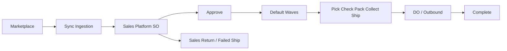
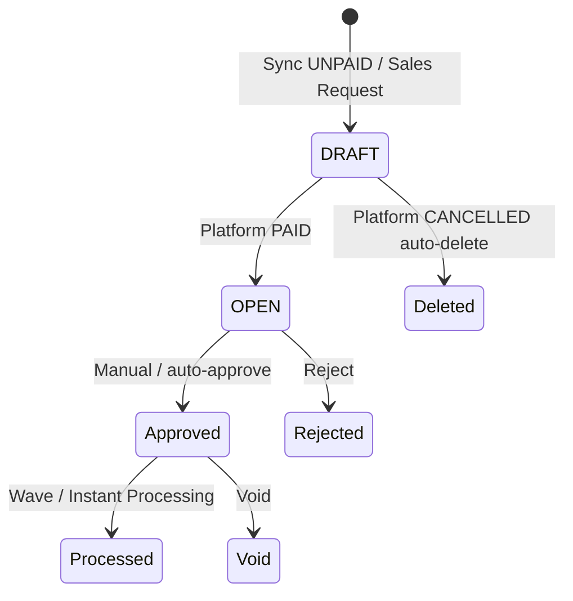
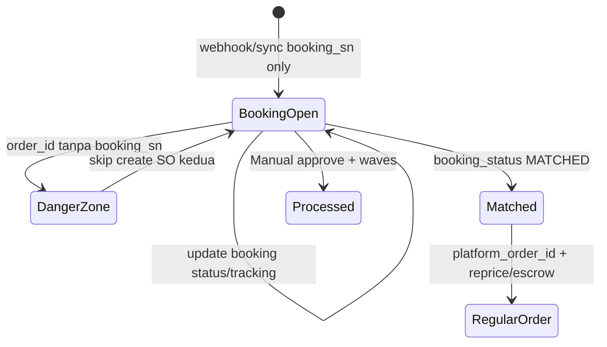
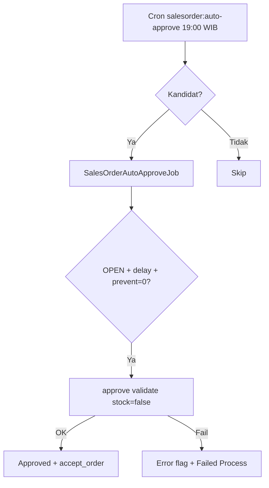
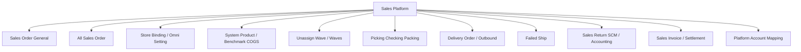
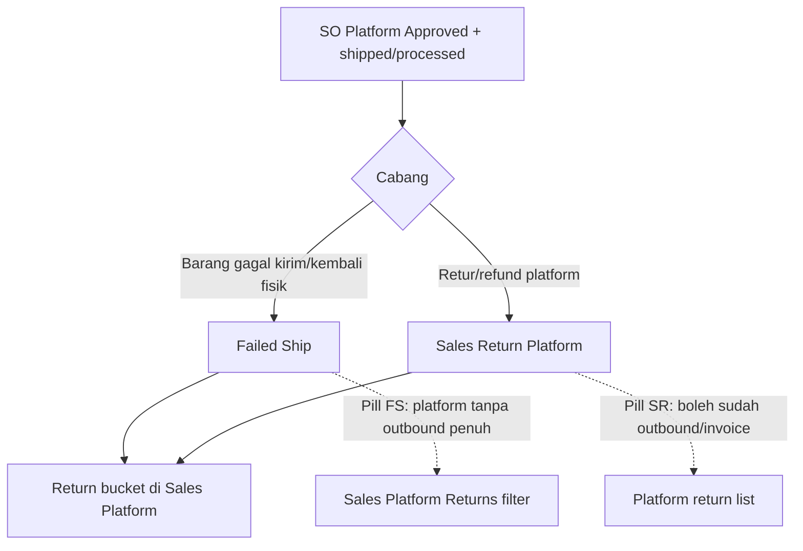

# Dev - Sales Platform — Requirement Documentation

**Modul:** OmniChannel  
**UI route:** `/omni/sales-order` · **type:** `platform`  
**Audience:** PM, Ops, QA  
**SoT:** 6 file `omni-sales-platform-*-source-of-truth.md` (booking v1.1)  
**Status:** AS-IS verified + PM SoT merge · lihat §Gaps  
**Jira (edit detail TO-BE):** [ETM-15749](https://erpintegration.atlassian.net/browse/ETM-15749) · pasangan ASO [ETM-15748](https://erpintegration.atlassian.net/browse/ETM-15748)

---

## 0. Metadata & Changelog

| Version | Date | Author | Changes |
|---------|------|--------|---------|
| 1.10 | 2026-09-04 | QA - Yemima | TO-BE Log Data §5.3.1: tab **Pending Orders** + pill **Unmatched Bookings** (ETM-15798; kanonik ASO §5.7) |
| 1.9 | 2026-09-04 | QA - Yemima | Booking Shopee dual-path: masuk by booking_sn dulu; tahan create order_id tanpa booking; merge di **MATCHED** + contoh kasus nyata (§3b, §5.6, FAQ) |
| 1.8 | 2026-09-03 | QA - Yemima | TO-BE §6.8: edit detail sebelum approve (add/replace SKU, price, disc, VAT; no delete; sync lock) — ETM-15749 / ETM-15748 |
| 1.7 | 2026-09-02 | QA - Yemima | **Extract** SKU bundle: Price (`each_price`) harus **> 0** (ETM-15733; booking price 0 ditolak); §6.7 |
| 1.6 | 2026-08-31 | QA - Yemima | AS-IS §5.4 jadwal sync: create vs update, lookback `max_backward` (default 10 hari), pecah job per hari / half-day; cross-ref Store §4.5 |
| 1.5 | 2026-08-12 | QA - Yemima | TO-BE snapshot **Benchmark COGS** = effective Manual COGS (§6.6 / GAP-BM-14 consumer) |
| 1.4 | 2026-08-11 | QA - Yemima | TO-BE Auto Add VAT dari **Store** (`GAP-ST-VAT-01`); abaikan customer GC untuk order platform |
| 1.3 | 2026-08-11 | QA - Yemima | TO-BE Error Flag **Below Benchmark COGS** (`cogs-error`); cross-ref GAP-BM-13; V-A07 + icon table |
| 1.2 | 2026-08-05 | QA - Yemima | Shopee unit price: escrow `discounted_price + shopee_discount` (bukan order-detail `model_discounted_price`); GAP-SPR-01 |
| 1.1 | 2026-07-15 | QA - Yemima | GAP-BOOK-01: jalur Instant Settlement mitigasi jurnal 0; booking × tracking × settle (§3b, §5.6) |
| 1.0 | 2026-07-15 | QA - Yemima | Initial dari 6 SoT + codebase; gaps APR/SPL/SPD/BOOK/SYN; relasi return/FS |

---

## 1. Ringkasan Eksekutif

Sales Platform adalah datalist **read-only** untuk order marketplace hasil sync. **Bukan** create manual — tombol **Create** redirect ke Sales Order General.

| Kebutuhan | Jawaban SP |
|-----------|-----------|
| Monitoring sync & gagal proses | Pill Failed Sync / Failed Process / Log Data / Sync Status |
| Lanjut fulfillment | Approve → waves → 6 icon processing → Outbound/DO |
| Booking Shopee tanpa Order ID | SO OPEN amount 0; proses manual diizinkan (ETM-13108); **satu SO** sampai status booking **MATCHED**; settle/journal IS menunggu Platform Order ID |
| Margin guard | `prevent_auto_approve` jika Price Before VAT &lt; Benchmark COGS |

### 1.1 Rantai proses


```mermaid
flowchart LR
    PLT[Marketplace] --> SYNC[Sync Ingestion]
    SYNC --> SP[Sales Platform SO]
    SP --> APV[Approve]
    APV --> WV[Default Waves]
    WV --> PIPE[Pick Check Pack Collect Ship]
    PIPE --> DO[DO / Outbound]
    DO --> CMP[Complete]
    SP --> RET[Sales Return / Failed Ship]
```

---

## 2. Prasyarat

| Prasyarat | Sumber | Catatan |
|-----------|--------|---------|
| Store authorized + active | Master Store | Hanya store auth masuk Sync Status |
| Platform Active | Platform config | Inactive → **nol** API call |
| Warehouse Process | Store → fallback Omni Setting | Kosong → `warehouse-error` |
| Binding System Product | System Product | Owner product harus = store default owner |
| Order Sync Start Date (opsional) | Omni Order Settings | Order sebelum tanggal tidak di-sync |

---

## 3. Siklus Status

### 3a. Status internal SO


```mermaid
stateDiagram-v2
    [*] --> DRAFT: Sync UNPAID / Sales Request
    DRAFT --> OPEN: Platform PAID
    DRAFT --> Deleted: Platform CANCELLED auto-delete
    OPEN --> Approved: Manual / auto-approve
    OPEN --> Rejected: Reject
    Approved --> Processed: Wave / Instant Processing
    Approved --> Void: Void
```

| Status | Editable detail? | Catatan |
|--------|------------------|---------|
| **DRAFT** | Ya (SKU/qty) | Ganti product → `prevent_auto_approve=1` |
| **OPEN** | Ya | Booking tetap OPEN amount 0 |
| **Approved** | Tidak | Read-only |
| **Rejected** | — | **Tidak masuk** summary bucket (GAP-SPL-01) |
| **Void** | Tidak | Bisa generate SO duplikat platform (lihat GAP-SPD-01) |

### 3b. Booking Shopee (sumbu terpisah)

Shopee mengirim **dua identitas sementara** yang baru digabung saat booking status **MATCHED**:

| Fase | Identitas dari Shopee | Yang boleh di OlshopERP |
|------|----------------------|-------------------------|
| Awal | Hanya **Booking Number** (`booking_sn`), belum ada Order ID | **1 SO** by booking — ops boleh proses (ETM-13108) |
| Tengah (zona bahaya) | Webhook **Order ID** lewat jalur advance package / order, sering **tanpa** `booking_sn` | **Jangan** create SO kedua |
| Akhir | Booking status **MATCHED** + link booking ↔ Order ID | Isi `platform_order_id` di SO booking yang sama; harga/buyer dilengkapi |


```mermaid
stateDiagram-v2
    [*] --> BookingOpen: webhook/sync booking_sn only
    BookingOpen --> BookingOpen: update booking status/tracking
    BookingOpen --> DangerZone: order_id tanpa booking_sn
    DangerZone --> BookingOpen: skip create SO kedua
    BookingOpen --> Matched: booking_status MATCHED
    Matched --> RegularOrder: platform_order_id + reprice/escrow
    BookingOpen --> Processed: Manual approve + waves
```

**Invariant anti-duplikat (major):** satu pesanan Shopee = **satu** SO OlshopERP. Dilarang dua baris dengan Platform Order ID sama (satu with booking, satu without). Kegagalan ini pernah fatal di sistem legacy **UPFOS** yang masih dipakai sebagian end user.

**ETM-13108:** approve/waves **boleh** saat `platform_order_id` NULL. Booking **dikecualikan** dari auto-approve.

#### Contoh kasus nyata (produksi — ingat pola ini)

| Waktu | Event Shopee | Efek di OlshopERP |
|-------|--------------|-------------------|
| **31 Agu 2026 21:03** | Webhook booking: `booking_sn` = `260831AASC74GOWV7FM`, status `READY_TO_SHIP`, **tanpa** order id | Sistem **simpan 1 SO** dengan Booking Number itu (Platform Order ID `-`) agar ops bisa proses |
| **1–2 Sep 2026** | Update status/pengiriman booking (masih tanpa order id sampai ~2 Sep 23:00) | Update SO booking yang sama |
| **2 Sep 2026 ~23:55** | Webhook Order ID `2609031XP6RKDK` lewat jalur advance package (**tanpa** nomor booking di payload) | **Tidak** create SO baru — belum ada bukti resmi = booking di atas |
| **3 Sep 2026** | Update status order `2609031XP6RKDK` | Masih zona bahaya jika sempat create terpisah |
| **3 Sep 2026 18:11** | Webhook booking `MATCHED`: `260831AASC74GOWV7FM` ↔ `2609031XP6RKDK` | ~18:11:27 Platform Order ID di row booking **otomatis terisi**; harga produk dll. baru lengkap setelah match |

**Kalau tidak di-hold sampai MATCHED:** muncul 2 SO dengan Platform Order ID sama — satu with booking sn, satu without — padahal hanya **1** order dan hanya boleh diproses **1×**.

**Accounting / Instant Settlement (mitigasi GAP-BOOK-01):**

| Gate | Perilaku AS-IS | Efek ke jurnal revenue |
|------|----------------|------------------------|
| Approve SO Platform (termasuk booking amount 0) | **Tidak** auto-generate Sales Invoice / journal (beda dari POS) | Tidak ada jurnal di momen approve |
| Get Resi / ship booking (Shopee) | Gagal jika **tracking number** tidak didapat | Bottleneck utama sebelum label/ship platform |
| Fulfillment gudang (wave → … → Shipped WH 3PL) | Tidak hard-require `platform_order_id` di validasi approve | Booking unmatched **bisa** sampai shipped stok |
| Instant Settlement (store platform) | Match file by **`platform_order_id` only** | Booking unmatched (`NULL`) → *"Unable to find order"* → **tidak** generate SI/outbound/journal dari IS |
| Setelah **MATCHED** / `order_sn` ter-link | `platform_order_id` + amount dari order reguler | Settle & journal memakai nilai order riil |

**Residual:** SI/journal amount 0 masih mungkin hanya jika dibuat/approve **manual** di luar Instant Settlement (bukan jalur utama Ops).

---

## 4. Form & Field (Order Detail)

Editable hanya **DRAFT/OPEN**. Setelah **Approved**: read-only.

**AS-IS (sebelum ETM-15749):** terutama System SKU + SO Qty (inline); Price/Disc/VAT dari sync / system product.

**TO-BE (ETM-15749 / §6.8):** add product (Select Product), ganti product, edit qty / unit price / disc / VAT; **tanpa** icon delete (kecuali Extract Bundle). Sync lock per field setelah user save.

| Area | Field penting | Wajib? | Sumber | Validasi |
|------|---------------|--------|--------|----------|
| Header | Trx Code, Platform Order ID | — | Sync | Booking → Platform Order ID tampil `-` |
| Header | Booking Number | — | Shopee booking | Temporary id sebelum match |
| Header | Warehouse Process | — | Store / Omni Setting | Kosong → warehouse-error |
| Header | Shipper Service | — | Binding shipping / platform name | Shipping-error jika belum bind |
| Detail | System \| Platform SKU | — | Binding + **TO-BE** Select Product / ganti product | bind-error jika unbound; ganti system product → Platform SKU **tetap** tampil SKU platform lama — **§6.8** |
| Detail | SO Qty / Platform Qty | — | Sync; SO Qty editable DRAFT/OPEN | Qty **> 0** (`gt:0`); Platform Qty info sync |
| Detail | Price / Disc / DPP / VAT / Total | — | Sync + system product; **TO-BE** editable user | §6.3 · VAT **bukan** dari payload platform · **§6.5** Auto Add · **§6.8** edit + sync lock |
| Detail | Price Before VAT, Benchmark COGS | — | Hidden default | Prevent auto-approve |
| Detail | Invoice Status / Failed Ship Status | — | Downstream docs | prepared / processed |
| Detail | Flag bundle / aksi **Extract** | — | BOM / tree detail | Tooltip *Extract Bundle Details* — **§6.7** (price > 0); Extract = exception no-delete |
| Other | Buyer Name | — | Platform | Selalu disensor |
| Other | Additional Cost/Disc | — | Platform Account Label | Mapping only; **tidak** ke SI |

---

## 5. How It Works

### 5.1 Datalist — summary buckets (saling eksklusif)

Sales Request · Review · Processed · Shipment Ready · Delivered · Received · Complete · Return · Cancelled.

| Bucket | Definisi singkat |
|--------|------------------|
| Complete | Outbound **Approved** mereferensi SO |
| Return | Ada Sales Return **dan/atau** Failed Ship |
| Cancelled | Platform status mengandung `cancel` |
| Received | Shopee `TO_CONFIRM_RECEIVE`/`SHIPPED` atau TikTok `DELIVERED` (platform); internal ≈ Delivered |

**Rejected** tidak punya bucket → GAP-SPL-01.

### 5.2 Pill buttons

| Pill | Fungsi |
|------|--------|
| **Failed Process** | Filter SO dengan error flag + tampilkan kolom `error flag` |
| **Order Failed Synchronize** | Sub-datalist `omni_failed_sales_orders` + Retry |
| **Ready to Process** | Tanpa error flag |
| **Order Synchronize Status** | Panel Today: Platform SO Total vs Sync to OlshopERP |

#### Error flag icons (Failed Process)

| Flag | Icon FA | Tooltip inti |
|------|---------|--------------|
| `shipping-error` / `shipping-error-min-weight` | `truck` | Shipping / min weight |
| `bind-error` | `link-slash` | Unbinded / inactive product |
| `coa-error` | `share-nodes` | COA belum lengkap |
| `stock-error` | `boxes-stacked` | Stok kurang (+ WH Process tip) |
| `price-error` | `tag` | Price null |
| `unknown-price-error` | `hand-holding-dollar` | Harga detail belum tersedia (random bundle path) |
| `cogs-error` | AS-IS `dollar-sign` → **TO-BE** `money-bill-trend-down` | **TO-BE** label **Below Benchmark COGS** + body: unit price before VAT (primary) di bawah Benchmark COGS; auto-approve diblokir, manual approve OK — [Benchmark COGS §6.5](../accounting-product-benchmark-price/requirement.md#65-error-flag-below-benchmark-cogs-to-be--improve-cogs-error) |
| `bundle-error` | `flag` | Bundle detail kurang |
| `warehouse-error` | `warehouse` | WH process/stock belum set |
| *(unknown)* | `triangle-exclamation` | Fallback pesan API |

**Filter (TO-BE):** advanced filter Error Flag by label `Below Benchmark COGS`. Icon juga di **detail SKU** untuk baris under saja.

#### Processing Status — 6 icon

Wave (`circle-check`) → Pick (`cart-flatbed`) → Check (`list-check`) → Pack (`box-open`) → Collect (`box-archive`) → Ship (`truck-fast`). Warna: abu menunggu · oranye queue wave · kuning progress · hijau selesai. Collect/Ship tanpa kuning.

### 5.3 Log Data (batch sync)

Slideover: Store · Action (`Sync Order` / `Update Store` / `Revalidate Order`) · Description · Date · Success(=Created+Updated) · Failed · Skipped · Started · Ended · Updated By. ≠ API Data Log di form detail.

#### 5.3.1 Tab Pending Orders + pill Unmatched Bookings (TO-BE · ETM-15798)

Paritas dengan [All Sales Order §5.7](../all-sales-order/requirement.md#57-log-data--tab-pending-orders--pill-unmatched-bookings-to-be--etm-15798) (card menu = ASO; **visibility wajib juga di SP**).

| Elemen | Label | Perilaku |
|--------|-------|----------|
| Tab | **Pending Orders** | List Platform Order ID yang di-hold (advance package / dual-path, belum MATCHED) — kolom Store · Platform Order ID \| Trx Date · Message (*awaiting from Shopee* match ke booking yang sudah di sistem) |
| Pill | **Unmatched Bookings** | SO dengan Booking Number ada + Platform Order ID kosong |
| Setelah MATCHED | — | Baris Order ID hilang dari Pending Orders |
| Guard | — | Tidak mengubah skip create SO kedua sebelum MATCHED (§3b) |

### 5.4 Sync ingestion

Timezone scheduler: **Asia/Jakarta**. Detail command & pecah job: [Store §4.5](../omni-store-binding/requirement.md#45-auto-sync-interval-as-is--verified-2026-08-31-kernelphp--configomniphp--synchronizeupdatecommand).

| Trigger | Apa yang terjadi (bahasa operasional) |
|---------|----------------------------------------|
| **Auto — ambil order baru** (`sales-order:sync-create`) | Siang kerja **06:00–17:59**: jalan **tiap 5 menit**. Hanya window singkat “baru saja” (bukan lookback panjang). |
| **Auto — refresh / lookback order** (`sales-order:sync-update`) | Siang **06:00–17:59**: jalan sesuai config interval kerja (default **tiap 1 jam**). Malam **18:00–05:59**: **tiap 1 jam**. Tiap run menarik order yang berubah dalam **N hari ke belakang** (`max_backward`, default **10** hari, maksimum **14**). |
| **Pecah antrian lookback** | Per **satu toko**: rentang N hari **dipecah per hari kalender**. Hari lampau dipecah lagi jadi **pagi + siang** (half-day); **hari ini** 1 job. Di Log Data biasanya terlihat banyak baris `Job Auto Sync Order from {tanggal 00:00} to {tanggal 23:59}` (satu hari per log), bukan satu log untuk seluruh lookback. |
| Bulk Sync / Sync per order / Retry Failed | Manual (UI) |
| Webhook | Shopee & TikTok; Lazada **tanpa** webhook status |

**Order Sync Start Date:** order sebelum tanggal ini **tidak** di-sync (semua trigger). Pada lookback otomatis, hari sebelum Start Date di-skip; jika Start Date jatuh di tengah rentang hari, window hari itu mulai dari Start Date (bukan “now − 48 jam”).

**Platform Inactive / Auto Sync OFF:** zero sync store → Log Action `Update Store`.

Outcome counters: Created / Updated / Skipped / Failed.

### 5.5 Price & mapping (sync)

| Platform | Rule harga unit (per line) |
|----------|----------------------------|
| Shopee | **Escrow** `v2.payment.get_escrow_detail` → match item by `line_item_id` → **`discounted_price + shopee_discount`** (field di `order_income.items`). **Jangan** pakai `v2.order.get_order_detail`.`model_discounted_price` sebagai unit price |
| TikTok | `sale_price + platform_discount` ([VERIFY] NULL discount) |
| Lazada | Product price existing; **tanpa** pre-sale datetime |

**Latar belakang Shopee (wajib):**  
`model_discounted_price` di order detail bisa sudah **terpotong voucher/discount ditanggung Shopee** pada SKU tertentu, sehingga nilai jual seller di SO menjadi understated. Contoh staging Meridian order `260804EWSU86XW`: order-detail menampilkan ~25.900 padahal harga seller yang benar ~53.999 (`shopee_discount` ≈ 28.099 ditanggung platform). Escrow memaparkan komponen itu; unit price SO = harga setelah seller-side discount **plus** bagian yang ditanggung Shopee.

```
unit_price = escrow.items[line].discounted_price + escrow.items[line].shopee_discount
→ tulis ke each_price / each_price_before_discount_before_vat (dan origin_price bundle header)
```

| Path sync Shopee | Escrow untuk harga |
|------------------|--------------------|
| Create SO (insert baru) | **Wajib** panggil `getAccountingInfo` / escrow |
| Update biasa (status/tracking) | Tidak wajib reprice ulang dari escrow |
| Convert booking → real order | **Wajib** escrow + reprice detail |

Escrow tersedia lintas status order yang relevan (verified requirement) — jangan tunda harga sampai settlement selesai.  
Jika escrow gagal / item tidak match → harga line **0** (risiko `price-error`) — lihat **GAP-SPR-01**.

Pre-sale time: Shopee `ship_by_date` · TikTok `shipping_due_time` · Tokopedia `preorder_deadline`.  
**Platform Account Label** → Additional Cost/Disc (info SO; **tidak** mengalir ke Sales Invoice). Label baru unmapped → sidebar dot.

### 5.6 Booking (Shopee)

**Dua jalur ingest (satu pesanan):**

| Jalur | Kapan | Perilaku wajib |
|-------|-------|----------------|
| **Booking** (`get_booking_list` / webhook code booking, `booking_sn`) | Awal — sering tanpa `order_sn` | INSERT SO jika belum ada `booking_number`; UPDATE jika sudah ada. Ops boleh proses. |
| **Order / advance package** (`storeSalesOrder`, flag `advance_package`) | Order ID muncul, payload sering **tanpa** `booking_sn` | **Jangan** INSERT SO baru sebelum ada link ke booking (status **MATCHED** / `order_sn` terikat). Skip create = accepted (bukan Failed Sync). |
| **MATCHED** | Webhook/sync membawa pairing booking ↔ order | UPDATE SO booking: isi `platform_order_id`, reprice (escrow), lengkapi buyer/harga |

- Manual Sync tanpa `platform_order_id` → `get_booking_detail` (bukan order detail).
- Datalist: Platform Order ID `-` sampai MATCHED; status dari `booking_status` selama unmatched.
- Manual edit field booking → **All Sales Order** Other Information (bukan form SP).
- **Resi/ship booking:** `shipSalesOrderBooking` / Get Resi gagal jika tracking number kosong.
- **Instant Settlement:** tidak menjaring booking unmatched; tunggu Platform Order ID terisi setelah MATCHED — lihat §3b + [Instant Settlement](../accounting-settlement-upload/requirement.md).
- **Contoh angka & timeline:** §3b (booking `260831AASC74GOWV7FM` → order `2609031XP6RKDK`).

### 5.7 Approval automation


```mermaid
flowchart TD
    A[Cron salesorder:auto-approve 19:00 WIB] --> B{Kandidat?}
    B -->|Ya| C[SalesOrderAutoApproveJob]
    C --> D{OPEN + delay + prevent=0?}
    D -->|Ya| E[approve validate stock=false]
    E -->|OK| F[Approved + accept_order]
    E -->|Fail| G[Error flag + Failed Process]
    B -->|Tidak| H[Skip]
```

**Kandidat auto-approve:** `transaction_date` > now−20 hari · OPEN · tidak cancel · `transaction_reference_id` NULL · `prevent_auto_approve=0` · **tanpa** detail error flags · **bukan** booking.

**Delay Omni + toggle Application Auto Approve:** UI menyebutnya kendali; **AS-IS cron mengabaikan keduanya** (GAP-APR-01). Delay tetap dicek di job; praktis lewat karena cron harian.

**Error-approve** (command terpisah): OPEN **dengan** detail error flags, `prevent_auto_approve=0`.

**Instant Processing** (Order Process Setting): Approved + default waves → auto Pick→…→Ship/DO jika ON.

### 5.8 Duplicate (dua perilaku)

| Trigger | Hasil | Catatan |
|---------|-------|---------|
| Icon Duplicate di detail | Clone ke SO **internal** (default store/shipping/company) | |
| Void via processing | SO **platform** baru, `platform_order_id` sama, nomor internal baru | GAP-SPD-01 — klarifikasi produk |

---

## 6. Validasi & Rules

### 6.1 Sync / ingestion

| ID | Rule | Trigger |
|----|------|---------|
| V-S01 | Platform Inactive → no API | Auto/Bulk/Webhook |
| V-S02 | Before Start Date → skip sync | Semua trigger |
| V-S03 | Bulk Sync anti-overlap lock | Bulk Sync |
| V-S04 | Failed sync → row Failed Synchronize | Sync fail |

### 6.2 Approve (manual & auto)

| ID | Rule | Pesan / efek |
|----|------|--------------|
| V-A01 | Harus OPEN, bukan cancel/void/closed | Block |
| V-A02 | Wajib punya detail (normal/random) | Block |
| V-A03 | Shipping bind + weight/dim | shipping-error |
| V-A04 | Warehouse process ada | warehouse-error |
| V-A05 | Bind / aktif / unit / COA / bundle children / price not null | bind/coa/bundle/price-error |
| V-A06 | Auto-approve: **tanpa** cek stok | Stock di evaluasi async `CheckOrderFlagsJob` |
| V-A07 | Price Before VAT (primary) &lt; Benchmark COGS → `prevent_auto_approve` + `cogs-error` | Tidak masuk kandidat cron; manual approve OK. Formula/FX/zero-COGS: [Benchmark §6.4](../accounting-product-benchmark-price/requirement.md#64-auto-approval-validation). UX flag: **GAP-BM-13** |

### 6.3 Formula tampilan

```
Product Amount = (unit price × qty) − disc/item + VAT
Net Sales      = Product Amount + additional cost − additional disc
```

Additional cost/disc **tidak** masuk Sales Invoice → Net Sales ≠ nilai SI.  
[VERIFY] Total Price baris = extended only vs include disc/VAT (hindari double-count).

### 6.4 Invoice / Failed Ship status (detail)

`prepared` = dokumen belum approved · `processed` = approved. Σ qty per SKU ≤ qty order (primary unit). Cap gabungan Invoice+FS [VERIFY].

### 6.5 Auto Add VAT dari Store — TO-BE (`GAP-ST-VAT-01`)

AS-IS: auto-add VAT di detail cenderung mengikuti pola **customer** (`auto_add_transaction_customer`) — kurang cocok untuk order platform.

| Aspek | TO-BE |
|-------|--------|
| Sumber setting | Store order → field **Auto Add VAT (Platform Orders)** |
| Abaikan | `Company.auto_add_transaction_customer` untuk `type=platform` |
| Opsi | Yes / No / Default by Product (default di Store) |
| Trigger | Detail **masuk** ke order **dan** unit price detail **sudah terisi** (pola PO) |
| Existing | Tidak backfill order lama |
| Master UI | [Store §4.9](../omni-store-binding/requirement.md#49-auto-add-vat-platform-orders--to-be-gap-st-vat-01) |

### 6.6 Benchmark COGS snapshot — effective Manual COGS (TO-BE · GAP-BM-14)

AS-IS: `handleBenchmarkCogsOnCreating` / bind path copy `ProductBenchmarkPrice.benchmark_price` (rumus).

| Aspek | TO-BE |
|-------|--------|
| Nilai snapshot | **Effective COGS** master = Manual COGS jika override aktif (terisi & belum expired), else rumus |
| Manual = 0 | Valid → snapshot **0** |
| Trigger | Detail create / sync bind / ganti `product_id` (skip rule AS-IS jika `benchmark_cogs` sudah > 0) |
| Live update | **Tidak** — order lama tidak berubah saat Manual master diubah |
| Konsumen | Kolom **Benchmark COGS** + Error Flag / auto-approve under-COGS |
| Kanonik | [Benchmark COGS §3.5](../accounting-product-benchmark-price/requirement.md#35-manual-cogs-override-to-be-v13) · sibling SOG / ASO |

### 6.7 Extract SKU bundle — price > 0 (AS-IS · ETM-15733)

Pada detail SO platform (status Pending / editable), baris **SKU bundle** menampilkan aksi **Extract** (tooltip *Extract Bundle Details*). Extract memecah header bundle menjadi baris komponen.

**Konteks booking:** order booking sering punya **Price = 0** sampai platform mengirim harga / convert ke order ID. Extract saat price 0 menghasilkan pecahan harga tidak valid — solusi sementara: **tolak Extract** jika price ≤ 0.

| Aturan | Perilaku |
|--------|----------|
| Field dicek | Header bundle `each_price` (kolom Price) |
| `each_price` **> 0** | Extract boleh (syarat status / bundle / convert booking tetap berlaku) |
| `each_price` **≤ 0** | Extract **ditolak**; bundle tidak pecah |
| Pesan | `Unable to extract this bundle, the price must be greater than zero.` |
| API | `POST omnichannel/sales-order/{id}/sales-order-detail/{detailId}/extract-bundle` |
| Implementasi | `bccomp($bundle_header->each_price, '0.0000', 4)` harus **> 0** |
| FE | `BundleRandomFlag.vue` di `Omni/SalesOrder/DatalistDetail.vue` |

**Contoh kasus**

| Case | Price | Hasil **Extract** |
|------|-------|-------------------|
| Booking / harga belum ada | `0` | Ditolak |
| Order sudah reprice / harga seller terisi | `> 0` | Berhasil (syarat lain OK) |
| Shopee booking belum `is_converted_to_real_order` | apa pun | Bisa ditolak dulu: *Unable to extract bundle detail for unconverted booking order* (existing, sebelum/bersamaan pintu price) |

Kartu pasangan ASO: [ETM-15732](https://erpintegration.atlassian.net/browse/ETM-15732) · [ASO §5.5](../all-sales-order/requirement.md).

| ID | Rule | Efek |
|----|------|------|
| V-EXT-01 | Extract: `each_price` > 0 + syarat lama OK | Sukses |
| V-EXT-02 | Extract: `each_price` ≤ 0 | Tolak + pesan price > 0 |

### 6.8 Edit detail sebelum Approve — add/replace SKU, price, disc, VAT; no delete; sync lock (TO-BE · ETM-15749)

**Kartu:** [ETM-15749](https://erpintegration.atlassian.net/browse/ETM-15749) (kanonik SP) · pasangan ASO [ETM-15748](https://erpintegration.atlassian.net/browse/ETM-15748) · Request ID `recvu2RzIu55hh`.

**Status editable:** **DRAFT + OPEN** saja. **Approved = read-only** (wajib).

| Aksi | TO-BE |
|------|--------|
| **Add product** | Select Product di section detail — validasi **sama** [Sales Order General](../sales-order-general/requirement.md) (aktif, bundle, random, max **100** detail) |
| **Ganti product** existing row | Boleh; kolom **Platform SKU** tetap menampilkan SKU platform lama; system product = last input user |
| **Edit qty** | Ya — `sales_order_quantity` **> 0** (`gt:0`; **bukan** auto-override ke 1) |
| **Edit unit price** | Ya |
| **Edit disc** per item | Ya — kalkulasi mengikuti SO General / Purchase Order |
| **Edit VAT** per SKU | Ya — sumber default: system product + Store Auto Add VAT (§6.5), **bukan** payload marketplace; setelah user save VAT → tidak di-override lagi (pola SOG/PO) |
| **Delete row** | **Tidak ada** icon delete. **Pengecualian:** **Extract Bundle** (§6.7) boleh rebuild/hapus child |
| **Recalc** | Ubah price/disc/VAT → DPP/Total otomatis (konsisten PO / SO General) |
| **Baris baru tanpa `product_omni_id`** | Murni system product; sync **tidak** boleh menambah / menghapus / menimpa baris itu |
| WH / COA / unit | **Tidak diubah** card ini — ikut AS-IS (approve V-A05 dll.) |

**Sync lock** — trigger: user mengubah field dan **save sukses** (bukan toggle terpisah).

| Kondisi | Perilaku sync |
|---------|----------------|
| Field (SKU / qty / price / disc / VAT) **belum** di-save user | Sync **boleh** update field itu |
| Field **sudah** di-save user | Sync **tidak** boleh override — last input user |
| **Booking**, unit price masih **0** | Sync/convert **boleh** isi price |
| **Booking**, unit price sudah **> 0** | Sync **tidak** update price (meski terisi dari convert sebelumnya) |
| Non-booking, price > 0 dari sync, user belum edit | Sync **masih boleh** refresh price sampai user save |

Edit detail apa pun → `prevent_auto_approve = 1` (keluar auto-approve; approve manual).

**Audit log (minimum):** SKU code + nama variable yang diubah + old value + new value (pola audit existing).

**Accepted risk (end user):** inkonsistensi price/SKU vs marketplace diterima selama last input user menang dan sync lock + audit terpenuhi.

| ID | Rule | Efek |
|----|------|------|
| V-ED-01 | DRAFT/OPEN: add/replace/edit fields §6.8 | Sukses save |
| V-ED-02 | Approved: field detail read-only | Block |
| V-ED-03 | Qty ≤ 0 | Tolak (`gt:0`) |
| V-ED-04 | Sync setelah user save field | Tidak override field locked |
| V-ED-05 | Booking price 0 vs > 0 | Matriks sync lock di atas |
| V-ED-06 | Baris tanpa platform product id | Sync tidak sentuh |
| V-ED-07 | Tidak ada icon delete; Extract boleh | UI + extract path |
| V-ED-08 | Edit → `prevent_auto_approve` | Auto-approve skip |

---

## 7. Relasi Menu Lain


```mermaid
flowchart TB
    SP[Sales Platform]
    SP --> SOG[Sales Order General]
    SP --> ASO[All Sales Order]
    SP --> ST[Store Binding / Omni Setting]
    SP --> SYS[System Product / Benchmark COGS]
    SP --> WV[Unassign Wave / Waves]
    SP --> PL[Picking Checking Packing]
    SP --> DO[Delivery Order / Outbound]
    SP --> FS[Failed Ship]
    SP --> SR[Sales Return SCM / Accounting]
    SP --> SI[Sales Invoice / Settlement]
    SP --> PAM[Platform Account Mapping]
```

| Menu | Fungsi & peran |
|------|----------------|
| **Sales Order General** | Create manual; Duplicate dari SP → SO general — doc: [sales-order-general](../sales-order-general/requirement.md) |
| **All Sales Order** | Gabungan monitoring + Failed Process lintas tipe + edit booking Other Info — doc: [all-sales-order](../all-sales-order/requirement.md) |
| **Store Binding** | Auth, WH Process/Stock, Auto Sync ON/OFF · **TO-BE:** Auto Add VAT (Platform Orders) |
| **Omni Order Settings** | Delay auto-approve (diabaikan AS-IS), Start Date sync |
| **Application Order Process** | Auto Approve toggle (banner only), Process to Wave, Instant Processing |
| **System Product / Benchmark COGS** | Binding + snapshot COGS prevent approve |
| **Platform Account Mapping** | Label → Additional Cost/Disc + settlement |
| **Unassign Wave / Default Waves** | Pasca approve jika Process to Wave / Instant |
| **Picking → Checking → Packing → Collect → Ship** | 6 icon Processing Status |
| **Delivery Order / Outbound** | End pipe; Complete bucket = Outbound Approved |
| **Failed Ship** | Failed Ship Status; bersama SR → Return bucket; pill Returns di FS index |
| **Sales Return (SCM/Omni)** | Return platform; qty cap vs SO; boleh setelah outbound (beda pill FS) |
| **Sales Return (Accounting)** | Jurnal/retur keuangan jika applicable |
| **Sales Invoice / Upload Settlement** | Invoice Status; SI tanpa additional cost/disc SP; Settlement butuh Shipped WH 3PL + match `platform_order_id` (booking unmatched tidak ikut) |

### 7.1 Flow Sales Return & Failed Ship dari SP


```mermaid
flowchart TD
    SO[SO Platform Approved + shipped/processed] --> BR{Cabang}
    BR -->|Barang gagal kirim/kembali fisik| FS[Failed Ship]
    BR -->|Retur/refund platform| SR[Sales Return Platform]
    FS --> RETB[Return bucket di Sales Platform]
    SR --> RETB
    FS -.->|Pill FS: platform tanpa outbound penuh| FSP[Sales Platform Returns filter]
    SR -.->|Pill SR: boleh sudah outbound/invoice| SRP[Platform return list]
```

| Aspek | Failed Ship | Sales Return Platform |
|-------|-------------|----------------------|
| Sumber order | SO platform (processing/shipped) | SO / return API platform |
| Status di detail SP | Failed Ship Status prepared/processed | Ikut dokumen SR |
| Bucket SP **Return** | Ya (ada FS dan/atau SR) | Ya |
| Pill index FS | Fokus **belum** outbound penuh | — |
| Pill SR platform | — | Boleh **sudah** outbound (+ invoice ref) |
| Qty | ≤ qty SO − invoice/FS overlapping [VERIFY] | available return qty |

Detail: [Failed Ship §4.0.5](../supplychain-failed-ship/requirement.md) · [Sales Returns §4.3](../supplychain-sales-returns/requirement.md)

---

## 8. Gap Registry

| ID | Deskripsi | Dampak | Status |
|----|-----------|--------|--------|
| **GAP-APR-01** | Delay + Auto Approve toggle diklaim kendali; cron 19:00 mengabaikan keduanya | Docs/ops salah asumsi | Open |
| **GAP-SPL-01** | Rejected tidak masuk summary bucket | Blind spot monitoring | Open (temp by design) |
| **GAP-SPD-01** | Dua mekanisme Duplicate (internal vs void-platform) belum diklarifikasi | Bingung usage | Open |
| **GAP-BOOK-01** | Approve booking amount 0 — risiko jurnal 0 via **Instant Settlement** hampir tertutup (null `platform_order_id` tidak match; approve SP tidak buat SI). Residual: SI manual amount 0 | Accounting | **Accepted residual** (verified 2026-07-15) |
| **GAP-BOOK-02** | Dual-path: Order ID (advance package) sering tanpa `booking_sn` sebelum **MATCHED** — wajib skip create SO kedua; merge di MATCHED. Contoh: `260831AASC74GOWV7FM` ↔ `2609031XP6RKDK`. Pelanggaran = 2 SO 1 order (fatal UPFOS) | Ops/fulfillment | **Design guard** (documented 2026-09-04) |
| **GAP-SYN-01** | Optimasi skip-sync Shopee (cancel/complete, dll.) belum diimplementasi | API waste | Open |
| **GAP-SPR-01** | Escrow gagal / `line_item_id` tidak match → unit price 0; order historis yang sync sebelum rule escrow tetap understated hingga re-sync/backfill | Nilai jual & benchmark/auto-approve salah | Open |
| **GAP-BM-13** | Error Flag `cogs-error` → **Below Benchmark COGS** (icon/tooltip/filter/detail SKU/FX primary) — kanonik di [Benchmark COGS](../accounting-product-benchmark-price/requirement.md#65-error-flag-below-benchmark-cogs-to-be--improve-cogs-error) | Ops sulit filter & bedakan under-COGS di list | Open (TO-BE) |
| **GAP-ST-VAT-01** | Auto Add VAT order platform dari **Store** (bukan customer GC) — kanonik di [Store §4.9](../omni-store-binding/requirement.md#49-auto-add-vat-platform-orders--to-be-gap-st-vat-01) | Line platform sering tanpa VAT auto | Open (TO-BE) |
| **GAP-BM-14** (consumer) | Snapshot Benchmark COGS = **effective** Manual COGS — [§6.6](#66-benchmark-cogs-snapshot--effective-manual-cogs-to-be--gap-bm-14) | Capture masih rumus mentah | Open (TO-BE) |
| **GAP-ED-01** | Edit detail sebelum approve + sync lock (add/replace SKU, price, disc, VAT; no delete) — [§6.8](#68-edit-detail-sebelum-approve--addreplace-sku-price-disc-vat-no-delete-sync-lock-to-be--etm-15749) · ETM-15749 | Form platform masih read-mostly; sync bisa timpa price | Open (TO-BE) |

**[VERIFY: CODEBASE] terbuka:** Start Date global vs store; Bulk Sync residual; Instant Processing timing vs Complete; Total Price composition; Invoice∪FS caps; bind-error owner mismatch; Buyer Name censor scope; TikTok NULL discount; auto-delete soft/hard.

---

## 9. Acceptance Criteria (ringkas)

- [ ] Datalist read-only; Create → Sales Order General
- [ ] 9 bucket eksklusif; Rejected tidak di bucket
- [ ] Failed Process icons + Failed Sync retry
- [ ] Log Data batch vs API Data Log terpisah
- [ ] Log Data **Pending Orders** + pill **Unmatched Bookings** (ETM-15798 / §5.3.1; paritas ASO §5.7)
- [ ] Booking NULL id processable; excluded auto-approve; IS tidak match hingga Order ID ada
- [ ] Booking dual-path: booking_sn-only create; order_id tanpa booking_sn tidak INSERT kedua; MATCHED merge (§3b contoh nyata)
- [ ] Auto-approve 19:00 filters + validate tanpa stock
- [ ] prevent_auto_approve + Error Flag Below Benchmark COGS saat PbV (primary) &lt; Benchmark; filter by label; detail SKU (GAP-BM-13)
- [ ] Shopee unit price = escrow `discounted_price + shopee_discount` (bukan order-detail `model_discounted_price`); kasus voucher Shopee-borne tidak understate penjualan
- [ ] **Extract** bundle ditolak jika Price header ≤ 0; boleh jika > 0; pesan price must be greater than zero (ETM-15733 / §6.7)
- [ ] **Edit detail TO-BE (ETM-15749 / §6.8):** DRAFT/OPEN add+Select Product; edit qty/price/disc/VAT; no delete (Extract OK); qty `gt:0`; sync lock + booking price 0/>0; baris manual aman; audit SKU+old/new; `prevent_auto_approve`
- [ ] Additional cost/disc tidak ke SI
- [ ] Return bucket = SR dan/atau FS

---

## 10. FAQ

**Q: Kenapa Create membuka form lain?**  
A: SP hanya menampilkan hasil sync; create manual = Sales Order General.

**Q: Kenapa delay Omni tidak terdengar?**  
A: AS-IS cron harian 19:00 — GAP-APR-01.

**Q: Booking tanpa Order ID bisa di-proses?**  
A: Ya (manual approve + gudang). Auto-approve tidak mengambil booking. Tracking kosong memblok Get Resi/ship booking. Instant Settlement **belum** bisa men-settle sampai Platform Order ID terisi (setelah booking **MATCHED** / `order_sn` ter-link).

**Q: Kenapa harus tunggu MATCHED — kenapa Order ID yang datang lebih dulu tidak langsung bikin SO baru?**  
A: Shopee sering kirim Order ID dulu **tanpa** Booking Number (jalur advance package). Kalau sistem create SO baru di situ, nanti setelah MATCHED ada **2 SO** dengan Platform Order ID sama (satu with booking, satu without) — hanya boleh diproses **1×**. Contoh nyata: booking `260831AASC74GOWV7FM` (31 Agu) vs order `2609031XP6RKDK` (2 Sep malam) digabung baru di MATCHED 3 Sep ~18:11 — lihat §3b. Fatal yang sama pernah di UPFOS.

**Q: Approve booking amount 0 apakah langsung jurnal revenue 0?**  
A: Tidak lewat jalur normal. Approve platform tidak auto-SI; Instant Settlement butuh `platform_order_id`. Setelah MATCHED, amount biasanya sudah dari order reguler.
