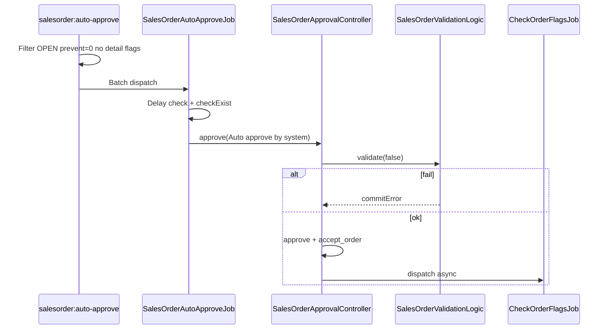
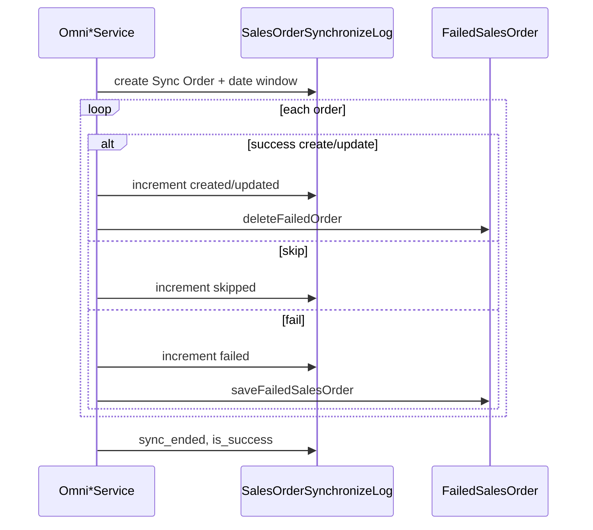

# Dev - Sales Platform — Technical Documentation

**UI:** `/omni/sales-order` · **API base:** `omnichannel/sales-order` · **type=platform`**

---

## 1. File Map

### Backend

| Path | Role |
|------|------|
| `Modules/OmniChannel/Http/Controllers/SalesOrderController.php` | Datalist, pills, sync, print, duplicate |
| `Modules/OmniChannel/Http/Controllers/SalesOrderApprovalController.php` | approve / void / unapprove |
| `Modules/OmniChannel/Http/Controllers/SalesOrderDetailController.php` | Detail + `updateAutoApproveFlagForSalesOrder` |
| `Modules/OmniChannel/Http/Controllers/FailedSalesOrderController.php` | Failed Synchronize list + retry |
| `Modules/OmniChannel/Http/Controllers/SalesOrderSyncLogController.php` | Log Data |
| `Modules/OmniChannel/Http/Controllers/OmniChannelController.php` | OrderSynchronizeStatistic (OSS), banner settings |
| `Modules/OmniChannel/Http/Controllers/TransferSummaryController.php` | `formatAvailabilityAndProcessStatus` (6 icons) |
| `Modules/OmniChannel/Logics/SalesOrder/SalesOrderValidationLogic.php` | Approve validations |
| `Modules/OmniChannel/Services/Omni{Shopee,Lazada,TikTok}Service.php` | Sync + price mapping |
| `Modules/OmniChannel/Services/Traits/ManagesShopeeBooking.php` | Booking sync |
| `Modules/OmniChannel/Jobs/SalesOrderAutoApproveJob.php` | Auto-approve per SO |
| `Modules/OmniChannel/Jobs/CheckOrderFlagsJob.php` | Post-approve / revalidate flags |
| `Modules/OmniChannel/Entities/SalesOrder.php` | Header + `renderErrorFlags` / cancel scopes |
| `Modules/OmniChannel/Entities/{FailedSalesOrder,SalesOrderSynchronizeLog,OrderAutomationSetting}.php` | Supporting |
| `Modules/GeneralSetting/Entities/OrderProcessSetting.php` | Auto Approve / Process to Wave / Instant |
| `app/Console/Commands/SalesOrderAutoApprove.php` | Cron picker |
| `app/Console/Commands/SalesOrderErrorApprove.php` | Retry failed-flag approve |
| `config/auto_approve.php` | Fallback delay |

### Frontend

| Path | Role |
|------|------|
| `olshoperp-frontend/src/pages/Omni/SalesOrder/DataList.vue` | Datalist + pills wire-up |
| `.../DatalistFailedSO.vue` | Failed Synchronize |
| `.../SyncLog.vue` | Log Data slideover |
| `.../Form.vue` / detail components | Order detail |
| `.../components/ErrorFlag.vue` | Error flag icons |
| `.../components/PillButtons.vue` | Pills + OSS panel |
| `.../master/GlobalSetting/OrderSettings.vue` | Delay + Start Date |

---

## 2. API Routes (utama)

| Method | Path | Notes |
|--------|------|-------|
| GET | `sales-order/get?type=platform` | Datalist |
| GET | `sales-order/pill-count?type=platform` | Failed / processable / failed_sync |
| GET | `sales-order/failed-process?type=platform` | Failed Process count |
| GET | `sales-order/failed-to-sync` | Failed Synchronize datalist |
| POST | `sales-order/failed-to-sync/bulk-retry` | Retry |
| GET | `sales-order/sync-logs` | Log Data |
| GET | `sales-order-oss/primevue` | Today Sync Status |
| POST | `sales-order/{id}/approve` | Approve |
| POST | resource sync endpoints | Bulk / single sync |
| GET/PUT | `order-automation-setting` | delay_time |
| PATCH | `settings` | min_order_date dll. |

---

## 3. Database Key Tables

| Table | Role |
|-------|------|
| `omni_sales_orders` | Header; `type_sales_order=platform`; `prevent_auto_approve`; `platform_order_id`; booking fields via relation |
| `omni_sales_order_details` / `_randoms` | Lines + morph error flags |
| `omni_sales_order_detail_errors` | JSON `errors` per detail |
| `omni_sales_order_errors` | Order-level `error` JSON |
| `omni_sales_order_other_costs` / `_discounts` | Platform Account Label mapping |
| `omni_sales_order_other_infos` | Tracking, COD, notes |
| `omni_sales_order_bookings` | Shopee booking_number / status |
| `omni_failed_sales_orders` | Failed Synchronize |
| `omni_sales_order_synchronize_logs` | Log Data counters |
| `omni_order_automation_settings` | `delay_time` |
| `gs_order_process_settings` | auto_approve, process_to_wave, instant_processing |
| `scm_stock_mutations` (+ transfer details) | Processing icons source |

---

## 4. Services / Pricing

| Platform | Unit price at sync |
|----------|-------------------|
| Shopee | `modal_discounted_price` only |
| TikTok | `sale_price + platform_discount` |
| Lazada | Existing product price path |

`updateAutoApproveFlagForSalesOrder`: compare `each_price_after_vat_primary_currency` vs `benchmark_cogs` (AS-IS; SoT menyebut Price Before VAT — GAP mengacu GAP-BM-05 di docs benchmark).

---

## 5. Flow — Auto Approve

Cron: `dailyAt('19:00')` Asia/Jakarta. OrderProcessSetting.auto_approve **not** gated → GAP-APR-01.

---

## 6. Flow — Sync batch Log Data

---

## 7. Invariants

1. Datalist `type_sales_order = platform` (atau filter ekuivalen controller).
2. Summary buckets **mutually exclusive** (Rejected excluded — GAP-SPL-01).
3. `prevent_auto_approve ∈ {0,1}`; cron hanya `=0`.
4. Auto-approve kandidat: `whereDoesntHave('detail_error_flags')`.
5. Booking (`is_booking` / null `platform_order_id` path) **tidak** masuk auto-approve picker.
6. Approve platform (`approveOrder`) **tidak** memanggil `CustomerInvoiceHelper` (hanya path POS) — tidak ada SI/journal di approve booking.
7. Get Resi booking: `ManagesShopeeBooking::shipSalesOrderBooking` gagal jika tracking kosong.
8. Instant Settlement platform: `ImportSettlementJob` match `whereIn('platform_order_id', …)` — booking unmatched tidak masuk generate SI.
9. Processing icons derived dari `stock_mutations.process_type` normalisasi pick|check|pack|collect|ship.
10. Additional cost/disc platform **tidak** di-copy ke Sales Invoice line generation.
11. Σ Invoice status qty ≤ SO qty; Σ Failed Ship qty ≤ SO qty (per SKU, primary unit).
12. Failed Synchronize uniqueness key: `(platform_id, store_id, platform_order_id, owned_by)`.
13. Log Data Success display = `order_created + order_updated`.

---

## 8. Validation Highlights

| Layer | Rules |
|-------|-------|
| Sync gating | Platform Active, store auth, Start Date, auto-sync ON |
| Approve | `SalesOrderValidationLogic` — stock skipped when `validate(false)` |
| Prevent flag | Benchmark compare + random-bundle + product change + clone + unapprove |
| checkExist | Skip auto-approve jika TransferMutationDetail sudah mereferensi SO details |

---

## 9. Frontend Behaviors

| Behavior | Implementation |
|----------|----------------|
| Failed Process column | Insert `error_flags_formatted` → `ErrorFlag.vue` binds `error_info.error` |
| Failed Sync view | Swap to `DatalistFailedSO` (`is_failed_sync`) |
| OSS panel | Absolute dropdown + PrimeDataTables `sales-order-oss` |
| Log Data | Slideover + Echo refresh counter |
| Processing icons | HTML dari BE `availability_and_process_status_formatted` (`is_with_availability=false`) |
| Create button | Redirect Sales Order General create |

---

## 10. Failure Modes & Transaction Boundary

| Failure | Boundary | Recovery |
|---------|----------|----------|
| Sync per-order exception | Order rollback / save FailedSalesOrder | Retry Failed Synchronize |
| Approve validation fail | `commitError`, SO tetap OPEN | Failed Process + manual fix + re-approve / error-approve |
| Auto-approve exception | Job catch + clear lock | Next cron / error-approve |
| Bulk Sync overlap | Cache lock | Message processing in progress |
| Duplicate job | `preventDuplicateJob` | Skip |

---

## 11. Data Lifecycle (flags hulu-hilir)

| Flag / field | Set | Clear / consume |
|--------------|-----|-----------------|
| `prevent_auto_approve` | Benchmark, edit product, clone, unapprove | Manual resolve + recompute flag |
| Detail error flags | Validation fail / CheckOrderFlagsJob | Clear on successful validate / fix source |
| `omni_failed_sales_orders` | Sync fail | delete on success sync/retry |
| Invoice / FS status | Downstream approve docs | Cap by SO qty |
| Return bucket | Exists SR and/or FS | Until documents settled |

---

## 12. Tests & QA Notes

- [ ] Cron filter set vs booking exclusion
- [ ] Shopee price always modal_discounted_price
- [ ] ErrorFlag icon matrix
- [ ] Processing icon color states
- [ ] Failed Sync retry deletes row
- [ ] Instant Processing generates pipeline docs
- [ ] Return bucket when only FS vs only SR vs both

---

## 13. Known Issues (GAP cross-ref)

| GAP | Technical note |
|-----|----------------|
| GAP-APR-01 | `SalesOrderAutoApprove` ignores `OrderProcessSetting.auto_approve`; FE documents delay as ignored |
| GAP-SPL-01 | Rejected omitted from carousel buckets |
| GAP-SPD-01 | Duplicate internal vs void-platform clone share naming |
| GAP-BOOK-01 | **Accepted residual:** jalur IS mitigated — null `platform_order_id` → no settlement match; approve SP no SI. Residual = manual SI amount 0 only. See requirement §3b |
| GAP-SYN-01 | No Shopee skip-sync optimization |
| GAP-BM-05 | Flag uses after-VAT price vs SoT Price Before VAT |
