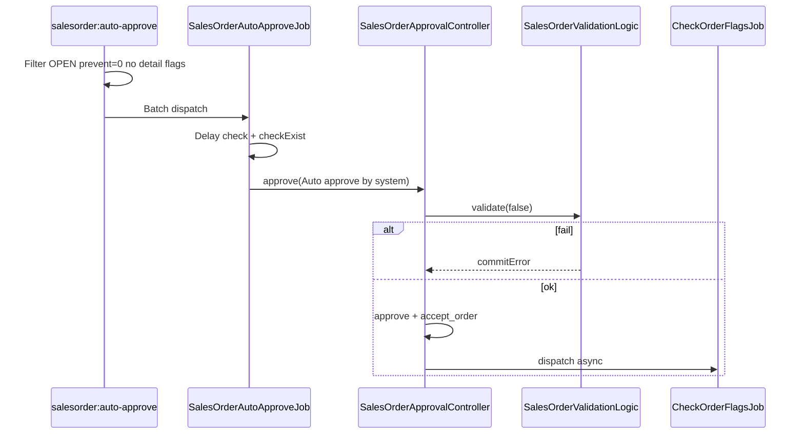
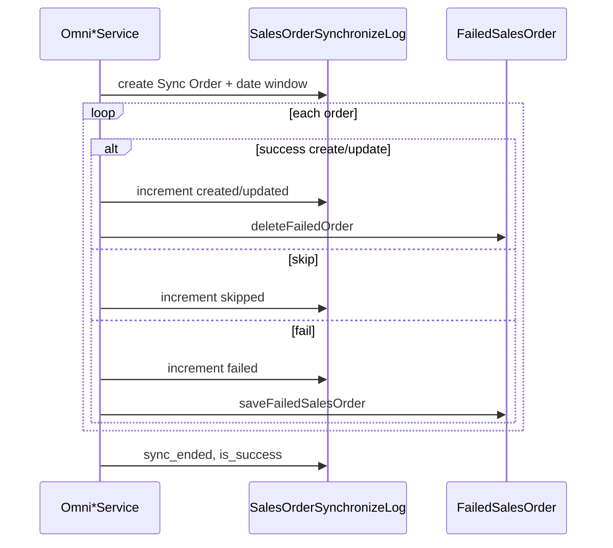

# Dev - Sales Platform — Technical Documentation

**UI:** `/omni/sales-order` · **API base:** `omnichannel/sales-order` · **type=platform`**

> Changelog 1.10 (2026-09-04): Log Data tab **Pending Orders** + pill **Unmatched Bookings** — [requirement §5.3.1](./requirement.md) · [ASO §5.7](../all-sales-order/requirement.md) · ETM-15798.  
> Changelog 1.9 (2026-09-04): Booking dual-path anti-dupe — `ManagesShopeeBooking` + `OmniShopeeService::storeSalesOrder` skip `advance_package` sebelum link/MATCHED; invariant 1 SO per pesanan — [requirement §3b / §5.6](./requirement.md).  
> Changelog 1.8 (2026-09-03): TO-BE edit detail sebelum approve + sync lock — [requirement §6.8](./requirement.md) · ETM-15749 / ETM-15748. Touchpoints: `SalesOrderDetailController` create/update, `OmniShopeeService`/`OmniLazadaService`/`OmniTikTokService` update detail (price path), FE `Omni/SalesOrder/DatalistDetail.vue` (+ ASO shared form).  
> Changelog 1.7 (2026-09-02): Extract bundle price > 0 — `extractBundleDetails` + `BundleRandomFlag.vue` (ETM-15733) — [requirement §6.7](./requirement.md).  
> Changelog 1.6 (2026-08-31): AS-IS sync schedule & job split — canonical di [Store technical §9.3](../omni-store-binding/technical.md#93-order-sync) + [requirement SP §5.4](./requirement.md#54-sync-ingestion).  
> Changelog 1.5 (2026-08-12): TO-BE Benchmark COGS line snapshot = **effective** Manual COGS (`GAP-BM-14`) — [requirement §6.6](./requirement.md#66-benchmark-cogs-snapshot--effective-manual-cogs-to-be--gap-bm-14); [Benchmark technical §4.4](../accounting-product-benchmark-price/technical.md#44-job-vs-manual-cogs-to-be--gap-bm-14).  
> Changelog 1.4 (2026-08-11): TO-BE Auto Add VAT dari Store (`GAP-ST-VAT-01`) — lihat [Store technical §11.1](../omni-store-binding/technical.md#111-auto-add-vat-platform-orders--to-be-gap-st-vat-01).  
> Changelog 1.3 (2026-08-11): TO-BE `cogs-error` Below Benchmark COGS — lihat [Benchmark technical §6.5–§6.6](../accounting-product-benchmark-price/technical.md#65-auto-approve-flag); GAP-BM-13.

---

## 1. File Map

### Backend

| Path | Role |
|------|------|
| `Modules/OmniChannel/Http/Controllers/SalesOrderController.php` | Datalist, pills, sync, print, duplicate |
| `Modules/OmniChannel/Http/Controllers/SalesOrderApprovalController.php` | approve / void / unapprove |
| `Modules/OmniChannel/Http/Controllers/SalesOrderDetailController.php` | Detail + `updateAutoApproveFlagForSalesOrder` + **`extractBundleDetails`** (price > 0) |
| `Modules/OmniChannel/Http/Controllers/FailedSalesOrderController.php` | Failed Synchronize list + retry |
| `Modules/OmniChannel/Http/Controllers/SalesOrderSyncLogController.php` | Log Data |
| `Modules/OmniChannel/Http/Controllers/OmniChannelController.php` | OrderSynchronizeStatistic (OSS), banner settings |
| `Modules/OmniChannel/Http/Controllers/TransferSummaryController.php` | `formatAvailabilityAndProcessStatus` (6 icons) |
| `Modules/OmniChannel/Logics/SalesOrder/SalesOrderValidationLogic.php` | Approve validations |
| `Modules/OmniChannel/Services/Omni{Shopee,Lazada,TikTok}Service.php` | Sync + price mapping |
| `Modules/OmniChannel/Services/Traits/ManagesShopeeBooking.php` | Booking sync |
| `Modules/OmniChannel/Jobs/SalesOrderAutoApproveJob.php` | Auto-approve per SO |
| `Modules/OmniChannel/Jobs/CheckOrderFlagsJob.php` | Post-approve / revalidate flags |
| `Modules/OmniChannel/Entities/SalesOrder.php` | Header + `renderErrorFlags` / cancel scopes |
| `Modules/OmniChannel/Entities/{FailedSalesOrder,SalesOrderSynchronizeLog,OrderAutomationSetting}.php` | Supporting |
| `Modules/GeneralSetting/Entities/OrderProcessSetting.php` | Auto Approve / Process to Wave / Instant |
| `app/Console/Commands/SalesOrderAutoApprove.php` | Cron picker |
| `app/Console/Commands/SalesOrderErrorApprove.php` | Retry failed-flag approve |
| `config/auto_approve.php` | Fallback delay |

### Frontend

| Path | Role |
|------|------|
| `olshoperp-frontend/src/pages/Omni/SalesOrder/DataList.vue` | Datalist + pills wire-up |
| `.../DatalistFailedSO.vue` | Failed Synchronize |
| `.../SyncLog.vue` | Log Data slideover — **TO-BE:** tab **Pending Orders** + pill **Unmatched Bookings** (ETM-15798) |
| `.../Form.vue` / detail components | Order detail |
| `.../DatalistDetail.vue` | Detail grid + slot bundle flag |
| `.../components/BundleRandomFlag.vue` | Bundle UI + **Extract** → `extract-bundle` |
| `.../components/ErrorFlag.vue` | Error flag icons |
| `.../components/PillButtons.vue` | Pills + OSS panel |
| `.../master/GlobalSetting/OrderSettings.vue` | Delay + Start Date |

---

## 2. API Routes (utama)

| Method | Path | Notes |
|--------|------|-------|
| GET | `sales-order/get?type=platform` | Datalist |
| GET | `sales-order/pill-count?type=platform` | Failed / processable / failed_sync |
| GET | `sales-order/failed-process?type=platform` | Failed Process count |
| GET | `sales-order/failed-to-sync` | Failed Synchronize datalist |
| POST | `sales-order/failed-to-sync/bulk-retry` | Retry |
| GET | `sales-order/sync-logs` | Log Data |
| GET | `sales-order-oss/primevue` | Today Sync Status |
| POST | `sales-order/{id}/approve` | Approve |
| POST | `sales-order/{id}/sales-order-detail/{detailId}/extract-bundle` | Extract SKU bundle; **reject** if header `each_price` ≤ 0 (ETM-15733) |
| POST | resource sync endpoints | Bulk / single sync |
| GET/PUT | `order-automation-setting` | delay_time |
| PATCH | `settings` | min_order_date dll. |

---

## 3. Database Key Tables

| Table | Role |
|-------|------|
| `omni_sales_orders` | Header; `type_sales_order=platform`; `prevent_auto_approve`; `platform_order_id`; booking fields via relation |
| `omni_sales_order_details` / `_randoms` | Lines + morph error flags |
| `omni_sales_order_detail_errors` | JSON `errors` per detail |
| `omni_sales_order_errors` | Order-level `error` JSON |
| `omni_sales_order_other_costs` / `_discounts` | Platform Account Label mapping |
| `omni_sales_order_other_infos` | Tracking, COD, notes |
| `omni_sales_order_bookings` | Shopee booking_number / status |
| `omni_failed_sales_orders` | Failed Synchronize |
| `omni_sales_order_synchronize_logs` | Log Data counters |
| `omni_order_automation_settings` | `delay_time` |
| `gs_order_process_settings` | auto_approve, process_to_wave, instant_processing |
| `scm_stock_mutations` (+ transfer details) | Processing icons source |

---

## 4. Services / Pricing

| Platform | Unit price at sync |
|----------|-------------------|
| Shopee | Escrow `get_escrow_detail` → `order_income.items[]`: **`discounted_price + shopee_discount`**, match `line_item_id` ke item order detail. **Bukan** `item_list.model_discounted_price` |
| TikTok | `sale_price + platform_discount` |
| Lazada | Existing product price path |

**Shopee implementation (`OmniShopeeService`):**

| Method | Escrow / price |
|--------|----------------|
| `getAccountingInfo($order_sn, $store_id)` | `POST/GET` path `/api/v2/payment/get_escrow_detail` |
| Create SO (store path) | Always call escrow; set `each_price`, `each_price_before_discount_before_vat`, bundle `origin_price` |
| `updateSalesOrder` | Reprice from escrow **only** when converting booking → real order (`converting_booking`) |
| Fallback if escrow empty / no match | `$price = 0` (GAP-SPR-01) |
| Legacy | Commented `model_discounted_price` / `model_original_price` — remove after **2026-09-04** |

`processAccountMapping` tetap memakai payload escrow untuk additional cost/disc mapping (terpisah dari unit price line).

`updateAutoApproveFlagForSalesOrder`: AS-IS bandingkan `each_price_without_vat` vs `benchmark_cogs` (random: before-discount-before-VAT). TO-BE: Price Before VAT × order rate → primary; skip `benchmark_cogs = 0`; satu helper dengan UI `cogs-error` — [GAP-BM-05](../accounting-product-benchmark-price/requirement.md) · [GAP-BM-13](../accounting-product-benchmark-price/requirement.md). FE: `ErrorFlag.vue` case `cogs-error`.

---

## 5. Flow — Auto Approve

```mermaid
sequenceDiagram
    participant CRON as salesorder:auto-approve
    participant JOB as SalesOrderAutoApproveJob
    participant APV as SalesOrderApprovalController
    participant VAL as SalesOrderValidationLogic
    participant FLG as CheckOrderFlagsJob

    CRON->>CRON: Filter OPEN prevent=0 no detail flags
    CRON->>JOB: Batch dispatch
    JOB->>JOB: Delay check + checkExist
    JOB->>APV: approve(Auto approve by system)
    APV->>VAL: validate(false)
    alt fail
        VAL-->>APV: commitError
    else ok
        APV->>APV: approve + accept_order
        APV->>FLG: dispatch async
    end
```

Cron: `dailyAt('19:00')` Asia/Jakarta. OrderProcessSetting.auto_approve **not** gated → GAP-APR-01.

---

## 6. Flow — Sync batch Log Data

```mermaid
sequenceDiagram
    participant SVC as Omni*Service
    participant LOG as SalesOrderSynchronizeLog
    participant FAIL as FailedSalesOrder

    SVC->>LOG: create Sync Order + date window
    loop each order
        alt success create/update
            SVC->>LOG: increment created/updated
            SVC->>FAIL: deleteFailedOrder
        else skip
            SVC->>LOG: increment skipped
        else fail
            SVC->>LOG: increment failed
            SVC->>FAIL: saveFailedSalesOrder
        end
    end
    SVC->>LOG: sync_ended, is_success
```

---

## 7. Invariants

1. Datalist `type_sales_order = platform` (atau filter ekuivalen controller).
2. Summary buckets **mutually exclusive** (Rejected excluded — GAP-SPL-01).
3. `prevent_auto_approve ∈ {0,1}`; cron hanya `=0`.
4. Auto-approve kandidat: `whereDoesntHave('detail_error_flags')`.
5. Booking (`is_booking` / null `platform_order_id` path) **tidak** masuk auto-approve picker.
6. Approve platform (`approveOrder`) **tidak** memanggil `CustomerInvoiceHelper` (hanya path POS) — tidak ada SI/journal di approve booking.
7. Get Resi booking: `ManagesShopeeBooking::shipSalesOrderBooking` gagal jika tracking kosong.
8. Instant Settlement platform: `ImportSettlementJob` match `whereIn('platform_order_id', …)` — booking unmatched tidak masuk generate SI.
9. Processing icons derived dari `stock_mutations.process_type` normalisasi pick|check|pack|collect|ship.
10. Additional cost/disc platform **tidak** di-copy ke Sales Invoice line generation.
11. Σ Invoice status qty ≤ SO qty; Σ Failed Ship qty ≤ SO qty (per SKU, primary unit).
12. Failed Synchronize uniqueness key: `(platform_id, store_id, platform_order_id, owned_by)`.
13. Log Data Success display = `order_created + order_updated`.
14. **Booking anti-dupe:** satu pesanan Shopee = satu `omni_sales_orders` row. Dedup by `booking_number` **atau** `platform_order_id` / `order_sn` → UPDATE, bukan INSERT kedua.
15. **Advance package without booking link:** `OmniShopeeService::storeSalesOrder` — jika `advance_package` dan order status masih sebelum gate yang disepakati / belum ter-link ke booking (**MATCHED**), return success skip (**bukan** Failed Sync) agar tidak materialisasi SO kedua saat webhook order_id tanpa `booking_sn`.
16. **MATCHED:** `update_so_booking_fields` / convert path mengisi `platform_order_id` pada SO booking existing + escrow reprice (`converting_booking`).

---

## 8. Validation Highlights

| Layer | Rules |
|-------|-------|
| Sync gating | Platform Active, store auth, Start Date, auto-sync ON |
| Approve | `SalesOrderValidationLogic` — stock skipped when `validate(false)` |
| Prevent flag | Benchmark compare + random-bundle + product change + clone + unapprove |
| checkExist | Skip auto-approve jika TransferMutationDetail sudah mereferensi SO details |
| Auto Add VAT **(TO-BE GAP-ST-VAT-01)** | Resolve dari `Store.auto_add_transaction_platform` saat detail create/sync + unit price set; **bukan** `Company.auto_add_transaction_customer` |
| Benchmark COGS snapshot **(TO-BE GAP-BM-14)** | Line capture = **effective** COGS (Manual override jika aktif); shared dengan SOG/ASO |

---

## 9. Frontend Behaviors

| Behavior | Implementation |
|----------|----------------|
| Failed Process column | Insert `error_flags_formatted` → `ErrorFlag.vue` binds `error_info.error` |
| Failed Sync view | Swap to `DatalistFailedSO` (`is_failed_sync`) |
| OSS panel | Absolute dropdown + PrimeDataTables `sales-order-oss` |
| Log Data | Slideover + Echo refresh counter |
| Processing icons | HTML dari BE `availability_and_process_status_formatted` (`is_with_availability=false`) |
| Create button | Redirect Sales Order General create |

---

## 10. Failure Modes & Transaction Boundary

| Failure | Boundary | Recovery |
|---------|----------|----------|
| Sync per-order exception | Order rollback / save FailedSalesOrder | Retry Failed Synchronize |
| Advance package / order_id tanpa booking_sn (pre-MATCHED) | Skip create (success Accepted) — **tidak** FailedSalesOrder | Tunggu webhook MATCHED → update SO booking |
| Approve validation fail | `commitError`, SO tetap OPEN | Failed Process + manual fix + re-approve / error-approve |
| Auto-approve exception | Job catch + clear lock | Next cron / error-approve |
| Bulk Sync overlap | Cache lock | Message processing in progress |
| Duplicate job | `preventDuplicateJob` | Skip |

---

## 11. Data Lifecycle (flags hulu-hilir)

| Flag / field | Set | Clear / consume |
|--------------|-----|-----------------|
| `prevent_auto_approve` | Benchmark, edit product, clone, unapprove | Manual resolve + recompute flag |
| Detail error flags | Validation fail / CheckOrderFlagsJob | Clear on successful validate / fix source |
| `omni_failed_sales_orders` | Sync fail | delete on success sync/retry |
| Invoice / FS status | Downstream approve docs | Cap by SO qty |
| Return bucket | Exists SR and/or FS | Until documents settled |

---

## 12. Tests & QA Notes

- [ ] Booking dual-path: booking_sn-only create; order_id tanpa booking_sn tidak INSERT kedua; MATCHED mengisi `platform_order_id` + escrow (case `260831AASC74GOWV7FM` / `2609031XP6RKDK`)
- [ ] Cron filter set vs booking exclusion
- [ ] Shopee price = escrow `discounted_price + shopee_discount` (match `line_item_id`); not order-detail `model_discounted_price`
- [ ] Booking convert reprice via escrow; regular status update does not zero prices
- [ ] Escrow fail / unmatched line → price 0 + observable (GAP-SPR-01)
- [ ] ErrorFlag icon matrix
- [ ] Processing icon color states
- [ ] Failed Sync retry deletes row
- [ ] Instant Processing generates pipeline docs
- [ ] Return bucket when only FS vs only SR vs both

---

## 13. Known Issues (GAP cross-ref)

| GAP | Technical note |
|-----|----------------|
| GAP-APR-01 | `SalesOrderAutoApprove` ignores `OrderProcessSetting.auto_approve`; FE documents delay as ignored |
| GAP-SPL-01 | Rejected omitted from carousel buckets |
| GAP-SPD-01 | Duplicate internal vs void-platform clone share naming |
| GAP-BOOK-01 | **Accepted residual:** jalur IS mitigated — null `platform_order_id` → no settlement match; approve SP no SI. Residual = manual SI amount 0 only. See requirement §3b |
| GAP-BOOK-02 | **Design guard:** dual-path booking vs advance package tanpa `booking_sn` — skip create sampai MATCHED; pelanggaran = 2 SO 1 order_id (fatal UPFOS). See requirement §3b / invariants 14–16 |
| GAP-SYN-01 | No Shopee skip-sync optimization |
| GAP-BM-05 / GAP-BM-13 | Auto-approve + Error Flag Below Benchmark COGS — formula FX primary + UX icon/filter/detail; kanonik di Benchmark COGS docs |
| GAP-SPR-01 | Escrow miss → price 0; historical SO understated until backfill/re-sync; legacy seeders `FixShopee*` still use `model_discounted_price` |
