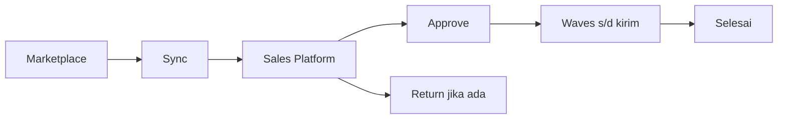
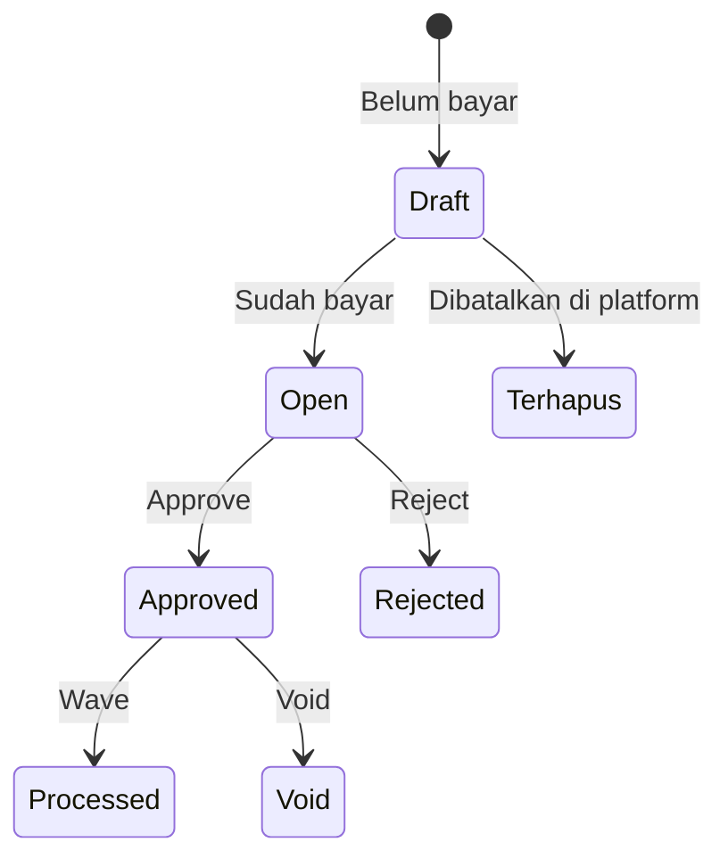

# Panduan Pengguna — Dev - Sales Platform

**Siapa yang baca:** tim ops marketplace, gudang, support  
**Menu:** Omni Channel → Dev - Sales Platform  
**Route:** `/omni/sales-order`

---

## 1. Apa Itu & Kenapa Penting

**Dev - Sales Platform** adalah daftar order dari toko online (Shopee, TikTok, Lazada, dan sejenisnya) yang sudah ditarik sistem. Kamu memantau sync, memperbaiki order yang gagal, lalu approve supaya gudang bisa proses sampai kirim.

Order **tidak** dibuat manual di sini. Tombol **Create** membuka **Dev - Sales Order** (order internal).

---

## 2. Overview Flow & Proses Bisnis

**Versi teks:**

1. Order masuk dari marketplace (otomatis, **Bulk Sync**, atau Sync per baris).
2. Order muncul di Sales Platform.
3. Kalau lolos cek → **Approve** (manual atau otomatis malam hari). Kalau tidak → **Failed Process** / **Failed Sync**.
4. Setelah approve: waves → pick → check → pack → collect → kirim.
5. Selesai, atau masuk **Return** jika ada Sales Return / Failed Ship.

### Status order

**Versi teks:**

| Status | Artinya | Bisa edit SKU/qty? |
|--------|---------|--------------------|
| Draft | Order baru / belum bayar (Sales Request) | Ya |
| Open | Sudah bayar; booking juga di sini (nilai sering 0) | Ya |
| Approved | Kunci proses gudang | Tidak — form terkunci |
| Rejected | Ditolak | — |
| Processed | Sudah masuk wave / proses gudang | Tidak |
| Void | Dibatalkan setelah approve | Tidak |

Ringkasan di atas daftar (Sales Request → Complete / Return / Cancelled) **saling eksklusif**. Order **Rejected** saat ini **tidak** masuk ringkasan itu.

---

## 3. Sebelum Mulai (Flow Sebelum)

Pastikan ini sudah siap supaya order bisa masuk dan diproses:

- [ ] Toko **authorized** dan platform **Active** (Store Binding).
- [ ] Gudang proses toko sudah diisi (toko, atau fallback Omni Setting).
- [ ] Produk marketplace sudah diikat ke System Product (owner produk = owner default toko).
- [ ] **Order Sync Start Date** di Omni Setting sudah sesuai — order lebih lama dari tanggal itu tidak ditarik.
- [ ] Binding kurir / layanan kirim siap, supaya tidak kena error pengiriman.

🎬 [Interactive demo akan ditambahkan di sini]

---

## 4. Setelah Selesai (Flow Sesudah)

Setelah order **Approved**:

1. Order masuk jalur gudang (Default Waves / Instant Processing jika menyala).
2. Ikon **Processing Status** bergerak: Wave → Pick → Check → Pack → Collect → Ship. Abu = menunggu · oranye = antre wave · kuning = dikerjakan · hijau = selesai. Hover ikon untuk teks status.
3. Setelah outbound disetujui, order masuk ringkasan **Complete**.
4. Kalau barang gagal kirim → kerjakan di **Failed Ship**. Kalau retur/refund marketplace → **Sales Return**. Keduanya bisa membuat ringkasan **Return** di Sales Platform.
5. Tagihan marketplace lewat **Instant Settlement** — bukan saat kamu klik Approve. Settlement mencocokkan **No. Pesanan = Platform Order ID**.

🎬 [Interactive demo akan ditambahkan di sini]

---

## 5. Yang Perlu Diperhatikan

- **Kalau kamu klik Create di sini**, form yang terbuka adalah Sales Order internal — bukan order marketplace.
- **Kalau order sudah Approved**, kamu tidak bisa edit harga/SKU/qty. Perbaiki di status Draft/Open sebelum approve.
- **Kalau kamu ganti produk di Draft**, sistem menandai order supaya **tidak** ikut auto-approve.
- **Kalau produk belum diikat, akun belum lengkap, stok kurang, kurir belum bind, atau gudang proses kosong**, order masuk **Failed Process**. Hover ikon error untuk pesan.
- **Kalau harga jual sebelum pajak (nilai utama) di bawah Benchmark COGS**, order **tidak** ikut auto-approve. Setelah fitur live, kolom Error Flag menampilkan label **Below Benchmark COGS** (ikon merah; bisa difilter). **Approve manual tetap boleh.**
- **Kalau stok kurang**, auto-approve **tetap jalan**; cek stok menyusul dan bisa muncul sebagai Failed Process.
- **Kalau order adalah Booking Shopee** (Platform Order ID tampil `-`), auto-approve **tidak** mengambilnya. Approve & proses gudang **manual** boleh. **Get Resi / cetak label** gagal tanpa tracking. **Instant Settlement** belum bisa selama nomor order masih kosong.
- **Kalau kamu approve booking bernilai 0**, itu **tidak** langsung membuat invoice/jurnal penjualan. Jurnal baru lewat settlement setelah Platform Order ID terisi.
- **Kalau kamu unggah settlement untuk booking yang belum match**, sistem tidak menemukan order — tunggu Order ID terisi dulu.
- **Kalau kamu Extract SKU bundle** padahal **Price** masih **0**, sistem menolak sampai harga lebih dari 0 (sering setelah booking jadi order ID / harga masuk).
- **Kalau harga line Shopee jadi 0 atau terasa terlalu kecil**, sync ulang dan cek data escrow di **API Data Log**. Harga seller = harga diskon **plus** potongan yang ditanggung Shopee — bukan angka “setelah voucher” di layar order marketplace.
- **Kalau ada biaya/diskon tambahan** dari label akun platform, itu hanya info di SO — **tidak** ikut ke Sales Invoice. Wajar kalau Net Sales beda dengan nilai invoice.
- **Kalau kamu atur “menit delay” auto-approve di Omni Setting**, jadwal harian sekitar **19:00** saat ini **tidak** mengikuti pengaturan itu. Auto-approve malam hari tetap jalan sesuai filter sistem.
- **Kalau fitur Auto Add VAT sudah live**, isi pajak produk mengikuti **Auto Add VAT (Platform Orders)** di Store toko itu (Store → Accounting & Tax) — **bukan** setting customer di General Company. Order lama tidak diisi ulang otomatis.

---

## 6. Langkah-Langkah (Step by Step)

### Pantau order harian

1. Buka **Dev - Sales Platform** (`/omni/sales-order`).
2. Cek pill:
   - **Failed Process** — order sudah masuk tapi ada error; hover ikon.
   - **Order Failed Synchronize** — order gagal ditarik; baca alasan → **Retry**.
   - **Ready to Process** — tanpa error flag.
   - **Order Synchronize Status** — hari ini: berapa order di platform vs sudah masuk sistem, per toko.
   - **Log Data** — riwayat batch sync (sukses/gagal/dilewati per toko). Beda dengan **API Data Log** di form order (isi payload, misalnya escrow Shopee).
3. Perbaiki master (binding, COA, gudang, kurir) → sync/retry → approve.

### Approve & proses gudang

1. Buka order berstatus **Open** tanpa error (atau setelah error beres).
2. Klik **Approve** (atau biarkan auto-approve malam hari jika order memenuhi syarat).
3. Lanjut waves & packing sampai kirim. Kalau Instant Processing menyala, sistem bisa menjalankan pick sampai kirim otomatis.

### Booking Shopee

Contoh yang sering muncul: baris booking dengan **Platform Order ID `-`** dan **nilai sering 0**.

1. Booking masuk → boleh **approve manual** dan siapkan gudang.
2. Pastikan **tracking / resi** ada sebelum Get Resi / ship.
3. Tunggu match buyer → Platform Order ID terisi, nilai biasanya ikut order biasa.
4. Setelah shipped (gudang 3PL) → baru unggah **Instant Settlement**.

Edit field booking (Other Information) dari **All Sales Order**, bukan dari list Sales Platform.

🎬 [Interactive demo akan ditambahkan di sini]

### Return

- Barang gagal kirim / perlu dikembalikan dari alur kirim → menu **Failed Ship** (pill di sana menonjolkan return platform yang belum outbound penuh).
- Retur/refund dari platform → menu **Sales Return** (boleh termasuk order yang sudah outbound).

---

## 7. Tips & Hal yang Sering Bikin Bingung

- **Order tidak muncul** → cek Start Date sync, platform Inactive, atau toko belum authorized. Pakai **Order Synchronize Status**.
- **Pill Failed Sync terisi** → produk belum sync, baris kosong, atau toko unauthorized. Perbaiki master lalu **Retry**.
- **Tidak auto-approve** → ada error flag, harga di bawah Benchmark COGS, booking, atau order sudah ditandai cegah approve (misalnya setelah ganti produk). Perbaiki lalu approve manual.
- **Create membuka form lain** → memang begitu. Order manual = Dev - Sales Order.
- **Apa beda Log Data dan API Data Log?** Log Data = batch sync toko. API Data Log = detail di form order.

**Contoh harga Shopee:** SKU tampil **25.900** di order detail marketplace, padahal harga seller **53.999** karena Shopee menanggung **28.099**. Sistem memakai data escrow supaya penjualan tidak mengecil salah. Order lama (sebelum perbaikan) bisa masih understated sampai di-sync ulang.

**Contoh Failed Process:** order sudah kelihatan di list, tapi ikon bind/COA/gudang merah. Hover → pesan. Ikat produk / lengkapi akun / set gudang proses, baru approve.

**Contoh Below Benchmark COGS:** harga jual sebelum pajak di bawah patokan HPP. Auto-approve dilewati; ikon **Below Benchmark COGS** (setelah fitur live) bisa difilter. Kamu tetap boleh approve manual jika memang disengaja.

**Contoh Auto Add VAT:** setelah live, toko A “Yes” → pajak produk terisi otomatis saat baris + harga sudah ada. Toko B “No” → tidak. Atur per toko di Store, bukan di customer.

**Contoh settlement booking:** unggah file saat Order ID masih `-` → *Unable to find order*. Tunggu match, pastikan Platform Order ID terisi, baru upload.

---

## 8. Referensi

| Sumber | Untuk apa |
|--------|-----------|
| [Knowledge Base](./knowledge-base.md) | Troubleshooting & pill |
| [Requirement](./requirement.md) | Validasi & siklus status |
| [Technical](./technical.md) | Developer |
| [Dev - Sales Order](../sales-order-general/README.md) | Order internal (tombol Create) |
| [All Sales Order](../all-sales-order/README.md) | Edit Other Info booking |
| [Store](../omni-store-binding/README.md) | Auth toko, gudang, Auto Add VAT |
| [Instant Settlement](../accounting-settlement-upload/README.md) | Match Platform Order ID |
| [Failed Ship](../supplychain-failed-ship/README.md) | Return dari gagal kirim |
| [Sales Returns](../supplychain-sales-returns/README.md) | Retur platform |
| [Benchmark COGS](../accounting-product-benchmark-price/README.md) | Patokan harga vs auto-approve |
