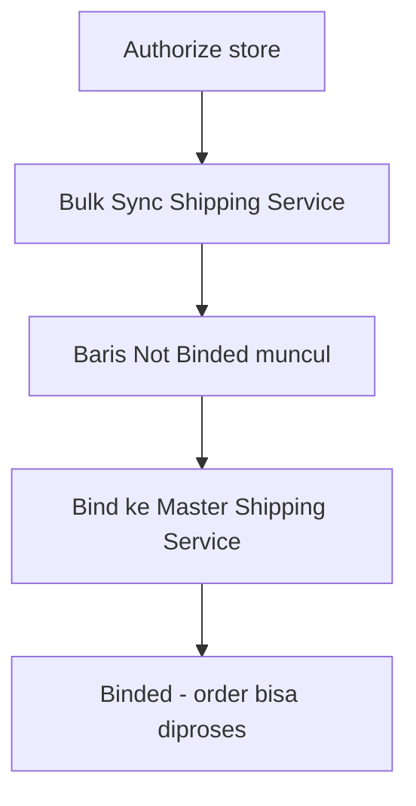

# Platform Shipping Service — Knowledge Base

> **Audience:** Omni Channel ops / QA. **Route:** `/omni/shipping-service-platform`

---

## 1. Apa itu?

Katalog **jasa kirim dari marketplace** (hasil sync), bukan daftar yang kamu ketik manual. Di sini kamu:

1. **Bulk Sync** — tarik jasa kirim dari store yang sudah authorize  
2. **Bind** — sambungkan ke Master Shipping Service internal  
3. Pantau **Binding Status** supaya order platform bisa diproses  

**Platform sync aktif:** Shopee & TikTok Shop. Lazada/Tokopedia belum ikut Bulk Sync.

---

## 2. Glosarium

| Istilah | Arti awam |
|---------|-----------|
| **Bulk Sync** | Tarik daftar jasa kirim terbaru dari marketplace |
| **Binding** | Sambungkan jasa marketplace ke standar internal |
| **Not Binded / Binded** | Belum / sudah tersambung |
| **`-DO` / `-PU`** | Drop Off (antar ke agen) / Pick Up (dijemput kurir) |
| **Data Owner** | Company pemilik baris (dari otorisasi store) |

---

## 3. Cara pakai

### Bulk Sync

1. Buka menu → buka panel **Bulk Sync**.  
2. Pastikan tidak ada sync yang masih jalan.  
3. Klik **Start Sync**.  
4. Tunggu selesai; cek **Sync Log** jika gagal / minta reauthorize.  

### Binding

1. Di baris **Not Binded**, klik ikon binding.  
2. Pilih **Master Shipping Service** → Save.  
3. Status jadi **Binded**. Unbind dari modal yang sama bila perlu.  

Binding juga bisa dari menu **Master Shipping Service**.

---

## 4. Yang bisa / tidak bisa

| Aksi | Bisa? | Catatan |
|------|-------|---------|
| Bulk Sync Shopee/TikTok | ✅ | Store harus authorized + active |
| Bind / unbind | ✅ | Satu baris platform hanya satu binding aktif |
| Create jasa kirim manual dari list | ❌ | Harus dari sync |
| Edit Type Service agar beda DO/PU | ❌ | Type kolom belum membedakan (lihat suffix code) |
| Sync Lazada/Tokopedia lewat Bulk Sync | ❌ | Belum didukung |

---

## 5. Troubleshooting

| Gejala | Solusi |
|--------|--------|
| Start Sync minta reauthorize | Authorize ulang store Shopee/TikTok terkait |
| Setelah authorize store, data kosong | Jalankan Bulk Sync manual |
| Order stuck / tidak diproses | Cek Binding Status jasa kirim order → bind |
| Type Service semua sama | Normal sementara — bedakan lewat `-DO` / `-PU` di code |
| Dua baris nama sama | Cek Data Owner (bisa beda company) |

---

## 6. FAQ

**Q: Kenapa tidak ada tombol Create?**  
A: Data hanya dari marketplace via Bulk Sync.

**Q: TikTok sync gagal?**  
A: Pastikan Warehouse Platform toko sudah tersinkron dulu.

**Q: Tracking number order dari mana?**  
A: Dari katalog Platform Shipping Service (bukan Master), meski sudah Binded.

---

## Related Documents

| Doc | Path |
|-----|------|
| Requirement | [requirement.md](./requirement.md) |
| Technical | [technical.md](./technical.md) |
| User Guide | [user-guide.md](./user-guide.md) |
| Master Shipping Service | [../omni-shipping-service/README.md](../omni-shipping-service/README.md) |
