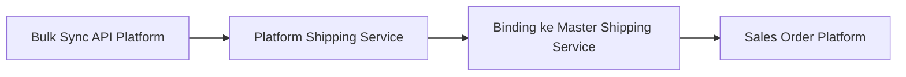
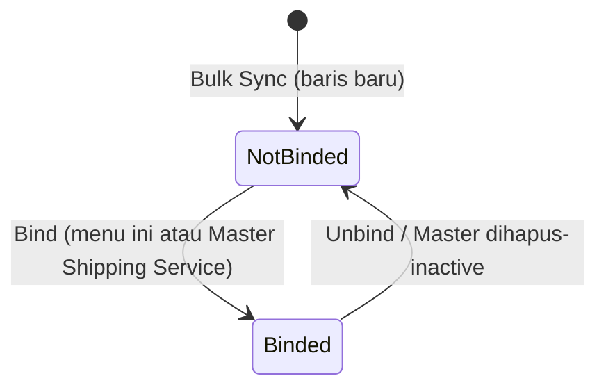
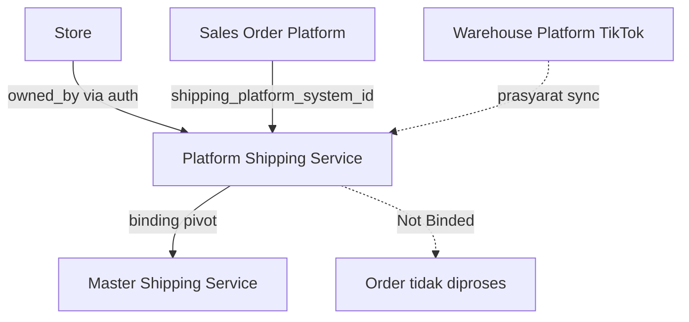

# Platform Shipping Service — Requirement Documentation

**Modul:** Omni Channel  
**UI route:** `/omni/shipping-service-platform`  
**API prefix:** `omnichannel/shipping-service-platform`  
**Audience:** PM, Omni ops, QA, Developer  
**PM source:** Platform Shipping Service Source of Truth **v2.0** (3 Agustus 2026)

> AS-IS diverifikasi codebase 3 Agu 2026 (`ShippingServicePlatformController`, `OmniShopeeService`/`OmniTikTokService`/`OmniLazadaService`, `ShippingServiceSyncJob`).

---

## 0. Metadata & Changelog

| Version | Date | Author | Changes |
|---------|------|--------|---------|
| 2.0 | 2026-08-03 | QA - Yemima | Docs penuh dari SoT v2.0 + verifikasi codebase; Gap Registry `GAP-PSP-01..07`; sync Shopee/TikTok only; binding 1:1 AS-IS |
| 1.0 | 2026-06-23 | QA - Yemima | Requirement bisnis awal (legacy file) |

---

## 1. Ringkasan Eksekutif

**Platform Shipping Service** adalah master **read-only** (untuk operator) yang menampilkan katalog jasa kirim hasil **Bulk Sync** dari API marketplace store yang authorized. Data ini di-**bind** ke Master Shipping Service internal sebelum Sales Order platform bisa diproses penuh.

**Sync aktif AS-IS:** Shopee + TikTok Shop saja. Lazada = stub `getLogistics`; Tokopedia deprecated di `OmniService` — lihat GAP-PSP-07.

---

## 2. Prasyarat

| Prasyarat | Sumber | Catatan |
|-----------|--------|---------|
| Store Shopee/TikTok authorized + active | Master Store | Tanpa ini → pesan reauthorize per platform |
| TikTok: Warehouse Platform tersinkron per store | Warehouse Platform | Delivery options butuh warehouse platform id |
| Tidak ada job lock `sync_shipping` aktif | Queue (`validateQueue`) | Start Sync ditolak sampai job selesai |
| Token OAuth store valid | Store auth | Expired → reauthorize |

---

## 3. Siklus status (Binding)

Bukan dokumen Draft/Approve — status relevan = **Binding Status** per baris.

| Status | Arti | Editable field baris? | Aksi |
|--------|------|----------------------|------|
| Not Binded | Belum ada pivot binding | Baca saja (datalist); Show mengikuti `can_update` policy | Icon → Binding Modal |
| Binded | Ada ≥1 pivot aktif (AS-IS max 1) | Sama | Binding Modal (lihat / unbind) |

---

## 4. Datalist

| Kolom | Default visible | Sumber | Keterangan |
|-------|-----------------|--------|------------|
| Code | Ya | Sync platform | Contoh `SP-…-DO` / `TK-…-PU` |
| Service Name | Ya | Sync | Nama layanan |
| Type Service | Ya | Relasi tipe internal | AS-IS selalu type id `1` saat sync — GAP-PSP-01 |
| Max Weight | Ya | Sync | Gram |
| Max Dimensions | Ya | Sync | L × W × H cm (TikTok mapping silang — GAP-PSP-06) |
| Platform Name | Ya | Platform | |
| Binding Status | Ya | Pivot exists | Not Binded / Binded |
| Active | Ya | Status | Soft-delete = tidak aktif |
| Created By \| At | Ya | Audit sync | |
| Action | Ya | — | Binding modal |
| ID | Hidden | Internal | |
| Store Name | Hidden | Store aktif **pertama** per platform | Bukan store sumber baris — GAP-PSP-04 |

**Fitur:** Show Deleted, Bulk Delete, filter kolom, Bulk Sync side page. **Tidak ada Create** di list (katalog dari sync). Endpoint `store` manual ada di API tapi bukan alur operator utama.

---

## 5. Bulk Sync (satu-satunya input operasional)

| Field / aksi | Validasi / catatan |
|--------------|-------------------|
| Start Sync | Ditolak jika queue `sync_shipping` lock; dispatch `ShippingServiceSyncJob` per store Shopee/TikTok authorized+active |
| Sync Log | History `ShippingServiceSyncLog` |
| Preview Store IDs | `shopee_store_id`, `tiktok_store_id`, `lazada_store_id` (preview only) |
| Live Preview Logistics | `getLogistics` — Lazada: pesan API not available |

---

## 6. How It Works

### 6.1 Sync per platform

Setiap channel biasanya jadi **2 baris**: suffix `-DO` (Drop Off) dan `-PU` (Pick Up).

| Platform | Perilaku AS-IS |
|----------|----------------|
| **Shopee** | `get_channel_list`; skip `enabled=false`; upsert by `platform_id` + `shipping_platform_id` (`…-DO`/`…-PU`) + `owned_by`; SPX Hemat/Standard dimensi kosong → default 120 cm; type id selalu `1` |
| **TikTok** | Per warehouse platform → delivery options → shipping providers; butuh WH platform; dimensi: `length←max_height`, `width←max_length`, `height←max_width` (GAP-PSP-06); type id selalu `1` |
| **Lazada** | Tidak di Bulk Sync; `getLogistics` return message only |
| **Tokopedia** | Tidak di Bulk Sync; `OmniService` throw deprecated |

### 6.2 Data owner

`owned_by` = `store.data_owner_id` saat sync — 2 company + store platform sama bisa menghasilkan 2 baris mirip beda owner (bukan bug).

### 6.3 Tracking number di SO Platform

Lookup shipper / tracking memakai katalog Platform Shipping Service (bukan Master), termasuk setelah Binded.

### 6.4 Binding

Dari Binding Modal menu ini **atau** section binding Master Shipping Service. AS-IS: **1 baris Platform hanya 1 pivot aktif** — bind kedua ditolak (`This Platform Shipping Service has already been binded.`) — GAP-PSP-02 vs requirement multi-owner.

---

## 7. Validasi

| # | Kondisi | Behavior / pesan AS-IS |
|---|---------|------------------------|
| 1 | Ada store Shopee tapi tidak ada authorized+active | `Please reauthorize Shopee stores for synchronization` |
| 2 | Sama untuk TikTok | `Please reauthorize TikTok stores for synchronization` |
| 3 | Tidak ada store syncable | Sync log dibuat, `total_amount=0`, complete |
| 4 | Gagal dispatch / duplicate job | `Failed to synchronize shipping service` (+ list) |
| 5 | Dispatch sukses | `The shipping service data has been successfully synchronized and imported.` |
| 6 | Bind saat sudah ada pivot | `This Platform Shipping Service has already been binded.` |
| 7 | `shipping_service_id` kosong saat bind | `Please select Shipping Service` |
| 8 | Unbind tanpa target | `Please select Shipping Service to Unbind` |
| 9 | SO platform shipping Not Binded | Order blocked / bind-error — harus bind dulu |
| 10 | Akses Master Shipping company lain | Access Denied (belongs to another company) |

---

## 8. Relasi Menu Lain

| Menu | Peran |
|------|-------|
| [Master Shipping Service](../omni-shipping-service/README.md) | Binding target |
| Sales Order Platform | Resolve shipping + tracking; block jika Not Binded |
| Store | Otorisasi → owned_by sync |
| Warehouse Platform | Prasyarat TikTok sync |

---

## 9. Acceptance Criteria

| ID | Kriteria |
|----|----------|
| PSP-01 | Bulk Sync hanya store Shopee/TikTok authorized+active; pesan reauthorize benar |
| PSP-02 | Job per store + lock `sync_shipping`; validate queue sebelum Start Sync |
| PSP-03 | Upsert key: `platform_id` + `shipping_platform_id` + `owned_by` |
| PSP-04 | Setiap channel menghasilkan pasangan -DO / -PU |
| PSP-05 | Bind 1:1 AS-IS; unbind membersihkan pivot |
| PSP-06 | SO Not Binded tidak bisa diproses sampai binding |
| PSP-07 | Gap registry terdokumentasi (Type Service, dimensi TikTok, Store Name, Lazada/Tokopedia) |

---

## 10. FAQ

**Q: Tidak bisa create di menu ini?**  
A: Katalog dari Bulk Sync, bukan input manual operator.

**Q: Dua baris nama+platform sama?**  
A: Biasanya beda Data Owner (2 company authorize store platform yang sama).

**Q: Authorize store baru tapi jasa kirim belum muncul?**  
A: Belum auto-sync — jalankan Bulk Sync manual.

**Q: Type Service semua sama?**  
A: GAP-PSP-01 — pembeda nyata di suffix code/name `-DO`/`-PU`.

**Q: Order tidak bisa diproses?**  
A: Cek Binding Status jasa kirim order → bind ke Master Shipping Service.

---

## 11. Gap Registry

| ID | Deskripsi | Status |
|----|-----------|--------|
| GAP-PSP-01 | Type Service sync selalu id `1` untuk DO & PU | Open |
| GAP-PSP-02 | Bisnis: multi Master beda owner; AS-IS hard 1:1 binding | Open |
| GAP-PSP-03 | Logistic Label Template di Show Platform (konsep Master) | Open — recommend remove |
| GAP-PSP-04 | Store Name = first active store per platform, bukan sumber baris | Open |
| GAP-PSP-05 | Insurance toggle mengikuti `can_update` (permission) — editable jika privilege update; bukan lock khusus sync | Clarified AS-IS |
| GAP-PSP-06 | Mapping dimensi TikTok silang height/length/width | Open |
| GAP-PSP-07 | Scope 4 platform vs sync aktif hanya Shopee+TikTok | Open |

---

## Related Documents

| Doc | Path |
|-----|------|
| Knowledge Base | [knowledge-base.md](./knowledge-base.md) |
| Technical | [technical.md](./technical.md) |
| User Guide | [user-guide.md](./user-guide.md) |
| Master Shipping Service | [../omni-shipping-service/README.md](../omni-shipping-service/README.md) |
