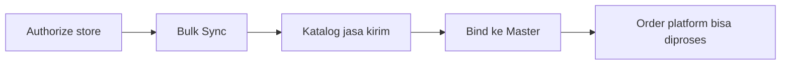

# Panduan Pengguna — Platform Shipping Service

**Siapa yang baca:** tim Omni Channel Operation  
**Menu:** Omni Channel → Platform Shipping Service  
**Route:** `/omni/shipping-service-platform`

---

## 1. Apa Itu & Kenapa Penting

**Platform Shipping Service** menampilkan jasa kirim yang dipakai di etalase marketplace (Shopee, TikTok, dll.) setelah ditarik ke OlshopERP. Kamu menyambungkannya ke **Master Shipping Service** internal supaya order dari platform bisa dikenali dan diproses gudang.

Tanpa binding, order marketplace sering tertahan karena sistem belum tahu jasa kirim internal mana yang dipakai.

---

## 2. Overview Flow & Proses Bisnis

**Versi teks:**

1. Store marketplace sudah di-authorize.  
2. Jalankan **Bulk Sync** untuk menarik jasa kirim.  
3. Setiap channel biasanya muncul 2 baris: **Drop Off (`-DO`)** dan **Pick Up (`-PU`)**.  
4. **Bind** ke Master Shipping Service.  
5. Order yang memakai jasa itu bisa diproses.

### Status yang kamu lihat

| Status | Arti | Bisa diubah field baris? |
|--------|------|--------------------------|
| **Not Binded** | Belum tersambung ke Master | Tidak — data dari sync |
| **Binded** | Sudah tersambung | Tidak — unbind lewat modal bila perlu |

---

## 3. Sebelum Mulai (Flow Sebelum)

- Store Shopee/TikTok sudah **authorized** dan aktif.  
- Untuk TikTok: **Warehouse Platform** toko sudah tersinkron.  
- Master Shipping Service internal sudah siap dipilih.  
- Tidak ada proses Bulk Sync yang masih berjalan.

🎬 [Interactive demo akan ditambahkan di sini]

---

## 4. Setelah Selesai (Flow Sesudah)

- Binding Status **Binded**.  
- Order platform yang sebelumnya error karena shipping belum bind bisa dilanjutkan.  
- Tracking number di Sales Order Platform tetap mengacu ke data jasa kirim platform ini.

---

## 5. Yang Perlu Diperhatikan

- Kalau kamu mencari tombol **Create**: tidak ada — data hanya dari Bulk Sync.  
- Kalau store baru sudah authorize tapi daftar kosong: jalankan Bulk Sync manual (tidak auto).  
- Kalau Start Sync minta **reauthorize**: perpanjang/otorisasi ulang store.  
- Kalau **Type Service** terlihat sama untuk DO dan PU: wajar untuk sementara — bedakan dari kode `-DO` / `-PU`.  
- Satu baris platform hanya boleh **satu** binding aktif; unbind dulu sebelum ganti.  
- Lazada/Tokopedia belum ikut Bulk Sync saat ini.  
- Dua baris nama sama bisa artinya **beda company owner** — bukan selalu duplikat error.

---

## 6. Langkah-Langkah (Step by Step)

1. Buka **Omni Channel → Platform Shipping Service**.  
2. Buka panel **Bulk Sync** → **Start Sync**.  
3. Tunggu selesai; bila gagal, baca Sync Log / pesan reauthorize.  
4. Filter atau cari baris **Not Binded**.  
5. Klik ikon binding → pilih Master Shipping Service → simpan.  
6. Pastikan status **Binded**.  
7. Uji order platform terkait bila sebelumnya tertahan.

🎬 [Interactive demo akan ditambahkan di sini]

---

## 7. Tips & Hal yang Sering Bikin Bingung

- **"Order tidak bisa diproses."** Cek Binding Status jasa kirim di order itu.  
- **"Sync tidak jalan."** Cek store authorized; cek tidak ada sync lain yang masih lock.  
- **"TikTok kosong."** Sync Warehouse Platform dulu, lalu Bulk Sync lagi.  
- **"Tracking dari mana?"** Dari Platform Shipping Service, bukan dari Master.

---

## 8. Referensi

| Sumber | Untuk apa |
|--------|-----------|
| [Knowledge Base](./knowledge-base.md) | Troubleshooting |
| [Requirement](./requirement.md) | Validasi & Gap Registry |
| [Technical](./technical.md) | API / job (developer) |
| [Master Shipping Service](../omni-shipping-service/README.md) | Sisi binding internal |
