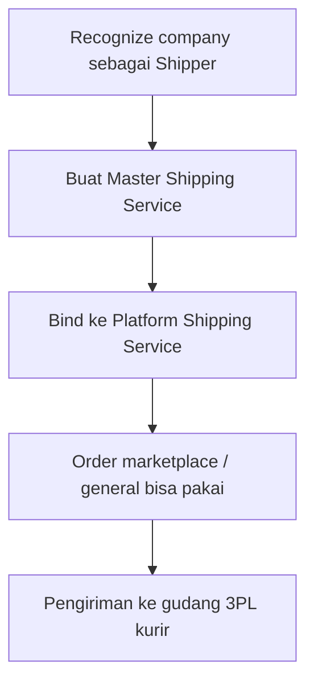

# Master Shipping Service — Knowledge Base

> **Audience:** Omni / Warehouse / Finance ops. **Route:** `/omni/shipping-service`

---

## 1. Apa itu?

Daftar **standar jasa kirim internal** perusahaanmu. Dipakai untuk:

- Menyambungkan nama jasa kirim marketplace (**binding**)  
- Mengisi jasa kirim di **Sales Order General**  
- Menentukan **kurir/shipper** yang punya gudang 3PL saat barang dikirim  

---

## 2. Glosarium

| Istilah | Arti awam |
|---------|-----------|
| **Shipper** | Perusahaan kurir (General Company yang di-recognize sebagai shipper) |
| **Binding** | Sambungkan jasa marketplace ke master internal |
| **Warehouse 3PL** | Gudang kurir tempat barang dikumpulkan sebelum ke pembeli |
| **Default Shipping Service** | Jasa yang otomatis terisi saat bikin order **pertama kali** |
| **Show for all company** | Perusahaan lain boleh lihat, tidak boleh ubah |
| **Not Binded / Binded** | Belum / sudah tersambung ke jasa platform |

---

## 3. Cara pakai

### Buat master

1. Pastikan Shipper sudah recognize + idealnya punya gudang 3PL (lihat section Warehouse di form).  
2. **Create** → isi Code, Shipper, nama service, Type (Pick Up / Drop Off), min/max weight, dimensi.  
3. Simpan. Type **tidak bisa diganti** setelah tersimpan.

### Binding

1. Buka Edit → tab/section **Shipping Binding**.  
2. Pilih satu atau lebih Platform Shipping Service yang masih Not Binded.  
3. Save. Jika gagal: company belum default owner store, atau platform sudah bound master lain.

### Inactive / Delete

- Delete ditolak jika sistem menganggap data sudah dipakai di transaksi.  
- **Hati-hati inactive:** sistem saat ini masih mengizinkan inactive meski order memakai jasa ini — bisa bikin field shipper di order kosong / proses packing gagal. Prefer jangan inactive jika masih dipakai.

---

## 4. Yang bisa / tidak bisa

| Aksi | Bisa? | Catatan |
|------|-------|---------|
| Create / edit weight & dimensi | ✅ | |
| Ganti Service Type setelah create | ❌ | Locked |
| Binding multi platform ke satu master | ✅ | Selama belum bound master lain (owner sama) |
| Logistic Label Template | ❌ | Belum berfungsi |
| Validasi gudang 3PL saat Save | ❌ | Baru ketahuan saat approve pengiriman DO |

---

## 5. Troubleshooting

| Gejala | Solusi |
|--------|--------|
| Binding failed — default owner | Set company sebagai default owner data store |
| Platform already bound | Unbind dulu dari master lama / cek menu Platform Shipping Service |
| Approve shipping gagal — no 3PL warehouse | Lengkapi pivot Warehouse 3PL untuk shipper di General Company |
| Warning segitiga di list | Max weight/dimensi master lebih besar dari platform yang di-bind — review angka |
| Shipper di SO jadi kosong | Cek apakah Master di-inactive-kan |
| Export With vs Without Details | With = pecah per binding platform; Without = ringkas tanpa detail platform |

---

## 6. FAQ

**Q: Kenapa shipper order berubah setelah saya edit Master?**  
A: Proses kirim baca data Master terkini, bukan kondisi saat order dibuat.

**Q: Default tidak muncul lagi di order kedua?**  
A: Setelah pernah buat order, sistem mengingat transaksi terakhir — default hanya untuk first-time.

**Q: Section Warehouse kosong?**  
A: Shipper belum punya gudang 3PL terhubung — perbaiki di setup shipper/company, bukan di field master.

---

## Related Documents

| Doc | Path |
|-----|------|
| Requirement | [requirement.md](./requirement.md) |
| Technical | [technical.md](./technical.md) |
| User Guide | [user-guide.md](./user-guide.md) |
| Platform Shipping Service | [../omni-shipping-service-platform/README.md](../omni-shipping-service-platform/README.md) |
