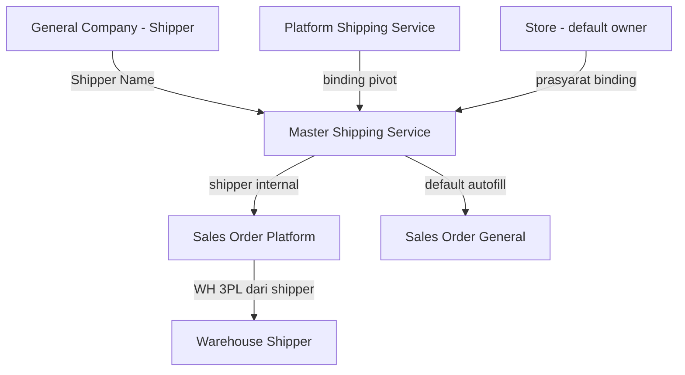
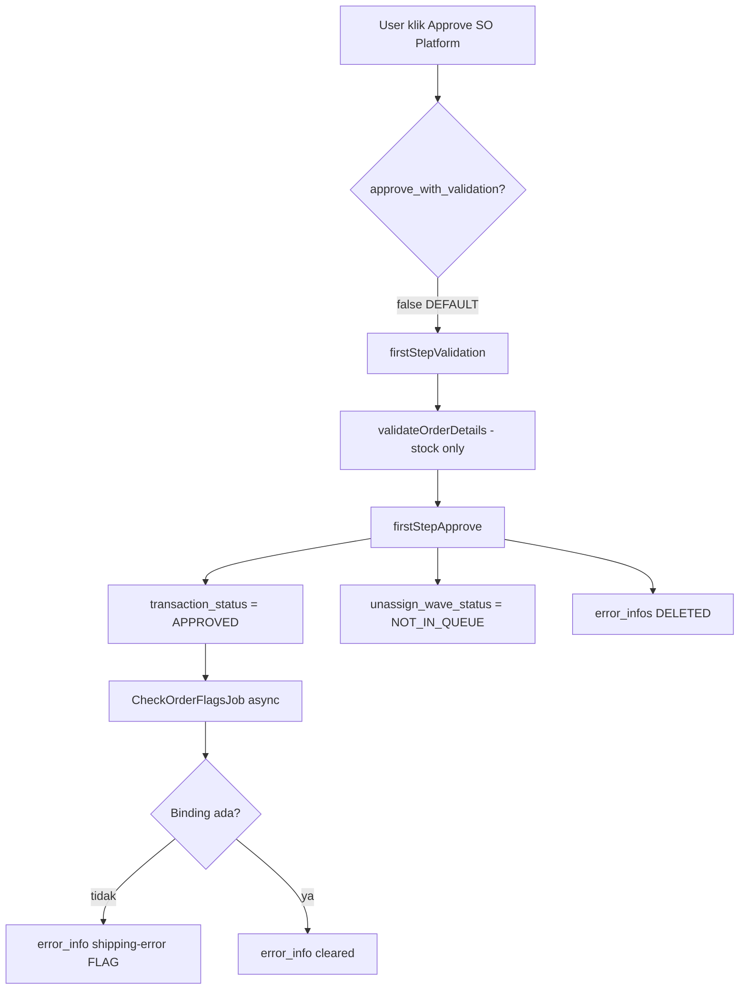

# Master Shipping Service — Requirement Documentation

> **Status: DRAFT** — v1.1 deep-check alur approve/wave + validasi weight (28 Juni 2026).

## 0. Metadata & Changelog

| Version | Date | Author | Changes |
|---------|------|--------|---------|
| 1.0 | 2026-06-28 | QA - Yemima | Konsolidasi `master_shipping_service_requirement.md`; verifikasi codebase; §5 UI/UX tombol; §6 export & platform sync; §12 gap analysis |
| 1.1 | 2026-06-28 | QA - Yemima | Deep-check approve vs Send to Default Wave (§8.1); detail export (§6.1); O-05/O-06; validasi weight (§8.2) |

**UI route:** `/omni/shipping-service`  
**API prefix:** `omnichannel/shipping-service/*`  
**Modul:** Omni Channel → Settings  
**Tabel utama:** `omni_shipping_services`

---

## 1. Ringkasan Eksekutif

**Master Shipping Service** mendefinisikan standar internal jenis pengiriman (shipper service), lalu di-**binding** ke penamaan shipping service dari masing-masing marketplace (Shopee, TikTok, Lazada, Tokopedia legacy).

| Kebutuhan Bisnis | Jawaban Master Shipping Service |
|------------------|----------------------------------|
| Konsistensi nama shipper lintas platform | 1 konfigurasi internal → banyak variasi nama platform via binding |
| Kontrol max/min weight & dimensions | Setting terpusat di master; validasi terhadap order |
| Validasi kelayakan paket | Weight/dimension order vs master saat approval (tergantung config) |
| Identifikasi WH Shipper (3PL) | Shipper (`shipping_id`) dari master internal dipakai proses gudang |

### 1.1 Diagram relasi



Menu terkait: [Platform Shipping Service](../omni-shipping-service-platform/README.md), [Store](../omni-store-binding/README.md), Sales Order Platform/General, Failed Ship.

---

## 2. Acceptance Criteria

### 2.1 DataList

| ID | Kriteria | Status codebase |
|----|----------|-----------------|
| A-01 | DataList grouped by Shipper Code (`row_group`) | ✅ |
| A-02 | Kolom: Warning, Code, Service Name, Shipper, Type Service, Min/Max Weight, Max Dimensions, Binding Status | ✅ |
| A-03 | Binding Status: **Binded** / **Not Binded** | ✅ |
| A-04 | Warning icon jika master weight/dimension **lebih besar** dari platform ter-binding | ✅ (informasi, bukan block save) |
| A-05 | Show Deleted, bulk delete, column filter, advanced filter | ✅ |
| A-06 | Export All (With/Without Details) via background job | ✅ |
| A-07 | Kolom "As Default Shipping Service" (hidden default, searchable) | ✅ |
| A-08 | **Import Excel create/update master** | ❌ Tidak ada — lihat §6 |

### 2.2 Basic Information (Create/Edit)

| ID | Kriteria | Status codebase |
|----|----------|-----------------|
| A-10 | Code & Shipper Name required | ✅ |
| A-11 | Shipper Name: General Company `is_shipper=1`, Active | ✅ `activeFilter()` + cek update inactive |
| A-12 | Shipper Service (`name`) required | ✅ |
| A-13 | Service Type: Drop Off / Pick Up (`master_shipping_service_types`) | ✅ **Required** |
| A-14 | Min/Max Weight (gram), Max Dimensions L×W×H (cm) | ✅ **Required**, numeric ≥ 0 |
| A-15 | Description max 150 karakter | ✅ |
| A-16 | Toggle Available Insurance | ✅ (informasi saja, belum relasi proses) |
| A-17 | Toggle Set as Default Shipping Service — single default per `owned_by`, auto OFF default lama | ✅ |
| A-18 | Toggle Active | ✅ |
| A-19 | Toggle Show for All Company — default OFF; visible hanya jika `owned_by` = company login | ✅ |
| A-20 | Logistic Label Template | ⚠️ UI ada, opsi kosong, belum fungsional |
| A-21 | Service Type tidak bisa diubah setelah create | ✅ disabled saat edit |
| A-22 | Uniqueness: kombinasi `shipping_id` + `name` + service type | ✅ |

### 2.3 Shipping Binding

| ID | Kriteria | Status codebase |
|----|----------|-----------------|
| A-30 | Section hanya tampil setelah master tersimpan (edit mode) | ✅ |
| A-31 | Shipper Service readonly dari Basic Information | ✅ |
| A-32 | Select Shipping Service multi-select (tags) dari Platform Shipping Service | ✅ |
| A-33 | 1 platform shipping service → max 1 master **per company** (`owned_by`) | ✅ |
| A-34 | 1 master → multiple platform (beda platform) | ✅ |
| A-35 | Binding hanya jika company punya Store dengan `default_company_owner` = company login | ✅ |
| A-36 | Save binding otomatis saat Save All (edit) | ✅ |

### 2.4 Relasi Order

| ID | Kriteria | Status codebase |
|----|----------|-----------------|
| A-40 | Header SO Platform: tampilkan nama master jika sudah binding | ✅ via `shipping_binding_pivot.shipping_service.name` |
| A-41 | Order tanpa binding → tidak lolos proses gudang | ⚠️ **Partial** — approve bisa sukses (config default), **Send to Default Wave diblok** — lihat §8.1 |
| A-42 | Validasi min/max weight & max dimension vs order | ⚠️ Gate sama dengan binding — lihat §8.2 |
| A-43 | Default shipping autofill Sales Order General | ✅ `getDefaultValues()` |
| A-44 | Delete master dipakai transaksi | ✅ ditolak |

### 2.5 Audit & Warehouse

| ID | Kriteria | Status codebase |
|----|----------|-----------------|
| A-50 | Audit Log slideover (Date, Source, Old/New Value, Action, User) | ✅ pola standar `auditDatatable` |
| A-51 | Side menu Warehouse Shipping → struktur WH shipper | ✅ slideover `warehouse_shipper/{id}` |

---

## 3. Validasi & Rules

| ID | Rule | Trigger | Pesan / behavior |
|----|------|---------|------------------|
| V-01 | `code` required, unique per company (non-deleted) | Create/update | "The code has already been taken." |
| V-02 | `name`, `shipping_id` required | Create/update | Laravel validation |
| V-03 | `shipping_id` harus General Company shipper Active | Create | "Shipper not found" |
| V-04 | `shipping_id` shipper inactive | Update | "Shipper is inactive. Please select another active shipper." |
| V-05 | `length`, `width`, `height`, `weight`, `min_weight` required numeric ≥ 0 | Create/update | Laravel validation |
| V-06 | `shipping_service_type_id` required, array max 1 | Create/update | "The service type field is required" |
| V-07 | `description` max 150 | Create/update | Laravel max:150 |
| V-08 | Duplikat `shipping_id` + `name` + service type | Create/update | "Shipping service {name} {type} in {shipper} already exist" |
| V-09 | Default ON → default lama same `owned_by` auto OFF | Create/update | Silent update |
| V-10 | Binding: platform sudah ter-binding ke master lain (same `owned_by`) | save_binding | "The shipping service platform '{name}' is already bound to shipping service ({codes})" |
| V-11 | Binding: company bukan default owner store | save_binding | "Binding failed. Only master shipping from internal company that is already set as default owner data store can be bound." |
| V-12 | Delete: dipakai di `SalesOrder.shipping_platform_system_id` | destroy | "Cannot delete this data because it is already used in transaction." |
| V-13 | Data company lain: `can_update=false`, toggle Show for All Company hidden | show | Read-only + `ToggleNotes` |
| V-14 | Show for All Company lock setelah relasi company lain | Update toggle OFF | ❌ **Belum diimplementasi** — lihat O-04 |

---

## 4. Fitur & Behavior

| ID | Fitur | Trigger | Expected result |
|----|-------|---------|-----------------|
| F-01 | Create master | Create → Save All | Redirect ke edit page; binding section muncul |
| F-02 | Save All (edit) | Tombol Save All | PUT master + PUT binding (jika ada perubahan binding) |
| F-03 | Export With Details | Export All slider | Excel per master + baris binding platform |
| F-04 | Export Without Details | Export All slider | Excel header master saja |
| F-05 | Warning mismatch weight/dimension | DataList render | Icon ⚠️ + tooltip perbandingan master vs platform bound |
| F-06 | Autofill default shipper create | Load select2 shipper | Prefill `is_default_shipper=1` jika ada |
| F-07 | Warehouse Shipping slideover | Side menu | Tampilkan tree WH shipper terkait master |

---

## 5. UI/UX — Halaman & Tombol

### 5.1 DataList (`/omni/shipping-service`)

| Elemen | Fungsi |
|--------|--------|
| **Create** | Navigasi ke `/omni/shipping-service/create` |
| **Checkbox row** | Multi-select untuk bulk delete |
| **Show Deleted** | Toggle tampilkan data soft-deleted |
| **Column manager / Filter** | Show/hide kolom, advanced filter per kolom |
| **Row group (Shipper)** | Baris dikelompokkan per kode shipper |
| **Warning icon (kolom pertama)** | Tooltip jika master weight/dimension melebihi batas platform ter-binding |
| **Binding Status badge** | Hijau **Binded** / kuning **Not Binded** |
| **Action (Edit/Delete/Restore)** | Standard DataTablesV3 — delete cek relasi transaksi |
| **Export All (slider)** | Buka panel Export File Table; pilih With/Without Details; proses background job |

**Default sort:** Min Weight ASC → Max Weight ASC → Shipper ASC.

### 5.2 Form Create/Edit

**Layout:** Accordion section kiri + sticky side navigation kanan.

| Side menu | Fungsi |
|-----------|--------|
| Basic Information | Scroll ke section; ✓ hijau jika edit mode |
| Shipping Binding | Scroll ke section; ✓ hijau jika ada ≥1 binding (edit only) |
| Warehouse Shipping | Buka slideover struktur WH shipper |
| Audit Log | Buka slideover audit trail (edit only) |
| **Save All** (sticky bottom) | Submit create/update + binding |

| Tombol/ikon | Mode | Fungsi |
|-------------|------|--------|
| Print (ikon printer) | Edit | Toast error: "Currently, there is no available print out design" |
| Save All | Create/Edit | POST (create) atau PUT (update); edit juga trigger save binding |

**Section Basic Information — field behavior:**

| Field | Create | Edit | Catatan UX |
|-------|--------|------|------------|
| Code | Editable | Editable jika `can_update` | Required |
| Shipper Name | Select2 async | Same | Autofill default shipper; inactive shipper `disabled` |
| Shipper Service | Editable | Editable | Placeholder "Standart Shipping" |
| Service Type | Editable | **Disabled** | Drop Off / Pick Up |
| Min/Max Weight | Number formatted + GRAM | Same | Required |
| Max Dimensions | L/W/H + CM | Same | Required |
| Logistic Label Template | Select (kosong) | Same | Belum fungsional |
| Description | Textarea | Same | Max 150 |
| Available Insurance | Toggle | Same | Info tooltip generik |
| Set as Default Shipping Service | Toggle | Same | — |
| Active | Toggle | Same | Default ON saat create |
| Show for All Company | Toggle | Hidden jika data milik company lain | Info: visible ke company lain |

**Section Shipping Binding (edit only):**

| Field | Behavior |
|-------|----------|
| Shipper Service | Readonly — mirror field `name` |
| Select Shipping Service | Multiselect tags; search Platform Shipping Service; TIPS box menjelaskan reassignment binding |

### 5.3 Warehouse Shipping slideover

Menampilkan `WarehouseStructureTable` read-only dari API `supplychain/warehouse_shipper/{shipping_service_id}` — struktur gudang shipper (3PL) terkait master ini.

---

## 6. Export Excel (AS-IS — tidak ada Import)

Menu ini **tidak memiliki Import Excel**. Satu-satunya bulk output adalah **Export All** background job.

### 6.1 Alur proses export (step-by-step)

```mermaid
sequenceDiagram
    participant Op as Operator
    participant FE as DataList ExportFileTable
    participant API as ShippingServiceController
    participant Job as ShippingServiceDetailExportJob
    participant Temp as omni_shipping_service_data_temps
    participant Excel as ShippingServiceDetailExportAll

    Op->>FE: Buka Export All slider
    Op->>FE: Pilih With Details / Without Details
    FE->>API: GET export-excel?filter=with_details|without_details
    API->>API: index(ExportData=true) — semua ID scoped owned_by
    API->>Job: Bus::batch per shipping_service_id (chunk 100)
    loop Per master record
        Job->>Job: ShippingServiceExportService chunk
        Job->>Temp: Insert rows + export_file_id
    end
    Job->>Excel: finally — merge temp → xlsx
    Excel->>Excel: Store S3/local; update export_file status=1
    Op->>FE: Poll export-file + export-progress
    Op->>FE: Download file selesai
```

| Step | Komponen | Detail |
|------|----------|--------|
| 1 | Trigger UI | DataList → panel **Export All** → pilih opsi dropdown |
| 2 | API | `GET omnichannel/shipping-service/export-excel?filter={type}` |
| 3 | Filter type | `MainModel::EXPORT_WITH_DETAILS` atau `EXPORT_WITHOUT_DETAILS` |
| 4 | Scope data | Hanya master milik `owned_by` = company login (via datalist query) |
| 5 | Job queue | `import_connection_{git_branch}`; batch name "Shipping Service With/Without Details Export" |
| 6 | Chunk | 100 ID per chunk; 100 job per batch |
| 7 | Temp table | `ShippingServiceDataTemp` — di-`forceDelete` setelah Excel selesai |
| 8 | File path | Production: S3 `exports/shipping-service/excels/`; local: `storage/exports/...` |
| 9 | Progress | `GET export-progress` → count `ShippingServiceExportFile` status=0 |
| 10 | History | `GET export-file` → Export File Table di slider |

### 6.2 Struktur file Excel

**Baris 1:** Judul merged (center) — `Export Shipping Service with Details {d-m-Y H:i:s}` atau `... without Details ...`

**Baris 2:** Header kolom (lihat tabel di bawah).

**Baris 3+:** Data.

| # | Header Excel | Field key | Format nilai | Keterangan |
|---|--------------|-----------|--------------|------------|
| 1 | Code | `code` | string | Kode master |
| 2 | Name | `name` | string | Shipper Service (nama internal) |
| 3 | Shipper | `shipper_name` | string | Nama General Company shipper |
| 4 | Shipping Service Type | `service_type` | string | `Drop Off` / `Pick Up` (bisa comma jika multi — AS-IS max 1) |
| 5 | Length | `length` | `{angka} CM` | Max dimension — panjang |
| 6 | Width | `width` | `{angka} CM` | Max dimension — lebar |
| 7 | Height | `height` | `{angka} CM` | Max dimension — tinggi |
| 8 | Weight | `weight` | `{angka} Grams` | **Maximum weight** master |
| 9 | Min Weight | `min_weight` | `{angka} Grams` | Minimum weight master |
| 10 | Insurance Available | `available_insurance` | `Yes` / `No` | |
| 11 | Default Shipping Service | `is_default` | `Yes` / `No` | |
| 12 | Status | `export_status` | `Active` / `Inactive` | |
| 13 | Description | `description` | string | `-` jika kosong |
| 14 | Created By | `export_created_by` | string | Nama user atau `System` |
| 15 | Created At | `export_created_at` | `d-m-Y H:i:s` | |
| 16 | Platform Name | `platform_name` | string | **Hanya With Details**; `-` jika Not Binded |
| 17 | Platform Shipping Service Code | `platform_service_code` | string | **Hanya With Details** |
| 18 | Platform Shipping Service Name | `platform_service_name` | string | **Hanya With Details** |

### 6.3 Rules shaping baris export

| Kondisi master | With Details | Without Details |
|----------------|--------------|-----------------|
| Tanpa binding | 1 baris; kolom 16–18 = `-` | 1 baris |
| N binding platform | N baris (master fields diulang per binding) | 1 baris (platform columns tetap `-`) |

**Contoh With Details** — master `JNT-REG-DO` bind ke Shopee + TikTok:

| Code | Name | ... | Platform Name | Platform Code | Platform Name |
|------|------|-----|---------------|---------------|---------------|
| JNT-REG-DO | Regular J&T Drop-Off | ... | Shopee | SP-reg_jnt-DO | SP-REG j&t-DO |
| JNT-REG-DO | Regular J&T Drop-Off | ... | TikTok Shop | TK-JNT-DO | TK-JNT-DO |

### 6.4 Validasi / batasan export

- Tidak ada data → error `"data not found."`
- Export tidak memfilter `status` atau `Binding Status` — semua master visible di datalist ikut ter-export.
- Tidak ada re-import path — file export **read-only reference**, bukan template upload.

---

## 6B. Platform Sync — Sumber Data Binding (menu terpisah)

Data platform **bukan** di-import lewat Master Shipping Service. Masuk via **Platform Shipping Service → Sync All**.

### 6B.1 Shopee & TikTok (ter-cover sync-all)

| Platform | API / Service | Record pattern |
|----------|---------------|----------------|
| **Shopee** | `OmniShopeeService::sync_logistic_all` → `/api/v2/logistics/get_channel_list` | Per channel **enabled**: 2 row `SP-{slug}-DO` + `SP-{slug}-PU`; weight = API kg × 1000 gram |
| **TikTok** | `OmniTikTokService::sync_logistic_all` → delivery_options + shipping_providers | Per provider: `TK-{slug}-DO` + `TK-{slug}-PU` |

Dispatch: `ShippingServicePlatformController@sync` → `ShippingServiceSyncJob` per store authorized.

### 6B.2 Lazada — gap sync (O-06, referensi task dev urgent)

**Problem:** Operator Lazada **tidak mendapat update shipping service otomatis** meskipun UI `preview-stores` sudah expose `lazada_store_id`.

**Root cause di codebase:**

| Bukti | Lokasi |
|-------|--------|
| `sync()` hanya query + dispatch Shopee & TikTok store | `ShippingServicePlatformController@sync` baris ~394–424 |
| Tidak ada branch Lazada store collection | Same method — zero reference `Platform::PL_LAZADA` |
| `OmniLazadaService` tidak implement `sync_logistic_all` | Tidak ada method; `OmniService::sync_logistic_all` delegate ke platform service |
| Data Lazada existing dari seeder manual | `ShippingServiceLazadaSeeder` — contoh `LZ-lazexpress-DO/PU` hardcoded dimension/weight |
| `previewStores()` **include** Lazada | Return `lazada_store_id` — misleading UX (store ada, sync tidak jalan) |

**Impact bisnis:**

- Order Lazada dengan shipping channel baru → `shipping_platform_system_id` tidak ketemu → error saat validasi wave.
- Operator harus create/update Platform Shipping Service **manual** atau jalankan seeder custom.
- Binding Master Shipping Service ke Lazada tidak bisa dilakukan untuk channel yang belum ada di platform table.

**Task improvement yang disarankan ( untuk dev ):**

1. Implement `OmniLazadaService::sync_logistic_all($store_id)` — mapping API Lazada logistics ke pola `LZ-{slug}-DO/PU`.
2. Tambah Lazada branch di `ShippingServicePlatformController@sync` (mirror Shopee/TikTok).
3. Dispatch `ShippingServiceSyncJob` untuk store Lazada authorized.
4. Update `validateQueue` / WebSocket channel jika perlu.
5. QA regression: sync log count, binding master, order Lazada approve → wave.

**Workaround sementara (operator):** Create manual di Platform Shipping Service atau extend seeder; binding master setelah record platform ada.

### 6B.3 Tokopedia

Deprecated — `OmniService` throw `"Tokopedia is deprecated"`. Legacy records only.

---

## 7. Relasi Menu Lain

| Menu | Peran |
|------|-------|
| General Company (Shipper) | Sumber Shipper Name; WH shipper tree |
| Platform Shipping Service | Target binding; sync API platform |
| Store | `default_company_owner` prasyarat binding |
| Sales Order Platform | Binding gate proses gudang; tampilan shipper internal |
| Sales Order General | Autofill `shipping_platform_system_id` dari default master |
| Unassign Wave / Send to Default Wave | Gate **`CheckApproveSoPlatform`** sebelum masuk wave |
| Product Shipping Information | Referensi platform shipping (bukan master langsung) |
| Failed Ship | WH 3PL dari shipper master (relasi tidak langsung) |

---

## 8. Relasi Approval Order, Wave & Validasi Shipping

### 8.1 Deep-check: Apakah order tanpa binding bisa lolos?

**Config kunci:** `config('omni.approve_so.approve_with_validation')` — default **`false`** (`config/omni.php`).

#### Alur A — Manual Approve (config default `false`)



**Jawaban O-03:**

| Pertanyaan | Jawaban AS-IS |
|------------|---------------|
| Flag error muncul, approve manual tetap bisa? | **Ya** — dengan config default, approve **sukses** (status Approved). `CheckOrderFlagsJob` kemudian menulis flag `shipping-error` (async, ~beberapa detik). |
| Apakah ter-block saat Send to Default Wave? | **Ya** — gate utama proses fisik gudang. `UnassignWaveController@processSOtoWave` → job `SOApproveToWave` → **`CheckApproveSoPlatform`** (selalu, tanpa cek config). Jika belum binding → `ValidationException` → job `fail()` → order **tetap NOT_IN_QUEUE**, **tidak masuk wave**. |
| Apakah order "lolos" ke gudang tanpa binding? | **Tidak** — selama operator harus Send to Default Wave (path normal). Order approved tanpa binding **macet** di Unassign Wave dengan flag error + failed process count. |

#### Alur B — Approve dengan `approve_with_validation = true`

`CheckApproveSoPlatform` dipanggil **saat approve**:
- Binding/weight/dimension dicek **sync** → approve **gagal** jika error.
- Jika sukses → `MoveSOToWaveMixJob` **langsung** saat approve (masuk default wave tanpa step terpisah).
- Config `omni.shipped_at.default_wave = true` → `shipSalesOrder` ke platform setelah masuk wave.

#### Ringkasan gate

| Gate | Cek binding? | Block? | Config |
|------|--------------|--------|--------|
| Manual Approve | ❌ (path default) | Tidak block approve | `approve_with_validation=false` |
| CheckOrderFlagsJob | ✅ | Flag saja, tidak rollback approve | Selalu dispatch setelah approve platform |
| Send to Default Wave (`SOApproveToWave`) | ✅ | **Block masuk wave** | Selalu |
| MoveSOToWaveMixJob (inside CheckApproveSoPlatform) | ✅ | Hanya jalan jika validasi lolos | Saat approve jika config true, atau via SOApproveToWave |

**Kesimpulan requirement vs AS-IS:**

- Inti bisnis *"order tidak boleh lolos ke gudang tanpa binding"* → **terpenuhi di gate wave** (`SOApproveToWave`), **tidak** di gate approve manual (config default).
- **Gap UX:** Order bisa status **Approved** + flag merah — operator mungkin mengira sudah siap proses.
- **Rekomendasi dev (opsional):** Set `approve_with_validation=true` di production, atau tambah pre-check binding di `firstStepValidation` agar approve sync-block selaras requirement bisnis.

**Catatan:** `can_approve` **tidak** memeriksa `error_info` — hanya status Open + Gate privilege.

### 8.2 Validasi Weight & Dimension — detail teknis

Validasi shipping (binding + weight + dimension) terpusat di **`SalesOrderController@CheckApproveSoPlatform`** dan mirror di **`CheckOrderFlagsJob`** (check-only, tidak pindah wave).

#### Prasyarat

1. Order punya `shipping_platform_system_id` (FK ke `omni_shipping_service_platforms.id`).
   - Jika kosong: sistem coba resolve via `ShippingServicePlatformController@getShippingPlatform(platform, shipping_platform_id)`.
   - Gagal resolve → error `"The shipping service platform not found."`
2. Ada pivot `ShippingServiceBindingPivot` untuk platform ID tersebut.
   - Tidak ada → `"The shipping service has not been tied to the shipping service platform yet."`
3. Master `ShippingService` dari pivot harus exist.
   - Tidak ada → `"Shipper is not linked with a master shipping service."`

#### Sumber angka order (`SalesOrder::getOtherDetail()`)

| Field order | Cara hitung |
|-------------|-------------|
| `weight` | Sum per detail: `(ProductDnW.weight converted to gram \|\| 1) × primary_unit_qty` — skip detail `origin_price > 0` |
| `volume_total` | Sum per detail: `length × width × height × primary_unit_qty` (DnW primary, default 1 jika null) |
| `length/width/height` | Dari detail dengan **volume terbesar** (bukan sum per axis) |

#### Sumber batas master

| Rule | Master field | Operator |
|------|--------------|----------|
| Max weight | `weight` | `order.weight > master.weight` → fail |
| Min weight | `min_weight` | `order.weight < master.min_weight` → fail |
| Max dimension | `length × width × height` | `order.volume_total > master L×W×H` → fail |

**Penting — bukan per-axis:** Validasi **tidak** membandingkan `order.length` vs `master.length` individually. Hanya **volume total** order vs **produk dimensi** master.

#### Pesan error & flag UI

| Error key | Pesan | Icon datalist SO |
|-----------|-------|------------------|
| `shipping-error` | Binding / platform not found | truck |
| `shipping-error-max-weight` | exceeds the maximum weight | truck |
| `shipping-error-min-weight` | exceeds the minimum weight | truck |
| `shipping-error-dimension` | exceeds the maximum dimension | (same family) |

Flag disimpan di `omni_sales_order_errors.error` (JSON). Unassign Wave menu **failed process** filter `whereHas('error_info')`.

#### Kapan validasi dijalankan

| Trigger | Sync/async | Rollback approve? | Masuk wave? |
|---------|------------|-------------------|-------------|
| Approve (`approve_with_validation=true`) | Sync | Ya (exception) | Ya jika pass |
| Approve (`approve_with_validation=false`) | — | — | Tidak (NOT_IN_QUEUE) |
| CheckOrderFlagsJob setelah approve | Async queue | Tidak | Tidak |
| SOApproveToWave (Send to Default Wave) | Async job, validasi sync inside | Tidak (sudah approved) | Tidak jika fail |
| WaveService / picking / checking | — | — | **Tidak ada** cek weight shipping |

#### Retroaktif

Jika master weight/dimension **diubah** setelah order approved: validasi ulang hanya saat **Send to Wave** atau re-run flag job — order yang sudah **IN wave / processed** tidak di-rollback otomatis.

### 8.3 Default Shipping Service → Sales Order General

| Aspek | AS-IS |
|-------|-------|
| Single default | Satu `is_default_shipping_service=1` per `owned_by`; set baru auto OFF lama |
| Autofill field | `shipping_platform_system_id` (UI: Shipper Service) |
| Endpoint | `GET omnichannel/sales-order/default-values` |
| Priority | (1) Latest SO General same `owned_by` + same user created_by → (2) latest company → (3) fallback default |

#### O-05 — Risiko bug fallback default (detail)

Kode fallback (`SalesOrderController@getDefaultValues`):

```php
if (! $shippingId || ! ShippingService::where('id', $shippingId)->where('status', 1)->exists()) {
    $data['shipping_platform_system_id'] = ShippingService::where('is_default_shipping_service', 1)->value('id');
}
```

| Issue | Penjelasan | Severity |
|-------|------------|----------|
| **No `owned_by` filter** | Query `.value('id')` ambil **first match** default visible dalam company scope — bisa default company **lain** jika `is_all_company=1` dan visible via `gs_internal_company_show_public_data` | ⚠️ Major jika multi-company pakai public master |
| **No `status=1` filter** on fallback | Fallback bisa set ID master **Inactive** | ⚠️ Medium |
| **Arbitrary ordering** | Tanpa `orderBy` — DB return order tidak deterministic jika multiple default visible | ⚠️ Medium |
| **Field naming confusion** | `shipping_platform_system_id` di SO General sebenarnya FK ke **`omni_shipping_services.id`** (master), bukan platform table | Info — legacy naming |

**Skenario bug:**

1. Company A punya default master ID=10 (private).
2. Company B punya default master ID=20 (`is_all_company=1`, visible ke A).
3. User Company A create SO General tanpa history → fallback query return ID=10 **or** ID=20 depending SQL plan → **inkonsisten**.

**Fix yang disarankan dev:**

```php
ShippingService::where('owned_by', getToken()->company_id)
    ->where('is_default_shipping_service', 1)
    ->where('status', 1)
    ->value('id');
```

---

## 9. Do's and Don'ts

### Do's

- Binding segera setelah sync platform shipping service.
- Set max weight/dimension sesuai kapasitas riil shipper.
- Set default shipping untuk mempercepat create Sales Order General.
- Cek warning icon di DataList jika master melebihi limit platform ter-binding.

### Don'ts

- Jangan bind 1 platform service ke 2 master (same company).
- Jangan andalkan Logistic Label Template (belum aktif).
- Jangan hapus master yang sudah dipakai transaksi.
- Jangan assume approve selalu block tanpa binding — cek config `approve_with_validation`.

---

## 10. Edge Cases

| Case | Expected (requirement) | AS-IS codebase |
|------|------------------------|----------------|
| Shipping platform baru belum pernah sync | Entry Not Binded di platform list | Auto-resolve saat order: `getShippingPlatform()` atau error not found |
| Max weight diturunkan, order in-flight | Validasi order baru | Validasi saat approve/flag job — tidak retroaktif block wave |
| Inactive master yang jadi default | Block atau cabut default | ⚠️ Tidak ada auto-unset default; inactive tetap bisa jadi default flag |
| Public → Private setelah company lain pakai | Toggle terkunci ON | ❌ Tidak ada validasi lock khusus |
| Company B stop pakai data Public | Bisa private lagi | ❌ Belum diverifikasi — tidak ada logic relasi usage |

---

## 11. QA Test Notes

1. Create master lengkap → binding 2 platform (Shopee + TikTok) → cek DataList Binded.
2. Coba bind platform yang sudah dipakai master lain → expect error V-10.
3. **O-03 regression:** SO Platform shipper belum binding → approve manual (config default) → status **Approved** + flag `shipping-error` async → coba **Send to Default Wave** → expect **gagal** (UnassignWaveLog fail, tetap NOT_IN_QUEUE).
4. Set `approve_with_validation=true` di `.env`/config → approve harus **ditolak sync** jika belum binding.
5. **Weight:** Set master max weight 500g → order dengan product DnW total >500g → Send to Wave → expect `shipping-error-max-weight`.
6. Set default → create SO General → field Shipper Service ter-autofill; cek fallback tidak ambil default company lain (O-05).
7. Export With Details → verifikasi 18 kolom + multi-row per binding.
8. Delete master unused → sukses; delete master dipakai SO → ditolak V-12.

---

## 12. Known Gaps & Perhatian Ke Depan

### 12.1 Ringkasan status open items

| ID | Status | Kategori |
|----|--------|----------|
| O-03 | ✅ Documented — partial AS-IS | Approve bisa sukses; **wave gate block** |
| O-05 | ⚠️ Bug risk | Fallback default SO General |
| O-06 | ❌ Missing feature | Lazada sync — task dev urgent |
| O-02 | 📋 Perhatian ke depan | Logistic Label Template |
| O-04 | 📋 Perhatian ke depan | Lock Show for All Company |
| O-07/O-08 | ✅ Resolved | Required — selaras codebase |
| O-09 | 📋 Perhatian ke depan | Inactive + Default flag |
| O-01 | ✅ Documented | Export only — detail §6 |

### 12.2 O-03 — Approve vs Wave (verified)

| Stage | Block tanpa binding? |
|-------|---------------------|
| Manual Approve (config default) | **Tidak** — order jadi Approved |
| CheckOrderFlagsJob | Flag saja |
| Send to Default Wave | **Ya** — `SOApproveToWave` → `CheckApproveSoPlatform` |

**Requirement bisnis** *order tidak lolos ke gudang* → **terpenuhi di wave gate**, bukan di approve gate (config default).

### 12.3 O-05 — Default shipping fallback (bug risk)

Lihat §8.3. Fallback `getDefaultValues` tanpa `owned_by` + `status` filter — potensi autofill master default company lain atau inactive.

### 12.4 O-06 — Lazada sync gap (task dev)

Lihat §6B.2 — `sync-all` exclude Lazada; hanya seeder/manual.

### 12.5 Perhatian ke depan (belum perlu fix immediate)

| ID | Item | Catatan |
|----|------|---------|
| **O-02** | Logistic Label Template | UI field ada; backend tidak wired; tunggu keputusan end user |
| **O-04** | Lock Show for All Company | Requirement: tidak bisa private setelah dipakai company lain — **belum ada validasi** di `ShippingServiceController@update`; perlu design relasi usage sebelum implement |
| **O-09** | Inactive + Default | Master inactive masih bisa carry `is_default_shipping_service=1`; fallback SO bisa dapat inactive default |

### 12.6 Resolved / documented

| ID | Resolusi |
|----|----------|
| O-01 | Tidak ada import; export detail §6 |
| O-07/O-08 | Service Type + Min/Max Weight **required** — requirement doc selaras codebase |
| O-10 | Weight validation **tidak** di WaveService — hanya CheckApproveSoPlatform / CheckOrderFlagsJob / SOApproveToWave |

---

## Related Documents

| Doc | Path |
|-----|------|
| Knowledge Base | [knowledge-base.md](./knowledge-base.md) |
| Technical | [technical.md](./technical.md) |
| Platform Shipping Service | [../omni-shipping-service-platform/README.md](../omni-shipping-service-platform/README.md) |
| Store | [../omni-store-binding/requirement.md](../omni-store-binding/requirement.md) |
