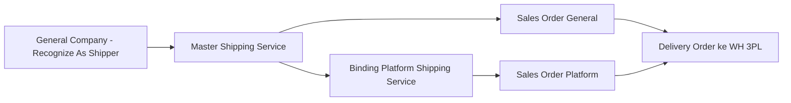
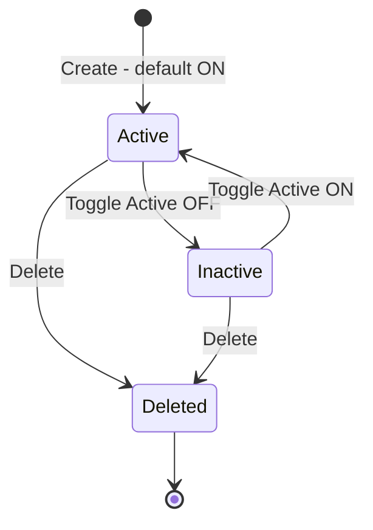
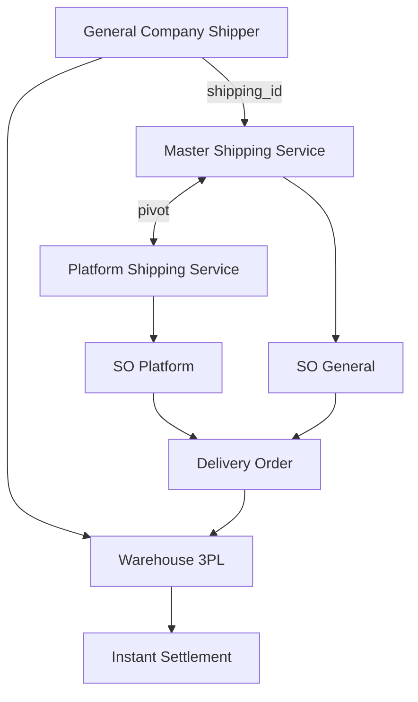

# Master Shipping Service — Requirement Documentation

**Modul:** Omni Channel → Settings  
**UI route:** `/omni/shipping-service`  
**API prefix:** `omnichannel/shipping-service`  
**Audience:** PM, Omni ops, Warehouse, Finance, QA, Developer  
**PM source:** Master Shipping Service Source of Truth **v1.0** (3 Agustus 2026)

> AS-IS diverifikasi codebase 3 Agu 2026 (`ShippingServiceController`, binding pivot, `TransferShippingDoController`, export service).

---

## 0. Metadata & Changelog

| Version | Date | Author | Changes |
|---------|------|--------|---------|
| 2.0 | 2026-08-03 | QA - Yemima | Rewrite dari SoT v1.0 + verifikasi; Gap `GAP-MSS-01..05`; export With/Without Details; typo key binding |
| 1.1 | 2026-06-28 | QA - Yemima | Draft deep-check (digantikan v2.0) |
| 1.0 | 2026-06-28 | QA - Yemima | Draft awal |

---

## 1. Ringkasan Eksekutif

**Master Shipping Service** adalah standar jasa kirim **internal per company**. Dipakai untuk:

1. **Binding** ke Platform Shipping Service (order marketplace)  
2. Opsi jasa kirim langsung di **Sales Order General**  
3. Menentukan **Shipper** → Warehouse **3PL** saat Shipping DO / pengiriman  

```mermaid
flowchart LR
    GC[General Company - Recognize As Shipper] --> MSS[Master Shipping Service]
    MSS --> BIND[Binding Platform Shipping Service]
    MSS --> SOG[Sales Order General]
    BIND --> SOP[Sales Order Platform]
    SOG --> DO[Delivery Order ke WH 3PL]
    SOP --> DO
```

Audience utama: Omni Channel Operation, Warehouse, Finance (Instant Settlement bergantung stok sampai 3PL).

---

## 2. Prasyarat

| Prasyarat | Sumber | Catatan |
|-----------|--------|---------|
| General Company recognize as Shipper (active) | General Company | Onboarding shipper otomatis membuat WH 3PL + pivot |
| Warehouse 3PL + pivot company–warehouse | General Company / WH 3PL | **Tidak divalidasi saat Save Master** — gate di approve Shipping DO → GAP-MSS-01 |
| Master Shipping Service Type (Pick Up / Drop Off) | Reference | Max 1; locked setelah create |
| Company = default owner data store | Store | Wajib sebelum **binding** |

---

## 3. Siklus status

```mermaid
stateDiagram-v2
    [*] --> Active: Create - default ON
    Active --> Inactive: Toggle Active OFF
    Inactive --> Active: Toggle Active ON
    Active --> Deleted: Delete
    Inactive --> Deleted: Delete
    Deleted --> [*]
```

| Status | Editable? | Catatan |
|--------|-----------|---------|
| Active | Ya | Default create |
| Inactive | Ya | **Requirement:** tolak jika sudah dipakai order; jika Binded tapi belum dipakai order, inactive OK + Binding → Not Binded. **AS-IS:** tidak ditolak, binding tidak otomatis dibersihkan → GAP-MSS-02 |
| Deleted | — | Soft delete; ditolak jika “used in transaction” (lihat §7.4 / GAP-MSS-03) |

Efek ideal ke Platform: inactive/delete Master yang Binded → Platform Binding Status jadi **Not Binded** (hanya jika pivot dihapus). Detail binding Platform: [omni-shipping-service-platform](../omni-shipping-service-platform/requirement.md).

---

## 4. Datalist

Grouped by **Shipper code** (`row_group`).

| Kolom | Default visible | Keterangan |
|-------|-----------------|------------|
| Warning icon | Ya | Master weight/dimensi **lebih besar** dari platform ter-bind (info, bukan block save) |
| Code | Ya | |
| Service Name | Ya | |
| Shipper | Ya | `shipper.code` — basis group |
| Type Service | Ya | Drop Off / Pick Up (pilihan user — beda dari Platform AS-IS type id `1`) |
| Min Weight | Ya | Gram |
| Max Weight | Ya | Gram (`weight`) — field terpisah dari dimensi |
| Max Dimensions | Ya | L × W × H cm |
| Binding Status | Ya | Not Binded / Binded |
| Active | Ya | |
| Created By \| At | Ya | |
| As Default | Hidden | `is_default_shipping_service` |
| Action Edit/Show/Delete | Ya | |

**Fitur:** Global search **contains** pada `code` / `name`; Show Deleted; column show/hide; Advanced Export **With Details** vs **Without Details**.

| Export | Isi |
|--------|-----|
| Without Details | 1 baris per master; kolom platform = `-` |
| With Details | 1 baris per binding (platform name/code/service); jika belum bind → 1 baris platform `-` |

---

## 5. Form & field

### 5.1 Basic Information

| Field | Wajib | Catatan |
|-------|-------|---------|
| Code | Ya | Unik (non-deleted) |
| Shipper Name | Ya | General Company `is_shipper` + active; update gagal jika shipper inactive |
| Shipper Service (name) | Ya | |
| Service Type | Ya | Max 1 Pick Up / Drop Off; **locked** setelah tersimpan (`disabled` bila ada `id`) |
| Minimum Weight | Ya | ≥ 0 gram |
| Maximum Weight | Ya | ≥ 0 gram — **bukan** bagian label Dimensions |
| Max Dimensions L/W/H | Ya | ≥ 0 cm |
| Logistic Label Template | Tidak | UI ada; **tidak di fillable / tidak persist** → GAP-MSS-05 |
| Description | Tidak | Max 150 |
| Available Insurance | Tidak | Flag info saja |
| Set as Default | Tidak | Max 1 default aktif per `owned_by`; auto-off default lama |
| Active | Tidak | Default ON |
| Show for all company | Tidak | Company lain bisa lihat, tidak ubah (`is_all_company` + `can_update`) |

Duplikat bisnis ditolak: **Shipper + Name + Service Type** sama.

### 5.2 Shipping Binding

| Field | Catatan |
|-------|---------|
| Shipper Service | View only |
| Select Shipping Service | Multi Platform Shipping Service; payload key AS-IS typo `shipping_service_platfrom` |

Validasi binding: company harus default owner store; platform yang sudah bound ke master **lain dengan owner sama** ditolak.  
**Nuansa GAP-MSS-04:** dari sisi Master, cek bentrok scoped `owned_by` (beda owner bisa bind platform yang sama). Dari sisi Platform menu, bind keras 1:1 global (`GAP-PSP-02`).

### 5.3 Warehouse Shipper (view only)

Tree WH 3PL dari pivot shipper company. Kosong tanpa warning di halaman ini jika pivot belum ada (GAP-MSS-01).

### 5.4 Audit Log

Standar audit menu OlshopERP.

---

## 6. How It Works

### 6.1 Shipper order = data terkini, bukan snapshot

Saat order diproses ke pengiriman / DO, sistem baca `shipping_id` Master **saat itu** — bukan snapshot saat SO dibuat. Edit Shipper Name setelah order masuk memengaruhi gudang 3PL saat proses lanjut.

### 6.2 Gate 3PL di Shipping DO, bukan di Save Master

Approve Shipping DO: `Company3PLWarehousePivot` untuk `delivery_order.shipper_id` wajib ada. Pesan AS-IS:  
`Approval failed because the shipper doesn’t have a 3PL warehouse.`

### 6.3 Default Shipping Service

Hanya autofill **create order pertama kali**. SO General/Internal selanjutnya memakai auto-save dari transaksi terakhir.

---

## 7. Validasi

### 7.1 Create

| Kondisi | Pesan AS-IS |
|---------|-------------|
| Code duplikat | `The code has already been taken.` |
| Shipper invalid | `Shipper not found` |
| Service type required | `The shiping service type field is required` *(typo dipertahankan)* |
| Type tidak ditemukan | `some of your shipping service type not found` |
| Duplikat Shipper+Name+Type | `Shipping service {name} {type} in {shipper} already exist` |

### 7.2 Update

| Kondisi | Pesan AS-IS |
|---------|-------------|
| Shipper inactive | `Shipper is inactive. Please select another active shipper.` |
| Service type kosong | `The service type field is required` |
| Duplikat | sama create |
| Inactive saat dipakai order | **Requirement tolak** — **AS-IS tidak ada cek** → GAP-MSS-02 |

### 7.3 Binding

| Kondisi | Pesan AS-IS |
|---------|-------------|
| Bukan default owner store | `Binding failed. Only master shipping from internal company that is already set as default owner data store can be bound.` |
| Platform sudah bound master lain (owner sama) | `The shipping service platform '{name}' is already bound to shipping service ({codes})` |

### 7.4 Delete

| Kondisi | Behavior |
|---------|----------|
| `SalesOrder.shipping_platform_system_id` = **id Master** exists | `Cannot delete this data because it is already used in transaction.` |
| Tidak ketemu | Soft delete |

**GAP-MSS-03:** SO Platform biasanya menyimpan ID **Platform** Shipping Service di kolom itu — delete Master via binding bisa lolos.

---

## 8. Relasi menu lain

```mermaid
flowchart TB
    GC[General Company Shipper] -->|shipping_id| MSS[Master Shipping Service]
    GC --> WH3PL[Warehouse 3PL]
    MSS <-->|pivot| PSP[Platform Shipping Service]
    PSP --> SOP[SO Platform]
    MSS --> SOG[SO General]
    SOP --> DO[Delivery Order]
    SOG --> DO
    DO --> WH3PL
    WH3PL --> IS[Instant Settlement]
```

| Menu | Peran |
|------|-------|
| [General Company](../generalsetting-general-company/README.md) | Shipper + auto WH 3PL |
| [Platform Shipping Service](../omni-shipping-service-platform/README.md) | Binding |
| SO Platform / General | Resolve / pilih master; weight vs master |
| Delivery Order / Shipping DO | `shipper_id` → pivot 3PL |
| Instant Settlement | Butuh stok di 3PL |
| Skip Processing | Bisa gagal generate DO jika shipper inactive (GAP-MSS-02) |

---

## 9. Acceptance Criteria

| ID | Kriteria |
|----|----------|
| MSS-01 | Create/update field wajib + unik code + duplikat Shipper+Name+Type |
| MSS-02 | Service Type max 1; locked setelah create |
| MSS-03 | Binding butuh default owner store; multi platform; key typo AS-IS |
| MSS-04 | Warning datalist jika master weight/dim > platform bind |
| MSS-05 | Export With Details = baris per binding; Without = tanpa detail platform |
| MSS-06 | Default max 1 per owned_by |
| MSS-07 | Gap registry terdokumentasi; inactive/delete usage gaps diketahui |

---

## 10. FAQ

**Q: Shipper di order berubah setelah Master diedit?**  
A: Sistem baca Master terkini saat proses kirim, bukan snapshot create order.

**Q: Tidak bisa pilih platform saat binding?**  
A: Sudah Binded ke master lain (cek menu Platform / pesan bound codes).

**Q: Shipping 3PL gagal meski Master lengkap?**  
A: Shipper belum punya pivot Warehouse 3PL — cek section Warehouse Shipper / setup General Company.

**Q: Min/Max Weight vs Max Dimensions?**  
A: Berat (gram) vs ukuran paket L×W×H (cm) — field terpisah.

---

## 11. Gap Registry

| ID | Deskripsi | Status |
|----|-----------|--------|
| GAP-MSS-01 | Save Master tidak cek pivot WH 3PL; gate di approve Shipping DO | Open |
| GAP-MSS-02 | Inactive tidak ditolak walau dipakai order; binding tidak auto-clear; SO shipper NULL / Skip Processing risk | Open |
| GAP-MSS-03 | Destroy cek `shipping_platform_system_id` = master id — miss pemakaian via SO Platform (ID platform) | Open |
| GAP-MSS-04 | Bisnis multi-owner bind vs Platform 1:1; Master-side scoped owned_by | Open (= GAP-PSP-02) |
| GAP-MSS-05 | Logistic Label Template UI non-fungsional / tidak persist | Open |

---

## Related Documents

| Doc | Path |
|-----|------|
| Knowledge Base | [knowledge-base.md](./knowledge-base.md) |
| Technical | [technical.md](./technical.md) |
| User Guide | [user-guide.md](./user-guide.md) |
| Platform Shipping Service | [../omni-shipping-service-platform/README.md](../omni-shipping-service-platform/README.md) |
