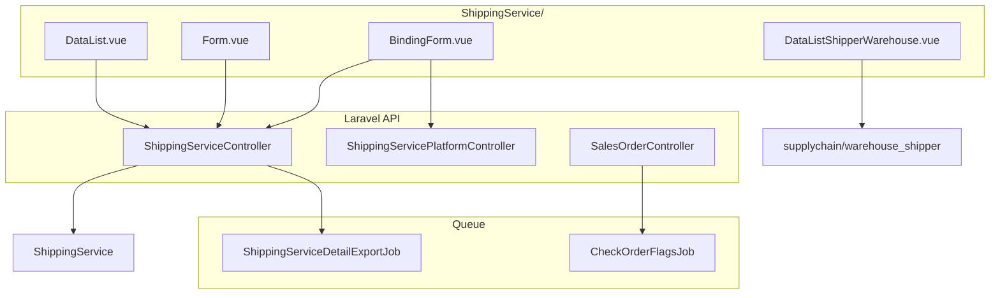
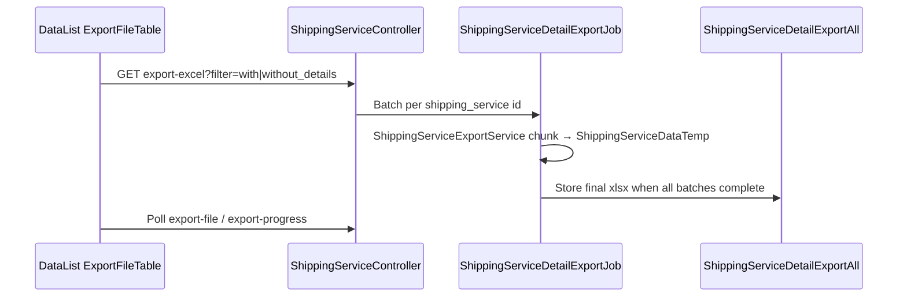

# Master Shipping Service — Technical Documentation

> **Status: DRAFT** — v1.0 (2026-06-28). Verifikasi codebase menyeluruh.

## 0. Metadata

| Field | Value |
|-------|-------|
| Menu slug | `omni-shipping-service` |
| UI route | `/omni/shipping-service` |
| API base | `{VITE_API_URL}omnichannel/shipping-service` |
| Controller | `Modules/OmniChannel/Http/Controllers/ShippingServiceController.php` |
| Entity | `Modules/OmniChannel/Entities/ShippingService.php` |
| Table | `omni_shipping_services` |
| Policy | `Modules/OmniChannel/Policies/ShippingServicePolicy.php` (extends `MainPolicy`) |
| Binding pivot | `omni_shipping_service_binding_pivots` |

**Validasi:** Inline di `ShippingServiceController` — **tidak ada** dedicated FormRequest class.

---

## 1. Architecture Overview



---

## 2. Frontend File Map

**Root:** `olshoperp-frontend/src/pages/Omni/master/ShippingService/`

| File | Role | Key API / behavior |
|------|------|-------------------|
| `DataList.vue` | Grid + export + bulk delete | `GET omnichannel/shipping-service`; row group shipper; ExportFileTable |
| `Form.vue` | Create/edit Basic Info + side nav | POST/PUT shipping-service; audit slideover; print stub |
| `BindingForm.vue` | Multi-select platform binding | GET/PUT `{id}/binding` |
| `DataListShipperWarehouse.vue` | WH shipper slideover | `GET supplychain/warehouse_shipper/{id}` |
| `components/ShippingServiceSelect.vue` | Reusable select2 | `GET shipping-service/select2` |

**Router:** `src/router/index.ts` — `shipping-service`, `create`, `edit/:id`.

---

## 3. Backend File Map

| File | Role |
|------|------|
| `ShippingServiceController.php` | CRUD, datalist, binding, export, select2, audit |
| `ShippingServicePlatformController.php` | Platform CRUD, sync, select2 for binding picker |
| `Entities/ShippingService.php` | Model master |
| `Entities/ShippingServiceBindingPivot.php` | Pivot master ↔ platform |
| `Entities/ShippingServiceType.php` | Pivot master ↔ `MasterShippingServiceType` |
| `Entities/MasterShippingServiceType.php` | Drop Off / Pick Up lookup |
| `Services/ShippingServiceExportService.php` | Chunk data for export job |
| `Exports/ShippingServiceDetailExportAll.php` | Excel assembly |
| `Jobs/ShippingServiceDetailExportJob.php` | Per-record export worker |
| `Jobs/CheckOrderFlagsJob.php` | Post-approve shipping validation flags |
| `Jobs/ShippingServiceSyncJob.php` | Platform sync (Platform menu, not master) |
| `Services/OmniShopeeService.php` | `sync_logistic_all` — Shopee channel list |
| `Services/OmniTikTokService.php` | `sync_logistic_all` — TikTok delivery options |
| `Database/Seeders/MasterShippingServiceTypeSeeder.php` | DO / PU types |
| `Database/Seeders/ShippingServiceLazadaSeeder.php` | Manual Lazada platform seed |

---

## 4. API Routes

### 4.1 Master Shipping Service (`auth:sanctum`)

| Method | Path | Handler | Notes |
|--------|------|---------|-------|
| GET | `omnichannel/shipping-service` | `index` | DataTables JSON |
| POST | `omnichannel/shipping-service` | `store` | Create |
| GET | `omnichannel/shipping-service/{id}` | `show` | Detail + `can_update` |
| PUT | `omnichannel/shipping-service/{id}` | `update` | Update |
| DELETE | `omnichannel/shipping-service/{id}` | `destroy` | Soft delete; block if used in SO |
| GET | `omnichannel/shipping-service/select2` | `select2` | Picker lintas menu |
| GET | `omnichannel/shipping-service/select2-shipper` | `select2Shipper` | Delegates GeneralCompanyController |
| GET | `omnichannel/shipping-service/select2-shipping-service-type` | `select2ShippingServiceType` | Drop Off / Pick Up |
| GET | `omnichannel/shipping-service/select2-shipping-service-platform` | `select2ShippingServicePlatform` | Binding multiselect source |
| GET | `omnichannel/shipping-service/{id}/binding` | `show_binding` | Current bindings |
| PUT | `omnichannel/shipping-service/{id}/binding` | `save_binding` | Sync pivot rows |
| GET | `omnichannel/shipping-service/{id}/audit` | `audit` | Audit trail |
| GET | `omnichannel/shipping-service/export-file` | `exportFile` | Export history table |
| GET | `omnichannel/shipping-service/export-progress` | `exportProgress` | In-progress count |
| GET | `omnichannel/shipping-service/export-excel` | `exportExcel` | Dispatch export batch |

### 4.2 Related (Sales Order General default)

| Method | Path | Handler |
|--------|------|---------|
| GET | `omnichannel/sales-order/default-values` | `SalesOrderController@getDefaultValues` |

---

## 5. Database Schema

### 5.1 `omni_shipping_services`

| Column | Type | Notes |
|--------|------|-------|
| `id` | bigint PK | |
| `code` | string | Unique with `owned_by`, `deleted_at` |
| `name` | string | Shipper Service label |
| `description` | text nullable | Max 150 validated |
| `shipping_id` | FK → `gs_companies` | Shipper (General Company) |
| `length`, `width`, `height` | decimal + unit FK | cm base |
| `weight` | decimal + unit FK | **Max weight** (gram) |
| `min_weight` | decimal + unit FK | Min weight (gram) |
| `available_insurance` | tinyint | Default 1 |
| `is_default_shipping_service` | tinyint | Single per company pattern |
| `status` | tinyint | Active/inactive |
| `is_all_company` | tinyint | Public visibility |
| `owned_by` | FK company | Creator company |
| base columns | | created/updated/deleted audit |

### 5.2 `omni_shipping_service_types` (pivot)

| Column | Notes |
|--------|-------|
| `shipping_service_id` | FK master |
| `shipping_service_type_id` | FK `master_shipping_service_types` (1=Drop Off, 2=Pick Up) |

### 5.3 `omni_shipping_service_binding_pivots`

| Column | Notes |
|--------|-------|
| `shipping_service_id` | FK master |
| `shipping_service_platform_id` | FK platform record |
| `platform_id` | Denormalized platform |
| Soft deletes | Restore on re-bind |

### 5.4 `master_shipping_service_types` (seed)

| code | name |
|------|------|
| DO | Drop Off |
| PU | Pick Up |

---

## 6. Business Logic Highlights

### 6.1 Binding save (`save_binding`)

1. Guard: `Store::where('default_company_owner', $company_id)->exists()`.
2. Validate platform IDs array.
3. Reject if platform already bound to **another** master with same `owned_by`.
4. Diff-delete removed pivots; create/restore new pivots.
5. Store `platform_id` on pivot from platform record.

### 6.2 Default shipping (`store` / `update`)

When `is_default_shipping_service=true`:
```php
ShippingService::where('owned_by', $userCompanyId)
    ->where('is_default_shipping_service', 1)
    ->update(['is_default_shipping_service' => 0]);
```

### 6.3 DataList warning columns

Compare master `weight`/`length`/`width`/`height` against bound `ShippingServicePlatform` records — show ⚠️ if master **exceeds** platform limits (informational).

### 6.4 Order validation chain (deep-check O-03)

**Config:** `config/omni.php` → `approve_so.approve_with_validation` (default `false`).

| Path | Entry | Shipping check? | Wave movement |
|------|-------|-----------------|---------------|
| Approve platform (default) | `SalesOrderApprovalController@approvePlatform` → `firstStepValidation` → `firstStepApprove` | ❌ | ❌ (`NOT_IN_QUEUE`) |
| Post-approve flag | `CheckOrderFlagsJob` | ✅ check-only | ❌ |
| Approve platform (strict) | `CheckApproveSoPlatform` inside approve when config true | ✅ blocks | ✅ `MoveSOToWaveMixJob` sync |
| Send to Default Wave | `UnassignWaveController@processSOtoWave` → `SOApproveToWave` → `CheckApproveSoPlatform` | ✅ blocks | ✅ if pass |

**Key files:**

- `SalesOrderApprovalController.php` — approve branch
- `SalesOrderController.php` — `CheckApproveSoPlatform`, `firstStepValidation`, `firstStepApprove`, `getDefaultValues`
- `CheckOrderFlagsJob.php` — async mirror validation
- `SOApproveToWave.php` — wave gate (always calls CheckApproveSoPlatform for platform SO)
- `UnassignWaveController.php` — `processSOtoWave`, `bulkProcessSOtoWave`

### 6.5 Weight/dimension validation formula

Executed in `CheckApproveSoPlatform` / `CheckOrderFlagsJob`:

```php
$so_detail_info = $sales_order->getOtherDetail();
$max_weight = $shipping_service_system->weight;
$min_weight = $shipping_service_system->min_weight;
$max_dimension = $shipping_service_system->length * $width * $height;

// Fail if:
$so_detail_info['weight'] > $max_weight;
$so_detail_info['weight'] < $min_weight;
$so_detail_info['volume_total'] > $max_dimension;
```

`getOtherDetail()` (`SalesOrder.php`):
- Weight: sum `(DnW.weight in gram || 1) × qty` per detail (skip gift/origin_price > 0).
- `volume_total`: sum `L×W×H×qty` per detail.
- Not per-axis comparison against master L/W/H individually.

### 6.6 Default SO General fallback (O-05)

`SalesOrderController@getDefaultValues`:

```php
$data['shipping_platform_system_id'] = ShippingService::where('is_default_shipping_service', 1)->value('id');
```

Missing: `owned_by`, `status`, `orderBy`. FK name `shipping_platform_system_id` points to **`omni_shipping_services.id`** (master), not platform table.

### 6.7 Lazada sync gap (O-06)

`ShippingServicePlatformController@sync` — only Shopee + TikTok store loops. No `OmniLazadaService::sync_logistic_all`. Data via `ShippingServiceLazadaSeeder` only.

---

## 7. Export Pipeline



**Queue:** `import_connection_{git_branch}`  
**Storage:** S3 (non-local) or `storage/exports/shipping-service/excels/`

---

## 8. Platform Sync Data Shape (binding source)

Documented here because operator workflow depends on it. Implementation lives in Platform menu services.

### Shopee (`OmniShopeeService::sync_logistic_all`)

- API: `/api/v2/logistics/get_channel_list`
- Per enabled channel → 2 records: `{channel_id}-DO`, `{channel_id}-PU`
- Code pattern: `SP-{slug}-DO|PU`
- Weight: `item_max_weight * 1000` grams

### TikTok (`OmniTikTokService::sync_logistic_all`)

- API: warehouse delivery_options + shipping_providers
- Per provider → `{provider_id}-DO`, `{provider_id}-PU`
- Code pattern: `TK-{name_slug}-DO|PU`

### Lazada

- No `sync_logistic_all` implementation
- Seeder example: `LZ-lazexpress-DO/PU`, `shipping_platform_id`: `1-DO`

### Tokopedia

- `OmniService` throws deprecated — legacy records only

---

## 9. Permissions

`ShippingServicePolicy` extends `MainPolicy` — standard Gate menu privilege.

`can_update` (MainModel): requires Gate update + not deleted + `is_updatable`.  
Cross-company private data: FE sets `can_update=false` when `owned_by != login company`.

---

## 10. Jobs / Observers / Events

| Job | Trigger | Purpose |
|-----|---------|---------|
| `ShippingServiceDetailExportJob` | export-excel | Write temp rows |
| `CheckOrderFlagsJob` | SO Platform approve | Async shipping flags |
| `ShippingServiceSyncJob` | Platform sync-all | Populate platform table (not master) |

No dedicated Observer on `ShippingService`.

---

## 11. Known Implementation Notes (for dev)

| Topic | Detail |
|-------|--------|
| Import | **None** for master — do not document Excel import template for this menu |
| Logistic label | FE field present; backend field not in `$fillable` |
| Binding typo | Request key `shipping_service_platfrom` (typo preserved API contract) |
| Dimension validation | Product of L×W×H vs order `volume_total`, not per-axis |
| approve_with_validation | Default false — binding/weight may not sync-block approve |
| is_all_company lock | Not implemented in controller |
| Lazada sync | Not in `ShippingServicePlatformController@sync` dispatch loop |

---

## 12. Related db-schema docs

When available, cross-check `docs/db-schema/` for `omni_shipping_services` and binding pivot tables.

---

## Related Documents

| Doc | Path |
|-----|------|
| Requirement | [requirement.md](./requirement.md) |
| Knowledge Base | [knowledge-base.md](./knowledge-base.md) |
| Platform Shipping Service | [../omni-shipping-service-platform/](../omni-shipping-service-platform/) |
