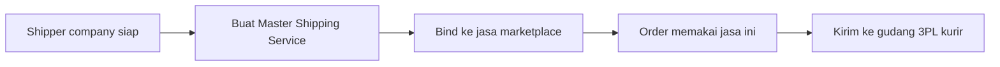

# Panduan Pengguna — Master Shipping Service

**Siapa yang baca:** tim Omni Channel, Warehouse, Finance  
**Menu:** Omni Channel → Settings → Master Shipping Service  
**Route:** `/omni/shipping-service`

---

## 1. Apa Itu & Kenapa Penting

**Master Shipping Service** adalah daftar jasa kirim standar di dalam OlshopERP. Kamu membuatnya sekali, lalu menyambungkannya ke nama jasa kirim di marketplace, dan memakainya juga untuk order non-marketplace.

Tanpa master (dan binding) yang benar, order sulit diproses sampai pengiriman ke gudang kurir (3PL), dan settlement outbound bisa ikut tertunda.

---

## 2. Overview Flow & Proses Bisnis

**Versi teks:**

1. Pastikan perusahaan kurir sudah di-recognize sebagai **Shipper**.  
2. Buat Master Shipping Service (kode, nama, tipe Pick Up/Drop Off, berat, dimensi).  
3. **Bind** ke Platform Shipping Service yang relevan.  
4. Order platform/general memakai jasa tersebut.  
5. Saat pengiriman, sistem memakai shipper terkini di master untuk gudang 3PL.

### Status yang kamu lihat

| Status | Arti | Catatan |
|--------|------|---------|
| **Active** | Bisa dipakai | Default saat create |
| **Inactive** | Tidak untuk order baru / proses | Jangan matikan jika masih dipakai order berjalan |
| **Binded / Not Binded** | Sudah / belum sambung ke marketplace | Di list dan di menu Platform |

---

## 3. Sebelum Mulai (Flow Sebelum)

- Shipper company sudah active dan (idealnya) punya gudang 3PL.  
- Company kamu sudah jadi **default owner** data store (untuk binding).  
- Platform Shipping Service sudah di-sync jika mau bind marketplace.  
- Tentukan apakah jasa ini Pick Up atau Drop Off (tidak bisa diganti nanti).

🎬 [Interactive demo akan ditambahkan di sini]

---

## 4. Setelah Selesai (Flow Sesudah)

- Master Active; Binding Status **Binded** bila disambungkan.  
- Order marketplace bisa resolve ke master; order general bisa memilih master.  
- Pengiriman menuju gudang 3PL milik shipper yang tertera di master **saat proses jalan** (bukan snapshot lama).

---

## 5. Yang Perlu Diperhatikan

- Kalau section **Warehouse Shipper** kosong: shipper belum punya gudang 3PL — perbaiki setup shipper, jangan menunggu error di approve pengiriman.  
- Kalau **Logistic Label Template** ada di form: belum bisa dipakai.  
- Kalau ingin **matikan Active**: pastikan tidak ada order yang masih bergantung ke jasa ini.  
- Kalau **warning** muncul di list: angka max weight/dimensi master lebih besar dari jasa platform yang di-bind.  
- **Default shipping** hanya autofill order pertama; order berikutnya mengingat transaksi terakhir.  
- Edit **Shipper Name** di master memengaruhi order lama yang masih diproses (sistem baca data terbaru).

---

## 6. Langkah-Langkah (Step by Step)

1. Buka **Omni Channel → Settings → Master Shipping Service**.  
2. Klik **Create** → isi Code, Shipper, nama service, Type, min/max weight, dimensi → Save.  
3. Buka lagi data → section **Shipping Binding** → pilih jasa platform → Save.  
4. Cek list: Binding Status **Binded**; tidak ada warning yang tidak kamu maksud.  
5. Uji di order platform/general sesuai skenario.  
6. Sebelum production shipping: pastikan Warehouse Shipper di form tidak kosong.

🎬 [Interactive demo akan ditambahkan di sini]

---

## 7. Tips & Hal yang Sering Bikin Bingung

- **"Binding failed."** Cek default owner store; cek apakah platform sudah bound master lain.  
- **"Approval failed… no 3PL warehouse."** Lengkapi gudang 3PL untuk shipper.  
- **"Tidak bisa ganti Type."** Memang terkunci setelah create — buat master baru bila salah tipe.  
- **"Shipper di order kosong."** Cek apakah master di-inactive-kan.  
- **Export With Details** = pecah per binding; Without = ringkas.

---

## 8. Referensi

| Sumber | Untuk apa |
|--------|-----------|
| [Knowledge Base](./knowledge-base.md) | Troubleshooting |
| [Requirement](./requirement.md) | Validasi & Gap Registry |
| [Technical](./technical.md) | API (developer) |
| [Platform Shipping Service](../omni-shipping-service-platform/README.md) | Sisi katalog marketplace |
