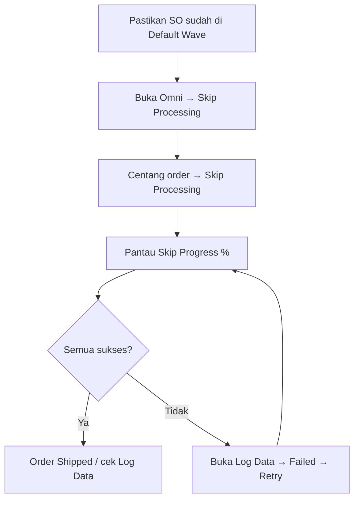

# Skip Processing — Knowledge Base (Operator)

**Audience:** Warehouse Operation / Fulfillment Lead, Support  
**Route:** `/omni/skip-processing`

---

## 1. Apa itu Skip Processing?

Skip Processing mempercepat fulfillment: sistem **mengerjakan sendiri** tahap picking, checking, packing, collecting, sampai order **shipped** ke gudang kurir (3PL) — tanpa kamu masuk menu Picking/Checking/Packing satu per satu.

Hanya order yang **sudah masuk Default Wave** yang bisa diproses di sini.

---

## 2. Kapan dipakai?

| ✅ Pakai jika | ❌ Jangan harapkan jika |
|---------------|-------------------------|
| Order sudah **Send to Default Wave** | Order masih di Unassign Wave (belum send) |
| Mau bypass tahap manual gudang untuk banyak order | Ada picking/checking/packing manual yang masih berjalan untuk order itu |
| Mau pantau / retry yang gagal dari log | Order sudah shipped / Not Authorized |

---

## 3. Alur kerja standar

**Keterangan langkah:**

- **Pilih order** lewat checkbox (satu atau banyak). Tidak ada form tambahan.
- **Progress bar** di kolom Skip Progress — realtime; 100% → icon status jadi hijau.
- **Icon Pick/Check/Pack/Collect:** abu-abu = belum/draft · kuning/oranye = sedang dikerjakan · hijau = selesai.
- **Log Data:** lihat batch (berapa sukses/gagal) dan detail per order; Retry hanya untuk yang gagal.
- **Sukses batch** = order sampai **Shipped** (bukan hanya selesai picking).

---

## 4. Istilah penting

| Istilah | Arti awam |
|---------|-----------|
| Default Wave | Order sudah “dilepas” ke proses gudang |
| Batch code | Kode satu kali eksekusi Skip (mis. SP-…) |
| Shipped | Barang sudah keluar ke gudang kurir |
| Retry | Ulangi hanya order gagal, dari tahap terakhir yang berhasil |
| Lock / duplicate | Sistem menahan agar order yang sama tidak diproses dua kali bersamaan |

---

## 5. Skip Processing Log

Dari toolbar **Log Data**:

- Tabel batch: total diproses, sukses, gagal, durasi, siapa yang jalankan.
- Klik angka → detail Success / Failed / All / DO Processed.
- Failed: baca pesan error + tombol **Retry**.

Setiap order yang kamu pilih harus masuk Success **atau** Failed — tidak boleh “hilang” dari hitungan.

---

## 6. Troubleshooting

| Gejala | Penyebab umum | Solusi |
|--------|---------------|--------|
| Order tidak muncul | Belum Send to Default Wave | Kirim dulu lewat Unassign Wave / Skip Wave Process |
| Klik Skip tidak jalan / error in progress | Picking/checking/packing manual masih jalan | Selesaikan dulu proses manual |
| Not Authorized | Order milik company lain | Login company pemilik order |
| Stuck / gagal di tengah | Struktur lokasi sementara gudang kurang, atau shipper belum ikat 3PL | Baca Messages di Failed log; koordinasi setup gudang/binding |
| Error duplicate | Klik berulang / user lain proses order sama | Tunggu proses selesai; jangan spam klik |
| Progress lama | Batch besar / antrian | Pantau progress bar; wajar |

---

## 7. FAQ

**Q: Beda Skip Processing vs Skip Wave Process?**  
A: Skip Wave Process biasanya lewat upload/batch dan juga mengirim ke Default Wave lalu pipeline yang sama. Menu ini khusus pilih manual order yang **sudah** di Default Wave.

**Q: Order sudah picking manual — masih bisa skip?**  
A: Ya. Sistem lanjut dari tahap berikutnya yang belum selesai.

**Q: Beda dengan Order Process?**  
A: Order Process = pantau + Generate Pick List + resi. Skip Processing = loncat otomatis sampai shipped.
