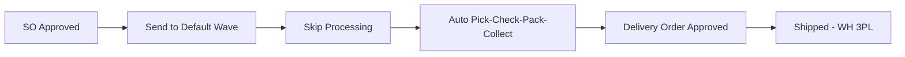
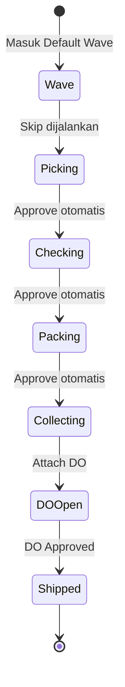
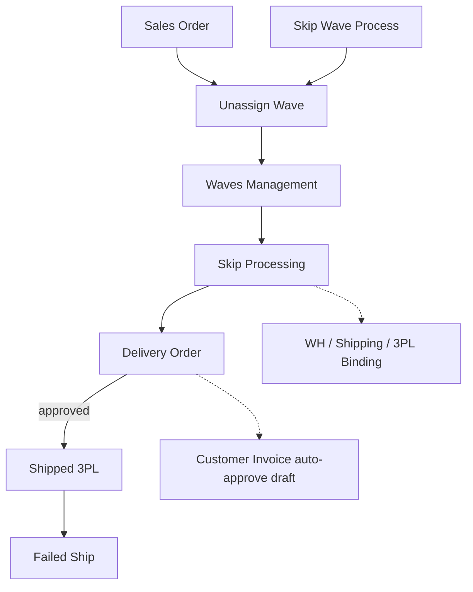

# Skip Processing — Requirement Documentation

**Modul:** SupplyChain / OmniChannel  
**Prefix:** `SP-` (Skip Processing gaps — jangan disamakan dengan System Product)  
**Audience:** PM, Warehouse Ops, QA  
**UI route:** `/omni/skip-processing`  
**SoT:** `omni-skip-processing-sot.md` v1.0 (19 Jul 2026)

---

## 0. Metadata & Changelog

| Version | Date | Author | Changes |
|---------|------|--------|---------|
| 1.0 | 2026-07-20 | QA - Yemima | Initial 5-file dari SoT v1.0 + verifikasi ProcessingService / jobs / locks |

---

## 1. Ringkasan Eksekutif

Skip Processing adalah **bulk action** yang mem-bypass pengerjaan manual Picking → Checking → Packing → Collecting untuk SO yang sudah **Send to Default Wave**, sampai **Delivery Order Approved** (status Shipped). Proses async di background; audit log per SO per tahap; retry dari posisi terakhir tanpa mengulang dari awal.

| Kebutuhan | Jawaban |
|-----------|---------|
| Bypass tahap manual gudang | Auto-advance pick→check→pack→collect→DO |
| Pantau batch | Skip Processing Logs + Skip Progress bar |
| Retry gagal | Retry per SO dari tahap terakhir sukses |
| Cegah dobel proses | Lock per SO (V2) |

### 1.1 Rantai proses

---

## 2. Prasyarat

| Prasyarat | Sumber | Catatan |
|-----------|--------|---------|
| SO approved + `ready_to_process` | Sales Order | — |
| `unassign_wave_status = processed` | Unassign Wave / Skip Wave Process | Wajib — tanpa ini tidak muncul di list |
| WH virtual tree lengkap (wave/pick/check/pack/ship/3PL) | Warehouse Structure | Child kurang → generate tahap gagal |
| Shipper terikat gudang 3PL | Warehouse Binding 3PL | Wajib tahap Shipping DO |
| Bukan Void | Sales Order | Ditolak validasi awal |
| Tidak ada Pick/Check/Pack manual in progress | PL/CL/Packing List | V6 |

---

## 3. Siklus Status

| Tahap | Kondisi | Editable manual? | Tombol Skip |
|-------|---------|------------------|-------------|
| Wave | Belum picking | N/A | Aktif |
| Pick / Check / Pack | Draft→approve otomatis | Tidak | Aktif jika belum selesai |
| Collecting | Approve saat attach DO | Tidak | Aktif jika belum DO |
| DO / Shipped | Final | Tidak | Hilang / Not Authorized |

SO yang sebagian sudah dikerjakan manual tetap bisa di-skip — sistem **resume** dari posisi terakhir (§6.1).

---

## 4. Datalist

**URL:** `/omni/skip-processing`

| Kolom | Default visible | Keterangan |
|-------|-----------------|------------|
| Checkbox | Ya | Bulk select |
| Trx Code \| Platform Order | Ya | — |
| Order Date | Ya | Kolom tambahan vs Order Process |
| Store \| Buyer | Ya | — |
| Status icon Pick/Check/Pack/Collect | Ya | Abu = draft/open; kuning/oranye = in progress; hijau = approved |
| Picking List Reference | Hidden | 1 SO bisa multi PL |
| Skip Progress | Ya | Progress bar % realtime (ganti Process Duration) |
| Action Skip Processing | Ya | Disabled / Not Authorized jika Shipped atau bukan company login |
| Kolom lain ≈ Order Process | — | Baseline belum lengkap — GAP-SP-03 |

**Fitur:** Bulk toolbar Skip Processing · Advanced Filter (default Data Owner = company login) · Export khusus Skip · Log Data (Skip Processing Logs) · Kartu status All/Pick/Check/Pack/Outbound/Shipping Ready/Complete (Complete placeholder) · **Tanpa** Broken Products / Log Get Resi.

---

## 5. Form & Field

Tidak ada form create/edit.

| Elemen | Catatan |
|--------|---------|
| Advanced Filter — Data Owner | Default company login; bisa reset; skip tetap ditolak untuk company lain (V3) |
| Konfirmasi bulk | Tidak ada field tambahan; batch code `SP-{timestamp}-{urutan}` |

---

## 6. How It Works

### 6.1 Auto-advance (resume)

| Posisi terakhir | Tahap yang dijalankan |
|-----------------|----------------------|
| Baru di Wave | Pick → Check → Pack → Collect |
| Picking Approved | Check → Pack → Collect |
| Checking Open/Draft | Pack → Collect |
| Packing Open/Draft | Collect |
| Collecting Open/Draft/Approved | Lanjut DO |
| Sudah Shipped / selesai | Tidak ada aksi — “Completed atau tidak perlu proses lanjutan” |

### 6.2 Pergerakan stock

Tiap tahap = transfer antar lokasi virtual di bawah WH Process; stock pindah saat approve.

| Tahap | Asal → Tujuan | Approved saat |
|-------|---------------|---------------|
| Wave (prasyarat) | Rack/WH Process → virtual wave | Tampungan |
| Picking | wave → pick | Generate Checking |
| Checking | pick → check | Generate Packing |
| Packing | check → pack | Generate Collecting |
| Collecting | pack → ship | Attach DO |
| Shipping DO | ship → WH 3PL shipper | DO Approved |

Qty DO: `prepared_to_do` saat attach → `processed_to_do` saat approve shipping (bukan qty terpisah dari SO).

### 6.3 Skip Processing Log

Aggregate per batch: Batch Code · Total DO Processed (hidden) · Total SO Processed (semua submit) · Success (hanya mencapai **Shipped**) · Failed · Executed/Ended · Duration · By/Company.

Detail: Success (SO, DO link, stage, waktu) · Failed (messages, Retry) · All · DO Processed.

**Invariant:** `Total Processed = Success + Failed` — tiap SO submit punya minimal 1 log entry. Success ketat = hanya Shipped.

### 6.4 UI progress

Icon warna §4 · Skip Progress % realtime · 100% → auto-refresh icon hijau.

### 6.5 Trx date transfer

Trx date dokumen = tanggal transaksi SO + 10 menit, lalu +10 detik antar dokumen berurutan.

### 6.6 Proteksi klik ganda

Lock per SO begitu request diterima; klik ulang / user lain → pesan duplikat (V2).

---

## 7. Validasi

### 7.1 Sebelum proses

| # | Kondisi | Pesan / behavior |
|---|---------|------------------|
| V1 | Tidak ada SO dipilih | No Sales Orders selected… |
| V2 | SO terkunci / duplicate | …prevented a duplicate processing attempt… |
| V3 | Company lain | …does not have permission to process skip orders |
| V4 | Belum stock mutation + wave belum processed | Redaksi mirip V3 — GAP-SP-02 |
| V5 | Void | …transaction status is Void |
| V6 | Pick/Check/Pack in progress | Skip not allowed while {tahap} is in progress |
| V7 | Collecting di DO multi-SO | Failed: Order grouped in {DO}… |
| V8 | Sudah selesai ship / gagal ship final | …no further process needed |
| V9 | Fatal | A fatal error occurred |

Accept request: “currently being processed. Please wait…”

### 7.2 Kegagalan di log

Gagal per tahap pick/check/pack/collect, create/approve DO, shipper tanpa 3PL, finalisasi terhenti.

### 7.3 Case lapangan sering

Belum send wave · WH virtual kurang · shipper tanpa 3PL · DO multi-order · manual in progress · klik ganda · deadlock (ada retry, bisa tetap failed).

---

## 8. Relasi Menu Lain

| Menu | Peran |
|------|-------|
| Unassign Wave / Skip Wave Process | Hulu — `processed` wajib / entry alternatif |
| Waves Management | Distribusi sebelum picking |
| PL / CL / Packing List | Tahap yang di-auto |
| Delivery Order | Hilir sukses = DO Approved / Shipped |
| Binding 3PL | Prasyarat shipping |
| Customer Invoice | Auto-approve draft saat attach DO |
| Failed Ship | Eligible setelah Shipped |

---

## 9. Gap Registry

| ID | Deskripsi | Dampak | Status |
|----|-----------|--------|--------|
| GAP-SP-01 | Auto description “Auto-completed via Skip Processing…” belum dikonfirmasi di semua dokumen transfer/DO (AS-IS ada beberapa string approve) | Audit trail dokumen kurang jelas | Open |
| GAP-SP-02 | Pesan V3 vs V4 (company vs wave/stock) redaksi mirip — mapping belum eksplisit | QA salah uji skenario | Open |
| GAP-SP-03 | Baseline kolom datalist = Order Process belum terdokumentasi penuh | Section 4 belum 100% | Open |

---

## 10. FAQ

**Q: SO tidak muncul?** Belum Send to Default Wave.  
**Q: Progress lama?** Normal; pantau Skip Progress %.  
**Q: Processed tapi bukan Success/Failed?** Seharusnya tidak — laporkan bug.  
**Q: Gagal padahal kelihatan OK?** Cek Messages di Failed log (in progress manual, DO multi-SO, 3PL binding).  
**Q: Beda Skip Wave Process?** Skip Wave = pintu upload/batch ke pipeline sama; menu ini = pilih SO yang sudah di Default Wave.  
**Q: Warna icon?** Abu draft · kuning in progress · hijau approved.  
**Q: Retry?** Ya dari detail Failed — lanjut dari tahap terakhir sukses.

---

## 11. Changelog (file)

| Version | Date | Changes |
|---------|------|---------|
| 1.0 | 2026-07-20 | Dari SoT v1.0 ke qa-docs-standard |
